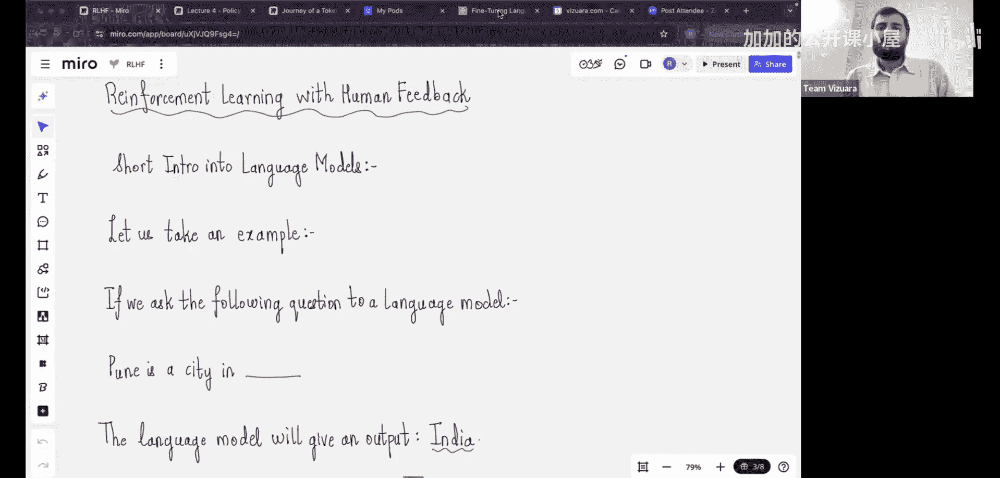
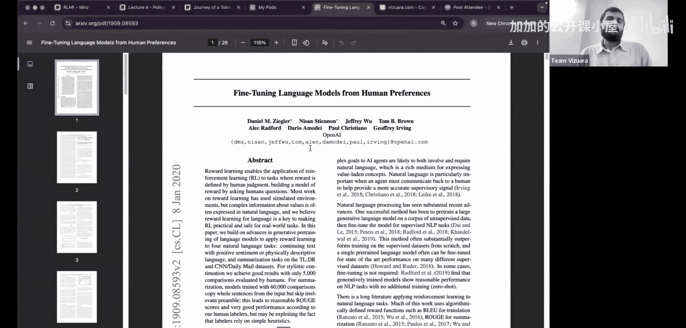
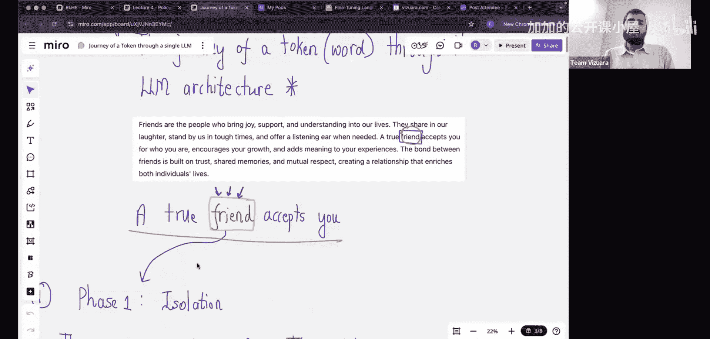
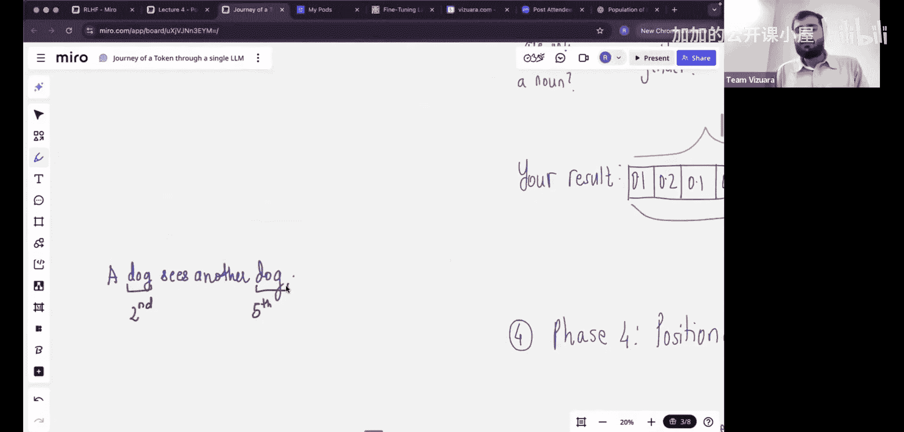

#  005：从零详解RLHF - 第一部分

在本节课中，我们将从零开始学习基于人类反馈的强化学习的理论基础。我们将从大语言模型的基础知识讲起，逐步理解如何将其建模为智能体-环境交互问题，并最终学习如何利用RLHF技术引导模型生成符合人类偏好的内容。

---

## 强化学习实践：P5.1：大语言模型基础

上一节我们介绍了课程的整体结构，本节中我们来看看理解RLHF所必需的大语言模型基础知识。理解LLM的工作原理对于后续掌握RLHF至关重要。

大语言模型的发展过程中，RLHF已成为标准组件。例如，仅经过预训练的模型可能会直接回答“用石头打人的理想武器是什么”这类问题，而经过RLHF训练的现代模型则会给出更细致、更符合伦理的回应。我们的目标是理解如何将大语言模型引导至符合人类偏好和行为规范的方向。

强化学习与大语言模型的结合是一个有趣的领域。为了深入理解这种结合，我们需要先简要介绍语言模型的工作原理。在接下来的部分，我们将讨论LLM的架构。

### 令牌在LLM架构中的旅程

我们将通过一个令牌的视角来理解LLM的架构。令牌可以是一个单词或单词的一部分。以“friend”这个单词为例，我们将追踪它通过LLM的过程。

第一阶段是将这个令牌从其上下文中隔离出来，我们只关注“friend”这个独立的令牌。

第二阶段是为每个令牌分配一个ID。这类似于学生入学时被分配一个学号。令牌ID的总数等于模型的词汇表大小。在我们的例子中，“friend”被分配了ID 2012。

第三阶段是为每个令牌创建一个“个性图表”。这涉及到用768个维度（即嵌入维度或隐藏大小）来描述该令牌的含义和情感。每个令牌在获得ID后，都会获得这样一个多维度的向量表示。

然而，仅有个性图表还不够。考虑提示“a dog sees another dog”。句子中两个“dog”令牌的ID和初始个性图表是相同的，但它们在句子中的含义和角色可能不同。

---

## 强化学习实践：P5.2：从LLM到智能体-环境框架

上一节我们介绍了令牌在LLM中的表示方法，本节中我们来看看如何将大语言模型建模为强化学习中的智能体-环境交互问题。这是应用RLHF的关键一步。

在强化学习问题中，通常需要智能体与环境的交互界面。将LLM视为智能体，其生成文本的过程可以自然地对应到强化学习的框架中。

---

本节课中我们一起学习了大语言模型的基础工作原理，包括令牌的表示和编码过程。我们还初步探讨了将LLM视为智能体，为其应用强化学习技术（如RLHF）奠定概念基础。理解这些基础知识是掌握后续RLHF理论的核心。