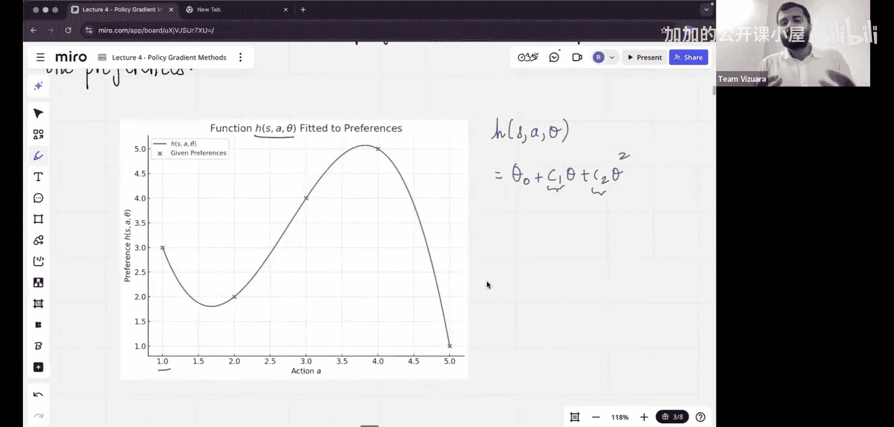

#  006：从零实现策略梯度方法


在本节课中，我们将要学习强化学习中的一个核心概念——策略梯度方法。这是将强化学习应用于大型语言模型等复杂系统的基石。我们将深入理解其原理，为后续学习PPO、GRPO等高级算法打下坚实基础。

## 课程回顾

上一节我们介绍了如何使用神经网络来近似Q值函数，从而解决了表格方法无法扩展到复杂状态空间的问题。我们构建了一个神经网络，输入状态，输出该状态下所有可能动作的Q值。

## 引入策略梯度方法

然而，基于Q值的方法存在一个中间步骤：我们需要先计算Q值，再根据Q值选择动作。本节中我们来看看一种更直接的方法——策略梯度方法。它旨在绕过对Q值的显式计算，直接学习一个策略函数。

这个策略函数 `π(a|s, θ)` 直接给出了在给定状态 `s` 和策略参数 `θ` 时，采取每个动作 `a` 的概率分布。我们的目标是直接优化参数 `θ`，使得策略能够获得更高的累积奖励。

## 理解策略参数化

为了理解策略如何被参数化，让我们看一个例子。假设在一个状态 `s` 下，有5个可能的动作（A1到A5），每个动作有一个“偏好值”。

以下是动作及其对应的偏好值：
*   A1: 3
*   A2: 2
*   A3: 4
*   A4: 5
*   A5: 1

我们的目标是将这些偏好值转换成一个概率分布。这可以通过一个参数化的函数来实现。例如，我们可以用一个多项式函数来拟合这些偏好值：
`偏好值 = θ₀ + c₁θ + c₂θ² + ...`
其中，`θ` 是我们要学习的参数（在神经网络中可视为权重），`c₁`, `c₂` 等是拟合得到的系数。

## 使用Softmax函数生成概率

更常见且有效的方法是使用 **Softmax** 函数。Softmax函数可以将一组任意实数（即我们的“偏好值”，通常由神经网络输出，称为“logits”）转换成一个概率分布。

其公式如下：
`π(a|s, θ) = softmax(f(s, a; θ)) = e^{f(s, a; θ)} / Σ_{b} e^{f(s, b; θ)}`
其中，`f(s, a; θ)` 是一个参数为 `θ` 的函数（如神经网络），它输出动作 `a` 在状态 `s` 下的偏好分数（logit）。Softmax确保所有动作的概率之和为1，且概率均为正数。

## 策略梯度定理

那么，如何优化策略参数 `θ` 呢？我们定义一个目标函数 `J(θ)`，它表示在策略 `π_θ` 下获得的期望累积奖励。我们的目标就是最大化 `J(θ)`。

策略梯度定理给出了目标函数梯度的一个无偏估计：
`∇_θ J(θ) = E_π[Q^π(s, a) ∇_θ log π(a|s, θ)]`
这个公式是策略梯度方法的核心。它告诉我们，为了提升期望奖励，我们应该沿着 `log π(a|s, θ)` 梯度的方向更新参数 `θ`，并用动作的价值 `Q^π(s, a)` 作为权重。高价值的动作会获得更大的更新幅度，使其在未来被选择的概率增加。

## REINFORCE 算法

一个最基础的策略梯度算法是REINFORCE（蒙特卡洛策略梯度）。它直接使用从完整回合中采样得到的回报 `G_t` 来近似 `Q^π(s_t, a_t)`。

以下是REINFORCE算法的伪代码：
```
初始化策略参数 θ
for 每个训练回合 do:
    根据策略 π_θ 生成一个回合的轨迹：s0, a0, r1, s1, a1, r2, ..., s_T
    for 该回合的每一步 t = 0, 1, ..., T-1 do:
        计算从t步开始的累积回报 G_t = Σ_{k=t}^{T} γ^{k-t} r_{k+1}
        计算损失函数：L(θ) = -G_t * log π(a_t|s_t, θ)  # 负号是因为我们要做梯度上升
        对参数 θ 执行梯度下降（实为梯度上升）：θ ← θ + α ∇_θ log π(a_t|s_t, θ) * G_t
    end for
end for
```

## 策略梯度方法的优势

与基于价值的方法相比，策略梯度方法有几个显著优势：
*   **能直接学习随机策略**：在某些环境中，最优策略本身就是随机性的（例如石头剪刀布游戏），策略梯度方法可以自然地学习到这一点。
*   **在高维或连续动作空间中更高效**：基于价值的方法在连续动作空间中需要最大化Q值，这本身就是一个优化问题；而策略梯度方法可以直接输出动作的概率分布或参数。
*   **更好的收敛特性**：虽然可能方差较大，但策略梯度方法通常被认为具有更好的收敛保证。

## 总结



本节课中我们一起学习了策略梯度方法的核心思想。我们从回顾基于价值的方法的局限性出发，引入了直接参数化并优化策略的概念。我们深入探讨了如何使用Softmax函数将偏好值转化为概率分布，并理解了策略梯度定理这一理论基石。最后，我们介绍了最基础的REINFORCE算法，它通过蒙特卡洛采样来估计梯度并更新策略参数。策略梯度方法是许多现代强化学习算法（如A2C、PPO）的基础，掌握了它，你就打开了通向更高级RL应用的大门。