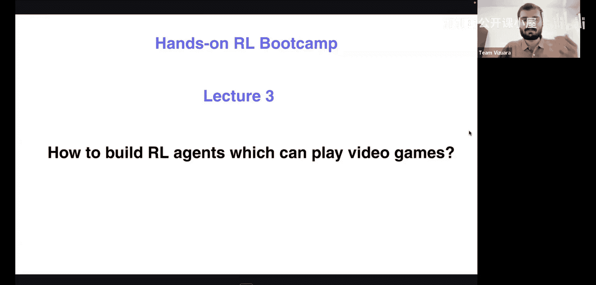
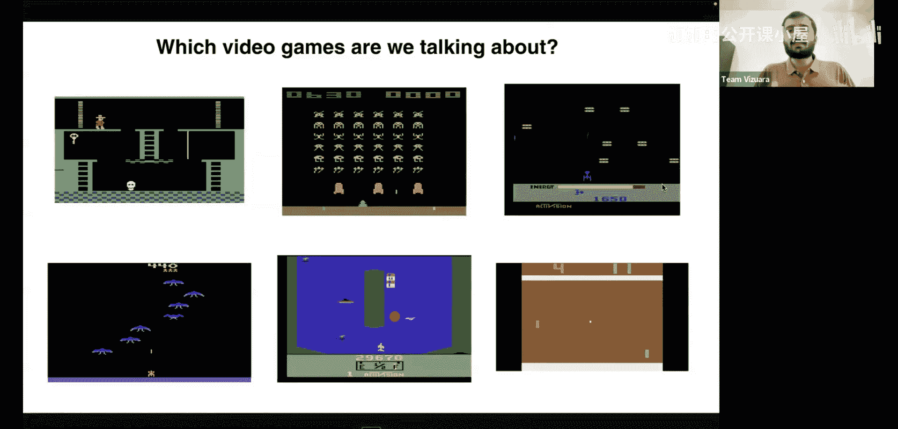
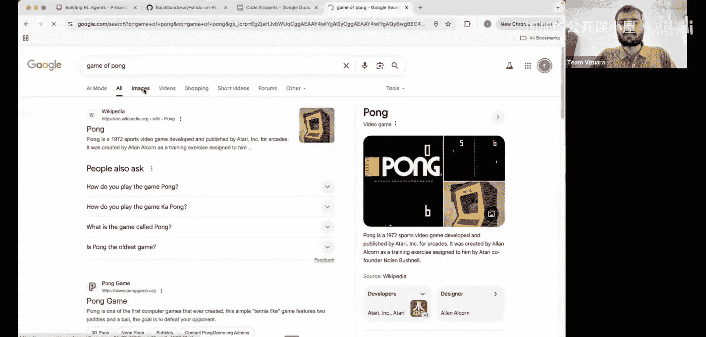
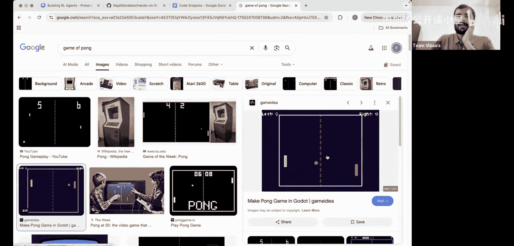
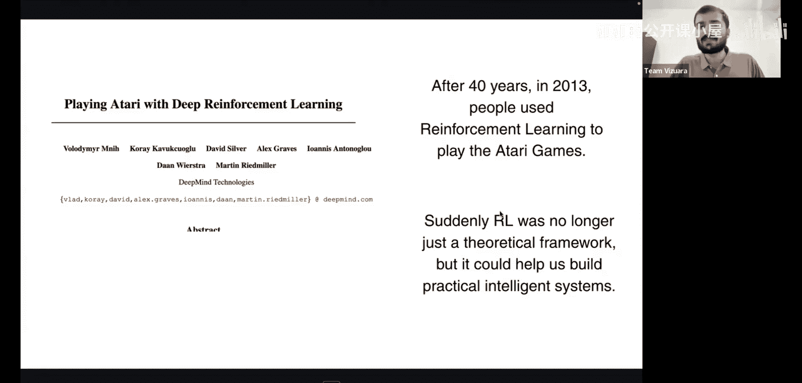
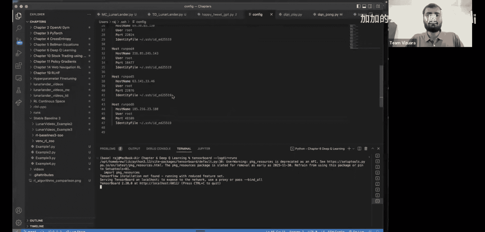
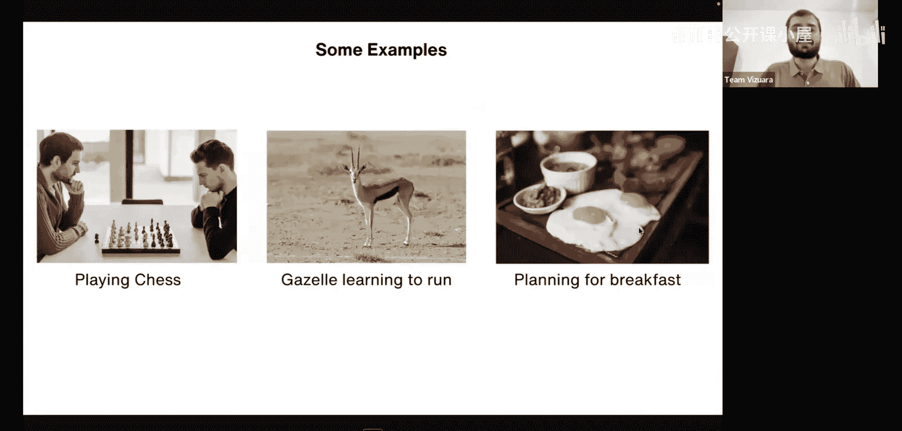

#  007：深度Q网络 🎮

在本节课中，我们将学习如何构建能够玩电子游戏的强化学习智能体。我们将从历史视角出发，逐步构建理解，最终实现一个能够自主玩游戏的智能体。

## 历史背景与目标

上一节我们介绍了课程的整体目标。本节中，我们来看看强化学习在游戏领域的里程碑。

首先，我们讨论的是哪类电子游戏？我们指的是类似下图所示的游戏，它们通常被称为街机游戏。虽然其图形质量以今天的标准来看较为简陋，但它们奠定了电子游戏的基础。

电子游戏的历史始于1972年雅达利公司推出的第一款街机游戏《Pong》。这是一款投币式游戏，其玩法在当时具有革命性。

在《Pong》中，玩家控制一个球拍，目标是将球击过对手的球拍。玩家可以向上或向下移动球拍，也可以保持不动。

随着1975年微处理器的普及，雅达利推出了家用版《Pong》，这使得家庭游戏成为主流。随后在1977年，雅达利视频计算机系统（VCS）发布，进一步推动了家庭游戏的发展。

然而，人们并不满足于此。一个核心问题被提出：**我们能否开发出可以自主玩这些游戏的AI？**

40年后的2013年，DeepMind发表的一篇著名论文《Playing Atari with Deep Reinforcement Learning》给出了肯定的答案。这篇论文标志着深度强化学习领域的诞生，并展示了强化学习强大的实际应用潜力。它的出现恰逢卷积神经网络（如AlexNet）的兴起，两者共同推动了该领域的复兴。

可以说，如果没有这篇论文，强化学习可能仍是一个前景广阔但缺乏重大实际应用的领域。

## 强化学习基础回顾

在深入2013年的论文之前，我们先快速回顾强化学习的基础概念，为后续内容做好准备。

在强化学习中，我们有一个**智能体-环境交互接口**。

其基本框架如下：
*   智能体从环境中接收**状态**（`s`）。
*   智能体根据某个**策略**（`π`）选择一个**动作**（`a`）。
*   智能体执行该动作后，环境会反馈一个**奖励**（`r`）并转移到新的状态（`s'`）。
*   这个过程持续进行。

所有强化学习问题都可以用**状态**、**动作**、**奖励**和指导智能体行为的**策略**来建模。

以下是一些经典示例：
*   下国际象棋：目标是击败对手。
*   机器人学习跑步：目标是高效移动。
*   规划早餐：目标是做出营养均衡的选择。

在这些例子中，智能体都有一个需要达成的特定目标。

本节课中，我们一起学习了强化学习玩电子游戏的历史背景和2013年里程碑论文的意义，并回顾了强化学习的核心交互框架。在接下来的章节中，我们将深入探讨深度Q网络的具体原理与实现。