#  008：经典强化学习的三大支柱

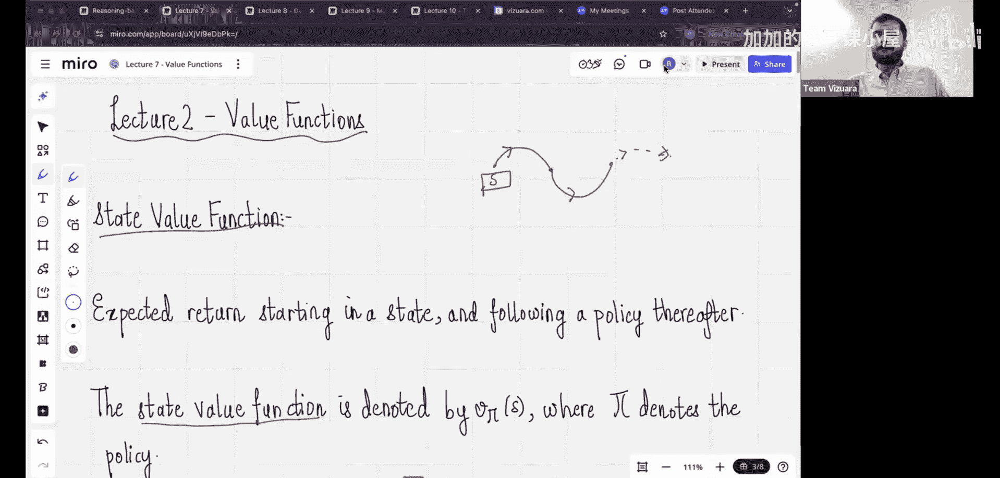

在本节课中，我们将学习如何让智能体做出有意义的决策，而不是随机选择动作。我们将深入探讨经典强化学习的核心概念，特别是状态价值函数，并理解其在指导智能体行为中的关键作用。

## 课程回顾与引入

上一节我们介绍了强化学习的四个基本要素：**策略**、**奖励**、**价值**和**环境模型**。我们了解到，策略指导智能体在每个状态下选择最佳动作，奖励是智能体执行动作后获得的即时反馈，而价值则衡量了状态的长期期望回报。我们还学习了马尔可夫性质，并假设在本课程中讨论的所有状态都满足这一性质。

在上一讲的末尾，我们通过OpenAI Gymnasium操控了月球着陆器，但当时缺少了一个关键要素——一个有效的策略，因此我们只能采取随机动作。本节中，我们将重点解决这个问题，学习如何构建能够做出明智决策的策略。

## 状态价值函数：衡量状态的好坏

为了构建有效的策略，我们首先需要一个方法来评估不同状态的好坏。这就是**状态价值函数**。

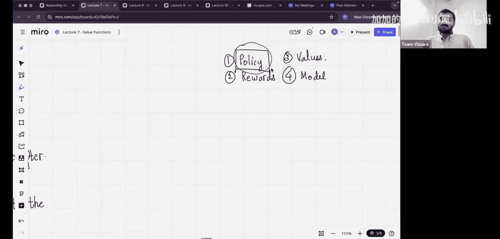

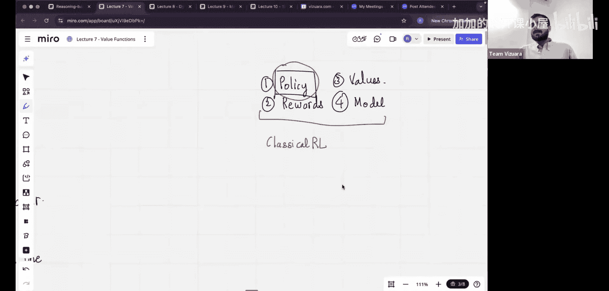

让我们通过一个例子来理解。假设智能体从某个特定状态 `S` 开始，根据某个已知策略选择动作 `A1`，进入新状态 `S1` 并获得奖励 `R1`。接着，它继续根据策略选择动作 `A2`，进入状态 `S2` 并获得奖励 `R2`，如此继续，直到在时间步 `T` 到达终止状态 `ST`，并获得最终奖励 `RT`。

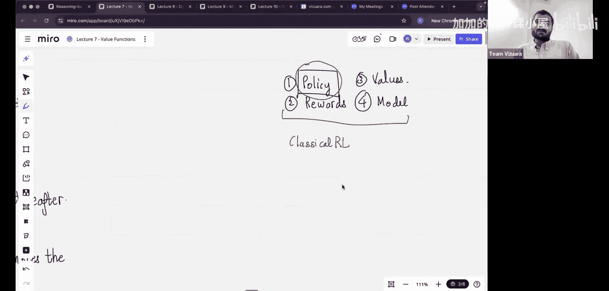

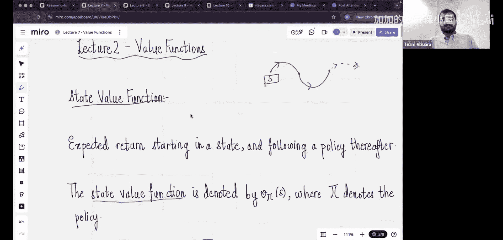

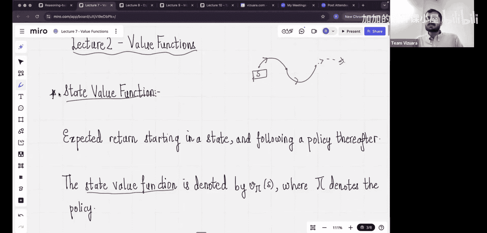

那么，状态 `S` 的价值是多少呢？直观上，它应该是智能体从 `S` 开始到结束所获得的所有奖励之和，即 `R1 + R2 + ... + RT`。然而，由于智能体每次遵循的轨迹可能不同，得到的回报也会波动。因此，我们采用**期望值**来定义状态价值，即多次运行后所获回报的平均值。

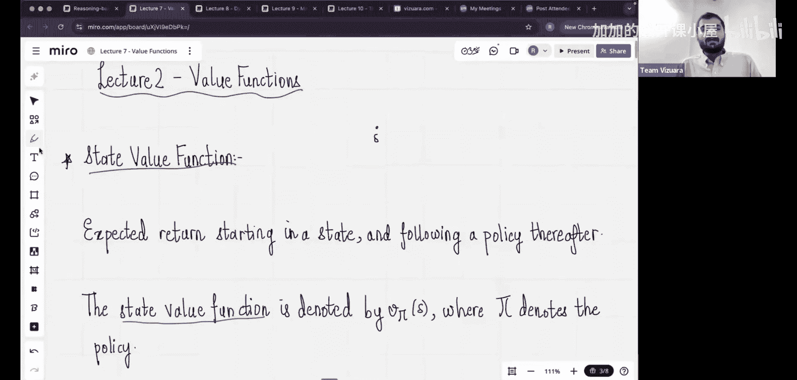

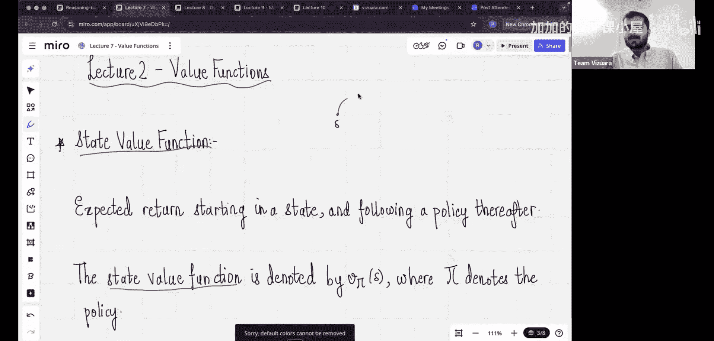

状态价值函数 `Vπ(s)` 的正式定义是：从状态 `s` 开始，并在此后始终遵循策略 `π`，智能体所能获得的**期望回报**。其数学公式如下：

`Vπ(s) = Eπ[ Gt | St = s ]`

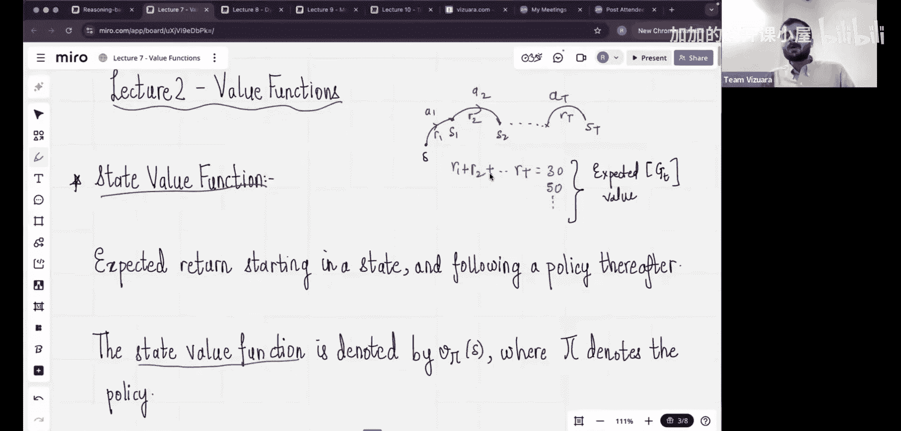

其中，`Gt` 代表从时间 `t` 开始的**折扣回报**，计算公式为：

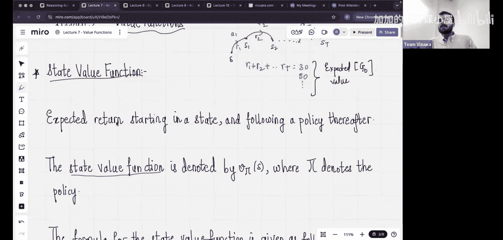

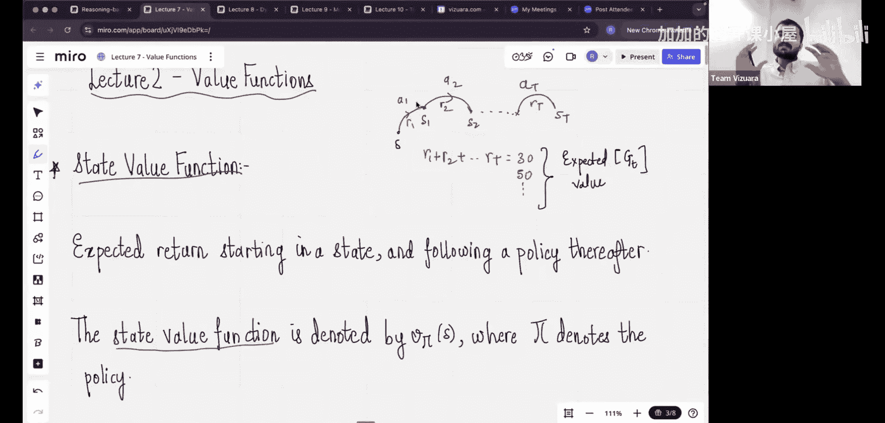

`Gt = Rt+1 + γ * Rt+2 + γ² * Rt+3 + ...`

这里的 `γ` 是**折扣因子**（0 ≤ γ ≤ 1），它体现了“即时奖励比未来奖励更有价值”的思想。`γ` 越接近1，智能体越重视长期回报；`γ` 越接近0，智能体则越关注眼前利益。

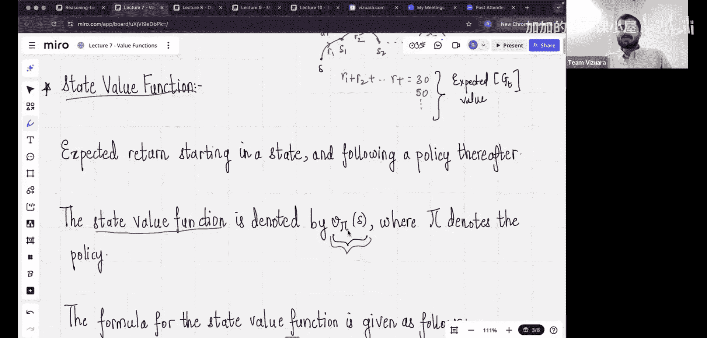

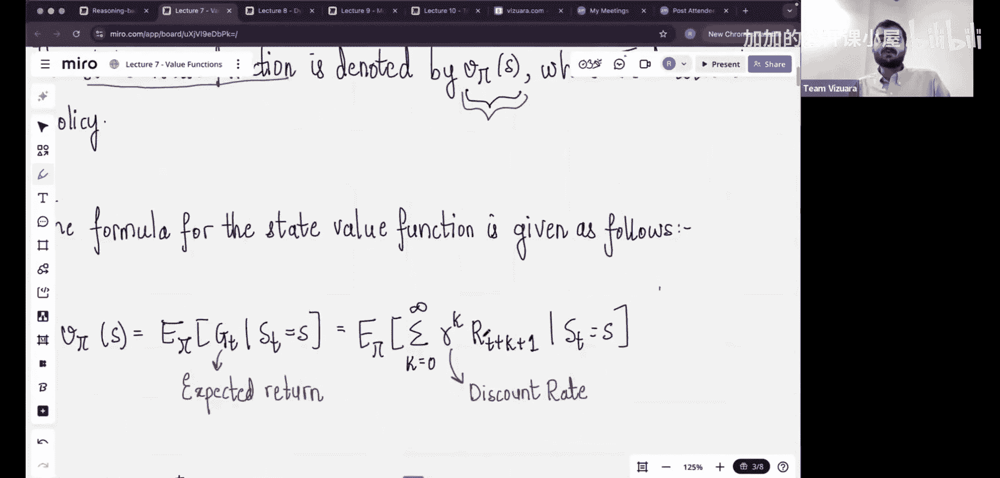

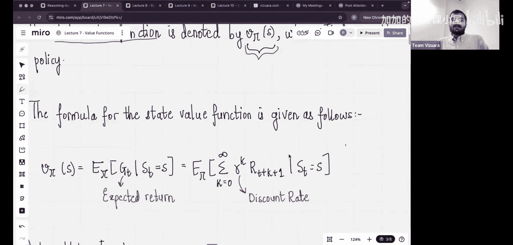

## 总结

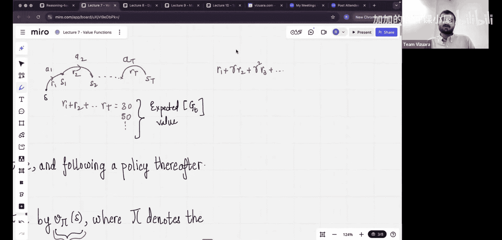

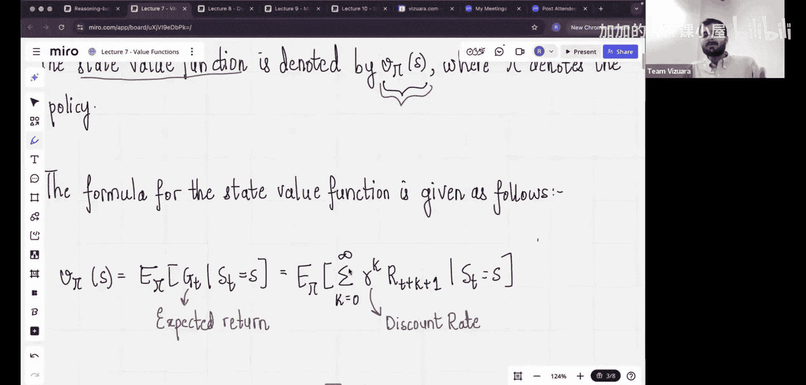

本节课我们一起学习了经典强化学习的核心基础之一——**状态价值函数**。我们明确了它的定义：在给定策略下，一个状态的期望折扣回报。理解 `Vπ(s)` 是后续学习如何评估和改进策略的关键第一步。在接下来的课程中，我们将以此为基础，探索如何寻找最优策略。