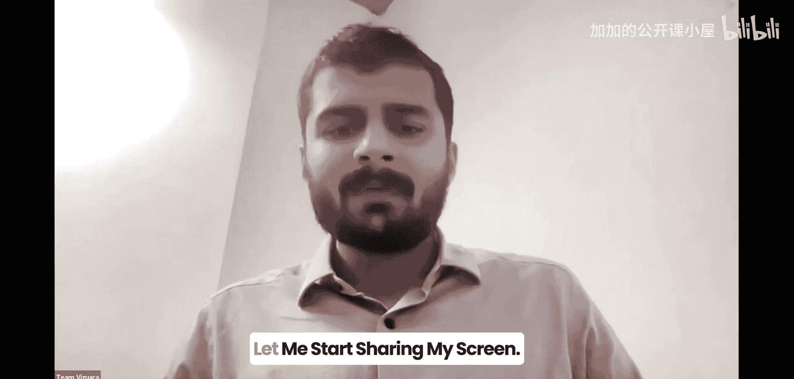
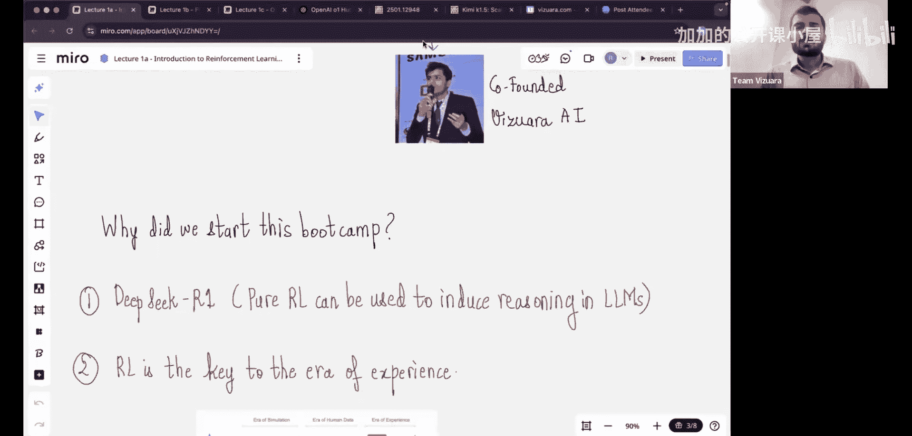
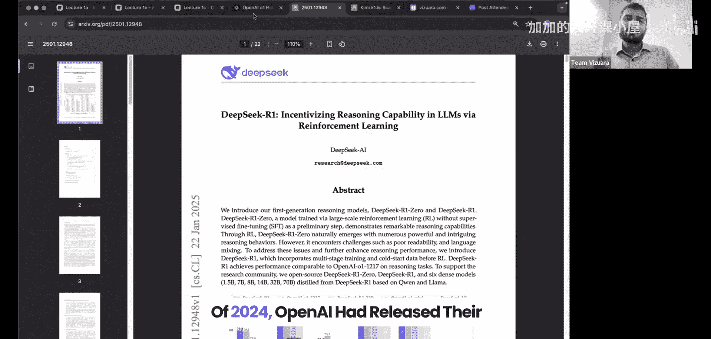
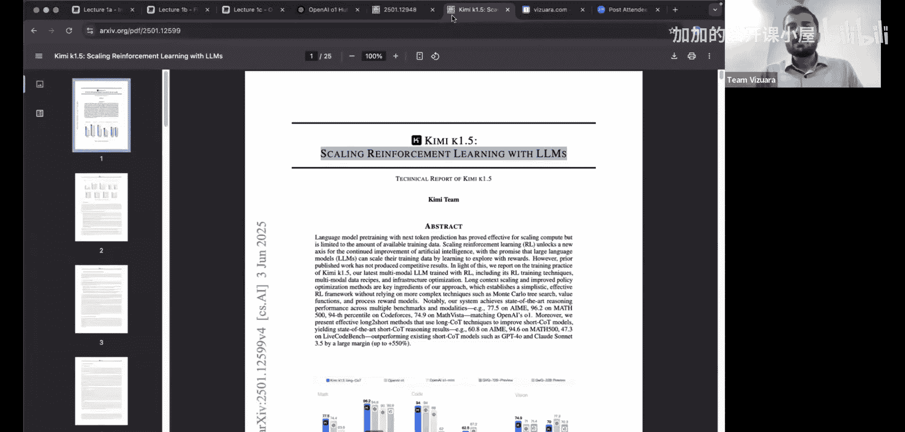
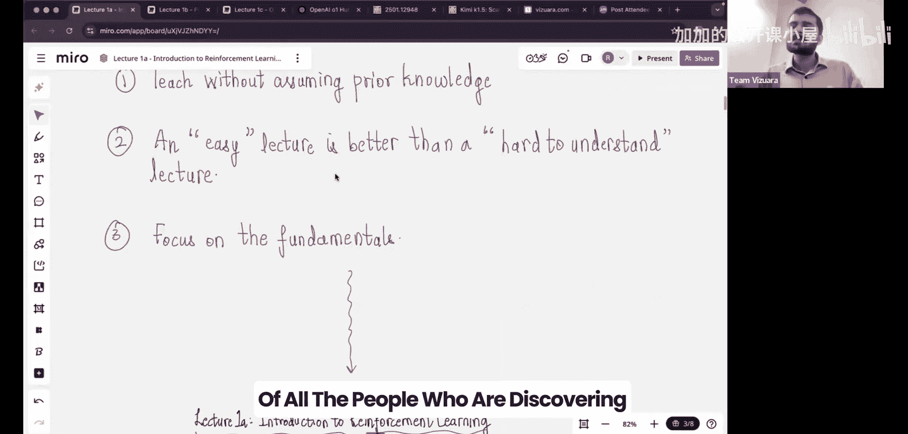

#  009：课程概述与引言

在本节课中，我们将要学习强化学习的基础概念、其发展历程，以及它在当今人工智能领域，特别是在大型语言模型中的重要性。

## 课程概述

欢迎来到“强化学习实践”训练营。我是本课程的讲师，也是Visura的联合创始人之一。我拥有印度理工学院马德拉斯分校的学士和硕士学位，并在普渡大学完成了博士学位。完成学业后，我与伙伴们回到印度，共同创立了Visura，致力于让人工智能技术变得人人可及。

今天我们将探讨的主题是强化学习。这个领域在过去一直处于相对边缘的位置，直到今年DeepSeek论文的发布，才使其重新回到了聚光灯下。

## 为何现在学习强化学习？

以下是启动本次训练营的两个主要原因。

首先，是DeepSeek-Carbon论文的发布。这篇论文于今年一月问世，真正震撼了世界。原因在于，在DeepSeek之前，OpenAI在2024年9月发布了他们的首个推理模型OpenAI O1。但问题在于，O1是一个完全的黑箱，人们无从知晓其内部如何实现推理功能。而当DeepSeek-Carbon发布时，其准确率水平已与OpenAI O1相当。这使人们突然意识到，论文中描述的方法很可能与OpenAI遵循的“配方”相似。

该论文中有一张被称为“顿悟时刻”的图表。其图注写道：“DeepSeek-Carbon-V2模型的一个有趣的顿悟时刻。模型学会了以拟人化的语调进行‘重新思考’，这让我们得以见证强化学习的力量与美感。”DeepSeek表明，若不将强化学习置于核心位置，就无法在大型语言模型中实现推理能力。

自DeepSeek论文发布以来，各大AI实验室如雨后春笋般推出了大量推理模型，例如Gemini、Anthropic、Po AI等。最近发布的Kimi K 1.5模型，其整篇论文都专注于强化学习。因此，强化学习突然成为焦点，并开始受到高度重视。

其次，我个人认为强化学习在未来几年将变得至关重要的另一个原因是，我们目前所处的阶段。我们正在大量使用大型语言模型，但这些模型有一个非常重要的预训练阶段，需要基于海量数据进行训练。这意味着我们仍处于“人类数据时代”——没有数据知识，LLM并不真正智能。

现在，我们正慢慢进入“经验时代”。这意味着智能体将自行体验事件，从这些经验中学习，并迭代改进。我们无需向智能体提供大量数据，而是由智能体通过与环境的**交互**来获取数据并从中学习。这正是强化学习领域所探讨的核心内容。

## 强化学习的发展历程

到目前为止，强化学习常与电子游戏相关联。许多人可能听说过RL被用于玩Atari游戏，那是一个重大的突破时刻。随后，AlphaGo是另一个例子，它利用强化学习使人工智能在这些游戏中变得非常聪明。

然而，在过去的两三年里，几乎没有人将RL应用于大型语言模型。事实上，如果没有基于人类反馈的强化学习这项发明，ChatGPT就不可能被创造出来，该技术是将LLM与人类偏好对齐的核心。

我谈论所有这些的原因，是因为我发自内心地认为，强化学习将在未来几年的AI革命中成为一个非常重要的驱动力。我们应该专注于理解RL背后的概念，然后逐步理解强化学习如何应用于大型语言模型。

现在，让我们看看RL是如何随着岁月发展的。从时间线来看，这个领域本身并不新，它自20世纪50年代就已存在。从1950年到1990年，我们称之为**经典强化学习**时代。

90年代之后，我们开始向**策略梯度方法**过渡。从2013年左右开始，人们开始讨论在强化学习问题中使用神经网络，于是**深度强化学习**领域诞生了。然后从2018年开始，我们开始在LLM中使用RL。

可以看到，AI社区在强化学习方面经历了这四个时代。作为本系列课程的一部分，我们将要学习的内容，将紧密见证数十年来杰出科学家们的工作，以及他们是如何发明这些算法的。如果不理解自20世纪50年代以来所有这些巨人们的贡献，我们就无法使用ChatGPT。

因此，本课程的安排方式是：除非我们理解并欣赏经典RL，否则就无法真正理解现代强化学习，因为经典RL是其真正的核心。然后，我们将逐步推进，迈向现代强化学习，并理解强化学习如何应用于大型语言模型，这将是本次训练营的一个关键重点。

## 课程目标与教学风格

我的目标有三点。

第一，帮助大家深入理解强化学习背后的理论。
第二，给予大家建立和编写代码以解决实际项目的信心。最近我与公司同事交流时，发现人们普遍认为强化学习是一个非常理论化的领域，他们不知道如何自己构建RL智能体。我的目标是打破这种观念，让大家了解强化学习如何能够实际部署。它和使用PyTorch或TensorFlow部署神经网络一样简单。因此，这不会仅仅是一门理论课程，也将非常实用，这也是课程名称“强化学习实践”的由来。
第三，我希望帮助大家培养对这个领域的浓厚兴趣。与AI内的其他学科相比，我对强化学习有特别的偏爱，因为我相信RL非常接近人类的经验，而其他领域则不那么接近。正如大家将在本讲座中看到的，强化学习与人类的思维方式非常相似，因此随着课程的推进，大家会感受到一种自然的理解。当你看到一个智能体真正从经验中学习时，几乎感觉就像是在我的计算机中模拟智能。当我第一次自己实现这些智能体时，就有这种感觉。我也想将这种深切的乐趣传递给大家。

我的教学风格将不预设任何先验知识。我相信一堂易于理解的讲座，总是优于一堂让人感觉难以理解的讲座。这是我的教学理念，我将专注于基础知识。我意识到的一点是，如果你的RL基础非常清晰和扎实，那么在实践中使用强化学习算法时会大有裨益。因此，你同样需要对理论有所理解。

## 总结

本节课中，我们一起学习了强化学习课程的引入部分。我们探讨了强化学习重新受到关注的时代背景，特别是DeepSeek等推理模型的崛起。我们回顾了强化学习从20世纪50年代经典方法到现代深度强化学习，再到应用于大型语言模型的发展历程。最后，我们明确了本课程的目标是理论理解、实践编码和培养兴趣，并介绍了以基础为核心、通俗易懂的教学风格。接下来，我们将回溯到50或70年前，尝试站在那些当时正在探索这个新兴领域的人们的角度，开始理解强化学习的核心思想。