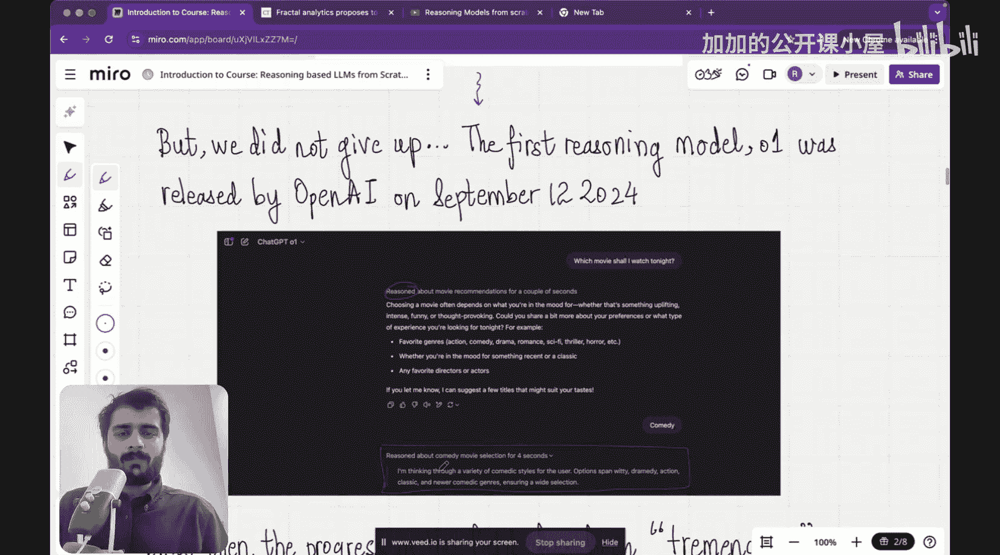

#  001：系列介绍

在本节课中，我们将要学习本系列课程的整体介绍，了解什么是推理大语言模型，以及为什么它们代表了人工智能发展的一个重要方向。

大家好，欢迎来到这门关于从零开始构建基于推理的大语言模型的课程。我们非常激动能够推出这门课程，并将这些知识分享给大家。

在开始之前，请允许我做个自我介绍。我是 Ra Ddiker 博士，将是本课程的讲师。这是我第一次在我们的 YouTube 频道上授课。大家可能会把我与 Raj 博士混淆，他曾教授过《从零构建真实大语言模型》、《动手学机器学习》或《从零构建神经网络》等课程。我是他的双胞胎兄弟，请不要混淆。

关于我的背景，我在印度理工学院马德拉斯分校完成了本科和硕士学位，之后在美国普渡大学获得了博士学位。我一直是一位充满激情的教师和教育者。事实上，在大学期间，很多朋友和同学都建议我，说我讲解概念非常清晰，为何不成为一名教师？但我当时对研究充满热情，因此继续攻读并完成了博士学位。最终，我的使命召唤还是到来了，我与 Rajan Srither 共同创立了 Vizuara。现在，我们的使命是让每个人都能接触到人工智能。能够为大家教授这门课程，我感到无比荣幸。

关于我的介绍就到这里。现在，让我们深入了解课程详情。

如果你偶然看到这个视频，我可以向你保证一件事：即使没有任何先验知识，你也能完全理解我在后续所有视频中教授的每一个知识点。

我的教学风格基于两句格言。第一句是：如果我无法向一群初学者讲清楚一个主题，那说明我自己也没有真正理解这个主题。我非常严肃地对待这一点。第二句是：我努力让主题尽可能简单。这些格言可能源自他人，但请允许我暂时将其归功于自己。

这就是我们的教学风格。我们将在每一个视频中，从零开始解释所有概念。并且，我会确保在讲解一个概念 X 时，不会在解释中使用“X”这个词，因为那样就失去了从零开始的意义。

现在，让我们开始了解这门课程的内容，以及为什么我们现在要讨论基于推理的大语言模型。

首先，人类，像我们所有人一样，拥有一种不可思议的能力，即能够对一个主题进行深入思考。例如，当你为母亲的生日订购蛋糕时，你会思考很多事情：她最喜欢的蛋糕是什么？这次要不要尝试点不同的？她上次对我订的蛋糕反应如何？她喜欢吗？她不喜欢吗？过去一年有什么变化吗？她是否对某种特定口味产生了反感？她最近有没有表达过对某种口味的渴望？等等。一系列想法在我们的大脑中闪过。有趣的是，所有这些思考都在极短的时间内发生，速度极快。这就是我所说的“深入思考”。每当我们做决定时，脑海中都会闪过一系列想法，我们称之为“思考”。

这就是我们所说的推理或思考，我们说人类拥有推理的能力。

现在，思考一下推理。推理分为两种类型：快速推理和慢速推理，也称为系统1推理或系统2推理。

什么是系统1推理？系统1帮助我们立即思考出答案。从这张图中可以看到，它几乎占我们大脑活动的95%。这就是系统1。例如，如果我问你“印度的首都是哪里？”，答案会自然而然地出现，因为它由我们的直觉、所有过去的经验以及本能驱动。因此，系统1占我们整个思维过程的95%。

系统2则是我们需要花时间思考一个主题的地方。它需要我们付出努力去思考，这个系统是缓慢的、逻辑的、懒惰的且犹豫不决的。例如，假设今晚录制结束后我想回家看一部电影。现在我需要考虑很多事情：什么类型？哪个流媒体平台？最近有什么新片上映吗？烂番茄上的评价如何？人们怎么评价它？IMDb评分是多少？此刻我脑海中涌现出如此多的事情，以至于我甚至无法快速做出决定。这类问题就属于系统2，即你花时间，以一种缓慢而审慎的方式思考问题。

现在，人工智能领域许多人关注的核心问题是：人工智能能推理吗？你可能会想，是的，它应该会推理，人工智能不就是为了像人类一样思考而创造的吗？答案是，不，人工智能并非为了像人类一样思考而创造，人工智能是为了像人类一样回答问题而创造的。

看看2022年11月发布的第一个版本的 ChatGPT。它能够非常快速地回答问题，例如，你在这里看到的。因为它被设计成像人类一样回答问题。但是，如果你问我，ChatGPT 3.5 会推理吗？那么我不确定，推理体现在哪里？你直接得到了答案，你并没有看到 ChatGPT 3.5 实际思考的逐步过程。所以，ChatGPT 3.5 在某些任务上表现得非常出色，让我重新表述一下，它在系统1类型的任务上表现得非常出色。也就是说，在需要快速、即时答案的任务上，它非常厉害。

对于需要推理的复杂任务，比如解决谜题、思考和规划，它表现得并不好。

因此，从这张图我们可以看出，ChatGPT 3.5 擅长一种类型的思考，但它并未展现出任何能够真正推理的能力。它能够真正思考问题并给出答案，因此作为用户，我能看到我得到了一个答案，但我不确定 ChatGPT 是否真正理解了问题。这一点的一个表现是，ChatGPT 3.5 经常产生幻觉，这意味着有时它会给出一些毫无意义的随机答案。然而，如果你真正理解了问题或者你在推理，你永远不会给出这样随机的答案。这是第一个迹象，表明这是一个被设计成像人类一样回答问题的人工智能，但它并非被设计成像人类一样推理或思考。

但我们没有放弃，研究继续发展。第一个真正意义上的推理模型由 OpenAI 于 2024 年 9 月 2 日发布。在这里，我问了它之前提到的完全相同的问题：“今晚我应该看哪部电影？”你可以看到，它显示“正在为电影推荐进行推理”，持续了几秒钟。在底部，你还可以看到 ChatGPT 说：“我正在为用户思考各种喜剧风格、选项、剧情、动作、经典等。”

本节课中，我们一起学习了本系列课程的介绍，了解了人类推理的两种系统（系统1和系统2），并探讨了早期大语言模型（如 ChatGPT 3.5）在推理能力上的局限性，以及新一代模型向真正推理能力发展的趋势。在接下来的课程中，我们将深入探讨如何从零开始构建具备这种推理能力的大语言模型。