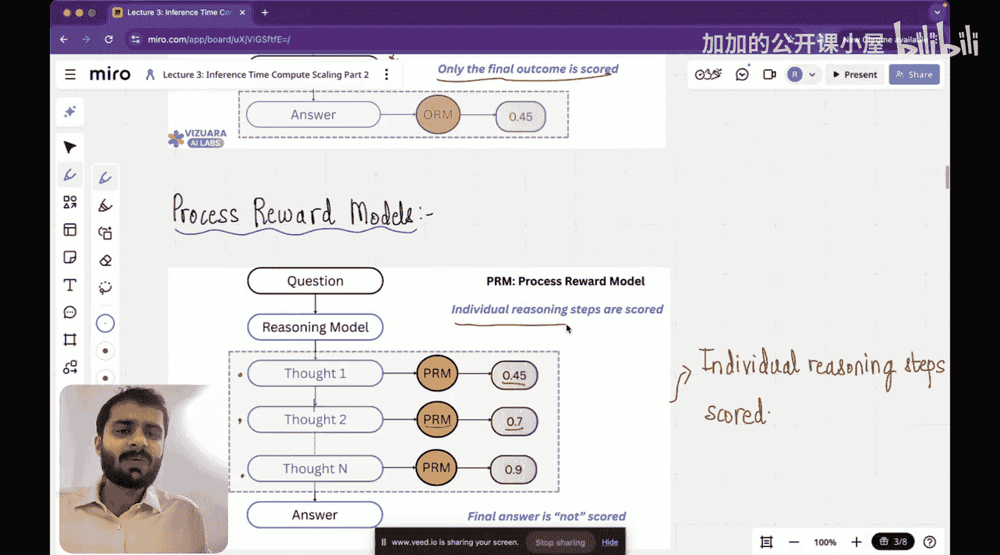

#  003：验证器与束搜索


在本节课中，我们将学习推理大语言模型的第二类推理时计算扩展方法：基于验证器的搜索。我们将了解什么是验证器，它与之前学习的提示技术有何不同，并深入探讨两种主要的奖励模型。

## 概述

上一节我们介绍了链式思维推理和零样本推理这两种提示技术，它们通过引导模型在给出答案前进行思考来提升性能。本节中，我们将探讨一种不同的方法：基于验证器的搜索。这种方法的核心不是直接引导模型思考，而是让模型生成多个候选答案，然后通过一个验证层来筛选出最佳答案。

## 什么是基于验证器的搜索？

验证是指生成不同答案，并最终从所有生成的答案中选择最佳答案的过程。

为了理解验证的必要性，请看下图。我们提出一个问题，问题被传递给推理模型。推理模型不是直接输出一个答案，而是生成四个不同的答案（A1, A2, A3, A4）。中间有一个验证层，负责验证这四个答案中哪一个是最好的，最终将最佳答案输出给用户。这就是验证层的作用。


我们可以用一个简单的类比来理解：假设你的任务是从一大片田地中挑选出质量最好的庄稼。你不会只找到一棵看起来不错的庄稼就停下来。通常，我们会采样五到六棵庄稼，然后从中选出最好的一棵。这样，获得最佳庄稼的概率就增加了。大语言模型也是如此，与其直接生成一个答案，不如先生成一组候选答案样本，然后借助验证层从中选出最佳答案呈现给用户。

## 验证与推理时计算扩展的关系

现在回到本系列讲座的主题“推理时计算扩展”。验证层如何契合这个主题？请记住，如果引入了验证层，模型在推理过程中使用的计算资源将会增加。这就是它属于“推理时计算扩展”范畴的原因，因为它增加了模型给出答案所需的时间。

我们可以用下图来理解大语言模型的工作流程：首先是预训练，然后是微调，最后是推理。在没有验证的情况下，推理过程是直接的。但当你增加验证步骤时，你实际上增加了模型给出答案的时间，因为你需要从不同答案中采样并选择最佳答案，因此增加了推理时的计算量。

## 验证层的实现：奖励模型

我们看到的这个验证层，既可以由人类完成，也可以由一个模型来完成。执行验证任务的模型被称为**奖励模型**。

例如，你可以去Hugging Face搜索“reward model”，比如“deberta-v3-large-v2”奖励模型。它的描述是：该模型经过训练，能够预测在给定问题下，人类会认为哪个生成的答案更好。它用于模型评估、RLHF中的奖励评分以及通过排序检测潜在的有害回复。这个模型经过训练后，当你给它一个输入时，它会根据生成答案的好坏给出一个分数。

这个模型的训练数据本身就是由人类生成的。然后利用这些数据来训练模型。因此，我们本质上是在用模型来模拟人类验证答案的能力。

之所以称为“奖励模型”，是因为最佳答案会获得最高分作为奖励。如果答案不好，分数就会较低，奖励也就较少。

## 奖励模型的类型

接下来，我们将详细探讨奖励模型。具体来说，奖励模型主要分为两种类型：**结果奖励模型**和**过程奖励模型**。它们的目的从名称上就大致可以理解。

### 结果奖励模型

想象一下，你有一个问题，并将这个问题输入到推理模型中。推理模型会给出一个链式思维过程，即它在给出最终答案前的思考步骤。

结果奖励模型的作用是：它不评估这些思考步骤。它基本上不关心思考过程，只关心最终答案，并且只对最终结果进行评分。

用公式表示其工作流程：
```
问题 -> 推理模型 -> [思考1, 思考2, ..., 思考N, 最终答案] -> 结果奖励模型 -> 分数
```
其中，结果奖励模型（ORM）只对“最终答案”部分输出一个分数（例如0.45）。

### 过程奖励模型

下一类更流行的是过程奖励模型。这类模型更有意义，因为当你使用推理模型时，思考过程对你来说非常重要。因此，需要一种机制来评判不仅仅是最终答案，还包括导致最终答案的各个思考步骤。

如下图所示，思考1被发送给过程奖励模型，模型对这个思考步骤进行评分；思考2再次被发送给过程奖励模型，模型再次评分。与结果奖励模型的主要区别在于，过程奖励模型评估的是推理路径上的每一个中间步骤。



## 总结


本节课中，我们一起学习了基于验证器的搜索这一推理时计算扩展方法。我们了解到，验证是通过生成多个候选答案并筛选最佳答案来提升模型输出质量的过程。验证层可以由专门的奖励模型实现，其中过程奖励模型通过评估推理的每一步，比只评估最终结果的结果奖励模型更能确保思考过程的质量。这种方法虽然增加了推理时的计算开销，但能有效提高答案的准确性和可靠性。