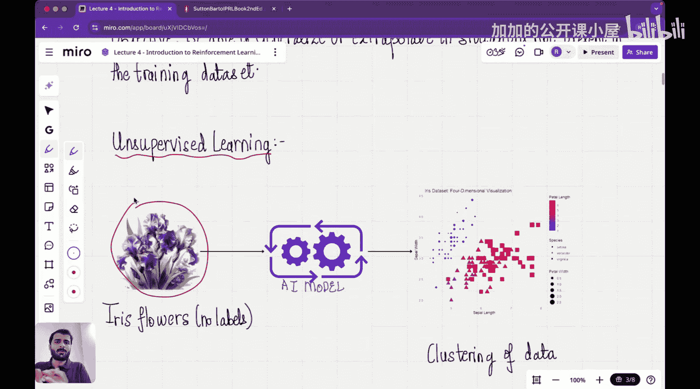

#  004：强化学习基础

在本节课中，我们将开始学习一个非常有趣的主题——强化学习。到目前为止，本课程已涵盖了属于“推理时计算扩展”类别的技术，这意味着我们完全没有改动训练好的模型，只是在推理阶段进行一些处理。我们看到了两个例子：第一个是提示工程，包括思维链提示和零样本思维链提示；第二个是验证器方法，即让大语言模型生成多个答案样本，然后通过一个验证层来选择最佳答案。

从本节课开始，我们将聚焦于一个完全不同的、在大语言模型中诱导推理的技术类别：纯粹的强化学习。这种方法不是调整模型的推理阶段，而是直接调整模型本身。为了理解如何应用纯粹的强化学习将一个非推理模型转变为推理模型，我们首先需要打好强化学习的基础。在接下来的几节课中，我们将暂时把推理部分放在一边，纯粹地学习强化学习这门学科。

## 机器学习范式对比

上一节我们介绍了本课程的新方向。为了更清晰地理解强化学习问题，本节中我们来看看它与监督学习和无监督学习有何不同。监督学习和无监督学习是机器学习领域的两大类别。

### 监督学习

监督学习是一类问题，其特点是拥有带标签的数据。我们收集这些标注数据并输入模型，然后要求模型对未见过的数据做出预测。

一个典型的例子是：开发一个模型，根据患者的脑部核磁共振扫描图像，判断肿瘤是良性还是恶性。为此，我们首先需要收集大量标注数据，即包含核磁共振扫描图像（输入）和对应标签（良性或恶性）的样本。这些标签由人工标注。然后，我们将这些数据输入AI模型进行训练。模型的任务是观察所有图像，并自行找出区分良性和恶性肿瘤的模式。完成学习后，我们向模型输入一个不在训练集中的新图像，要求它预测该图像属于良性还是恶性。

之所以称为“监督”学习，是因为我们提供了标签数据，模型是在人类已标注数据的“监督”下进行训练的。这类学习的主要目标是能够**泛化**或**外推**到训练数据集中未出现的情况，这使其极具吸引力。

### 无监督学习

根据前面的讨论，你可能已经猜到，在无监督学习中，提供给模型的数据没有标签。

一个常用来解释此类问题的例子是：假设你有一个花园，里面种满了鸢尾花。你知道所有这些花都属于鸢尾花，但不知道花园里具体有多少个品种。你作为科学家的目标是，观察整个花园并预测其中鸢尾花品种的数量。这里的问题在于，你没有被提供任何标签。

以下是两种学习范式的主要区别：

*   **目标**：监督学习的目标是根据已有标签进行预测或分类。无监督学习的目标是发现数据中隐藏的结构或模式。
*   **数据**：监督学习使用带标签的数据。无监督学习使用未标记的数据。
*   **示例任务**：监督学习的示例包括图像分类、垃圾邮件检测。无监督学习的示例包括聚类、降维。

## 强化学习：第三种范式

上一节我们对比了监督学习和无监督学习。本节中我们来看看机器学习中的第三种范式——强化学习，它与我们之前讨论的两种范式有根本不同。

在强化学习中，我们并不直接向模型提供带有“正确答案”的数据集。相反，我们让一个**智能体**与一个**环境**进行交互。智能体通过执行**动作**来影响环境，环境则对每个动作做出响应，反馈给智能体一个新的**状态**和一个**奖励**信号。奖励是一个标量值，告诉智能体其动作的好坏。智能体的目标是学习一种行为策略，以最大化长期获得的累积奖励。

这非常类似于训练宠物：当宠物执行了一个你期望的动作（如坐下）时，你给予它奖励（如食物）；当它做了你不希望的事（如在地毯上小便）时，你给予惩罚（如责骂）。宠物（智能体）通过反复试验，学习哪些动作能带来奖励，从而调整其行为。

强化学习框架的核心要素可以概括如下：

*   **智能体**：做出决策的学习者或决策者。
*   **环境**：智能体与之交互的外部系统。
*   **状态**：环境在特定时刻的描述。
*   **动作**：智能体可以执行的操作。
*   **奖励**：环境在智能体执行动作后反馈的标量信号。
*   **策略**：智能体根据当前状态选择动作的规则，可以表示为 `π(a|s)`，即在状态 `s` 下选择动作 `a` 的概率。

强化学习智能体的目标不是简单地拟合已有数据，而是通过试错进行探索，从而学会在复杂、动态的环境中达成目标。这使得它在游戏、机器人控制、自动驾驶等序列决策问题中非常强大。

## 本讲总结

本节课中，我们一起学习了强化学习的基础知识。我们首先将强化学习与熟悉的监督学习和无监督学习进行了对比，明确了其通过与环境交互、根据奖励信号学习的特点。然后，我们介绍了强化学习的基本框架，包括智能体、环境、状态、动作、奖励和策略等核心概念。理解这些基础是后续学习更现代、更复杂的强化学习方法，并最终将其与推理大语言模型相结合的关键。在接下来的课程中，我们将继续深入探讨强化学习的经典算法。