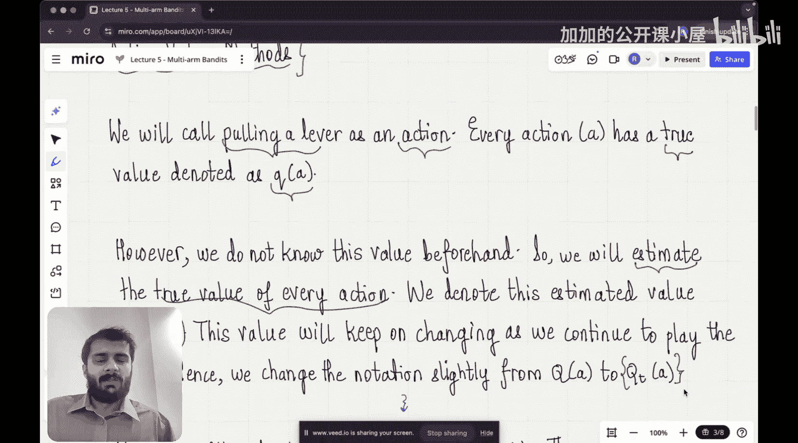

#  005：多臂老虎机


在本节课中，我们将要学习强化学习中的一个经典问题——多臂老虎机。我们将理解其基本概念、核心挑战以及如何通过简单的策略来估计每个“手臂”的价值，从而最大化总收益。

上一节我们介绍了强化学习的基础知识，包括其与监督学习和无监督学习的区别，以及强化学习问题的基本要素。本节中，我们来看看一个更具体、更基础的强化学习问题模型：多臂老虎机。

## 多臂老虎机问题简介

首先，让我们理解“多臂老虎机”这个名称的由来。它源自一种名为“单臂老虎机”的赌博游戏。玩家拉动一个杠杆，如果机器上的符号对齐，就能赢钱；否则就会输钱。它被称为“老虎机”是因为这台机器像强盗一样会“偷走”你的钱。

那么，什么是多臂老虎机呢？顾名思义，它拥有多个杠杆（手臂），而不仅仅是一个。如下图所示，我们可能有四个不同的杠杆。



问题的核心在于：你事先并不知道每个杠杆的真实价值。如果你知道，游戏将变得非常简单——你只需一直拉动价值最高的那个杠杆即可。但在这个游戏中，你必须通过不断尝试来探索每个杠杆，并最终形成一个策略，以选择能带来最大回报的杠杆。

## 问题形式化：动作与价值

在深入解决方案之前，我们需要将这个问题形式化。我们将拉动一个杠杆的行为称为一个**动作**。每个动作都有一个真实的、但我们未知的**价值**，我们用 `Q*(a)` 来表示动作 `a` 的真实价值。

既然我们不知道真实价值，游戏的目标就变成了**估计**每个动作的价值。我们用 `Q_t(a)` 来表示在时间 `t` 时，对动作 `a` 的价值的估计。这个估计值会随着我们不断玩游戏而更新。

那么，如何计算一个动作的估计价值呢？一个直观的方法是计算该动作在过去被选择时，所获奖励的平均值。

以下是计算估计价值的公式：

`Q_t(a) = (在时间 t 之前，选择动作 a 所获得的所有奖励之和) / (在时间 t 之前，选择动作 a 的次数)`

用更数学的方式表达，如果 `R_1, R_2, ..., R_{k_a}` 是选择动作 `a` 所获得的 `k_a` 次奖励，那么：

`Q_t(a) = (R_1 + R_2 + ... + R_{k_a}) / k_a`

这个公式非常直接：它只是过去收益的算术平均值。通过这种方式，我们可以根据历史经验来估计每个杠杆的“好坏”。

## 核心挑战：探索与利用的权衡

现在我们已经知道如何估计动作的价值。一个最直接的策略是：在每一步，都选择当前估计价值最高的那个动作。这个策略被称为**贪婪策略**。

然而，贪婪策略存在一个根本性问题：它可能过早地锁定在一个次优的动作上。例如，你可能在最初几次尝试中，偶然从某个杠杆获得了较高的奖励，从而高估了它。如果你从此只选择这个杠杆，就再也没有机会去尝试其他可能更好的杠杆了。

这就引出了强化学习中的一个核心困境：**探索与利用的权衡**。
*   **利用**：选择当前已知最好的动作，以最大化即时收益。
*   **探索**：尝试那些目前看来不是最优的动作，以收集更多信息，可能在未来发现更好的选择。

一个只利用不探索的智能体可能无法找到真正的最佳动作。一个只探索不利用的智能体则无法有效积累奖励。

## 简单的解决方案：ε-贪婪策略

为了解决探索与利用的难题，一个简单而有效的方法是 **ε-贪婪策略**。这个策略的工作原理如下：

在每一步，智能体以 `1 - ε` 的概率选择当前估计价值最高的动作（即贪婪动作），进行**利用**。
同时，智能体以 `ε` 的概率完全随机地从所有动作中选择一个，进行**探索**。

其中，`ε` 是一个很小的数，例如 0.1 或 0.01，它控制了探索的频率。

以下是 ε-贪婪策略的伪代码描述：

```
对于每一个时间步 t = 1, 2, 3, ...：
    生成一个 0 到 1 之间的随机数 p
    如果 p < ε：
        随机选择一个动作（探索）
    否则：
        选择具有最高估计值 Q_t(a) 的动作（利用）
    执行选择的动作 a_t，获得奖励 R_t
    更新该动作的估计值 Q_{t+1}(a_t)
```

通过引入这个小概率的随机探索，智能体能够持续地测试其他选项，避免陷入局部最优，同时大部分时间仍在利用当前的最佳知识。

## 与完整强化学习问题的联系


现在，让我们将多臂老虎机问题与上一节介绍的完整强化学习问题联系起来。多臂老虎机是强化学习的一个**简化特例**，它只包含一个状态。

在完整的强化学习问题中，智能体身处环境中，其行动不仅影响即时奖励，还会导致状态转移，从而影响未来的奖励序列。而在多臂老虎机中，环境是静态的——每次拉动杠杆都是一个独立的、相同分布的尝试（尽管奖励是随机的），你的选择不会改变“游戏规则”本身。因此，这里没有“状态”的概念，也没有长期价值函数的计算，问题简化为直接估计每个动作的期望奖励。

学习多臂老虎机非常重要，因为它剥离了状态转移的复杂性，让我们能够专注于理解和解决“探索与利用”这个核心挑战，这是所有强化学习算法成功的关键。

本节课中我们一起学习了多臂老虎机问题。我们首先了解了这个问题的现实比喻和基本设定，然后将其形式化为估计动作价值的问题。我们介绍了计算动作价值估计的简单平均方法，并重点探讨了强化学习的核心挑战——探索与利用的权衡。最后，我们学习了一个解决此问题的经典且简单的策略：ε-贪婪策略。理解这个基础模型，为我们后续学习更复杂的、包含状态和长期规划的强化学习算法奠定了坚实的基础。