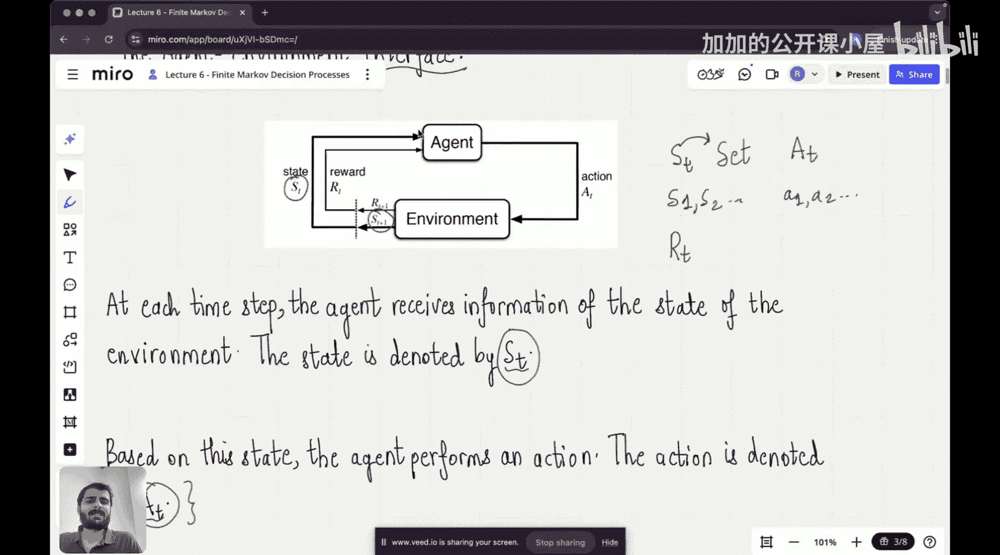

#  006：马尔可夫决策过程

欢迎来到“推理LLM从零开始”课程的第6讲。在过去的两讲中，我们一直专注于强化学习这个主题。在强化学习的第一讲中，我们探讨了强化学习的含义，以及强化学习问题与监督学习问题的区别。然后我们研究了一类被称为“多臂老虎机”的强化学习问题。

在本节课中，我们将开始讨论强化学习的核心，即有限马尔可夫决策过程。这个问题定义了强化学习领域，我们将从头开始完整地理解它。为了理解这个问题，我们首先从定义一种称为“智能体-环境接口”的结构开始。

回想一下关于强化学习的第一讲，我们提到有一个智能体与其周围的环境进行交互。然后它从环境中获得越来越多的经验，不断学习并变得更好，以实现奖励或目标。现在，我们将以这种“智能体-环境接口”的形式来形式化这种直觉。

这个接口表明，在强化学习问题的中心，存在一个智能体。这个智能体从环境中接收关于环境状态的信息，该状态用 **S_t** 表示。因此，在每个时间步，智能体都会从环境中接收某种信息，记为 **S_t**。

然后，基于从环境接收到的信息或信号，智能体将采取某个动作。这个动作用 **A_t** 表示。接着，在智能体执行此动作后，经过一个时间步，智能体将收到环境给予的奖励，并进入一个新的状态。

现在，我们在定义状态、奖励和动作时，将遵循某些命名约定。状态集总是用大写 **S_t** 表示，大写表示集合。而小写，例如 **s1** 和 **s2** 等，表示该集合内的实际状态值。类似地，动作用 **A_t** 表示，动作集用 **A_t** 表示，该动作集内的单个动作用 **a1, a2, a3** 等表示。同样，奖励集用 **R_t** 表示，单个奖励用小写字母 **r1, r2, r3** 等表示。

因此，智能体从环境接收一个状态信号 **S_t**，然后基于该信号采取一个动作。在采取动作之后，状态将发生变化，智能体现在将从环境接收一个新状态，记为 **S_{t+1}**，同时智能体还会收到一个奖励。新状态和新奖励是同时发生的，新奖励记为 **R_{t+1}**。这就是我们将在本讲剩余部分中使用的结构。

现在你可能会想，智能体接收到这个状态后，是如何执行这个动作的呢？

是否存在某种映射来告诉智能体采取什么动作？答案是肯定的。存在一个从每个状态到在该状态下选择每个可能动作的概率的映射。这个映射被称为智能体的**策略**。

因此，策略是从智能体的每个状态到从该状态选择每个可能动作的概率的映射。在某种程度上，策略决定了当智能体从环境接收到特定信号时，它将采取什么动作。我们用 **π_t** 表示这个策略。你也会经常看到这个符号：**π_t(a|s)**，它的意思是：给定状态 **s**，选择动作 **a** 的概率由这个策略给出。所以 **a|s** 表示“给定状态 **s** 下的动作 **a**”，这就是我们阅读这个符号的方式。

现在，让我们尝试理解一些状态的例子。状态的例子可以是传感器读数，或者在下棋或围棋游戏时的中间局面。状态也有一些抽象的概念，例如，“我要去办公室，但我不确定我的车钥匙在哪里”，这种想法就构成了我思维的状态。因此，状态也是一个抽象概念，如果我正在与一个人互动，那么在我与该人进行任何对话之前，我脑海中关于我与那个人关系的任何记忆也可以被视为一种状态。状态是你提供给智能体的任何信息，以使其能够在环境中执行动作，这就是状态的含义。

动作的例子可以是施加到机械臂电机上的电压，决定是否吃午餐，或者小孩第一次学骑自行车时踩踏车轮。所以，状态和动作之间是有区别的。状态就像你拥有的信息，而动作是你从环境获得信息后所做的决策。这就是状态和动作之间的区别。

现在，我们将通过一些实际例子来理解智能体-环境接口，这将具体化你对该接口以及如何用智能体-环境接口来表述问题的理解。

我们举的第一个例子是生物反应器。不用担心生物反应器是什么，即使我也不完全清楚生物反应器的工作原理，但我们不需要知道这些。我们只需要知道，生物反应器是一种用于生产有用化学品的机器。它的工作方式是通过一些传感器获取读数，然后基于这些读数，试图在生物反应器内达到某个温度和某个搅拌速率。根据这些信息，让我们试着思考在智能体和环境接口中，状态、动作和奖励分别是什么。

状态是我们从环境接收到的信息，所以它们是传感器的读数和热电偶的读数。动作是我在生物反应器内设定的目标温度和目标搅拌速率。为了达到目标温度，我将打开加热元件并激活它。为了达到目标搅拌速率，我将激活生物反应器内的电机。这些就是我将基于从环境获得的信息所采取的动作类型。奖励是生物反应器中有用化学品生产速率的瞬时测量值。你可以看到，状态是向量，但奖励是单个标量。例如，状态可以写成这个向量，其中第一个元素是...