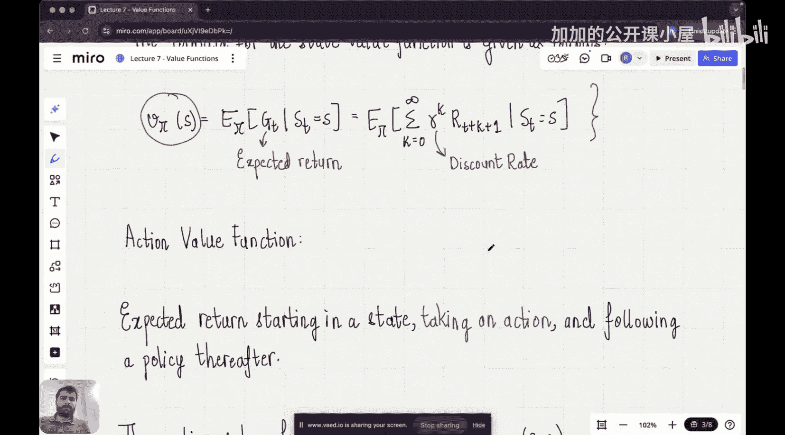

#  007：价值函数

欢迎来到《从零开始构建推理LLM》课程强化学习阶段的下一讲。

在上一讲中，我们介绍了马尔可夫性质的概念，并探讨了如何将强化学习问题描述为马尔可夫决策过程。具体来说，如果一个状态信号保留了所有来自过去的相关信息，它就具有马尔可夫性质。那么，状态信号具有马尔可夫性质的强化学习问题就被称为马尔可夫决策过程。

在本节课中，我们将以马尔可夫决策过程的概念为基础，讨论一个非常重要的概念——价值函数。在我的强化学习研究中，我认识到理解价值函数的概念是理解所有强化学习类型问题的核心。即使在大型语言模型中，例如使用强化学习来改进LLM的DeepSeek等模型，要理解这种改进是如何发生的，理解价值函数的概念也至关重要。因此，我们今天将专门用一整节课来讲解价值函数，不与其他概念合并。

让我们开始理解价值函数的含义。

还记得在强化学习的第一讲中，我们说过“价值”的含义是什么吗？事实上，“价值”是强化学习类型问题的四个要素之一。在第一讲中，我们还说过，价值的含义不是智能体获得的即时奖励，而是长期累积的期望奖励。我们曾用一个很好的类比来理解价值：想象一个团队为锦标赛选择了一名球员，假设是板球比赛，锦标赛有14场比赛，我们假设该球员在前两场比赛中表现不佳。作为团队管理层，他们更关心的是这名球员的“价值”。他们相信，即使这名球员在前两场比赛中表现不佳，他的价值仍然很高，这意味着他最终会在接下来的某些比赛中发挥出色。也就是说，如果你把他14场比赛的所有得分加起来，会得到一个不错的总价值，因此我们可以忽略前两场比赛。所以，价值意味着智能体在长期运行中获得的累积奖励。这与我们在上一讲中看到的“期望回报”概念相似。

## 状态价值函数

让我们来看状态价值函数。假设我们从某个状态开始，然后从这个状态跳转到另一个状态，再跳转到下一个状态，依此类推。这个状态的价值不是我在此处获得的即时奖励，而是我的智能体在未来获得的所有奖励的总和。本质上，你汇总所有奖励，然后问一个问题：这个累积总和在长期运行中的期望值是多少？这样你就得到了这个状态的价值。

状态价值函数用符号 **Vπ(s)** 表示。这意味着我们是在智能体遵循策略 **π** 的情况下计算这个状态 **s** 的价值。

我们可以根据上一讲关于期望回报的讨论来写出 **Vπ(s)** 的表达式。期望回报 **Gt** 是：
**Gt = Rt+1 + γRt+2 + γ²Rt+3 + ...**
其中 **γ** 是折扣率。这个公式特别适用于连续任务。

状态价值函数就是这个期望回报的期望值。因此，**Vπ(s)** 的公式如下：
**Vπ(s) = Eπ[Gt | St = s] = Eπ[ Σk=0∞ γk Rt+k+1 | St = s ]**

不要被数学符号困扰。状态价值背后的直觉很简单：本质上，我们是在观察，如果一个智能体处于某个状态，它未来可能获得哪些奖励？然后我们说，如果你把这些奖励加起来，整个奖励总和的期望值是多少？我们引入折扣率 **γ**，是因为未来的奖励不如即时奖励有价值。还记得我们讨论过，如果你有一张100卢比的钞票，五年后它的价值远低于现在的价值。这里的道理非常相似：我们说的是，与未来收到的奖励相比，更即时的奖励更有价值。这个直觉通过折扣率 **γ** 得到了很好的体现。

## 动作价值函数

在讨论了状态价值函数之后，我们现在需要继续看看什么是动作价值函数。

动作价值函数意味着我们仍然在计算从一个状态出发的期望回报，但与状态价值函数唯一的区别在于，这里我们计算的是智能体采取某个特定动作 **a** 之后，再遵循策略 **π** 所能获得的期望回报。

状态价值函数和动作价值函数的主要区别在于：假设你有一个智能体，它到达了某个状态 **s**。状态价值函数 **Vπ(s)** 问的是：“从这个状态开始，遵循策略 **π**，我能期望获得多少总回报？”而动作价值函数 **Qπ(s, a)** 问的是：“在状态 **s** 下，如果我选择执行动作 **a**，然后从下一个状态开始遵循策略 **π**，我能期望获得多少总回报？”

动作价值函数用符号 **Qπ(s, a)** 表示。其公式与状态价值函数类似，但条件包含了所采取的动作：
**Qπ(s, a) = Eπ[Gt | St = s, At = a] = Eπ[ Σk=0∞ γk Rt+k+1 | St = s, At = a ]**

## 两种价值函数的关系与重要性

理解这两种价值函数的关系至关重要。状态价值 **Vπ(s)** 可以看作是，在状态 **s** 下，根据策略 **π** 选择各个可能动作的动作价值 **Qπ(s, a)** 的加权平均，权重就是策略 **π** 在该状态下选择每个动作的概率 **π(a|s)**。用公式表示就是：
**Vπ(s) = Σa π(a|s) * Qπ(s, a)**

价值函数是强化学习的核心，因为它们为评估和比较不同的状态或“状态-动作”对提供了标准。智能体的目标就是找到最大化价值函数（无论是状态价值还是动作价值）的策略。在后续的课程中，我们将看到如何利用这些价值函数来改进策略，例如通过策略迭代或价值迭代等方法。在基于人类反馈的强化学习等技术中，价值函数（通常由一个称为“奖励模型”或“价值模型”的独立网络学习）被用来指导语言模型的生成，使其输出更符合人类偏好、更有帮助且更无害的内容。

## 总结

本节课中，我们一起深入学习了强化学习中的核心概念——价值函数。我们首先回顾了价值的含义，即长期累积的期望奖励。然后，我们分别定义了**状态价值函数 Vπ(s)** 和**动作价值函数 Qπ(s, a)**，并给出了它们的数学表达式。我们强调了折扣率 **γ** 在衡量未来奖励现值时的重要性。最后，我们简要讨论了两类价值函数之间的关系及其在寻找最优策略和高级RL应用（如对齐大语言模型）中的根本作用。理解价值函数是打开强化学习大门的关键钥匙。