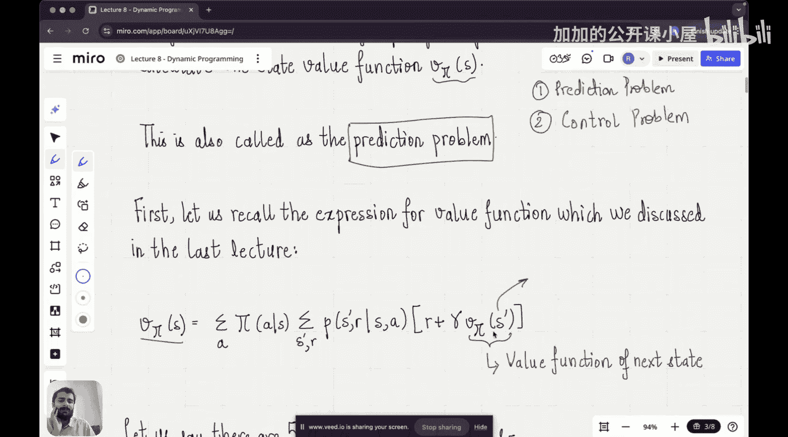

#  008：动态规划与强化学习阶段

在本节课中，我们将学习如何解决强化学习问题，以找到智能体的最优策略。我们将从动态规划方法开始，这是求解价值函数和最优策略的基础算法集合。

上一节我们介绍了价值函数和贝尔曼方程。本节中，我们来看看如何利用这些方程来实际求解价值函数，进而找到最优策略。我们将从动态规划的第一步——策略评估开始。

## 策略评估：预测问题

动态规划方法的第一步称为**策略评估**。其含义是：对于一个给定的策略 **π**，我们能否估计出该策略下的价值函数 **V^π(s)**。

策略评估也被称为**预测问题**。在动态规划乃至所有求解最优策略的方法中，通常分为两步：首先是预测问题（评估给定策略的好坏），然后是控制问题（改进策略以找到最优策略）。我们先深入理解预测问题。

以下是策略评估的核心思路：利用上一节学习的贝尔曼方程。

贝尔曼方程表明，一个状态 **s** 的价值函数 **V(s)** 可以通过其后续状态 **s'** 的价值函数 **V(s')** 来表示。具体来说，**V(s)** 等于所有可能的下一个状态 **s'** 的期望回报之和，其中考虑了即时奖励 **r**、折扣因子 **γ** 以及从状态 **s** 采取动作 **a** 后转移到状态 **s'** 并获得奖励 **r** 的概率。

我们可以用以下公式来表达给定策略 **π** 下的贝尔曼方程：

**V^π(s) = Σ_a π(a|s) Σ_{s', r} p(s', r | s, a) [ r + γ * V^π(s') ]**

其中：
*   **π(a|s)** 是策略，表示在状态 **s** 下采取动作 **a** 的概率。
*   **p(s', r | s, a)** 是状态转移概率，表示在状态 **s** 采取动作 **a** 后，转移到状态 **s'** 并获得奖励 **r** 的概率。
*   **γ** 是折扣因子。

然而，这里存在一个挑战：方程右侧包含了未知的后续状态价值函数 **V^π(s')**。每个状态的价值函数方程都依赖于其他状态的价值函数，这形成了一个相互关联的方程组。

## 动态规划求解：迭代策略评估

我们的主要目标就是解决这个预测问题。动态规划提供了一种迭代方法来求解这个方程组。

其核心思想是**迭代策略评估**。我们从一个对价值函数的初始猜测开始（例如，将所有状态的价值设为0）。然后，我们反复应用贝尔曼方程作为更新规则，来改进我们对每个状态价值的估计。

具体步骤如下：
1.  初始化：为所有状态 **s** 设定一个初始价值估计 **V_0(s)**。
2.  迭代更新：对于第 **k+1** 次迭代，使用第 **k** 次迭代的价值估计，按照以下公式更新所有状态的价值：
    **V_{k+1}(s) = Σ_a π(a|s) Σ_{s', r} p(s', r | s, a) [ r + γ * V_k(s') ]**
3.  收敛判断：重复步骤2，直到价值函数的变化小于一个设定的阈值，此时我们认为价值函数已经收敛到 **V^π**。

这个过程被称为“**自举**”，因为我们利用当前的价值估计来更新自身。只要折扣因子 **γ < 1** 或者所有策略都能保证最终到达终止状态，这个迭代过程就能保证收敛到真实的 **V^π**。

## 从评估到控制：策略改进

一旦我们能够评估一个给定策略的价值函数（解决了预测问题），下一步自然就是**改进策略**（解决控制问题）。目标是找到比当前策略更好的策略。

策略改进基于一个简单的思想：**策略提升定理**。如果在某个状态 **s**，我们选择一个动作 **a**（这个动作不同于原策略 **π** 在该状态建议的动作），并且这个动作能带来更高的期望回报（即 **Q^π(s, a) > V^π(s)**），那么通过在该状态改为选择这个新动作，并保持其他状态策略不变，我们就能得到一个总体上优于原策略 **π** 的新策略 **π'**。

这里 **Q^π(s, a)** 是动作价值函数，表示在状态 **s** 采取动作 **a**，然后遵循策略 **π** 所能获得的期望回报。其公式为：
**Q^π(s, a) = Σ_{s', r} p(s', r | s, a) [ r + γ * V^π(s') ]**

策略改进的步骤是：对于每个状态 **s**，我们检查是否有某个动作 **a** 的 **Q^π(s, a)** 值大于当前的 **V^π(s)**。如果有，我们就更新策略，使在该状态选择这个“更优”动作的概率增加（例如，改为确定性地选择该动作）。

## 策略迭代与价值迭代

结合策略评估和策略改进，我们可以得到两种主要的动态规划算法：

1.  **策略迭代** 🔄
    *   步骤一：**策略评估**：给定当前策略 **π**，迭代计算其价值函数 **V^π** 直至收敛。
    *   步骤二：**策略改进**：基于计算出的 **V^π**，通过贪心策略（在每个状态选择 **Q^π(s, a)** 最大的动作 **a**）生成一个更好的新策略 **π'**。
    *   重复步骤一和步骤二，直到策略不再发生变化，此时我们就找到了最优策略 **π***。

2.  **价值迭代** ⚡
    *   价值迭代将策略评估和策略改进的过程合并为一步。它直接迭代更新状态价值函数，其更新规则基于贝尔曼最优方程：
        **V_{k+1}(s) = max_a Σ_{s', r} p(s', r | s, a) [ r + γ * V_k(s') ]**
    *   这个公式直接假设在每一步都采取最优动作。当价值函数收敛后，最优策略可以通过对每个状态选择最大化上述表达式的动作来得到：
        **π*(s) = argmax_a Σ_{s', r} p(s', r | s, a) [ r + γ * V*(s') ]**

价值迭代通常比策略迭代更快，因为它不需要等待策略评估完全收敛。

## 动态规划的假设与局限性

动态规划方法功能强大，但它们基于一个关键假设：**我们拥有环境的完美模型**。具体来说，我们需要知道状态转移概率 **p(s', r | s, a)** 和奖励函数。在已知模型的情况下，动态规划是计算最优策略的高效方法。

然而，在大多数现实世界的强化学习问题中（例如游戏、机器人控制），我们并**不知道**环境的精确模型。这正是动态规划的主要局限性。

本节课中我们一起学习了动态规划，它是解决已知模型强化学习问题的经典方法。我们首先通过**策略评估**（预测问题）学习了如何计算给定策略的价值函数。然后，我们探讨了如何通过**策略改进**来获得更好的策略，并最终介绍了**策略迭代**和**价值迭代**这两种寻找最优策略的核心算法。理解动态规划为我们后续学习在未知模型环境中工作的算法（如蒙特卡洛方法和时序差分学习）奠定了重要基础。