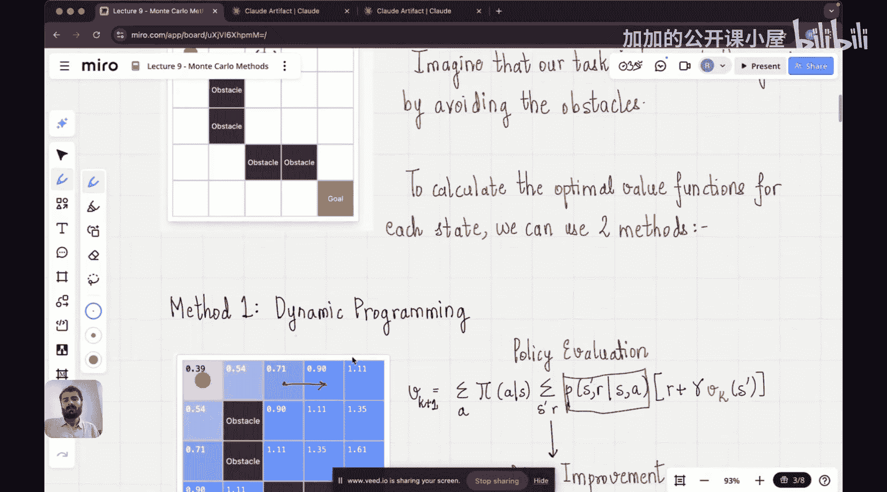

#  009：蒙特卡洛方法 | 强化学习阶段

在本节课中，我们将学习强化学习中的蒙特卡洛方法。我们将了解它如何仅通过与环境的交互经验来估计价值函数和寻找最优策略，并理解其与动态规划方法的根本区别。

## 概述

上一节我们介绍了动态规划方法，它通过“自举”的方式，利用后续状态的价值来更新当前状态的价值。然而，动态规划的一个核心限制是它需要环境的完整模型，即状态转移概率和奖励函数。在许多实际场景中，我们无法预先获得这个模型。

本节中，我们来看看蒙特卡洛方法。这是一种基于经验的学习方法，它不需要环境的先验知识，只需要智能体与环境交互产生的“经验”序列（或称“幕”），就能学习到价值函数和最优策略。

## 蒙特卡洛 vs. 动态规划

动态规划的核心是**自举**，其更新公式基于贝尔曼方程：
`V(s) ← Σ_a π(a|s) Σ_s‘ P(s'|s,a) [R(s,a,s') + γV(s')]`
这个公式要求我们知道模型 `P(s'|s,a)` 和 `R(s,a,s')`。

蒙特卡洛方法则完全不同。它通过让智能体遵循策略 `π` 与环境交互，收集从起始状态到终止状态的完整轨迹（称为一幕），然后计算该轨迹上获得的实际回报，并用这个实际回报的平均值来估计状态的价值。其核心思想是**从经验中学习**。

以下是两者的关键区别：
*   **模型需求**：动态规划需要**完整的环境模型**；蒙特卡洛方法**不需要模型**，只需要经验。
*   **更新时机**：动态规划可以基于其他状态的估计值进行单步更新；蒙特卡洛方法必须等待**一幕结束**后才能进行更新。
*   **学习方式**：动态规划是**计算**；蒙特卡洛是**从样本中学习**。

## 一个直观的例子

为了更直观地理解，让我们考虑一个具体场景。假设你是一个智能体（黄色圆圈），你的任务是从起点出发，避开障碍物（黑色方块），到达目标点（绿色方块），并获得最大奖励。

在这个网格世界中：
*   **状态**：每个单元格就是一个状态（例如起点、目标点、每个空位）。
*   **动作**：在每个状态，你可以选择向上、向下、向左、向右移动。
*   **奖励**：到达目标可能获得+1奖励，撞到障碍物或走出边界可能获得-1奖励，每走一步可能获得一个小的负奖励（如-0.01）以鼓励尽快到达目标。

**如何用动态规划解决？**
你需要知道所有状态转移概率 `P(s'|s,a)`。例如，在中间的空单元格，执行“向上”动作，成功移动到上方单元格的概率是多少？如果假设动作执行是确定的，那么这个概率就是1。但即使如此，你仍然需要预先定义好整个环境的动态规则。对于火星探测器这样的未知环境，这是不可能的。

**如何用蒙特卡洛方法解决？**
你不需要知道任何概率。你只需要让智能体（或模拟程序）一次又一次地尝试从起点走到终点。每次尝试（一幕）结束后，你记录下经过的路径和获得的总奖励。例如：
*   第一幕：起点 -> 右 -> 右 -> 上 -> 撞墙 -> ... -> 最终到达目标，总奖励 = 0.5。
*   第二幕：起点 -> 上 -> 上 -> 右 -> 右 -> 到达目标，总奖励 = 0.9。
*   ...

然后，对于某个状态（比如起点右边第一个格子），你查看所有经过这个状态的幕，计算这些幕从该状态开始到结束所获奖励的平均值。这个平均值就是该状态价值的估计。通过大量这样的“经验”，价值估计会越来越准确，进而可以改进策略。

## 蒙特卡洛预测：评估给定策略

蒙特卡洛预测的目标是：给定一个策略 `π`，估计该策略下的状态价值函数 `Vπ(s)`。

其算法步骤如下：
1.  **初始化**：对所有状态 `s`，初始化价值 `V(s)` 为一个任意值（如0），并初始化一个计数器 `N(s)=0`，用于记录状态 `s` 被访问的次数。
2.  **生成经验**：使用策略 `π` 与环境交互，产生一幕序列：`S0, A0, R1, S1, A1, R2, ..., ST`（其中 `T` 是终止时刻）。
3.  **计算回报**：从该幕的**最后一步向前回溯**。对于时间步 `t`，其回报 `Gt` 是从 `t` 开始到幕结束所获奖励的总和（考虑折扣 `γ`）：`Gt = Rt+1 + γ*Rt+2 + γ²*Rt+3 + ... + γ^(T-t-1)*RT`。
4.  **更新价值**：对于该幕中出现的**每一个**状态 `St`：
    *   递增计数器：`N(St) ← N(St) + 1`
    *   更新价值估计（增量式更新）：`V(St) ← V(St) + (1/N(St)) * [Gt - V(St)]`
        这个公式的含义是：用新观测到的回报 `Gt` 与旧估计 `V(St)` 的误差，来调整旧估计。`1/N(St)` 是学习步长，随着样本增多，调整幅度变小。
5.  **重复**：回到步骤2，用新的幕继续更新，直到价值函数收敛。

## 蒙特卡洛控制：寻找最优策略

仅仅评估一个策略不够，我们的目标是找到最优策略 `π*`。蒙特卡洛控制将策略评估和策略改进结合起来。

最常见的方法是**蒙特卡洛ES（Exploring Starts，探索性起始）**算法：
1.  **初始化**：随机初始化所有状态 `s` 和所有动作 `a` 的 `Q(s,a)`（动作价值）和 `π(s)`（策略）。`π(s)` 通常初始化为等概率随机策略。
2.  **循环（每一幕）**：
    *   **探索性起始**：随机选择一幕的起始状态 `S0` 和起始动作 `A0`，确保每个状态-动作对都有被访问到的可能。
    *   **生成轨迹**：从 `(S0, A0)` 开始，遵循当前策略 `π` 生成一幕序列，直到终止。
    *   **计算回报**：同预测步骤，计算该幕中每个状态-动作对 `(St, At)` 的回报 `Gt`。
    *   **更新动作价值**：对于该幕中出现的**每一个**状态-动作对 `(St, At)`：
        *   `N(St, At) ← N(St, At) + 1`
        *   `Q(St, At) ← Q(St, At) + (1/N(St, At)) * [Gt - Q(St, At)]`
    *   **策略改进**：对于该幕中出现的**每一个**状态 `St`，更新策略为贪婪策略：`π(St) ← argmax_a Q(St, a)`。即选择当前估计下能带来最大价值的动作。

通过不断重复“用策略生成经验 -> 用经验更新Q值 -> 根据Q值改进策略”的循环，最终可以收敛到最优策略和最优动作价值函数。

## 总结

本节课中我们一起学习了蒙特卡洛方法。我们了解到，与需要完整环境模型的动态规划不同，蒙特卡洛方法是一种**基于经验**的无模型强化学习方法。它的核心是让智能体通过实际交互收集完整的“幕”序列，然后用这些序列中观测到的实际回报的平均值来估计状态或状态-动作对的价值。

我们学习了两个主要部分：
1.  **蒙特卡洛预测**：用于评估一个给定策略的好坏。
2.  **蒙特卡洛控制**（如蒙特卡洛ES算法）：通过结合策略评估和策略改进（通常采用贪婪策略），来寻找最优策略。

蒙特卡洛方法的优势在于其简单性和对未知环境模型的适用性，但它也有缺点，例如必须等待一幕结束才能更新，且对探索有较高要求。这为我们理解后续更高效的时序差分学习方法奠定了基础。