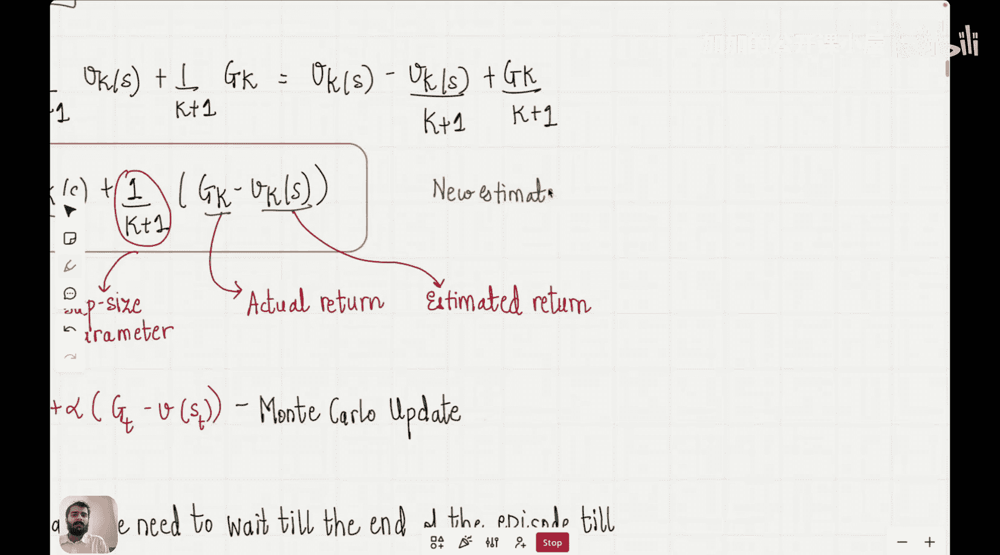

#  010：时序差分预测｜强化学习阶段


在本节课中，我们将学习强化学习中的时序差分方法。我们将探讨它如何结合蒙特卡洛方法和动态规划的优点，并理解其更新机制。

## 概述

在本系列课程中，我们正处于强化学习阶段。上一讲我们探讨了蒙特卡洛方法，再上一讲我们学习了动态规划。今天，我们将通过讨论时序差分方法来完善这三种核心方法。

动态规划方法需要环境的完整模型，否则无法求解贝尔曼方程。蒙特卡洛方法解决了这一限制，它不需要环境模型，智能体可以直接从自身经验中学习。这是一个巨大的进步，意味着即使不了解环境的完整动态，也可以让智能体通过与环境的交互来学习，并逐渐收敛到真实的价值函数，从而找到最优策略。

然而，我们在上一讲也讨论了蒙特卡洛方法的一个局限：在更新状态价值之前，必须等待整个回合结束。这是因为要计算一个状态的真实回报，需要访问从该状态开始直到回合结束的所有状态。

今天要讨论的方法，结合了蒙特卡洛和动态规划的思想。它与蒙特卡洛的相似之处在于，它从原始经验中学习，同样不需要环境模型。它与动态规划的相似之处在于，它基于其他已学习的估计值进行更新，并且不需要等待最终结果。现在，让我们深入探讨这些方法的工作原理，以及为什么人们通常更倾向于使用它们。

## 时序差分预测问题

首先，我们来定义预测问题的含义。给定一个策略 π，目标是估计遵循该策略的所有状态的价值。这就是预测问题。我们已经用动态规划和蒙特卡洛方法解决了预测问题，现在来看看时序差分方法中的预测问题。

假设我们想用蒙特卡洛方法估计一个状态 S 的价值。令之前的估计值为 **V_k(S)**。我们希望在完成一个获得回报 **G_k** 的回合后更新这个估计值。这里的下标 k 表示第 k 个回合。我们的目标是找到新的估计值 **V_{k+1}(S)**。

在蒙特卡洛方法中，我们通过计算所有历史回报的平均值来更新价值估计。对于前 k 个回合，状态 S 的价值估计可以表示为所有历史回报的平均值。

当我们获得第 k+1 个回合的新回报 **G_k** 后，新的价值估计 **V_{k+1}(S)** 就需要将新回报纳入平均计算。

我们的目标是将 **V_{k+1}(S)** 表示为 **V_k(S)** 的函数。通过数学推导，我们可以得到以下更新公式：

**V_{k+1}(S) = V_k(S) + α * (G_k - V_k(S))**

其中，**α = 1/(k+1)**，可以看作学习率。

这个公式的含义是：新的估计值等于旧的估计值加上一个调整项。调整项是当前回报 **G_k** 与旧估计值 **V_k(S)** 之间的差值（称为“误差”或“惊喜”），乘以一个学习率 α。这本质上是一种增量平均的计算方式。

## 从蒙特卡洛到时序差分

上一节我们推导了蒙特卡洛方法的增量更新公式。然而，这个公式仍然需要等待整个回合结束以获得 **G_k**。时序差分方法的关键思想是：我们不必等待回合结束，可以基于下一个状态的估计值进行更新。

在时序差分中，我们使用一个估计值来替代完整的未来回报。具体来说，我们使用当前奖励 **R_{t+1}** 加上下一个状态 **S_{t+1}** 的折扣估计值 **γ * V(S_{t+1})**，来近似从状态 **S_t** 开始的回报。这被称为 **TD 目标**。

因此，时序差分方法的更新公式变为：

**V(S_t) ← V(S_t) + α * [ R_{t+1} + γ * V(S_{t+1}) - V(S_t) ]**

这个公式就是著名的 **TD(0)** 更新规则。其中：
*   **V(S_t)**：状态 **S_t** 的当前估计值。
*   **α**：学习率，控制更新步长。
*   **R_{t+1}**：在状态 **S_t** 执行动作后立即获得的奖励。
*   **γ**：折扣因子，衡量未来奖励的当前价值。
*   **V(S_{t+1})**：下一个状态 **S_{t+1}** 的当前估计值。
*   **[ R_{t+1} + γ * V(S_{t+1}) ]**：这就是 **TD 目标**。
*   **[ TD目标 - V(S_t) ]**：这就是 **TD 误差**，它驱动着价值估计的更新。

这个更新的核心思想是：用对下一步的即时估计（TD目标）来修正当前状态的估计值。它结合了蒙特卡洛（从经验学习）和动态规划（基于其他估计值进行更新，即“自举”）的思想。

## 时序差分方法的优势

以下是时序差分方法相较于蒙特卡洛和动态规划的主要优势：

**在线学习**
时序差分方法可以在每一步之后立即更新价值估计，无需等待回合结束。这使得学习更加高效，尤其适用于长回合或连续任务。

**无需环境模型**
与动态规划不同，时序差分方法像蒙特卡洛一样，不需要知道环境的转移概率和奖励函数。它直接从经验中学习。

**方差更低**
与蒙特卡洛方法相比，时序差分更新依赖于当前的估计值，而不是整个回合的随机回报序列，因此通常具有更低的方差，学习过程更稳定。

**收敛性**
在适当的条件下，时序差分方法能够收敛到真实的价值函数。

## 算法：TD(0) 预测

以下是用于策略评估（预测）的 TD(0) 算法的伪代码描述：

```
输入：待评估的策略 π
参数：学习率 α ∈ (0, 1]，折扣因子 γ ∈ [0, 1]
初始化：对于所有状态 s ∈ S，任意初始化 V(s)（例如，初始化为0）

循环每个回合：
    初始化状态 S
    当状态 S 不是终止状态时：
        根据策略 π，在状态 S 选择动作 A
        执行动作 A，观察奖励 R 和下一个状态 S‘
        # TD(0) 更新
        V(S) ← V(S) + α * [ R + γ * V(S') - V(S) ]
        S ← S‘
```

该算法持续运行，直到价值函数 V(s) 收敛或达到预设的迭代次数。

## 总结

本节课我们一起学习了时序差分预测方法。我们首先回顾了蒙特卡洛方法的增量更新形式，然后引入了时序差分的核心思想：用下一步的估计（TD目标）来替代完整的蒙特卡洛回报，从而实现每一步的在线更新。

我们推导了 **TD(0)** 的更新公式 **V(S_t) ← V(S_t) + α * [ R_{t+1} + γ * V(S_{t+1}) - V(S_t) ]**，并解释了其中 TD 目标和 TD 误差的含义。最后，我们讨论了时序差分方法结合蒙特卡洛和动态规划优点的特性，并给出了 TD(0) 预测算法的具体步骤。



时序差分方法是现代强化学习的基石之一，为后续更高级的算法（如 Q-learning、SARSA）奠定了基础。