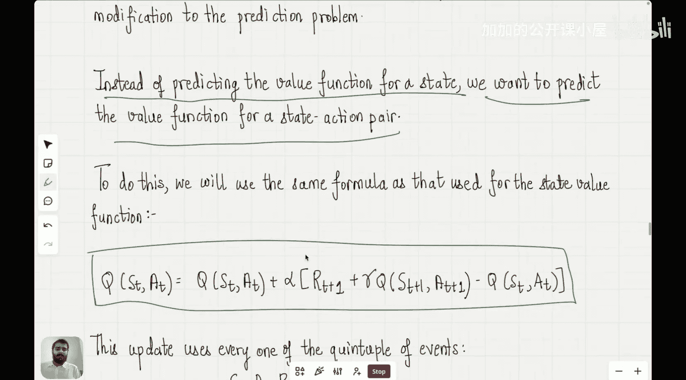

#  011：时序差分控制

在本节课中，我们将基于上一讲的内容，讨论时序差分方法中的控制问题。

上一节我们介绍了如何使用时序差分方法解决预测问题。本节中我们来看看如何将其扩展到控制问题，以寻找最优策略。

## 概述

在强化学习中，预测问题是给定一个策略，我们试图确定该策略的价值函数。控制问题则是要找出最优策略。我们已经学习了动态规划和蒙特卡洛方法中的控制问题，现在将探讨如何在时序差分框架下解决它。

## 预测问题回顾

首先，快速回顾一下预测问题。在预测问题中，给定一个策略，我们尝试确定该策略的价值函数。我们在上一讲中看到，时序差分方法用于写出更新规则。

更新规则如下：
`V(s) ← V(s) + α * [R_{t+1} + γ * V(S') - V(s)]`
其中，`V(S')` 是下一步的状态价值，这个更新规则用于更新所有状态的价值。这正是使用时序差分方法解决预测问题的方式。

我们还看到，与蒙特卡洛方法相比，TD方法具有显著优势，特别是你无需等待整个回合结束即可进行更新。它们在某种程度上与动态规划相似，因为都涉及“自举”的元素。

当我们进行自举时，我们使用下一个状态的价值来更新前一个状态的价值。这正是我们在动态规划和时序差分方法中所做的，但在蒙特卡洛方法中我们不这样做，因为蒙特卡洛方法使用整个回合的回报。

## 从预测到控制

现在，我们将理解如何解决控制问题。请记住，在控制问题中，我们试图找出哪个策略是最优策略。

既然我们已经理解了如何使用时序差分方法来估计给定策略的价值函数，我们能否推动策略向最优策略发展？

我们在动态规划和蒙特卡洛方法中也研究过这个问题，通常这个过程是递归的。换句话说，你更新策略，然后再次改变价值函数，接着再次更新策略，这种来回的算法持续进行，直到获得最优策略及其对应的价值函数。

## 蒙特卡洛控制方法回顾

为了给本次讨论打下基础，让我们快速回顾一下蒙特卡洛方法中的控制问题。

在蒙特卡洛方法中，代理遵循特定策略经历一系列状态，直到回合结束。然后，你根据整个回合的回报来更新状态的价值函数。

当你试图优化策略时，假设从状态 `S` 出发，有三个可能的动作：`A1`、`A2` 和 `A3`。如果 `A3` 是能给你最大回报的动作，但你的代理只探索过 `A1`，那么这对你没有帮助，因为代理根本没有探索过 `A2` 和 `A3`。这个问题在动态规划中不会出现，因为我们知道环境模型，所有动作都被探索过了。

因此，我们必须进行一个称为“探索”的过程。探索意味着，即使你的动作价值函数 `Q(S, a)` 告诉你动作 `A1` 的价值最大，你也会以概率 `ε` 采取一个完全随机的动作。这个随机动作可能是 `A3`，这将允许你探索以前未探索过的更多动作。这种策略被称为 **ε-贪心策略**。

ε-贪心策略允许你探索以前未探索过的动作，并最终以这样的方式更新 `Q` 函数：所有可能的动作都被代理探索过。因此，对于每个状态，你都知道哪个动作是最好的，因为所有动作都被代理探索过了。

## ε-贪心策略与策略迭代

以下是我们在蒙特卡洛方法中用于更新动作价值函数的策略：

1.  我们首先使用预测方法计算动作价值函数。我多次使用“动作价值函数”这个词，以防你不记得之前的课程。它简单意味着，如果我处于特定状态并采取一个动作，那么我在未来预期的奖励是多少。当策略最优时，它将始终选择具有最大动作价值函数值的动作。
2.  之后，我们使用 **ε-贪心策略** 为每个状态选择动作。
3.  然后我们再次更新这个动作价值函数。

这个过程持续递归进行。我们首先假设一个初始策略（通常是随机策略），然后通过反复经历回合来估计该策略的动作价值函数。接着，我们基于 ε-贪心动作更新该策略，这意味着我们查看更新后的 `Q` 值，找出每个状态下哪个动作的 `Q` 值最大，并根据这些更新后的 `Q` 值决定每个状态的动作。偶尔，我们会采取随机动作。因此，我们遵循 ε-贪心策略。

这在某种程度上也是一种策略迭代，类似于我们在动态规划中看到的，但更加隐式。你并没有明确地说你在迭代策略，但本质上你是，因为 `Q` 函数（这些 `Q` 值）在每个回合后都在更新，而你的 ε-贪心策略基于这个 `Q` 函数决定动作，所以它们也在每个回合后更新。这就是为什么这两个过程是同时发生的。

简而言之，我们所做的是：使用 ε-贪心策略，通过多次执行回合来更新动作价值函数。我们看到，如果你执行足够多的回合，动作价值函数会收敛到最优动作价值函数，策略也会收敛到最优策略。

## 时序差分控制

现在，在时序差分方法的控制问题中，我们将采用非常相似的方法。我们不是预测状态的价值函数，而是预测“状态-动作对”的价值函数。

这意味着，如果我处于一个状态并采取一个特定动作，那么该动作的价值是多少？换句话说，代理在采取该动作后未来将获得的累积奖励是多少？

然后，这个公式与我们之前看到的用于价值函数的 TD 更新完全相同，唯一的区别是将状态价值 `V(s)` 替换为动作价值 `Q(s, a)`。

## 总结

本节课中我们一起学习了如何将时序差分方法从预测问题扩展到控制问题。我们回顾了蒙特卡洛控制中的 ε-贪心策略，它通过平衡探索与利用来寻找最优策略。在时序差分控制中，核心思想是将状态价值更新转变为状态-动作价值更新，并同样结合策略改进（如 ε-贪心策略）来迭代地逼近最优策略和最优价值函数。这构成了像 Q-learning 和 SARSA 这类重要算法的基础。