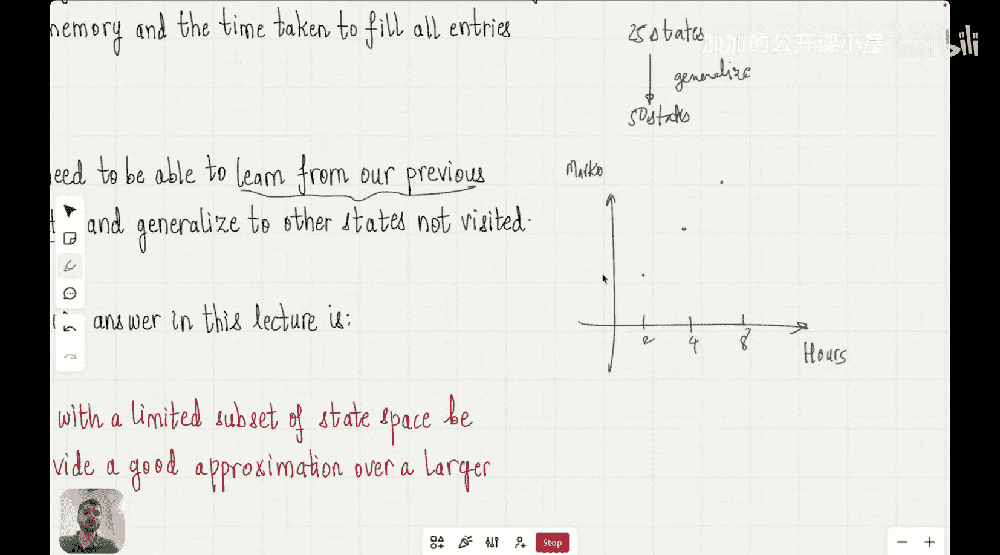

#  012：函数逼近方法｜强化学习阶段

在本节课中，我们将学习强化学习中的函数逼近方法。我们将探讨如何利用有限的状态访问经验，来近似估计整个巨大状态空间的价值函数，从而解决表格方法在处理大规模问题时的局限性。

## 课程回顾与问题引入

上一节我们介绍了时序差分方法，它是解决无需环境模型且能即时更新的有效算法。本节中，我们来看看当状态空间变得极其庞大时，传统方法面临的挑战。

到目前为止，我们课程中讨论的所有强化学习方法——动态规划、蒙特卡洛方法和时序差分方法——都属于**表格方法**。在这些方法中，我们为每个独立的状态 `s` 计算并存储一个具体的价值 `V(s)`。这就像为每个状态在表格中预留了一个位置。

表格方法在状态数量有限时是有效且直观的。然而，其主要的缺点在于，对于实际问题，状态的数量往往是**极其庞大**的。

以国际象棋游戏为例。棋盘上的棋子有多种走法，导致可能的状态组合数量达到了惊人的 `10^46` 个。如果使用表格方法，我们需要为这 `10^46` 个状态中的每一个都计算并存储一个价值。这需要巨大的内存和计算时间，在实践中几乎无法实现。

因此，表格方法虽然易于理解和教学，可以作为现代强化学习的入门基础，但其本身并不适用于解决具有巨大状态空间的现实问题。

## 函数逼近的核心思想

那么，我们该如何解决这个问题呢？关键在于**泛化**。

我们能否让智能体只访问一部分状态，然后利用从这些状态中学到的知识，去**估计**它尚未访问过的其他状态的价值？这正是函数逼近方法要解决的问题。

当你听到“泛化”这个词时，可能会联想到**回归**问题。例如，我们有一些数据点：学生学习了2小时、4小时和8小时后的考试成绩。我们希望通过这些已知的点，拟合出一条曲线或直线，从而预测学习了6小时（一个未知点）的成绩。

函数逼近在强化学习中的思想与此类似。我们不再为每个状态 `s` 存储单独的价值 `V(s)`，而是尝试找到一个**函数** `V̂(s, w)`。这个函数以状态 `s` 作为输入，并输出该状态的**近似价值**。参数 `w` 是我们要学习的权重，它定义了函数的具体形式。

**核心公式**：
`V(s) ≈ V̂(s, w)`

我们的目标是通过调整参数 `w`，使得函数 `V̂` 对已访问状态的价值预测尽可能准确，同时也能对未访问状态给出合理的估计。

## 函数逼近的优势

以下是采用函数逼近方法的主要好处：

1.  **节省内存**：我们不再需要存储一个与状态数量等大的表格，只需要存储函数 `V̂` 的参数 `w`。参数的数量通常远小于状态的数量。
2.  **泛化能力**：智能体可以从有限的经验中学习，并将其知识推广到未见过的状态。例如，在象棋中，即使智能体从未见过某个具体的棋盘布局，如果该布局与它见过的某些布局相似，函数 `V̂` 也能给出一个合理的价值估计。
3.  **处理连续状态**：表格方法只能处理离散的、可枚举的状态。而函数逼近可以自然地处理连续状态空间（例如，机器人的关节角度、汽车的速度），只需将连续状态作为函数的输入即可。

## 学习方法与损失函数

我们如何学习参数 `w` 呢？这通常通过**梯度下降**类算法来完成。

我们定义一个**损失函数** `J(w)`，用于衡量当前参数 `w` 下，预测值 `V̂(s, w)` 与目标值（例如，蒙特卡洛回报 `G_t` 或时序差分目标 `R_{t+1} + γV̂(s_{t+1}, w)`）之间的差异。

**核心思想**是：计算损失函数 `J(w)` 关于参数 `w` 的梯度，然后沿着梯度反方向（即减小损失的方向）更新参数。

**参数更新公式（梯度下降）**：
`w ← w - α * ∇_w J(w)`
其中，`α` 是学习率。

不同的强化学习算法（如蒙特卡洛或时序差分）会提供不同的目标值，从而定义不同的具体损失函数和更新规则。但它们的共同目标都是最小化预测值与目标值之间的误差。

## 总结

本节课中我们一起学习了强化学习中的函数逼近方法。我们首先指出了传统表格方法在处理海量状态空间时的局限性。接着，我们引入了函数逼近的核心思想：使用一个带参数的函数 `V̂(s, w)` 来近似真实的价值函数 `V(s)`，从而实现状态的泛化。这种方法不仅能大幅节省存储和计算资源，还能让智能体将经验推广到未知状态，并处理连续状态空间。最后，我们了解到参数 `w` 的学习通常通过基于梯度下降最小化预测误差来完成。函数逼近是连接经典强化学习与能够解决复杂实际问题（如游戏、机器人控制）的现代深度强化学习的关键桥梁。