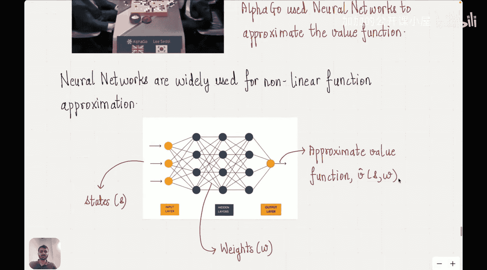

#  013：P13 使用价值函数近似的策略控制

在本节课中，我们将学习如何使用价值函数近似进行策略控制。我们将探讨线性与非线性两种近似方法，理解它们如何帮助我们处理大规模状态空间问题，并最终实现有效的策略优化。

## 概述

上一讲我们完成了一次重要的思维转变，即价值函数的表示方式。之前我们使用表格化方法，但在状态空间巨大（例如国际象棋有超过10^46个状态）时，这种方法会消耗大量内存且不切实际。因此，我们引入了泛化的概念，即通过观察部分状态来估计所有状态的价值。这类似于函数近似，但强化学习中的目标是未知且非平稳的，因此需要特殊处理。我们定义了损失函数，并使用梯度下降来更新近似价值函数的权重。然而，更新规则依赖于真实价值函数，我们通过用蒙特卡洛回报或时序差分回报来近似真实价值函数解决了这个问题。上一讲我们涵盖了这些方法，但尚未详细讨论如何用权重精确表示价值函数。本节我们将深入探讨这一点。

## 线性方法

线性方法，顾名思义，使用一个非常简单的函数来表示价值函数。这个函数由权重向量与一个称为特征向量的向量相乘得到。

**核心公式**：
如果权重为 `w1` 和 `w2`，特征向量为 `x1` 和 `x2`，则价值函数 `V(s)` 可表示为：
`V(s) = w1 * x1(s) + w2 * x2(s)`

我们根据问题的已知信息预先定义特征向量 `x1` 和 `x2`，然后只需要估计权重 `w1` 和 `w2` 即可。

关于梯度，在更新规则中我们需要计算价值函数对权重的梯度。对于线性情况，梯度计算非常简单：

**梯度计算**：
`∇V(s) = [∂V/∂w1, ∂V/∂w2] = [x1(s), x2(s)] = x(s)`

因此，梯度就是特征向量本身。

有了梯度的表达式，我们就可以写出具体的更新规则。以下是两种主要方法的更新规则：

**蒙特卡洛方法更新规则**：
`w ← w + α * [G_t - V(s_t)] * x(s_t)`
其中，`G_t` 是从时间 `t` 开始的回报，`α` 是学习率。

**时序差分方法更新规则**：
`w ← w + α * [r_{t+1} + γ * V(s_{t+1}) - V(s_t)] * x(s_t)`
其中，`r_{t+1}` 是即时奖励，`γ` 是折扣因子。

由于其简洁性，线性方法在许多问题中非常受欢迎。在线性方法内部，还有多种子类型，例如粗粒度编码，可以高效地估计特征向量。根据问题类型，人们通常使用不同的特征向量（例如，对于周期函数，使用周期性的特征向量）。我们不会深入探讨线性特征向量的各种构造方法，但感兴趣的读者可以参考相关教材。至此，我们使用线性方法的整个分析框架就完整了。

## 非线性方法

对于许多有趣的用例，线性方法并不适用，因为它在可近似的函数类型上非常有限（毕竟是权重的线性组合）。

然而，像击败人类围棋冠军的AlphaGo这样的问题，就使用了神经网络来近似价值函数，即采用了非线性方法。同样，在人类反馈强化学习或推理模型（如DeepSeek使用的GRPO算法）等系统中，也广泛使用神经网络进行价值函数近似。神经网络是用于非线性函数近似的强大工具。

## 总结

本节课我们一起学习了价值函数近似的策略控制。我们回顾了从表格方法转向函数近似的必要性，并重点介绍了两种主要的近似方法：线性方法和非线性方法。线性方法通过简单的权重与特征向量相乘来构建价值函数，其梯度就是特征向量本身，从而导出了简洁的更新规则。然而，线性方法的表达能力有限。因此，对于更复杂的问题（如AlphaGo），我们转向使用神经网络等非线性方法，它们能够近似更复杂的函数关系，是当前强化学习领域的主流工具。