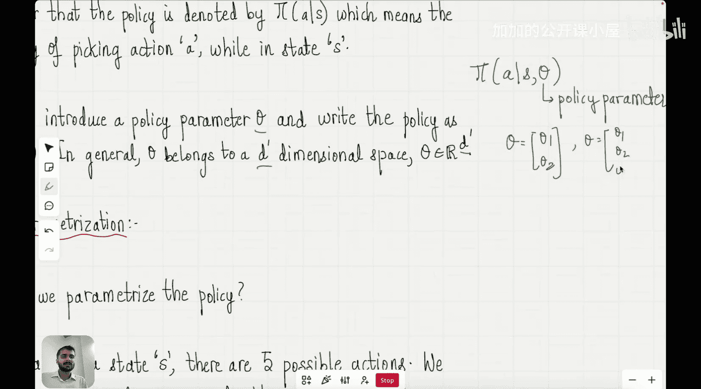

#  014：策略梯度方法

在本节课中，我们将要学习强化学习阶段的一个核心方法：策略梯度方法。我们将了解它为何重要，以及它如何直接优化策略本身，而不是像之前的方法那样通过价值函数间接优化。

在之前的几节课中，我们探讨了课程强化学习阶段的内容。这些内容都是为了理解如何为大型语言模型提供推理能力而做的铺垫。今天，我们离这个理解更近了一步。到目前为止，我们在强化学习阶段学习的所有概念，都将在今天关于策略梯度方法的章节中汇聚起来。

这一章对于理解如何利用强化学习赋予语言模型推理能力至关重要。所有语言模型中的强化学习应用都涉及策略梯度方法。它们是DeepSeek等模型中使用的策略或算法的核心，也是OpenAI的O1、O3等推理模型所用算法的核心。每一个使用了强化学习的推理LLM，都使用了策略梯度方法。因此，从理解推理LLM如何工作的角度来看，本节课极其重要。我们正稳步迈向理解强化学习究竟如何为大型语言模型提供推理能力的目标。

## 为何需要策略梯度方法？🤔

首先，让我们尝试理解为什么需要策略梯度方法。请记住，强化学习的目标是找到最优策略。到目前为止，我们学习的寻找最优策略的方法都大同小异。我们的做法是：观察一个特定状态S，假设在这个状态下有四个可能的动作A1、A2、A3和A4。然后我们说，要找出智能体在遵循这四个轨迹中的每一个之后，将获得的期望回报。接着我们为所有这四种情况计算这个期望回报，称之为Q1、Q2、Q3和Q4。然后我们据此制作一个表格：左边是动作，右边是智能体执行该动作后获得的期望回报。这里有四个动作A1、A2、A3、A4和四个不同的期望回报Q1、Q2、Q3、Q4。记住，这些也被称为动作价值。但为了从头解释，我将避免使用那个术语，只说期望回报。然后你要做的是对这四种回报进行排序，找出具有最高期望回报的值，假设是Q2，然后当智能体处于状态S时，你就选择动作A2。

为了首先得到这个表格本身，你可以使用多种算法，我们在过去已经看过一些算法，例如蒙特卡洛方法、时序差分法以及动态规划。我刚才写的内容，你可以看到是一种表格形式，这被称为**表格化方法**。在上一节课中我们看到，如果你有很多状态，那么使用表格就没有意义了，因为你会有一个巨大的表格，需要大量内存。国际象棋游戏有10^46个状态，因此你需要海量内存来以这种形式存储这个表格。所以，你转而做的是：构建一个函数，该函数以状态和动作为输入，并告诉我期望回报是多少。在许多情况下，正如我们在上一节课中看到的，这是一个神经网络。

在本节课中，我们不关注如何获得这些期望回报值，正如我所说，有两个大类：第一是表格化方法，第二是使用函数近似。但核心思想是，一旦你得到表格或函数，你就找到能给你最大期望回报的动作，然后智能体将执行该动作。这就是我们到目前为止一直在做的。

然而，这类方法在某种程度上是有用的，但它们并不直接评估策略。我们所做的是首先为每个动作计算一个数值，然后检查哪个数值最高。问题是，我们能否直接优化策略，而不是优化一个作为策略优化代理的函数？这正是策略梯度方法所做的。

因此，我们将逐步了解这些策略梯度方法究竟如何工作，以及它们与我们迄今为止一直固守的这种方法有何不同。

## 直接学习策略 🎯

现在，我们要做的是学习策略，即智能体必须遵循的最优策略，而不考虑动作价值函数，也就是不考虑这些Q值。所以我们要摆脱那个公式。让我们看看如何做到这一点。

首先，我们将用 **π(a|s)** 来表示我们的策略。这表示当智能体处于状态s时，采取动作a的概率。这意味着在状态s下选择动作a的概率。我们将在后续几节课中坚持使用这个符号，所以我希望你能对此感到适应。

然后，既然我们想要评估这个最优策略，我们将引入一个名为 **θ** 的参数。我们将策略写为 **π(a|s; θ)**。这被称为**策略参数**。我们引入策略参数θ的原因是，根据θ的值，我们的策略将会改变。因此，我们将用这个策略参数θ来表示策略，然后尝试找出能给我们最佳策略的θ值。这是一种对策略本身进行参数化的方式。

θ属于一个D维空间。例如，如果D=2，那么θ就是一个二维向量，我们可以将其写为[θ1, θ2]；如果D=3，那么θ就变成[θ1, θ2, θ3]。

## 策略梯度方法的核心思想 💡

上一节我们介绍了策略参数化的概念，本节中我们来看看策略梯度方法的核心思想。策略梯度方法的目标是直接优化策略参数θ，以最大化智能体在整个任务中获得的**期望总回报**。

我们定义一个目标函数 **J(θ)**，它表示在策略π(θ)下，从起始状态开始的期望总回报。我们的目标就是找到使J(θ)最大化的θ值：

**目标： max_θ J(θ)**

为了最大化J(θ)，我们可以使用梯度上升法。梯度上升是梯度下降的反向操作：我们沿着梯度方向更新参数，以增加目标函数的值。参数更新公式如下：

**θ ← θ + α * ∇_θ J(θ)**

其中，α是学习率，**∇_θ J(θ)** 是目标函数J关于参数θ的梯度。

关键在于如何计算这个梯度 **∇_θ J(θ)**。策略梯度定理提供了一个优雅的解决方案。它指出，期望回报的梯度可以表示为期望的形式：

**∇_θ J(θ) = E_π[ ∇_θ log π(a|s; θ) * Q^π(s, a) ]**

这个公式就是策略梯度定理的核心。其中：
*   **E_π[...]** 表示在策略π下，关于状态和动作分布的期望。
*   **∇_θ log π(a|s; θ)** 是策略的对数关于参数θ的梯度。
*   **Q^π(s, a)** 是在策略π下，在状态s采取动作a后的期望回报（即动作价值函数）。

这个公式的美妙之处在于，它允许我们通过采样轨迹（智能体在环境中实际运行的经验）来估计梯度。我们不需要知道环境的完整模型，只需要根据当前策略与环境交互，收集(s, a, r, s')这样的转移样本，然后使用这些样本来计算梯度的无偏估计。

## 策略梯度算法步骤 📝

理解了核心思想后，以下是实现一个基本策略梯度算法（如REINFORCE算法）的典型步骤：

1.  **初始化策略参数θ**：随机初始化神经网络的权重或其他参数化策略的参数。
2.  **循环多轮（episodes）**：
    a.  **根据当前策略π(θ)生成一条轨迹**：让智能体从起始状态开始，根据π(a|s; θ)选择动作，与环境交互，直到回合结束，收集状态、动作和奖励序列：τ = (s0, a0, r1, s1, a1, r2, ..., sT)。
    b.  **计算每个时间步的回报G_t**：对于轨迹中的每个时间步t，计算从该步开始到回合结束的累积折扣回报：`G_t = Σ_{k=t}^{T} γ^{k-t} * r_{k+1}`，其中γ是折扣因子。
    c.  **计算梯度估计**：对于轨迹中的每个时间步t，计算 `∇_θ log π(a_t|s_t; θ) * G_t`。这里用实际获得的回报G_t来近似Q^π(s_t, a_t)。
    d.  **更新策略参数**：将所有时间步的梯度估计进行平均或求和，然后执行梯度上升更新：`θ ← θ + α * Σ_t ∇_θ log π(a_t|s_t; θ) * G_t`。

通过重复这个过程，策略参数θ逐渐调整，使得产生更高回报的动作被选择的概率增加，从而优化策略。

## 策略梯度方法的优势与挑战 ⚖️

策略梯度方法相对于基于价值的方法（如Q-learning）有几个显著优势：

*   **直接优化目标**：直接对期望回报进行优化，更自然。
*   **能处理随机策略**：策略梯度可以学习随机策略（输出动作概率分布），这在某些需要探索或具有部分可观测性的环境中很重要。
*   **适用于连续动作空间**：基于价值的方法在连续动作空间中难以处理最大化操作（max over actions），而策略梯度方法天然适合连续动作空间。
*   **更好的收敛性**：在某些情况下，策略梯度方法具有更好的收敛保证。

然而，策略梯度方法也面临一些挑战：

*   **高方差**：使用蒙特卡洛估计回报G_t会导致梯度估计的方差很高，使得训练不稳定且缓慢。
*   **样本效率低**：通常需要大量样本（与环境交互的次数）才能学习到一个好的策略。
*   **局部最优**：可能会收敛到局部最优策略而非全局最优。

为了应对高方差问题，后续发展出了许多改进算法，例如：
*   **使用基线（Baseline）**：从回报G_t中减去一个基线（如状态价值函数V(s)），减少方差而不引入偏差。这引出了**优势函数A(s,a) = Q(s,a) - V(s)** 的使用。
*   **Actor-Critic方法**：结合策略梯度（Actor）和价值函数近似（Critic）。Critic用来估计价值函数（作为基线或优势函数），指导Actor的更新。这是现代深度强化学习（如PPO、A3C）的基础，也是大型语言模型强化学习微调（如RLHF中的PPO）的核心。

## 总结 🎓

本节课中我们一起学习了强化学习中至关重要的策略梯度方法。我们从回顾基于价值的方法的局限性开始，引出了直接优化策略的必要性。我们学习了如何用参数θ表示策略，并定义了最大化期望回报J(θ)的目标。核心在于策略梯度定理，它给出了计算目标函数梯度的公式：**∇_θ J(θ) = E_π[ ∇_θ log π(a|s; θ) * Q^π(s, a) ]**。基于此，我们介绍了基本的REINFORCE算法步骤：采样轨迹、计算回报、估计梯度并更新参数。最后，我们讨论了策略梯度方法的优势（如处理连续动作、随机策略）和挑战（如高方差），并简要提到了通过使用基线和Actor-Critic框架等改进方法。策略梯度方法是连接强化学习与大型语言模型推理能力培养的桥梁，是理解如RLHF等关键技术的基础。在接下来的课程中，我们将看到这些方法如何具体应用于训练具有推理能力的LLM。