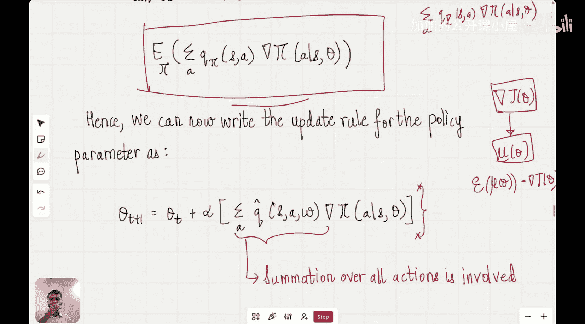

#  015：REINFORCE算法｜强化学习阶段


在本节课中，我们将基于策略梯度定理，学习第一个利用该定理结果的算法——REINFORCE算法。我们将结合参数化策略的表达式和梯度上升算法，来寻找能最大化性能度量的策略参数。

上一节我们介绍了策略梯度定理，它告诉我们策略性能度量的梯度与状态分布、动作价值函数以及策略的梯度成正比。我们还了解到，这个梯度不涉及状态分布本身的梯度，这避免了繁琐的计算，为我们提供了一种计算性能度量梯度的简便方法。

## 梯度上升与策略更新

在梯度上升方法中，我们从非最优的策略参数点A开始，沿着梯度的方向缓慢上升，逐步向最优点B移动。每一步，我们都会根据当前策略参数处的梯度方向来更新参数。

具体更新规则如下：
```
θ_{t+1} = θ_t + α * ∇J(θ_t)
```
其中，`θ_t`是当前时间步的策略参数，`α`是学习率，`∇J(θ_t)`是性能度量`J`在`θ_t`处的梯度。这个更新确保我们朝着性能度量最大的方向移动。

策略梯度定理告诉我们，这个梯度与所有状态的状态分布、所有动作的动作价值函数以及策略梯度的乘积之和成正比。

## 从求和到期望

在REINFORCE算法中，我们将重点关注策略梯度定理中的求和符号。这些求和意味着对所有可能的状态和所有可能的动作进行求和。

我们将利用概率论中的期望概念来简化这个表达式。对于一个随机变量`X`，其每个可能结果`x`的概率为`P(x)`，那么`X`的期望值`E[X]`计算公式为：
```
E[X] = Σ_x [ P(x) * x ]
```
类似地，函数`f(X)`的期望值为：
```
E[f(X)] = Σ_x [ P(x) * f(x) ]
```

在策略梯度定理的表达式中，状态分布`μ(s)`可以看作是智能体处于状态`s`的概率。因此，对状态`s`的求和`Σ_s μ(s) * Y(s)`，实际上就是`Y(s)`在状态分布`μ`下的期望值`E[Y(s)]`。

应用这个原理，策略梯度定理中的梯度可以重写为一个期望值的形式。这使我们能够用期望值内部的量作为梯度本身的近似。

## REINFORCE算法更新规则

基于以上推导，策略参数的更新规则可以简化为：
```
θ_{t+1} = θ_t + α * Σ_a [ Q̂(s, a; w) * ∇π(a|s, θ) ]
```
这里，`Q̂(s, a; w)`是近似动作价值函数（由参数`w`参数化），`∇π(a|s, θ)`是策略`π`关于其参数`θ`的梯度。

这意味着，当智能体处于某个状态`s`时，它会计算所有可能动作`a`的近似动作价值`Q̂`，然后对这些值进行加权求和（权重是策略梯度的方向），并用这个结果来更新策略参数`θ`。我们之所以能用这个表达式直接替换梯度`∇J(θ)`，是因为我们已经证明了它的期望值等于`∇J(θ)`。

## 算法步骤概述

以下是REINFORCE算法的核心步骤：

1.  **初始化**：随机初始化策略参数`θ`。
2.  **生成轨迹**：使用当前策略`π(θ)`与环境交互，生成一个完整的轨迹（状态、动作、奖励序列）。
3.  **计算回报**：从轨迹的末端开始，反向计算每个时间步的动作价值估计（例如，使用蒙特卡洛回报）。
4.  **计算梯度**：对于轨迹中的每个时间步，计算策略梯度`∇ log π(a_t|s_t, θ)`。
5.  **参数更新**：使用计算出的梯度更新策略参数：`θ ← θ + α * G_t * ∇ log π(a_t|s_t, θ)`，其中`G_t`是从时间步`t`开始的累积回报。
6.  **重复**：重复步骤2-5，直到策略收敛。



## 总结

本节课我们一起学习了REINFORCE算法。我们从策略梯度定理出发，通过引入期望的概念，将复杂的梯度求和表达式转化为更易于计算的期望形式。基于此，我们推导出了REINFORCE算法的核心更新规则，该规则使用采样得到的轨迹和近似价值函数来估计梯度，并通过梯度上升来优化策略参数。REINFORCE是一种经典的蒙特卡洛策略梯度方法，为后续更复杂的策略优化算法奠定了基础。