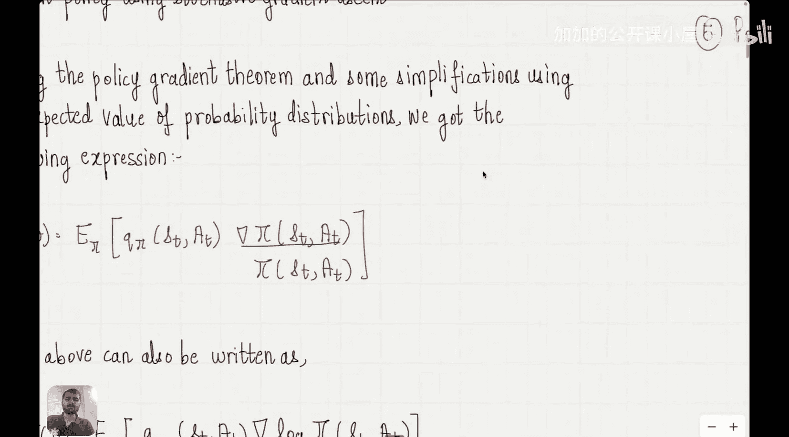

#  016：广义优势估计

在本节课中，我们将学习强化学习阶段的一个重要概念：广义优势估计。上一节我们介绍了策略梯度方法，本节我们将在此基础上，探讨如何更高效地估计优势函数，从而优化策略更新。

## 概述

策略梯度方法的核心是沿着性能指标 `J(θ)` 的梯度方向更新策略参数 `θ`，以最大化长期累积奖励。然而，直接计算梯度中的优势函数 `Q(s, a)` 通常方差较大，导致训练不稳定。广义优势估计提供了一种平衡偏差与方差的通用框架。

## 策略梯度方法回顾

首先，让我们快速回顾一下策略梯度方法。我们主要关注了两个步骤。

第一步是参数化策略。这意味着将策略 `π(a|s)`（即在状态 `s` 下采取动作 `a` 的概率）表示为带参数 `θ` 的函数 `π_θ(a|s)`。一个简单的参数化方式是使用基于偏好的Softmax函数。

第二步是定义并最大化性能指标 `J(θ)`。我们通常将其定义为初始状态 `s_0` 的价值函数 `V_π(s_0)`，即从初始状态开始所获累积奖励的期望值。我们的目标是找到使 `J(θ)` 最大的参数 `θ`。

为了最大化 `J(θ)`，我们需要计算其关于 `θ` 的梯度 `∇J(θ)`，并使用梯度上升法更新参数：
`θ_{t+1} = θ_t + α * ∇J(θ_t)`

计算梯度的主要挑战在于，改变策略参数 `θ` 会同时影响状态分布和策略本身。然而，策略梯度定理告诉我们，梯度计算可以简化，无需考虑状态分布的变化，只关注策略本身的变化。最终，我们得到了一个可计算的梯度表达式。

## 广义优势估计的引入

上一节我们推导的策略梯度公式中，包含一个关键项：优势函数 `A(s, a) = Q(s, a) - V(s)`。它衡量了在状态 `s` 下采取特定动作 `a` 相对于平均水平的优劣。准确估计优势函数对于降低梯度方差至关重要。

直接估计 `Q(s, a)` 或 `A(s, a)` 可能很困难且方差高。广义优势估计通过结合不同时间步的奖励估计，提供了一种更稳健的估计方法。

以下是GAE的核心思想：

*   **n步回报**：首先，我们可以定义n步回报来估计价值。n步回报结合了接下来n步的实际奖励和第n步之后的估计价值。
*   **优势函数混合**：GAE的核心是将不同n值的n步优势估计进行指数加权平均。这允许我们在低偏差（小n）和低方差（大n）之间进行平滑的权衡。
*   **调节参数λ**：GAE引入了一个参数 `λ`（取值范围[0,1]），用于控制不同n步估计的权重。`λ=0` 对应于仅使用一步优势估计（高偏差，低方差），`λ=1` 对应于使用蒙特卡洛回报直至终局（低偏差，高方差）。

广义优势估计 `A^{GAE(γ, λ)}` 的公式如下：
`A^{GAE(γ, λ)}_t = Σ_{l=0}^{∞} (γλ)^l δ_{t+l}`
其中，`δ_t = r_t + γV(s_{t+1}) - V(s_t)` 是时序差分误差，`γ` 是折扣因子。

## GAE的优势与实现

使用GAE估计优势函数后，我们可以将其代入策略梯度公式。这通常能带来更稳定、更高效的策略学习。

在实践中，GAE常与演员-评论家算法结合使用。评论家网络用于估计状态价值函数 `V(s)`，演员网络则代表策略 `π_θ(a|s)`。GAE利用评论家的价值估计来计算优势，进而指导演员网络的策略更新。

## 总结

本节课我们一起学习了广义优势估计。我们首先回顾了策略梯度方法及其梯度计算。接着，我们指出了直接估计优势函数的挑战，并引入了广义优势估计作为解决方案。GAE通过混合不同时间跨度的优势估计，并利用参数 `λ` 在偏差和方差之间取得平衡，从而为策略梯度提供了更优的更新信号。这构成了许多现代强化学习算法（如PPO、TRPO）的重要组成部分。