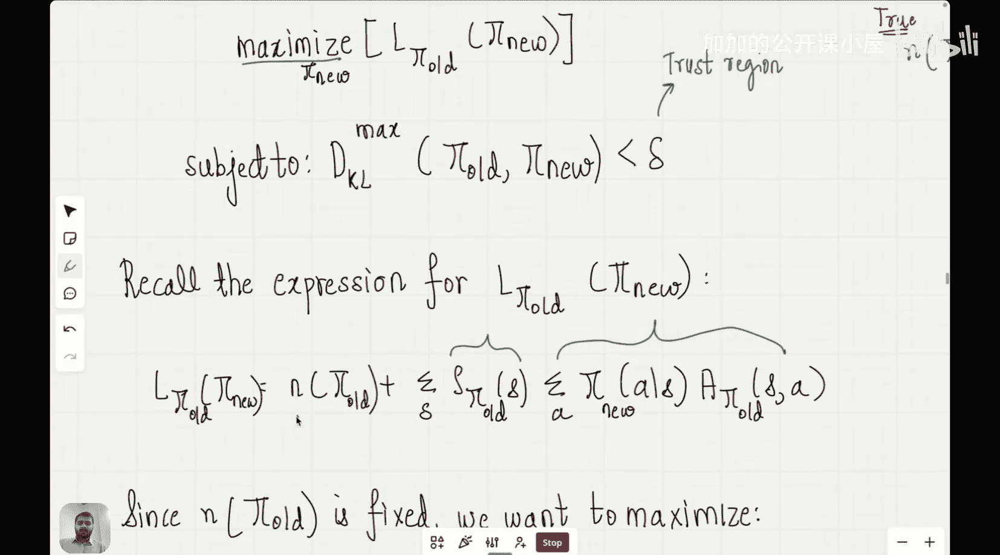

#  018：TRPO求解方法论

在本节课中，我们将学习如何求解上一节提出的带约束优化问题，以完成信任域策略优化算法的构建。我们将看到，最终的求解表达式将与基础的策略梯度方法非常相似。

## 概述

上一节我们介绍了信任域策略优化算法。我们从一个策略的性能度量目标函数 **η(π)** 开始，目标是找到最大化该性能的策略。我们推导出，新策略 **π'** 的性能 **η(π')** 可以用旧策略 **π** 的性能加上一个与优势函数和状态分布相关的项来表示。由于新策略的状态分布未知，我们转而优化一个替代目标函数 **L_π(π')**，并引入KL散度作为约束，确保新策略不会偏离旧策略太远。这最终将问题转化为一个带约束的优化问题：

**最大化：L_π(π') = η(π) + Σ_s ρ_π(s) Σ_a π'(a|s) A_π(s, a)**

**约束条件：D_KL(π || π') ≤ δ**

本节课，我们的核心任务就是求解这个优化问题。

## 简化目标函数

首先，我们来简化需要最大化的目标函数 **L_π(π')**。

目标函数展开后包含两项：旧策略的性能 **η(π)** 和一项关于优势函数的加权和。其中，**ρ_π(s)** 是旧策略下的状态分布，**A_π(s, a)** 是旧策略下的优势函数。

**L_π(π') = η(π) + Σ_s ρ_π(s) Σ_a π'(a|s) A_π(s, a)**

由于 **η(π)** 是已知的常数，不依赖于待优化的新策略参数 **θ'**，因此在最大化过程中可以忽略。我们的优化问题简化为：

**最大化：Σ_s ρ_π(s) Σ_a π'(a|s) A_π(s, a)**

**约束条件：D_KL(π || π') ≤ δ**

优势函数 **A_π(s, a)** 的含义至关重要。如果某个状态-动作对的优势值为正，意味着在该状态下存在比旧策略默认行为更好的动作。如果对所有状态，新策略选择的动作都能产生正优势，那么新策略的性能就会优于旧策略。这类似于动态规划中的策略改进步骤。

## 处理约束：拉格朗日乘子法

现在我们面临一个带不等式约束的最大化问题。一个标准的求解方法是使用拉格朗日乘子法。

我们可以将约束优化问题转化为一个无约束的拉格朗日函数来求解。引入拉格朗日乘子 **λ**，构造如下拉格朗日函数 **L(θ', λ)**：

**L(θ', λ) = Σ_s ρ_π(s) Σ_a π'(a|s) A_π(s, a) - λ * (D_KL(π || π') - δ)**

我们的目标是找到 **θ'** 和 **λ**，使得 **L(θ', λ)** 最大化，同时满足 **λ ≥ 0** 以及原约束条件（互补松弛条件）。

然而，直接精确求解这个优化问题计算量很大，因为它需要对所有状态和动作求和，并且涉及复杂的KL散度计算。

## 近似与简化：单步策略梯度

为了得到实用的算法，我们需要进行近似。关键的一步是注意到，当新旧策略非常接近时（这正是KL散度约束所保证的），我们可以做出一系列简化。

1.  **状态分布近似**：当 **π'** 接近 **π** 时，**ρ_π'(s)** 与 **ρ_π(s)** 也接近。在目标函数中，我们原本使用了 **ρ_π(s)**，这已经是一个合理的近似。
2.  **目标函数局部近似**：在 **θ**（旧策略参数）附近对目标函数进行一阶泰勒展开。其梯度恰好就是策略梯度！
    **∇_{θ'} [Σ_s ρ_π(s) Σ_a π'(a|s) A_π(s, a)] |_{θ'=θ} = ∇_θ η(π)**
    这正是我们之前推导的策略梯度定理的结果。
3.  **约束函数局部近似**：同样，在 **θ** 附近对KL散度约束进行二阶泰勒展开。可以证明，KL散度在 **θ' = θ** 处的一阶导数为零，因此其主要贡献来自二阶项（即费舍尔信息矩阵 **F**）。
    **D_KL(π_θ || π_{θ'}) ≈ 1/2 * (θ' - θ)^T * F(θ) * (θ' - θ)**

将这些近似代入原问题，我们得到一个大大简化后的优化问题：

**最大化：g^T * (θ' - θ)**
**约束条件：1/2 * (θ' - θ)^T * F(θ) * (θ' - θ) ≤ δ**

其中，**g = ∇_θ η(π)** 是策略梯度，**F(θ)** 是费舍尔信息矩阵。

## 求解近似问题

现在，我们有一个在局部二次近似下的约束优化问题。这是一个经典的二次型在线性约束下的优化问题，其解具有解析形式。

利用拉格朗日乘子法求解上述近似问题，可以得到参数更新步长 **Δθ** 的表达式：

**θ' = θ + α * F(θ)^{-1} * g**

其中，**α** 是一个与约束边界 **δ** 和梯度、费舍尔信息矩阵相关的步长系数，通常通过线性搜索确定。这个更新公式被称为**自然策略梯度**或**TRPO的近似更新规则**。

这个形式非常优美且富有启发性：
*   **F(θ)^{-1} * g** 被称为自然梯度。它不仅考虑了性能提升的方向（**g**），还考虑了参数空间的曲率（通过 **F(θ)^{-1}**）。
*   与普通的策略梯度更新 **θ' = θ + β * g** 相比，自然梯度通过 **F(θ)^{-1}** 对更新进行了缩放，使其在概率分布的流形上遵循最速上升方向，而不是在原始的欧几里得参数空间。这通常能带来更稳定、更高效的更新。

## 与策略梯度的联系

现在我们可以看到TRPO与原始策略梯度方法的深刻联系。原始的REINFORCE或策略梯度算法直接沿着 **g** 的方向更新。而TRPO通过理论推导，引入了信任域约束，最终导出的更新方向是自然梯度 **F^{-1}g**。

这解释了为什么我们要经历复杂的推导过程：虽然最终更新式看起来像是策略梯度加了一个“预处理矩阵”，但信任域的推导为我们提供了坚实的理论保证（单调改进性），并指导我们如何设置步长 **α** 以确保约束被满足，从而在实践中带来更稳定的训练。

## 总结

本节课中，我们一起学习了TRPO算法的求解方法论。我们从带KL散度约束的优化问题出发，通过拉格朗日乘子法将其转化为无约束形式。为了实际求解，我们在当前策略参数点对目标和约束进行了局部近似（一阶泰勒展开用于目标，二阶泰勒展开用于KL散度），从而将问题简化为一个可解析求解的二次规划问题。最终，我们推导出了参数更新规则：**θ' = θ + α * F(θ)^{-1} * g**，即沿着自然梯度方向更新。这个结果将TRPO与基础的策略梯度方法清晰地联系起来，并揭示了通过引入信任域约束，算法如何获得更稳定、理论保证更强的策略更新方式。