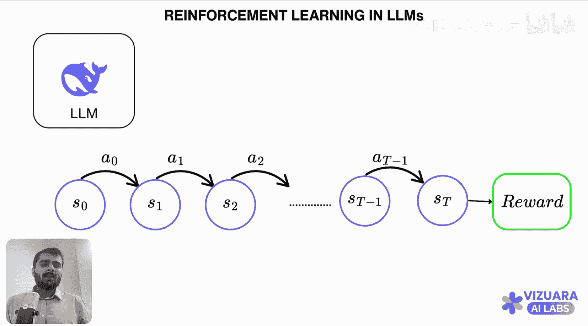

#  019：40分钟详解GRPO 🚀

在本节课中，我们将学习GRPO算法。GRPO是一种强化学习算法，被DeepSeek等团队用于训练模型。我们将从经典的强化学习概念出发，逐步构建对GRPO的理解，并解释它为何在构建推理大语言模型时如此有效和流行。

## 经典强化学习基础

上一节我们介绍了课程目标，本节中我们来看看强化学习的基本框架。

在典型的强化学习问题中，我们有一个**智能体**和一个**环境**。智能体与环境进行交互。

以下是强化学习中常用的核心概念：

*   **状态**：智能体所处的特定情况。例如，一个在房间内移动的机器人。
*   **动作**：智能体在特定状态下可以执行的操作。例如，机器人移动或返回充电站。
*   **奖励**：环境根据智能体的动作给予的反馈。例如，机器人收集垃圾获得正奖励，电池耗尽获得负奖励。

任何强化学习问题都可以用这三个变量来描述。以国际象棋为例：
*   **状态** = 棋盘上棋子的当前布局。
*   **动作** = 移动棋子。
*   **奖励** = 赢棋得+1，输棋得-1。

这就是典型的智能体-环境交互界面。

## 大语言模型中的强化学习

上一节我们了解了经典框架，本节中我们来看看如何将其应用于大语言模型。

主要问题是：如果将强化学习应用于大语言模型，状态、动作和奖励分别是什么？

首先，在大语言模型中：
*   **智能体** 是LLM本身（如DeepSeek、GPT等）。
*   **环境** 是LLM交互的对象，可以是Python解释器、数据集或人类。本质上，环境是在你输入提示后给出答案的东西。

让我们通过一个例子来理解状态和动作。

**示例提示**：`Roger has five tennis balls, and he buys two more cans of tennis balls, each can has three tennis balls each. How many tennis balls does Roger have now?`
我们知道答案是 `5 + 2 * 3 = 11`。

以下是状态和动作的分解过程：

1.  **初始状态 S0**：提示文本本身。
2.  **动作 A0**：LLM输出第一个词元，例如 `Roger`。
3.  **新状态 S1**：`S0` + `A0`（即提示 + `Roger`）。
4.  **动作 A1**：LLM基于S1输出下一个词元，例如 `has`。
5.  此过程持续进行，依次输出 `11`、`tennis`、`balls`，直到答案完成。

所以，**状态**是不断增长的文本序列（之前的输出 + 新的输入），**动作**是LLM在每一步预测的下一个词元。

那么奖励呢？这与经典强化学习有显著不同。

在传统强化学习中，智能体每执行一个动作通常会获得奖励。但在大语言模型中，在生成完整答案之前，**奖励始终为0**。只有当答案完全生成后，我们才能判断其正确性，并给予最终奖励（例如，答案正确为+1，错误为0）。

这意味着，LLM需要经历一长串状态和动作（可能非常长），最终只获得一个稀疏的奖励信号。然后，无论奖励是正还是负，我们都必须沿着这整个生成链回溯，来更新LLM的权重。这是一个巨大的挑战。

## 核心挑战与GRPO的引入

上一节我们看到了LLM中强化学习的独特之处，本节中我们来看看其中的核心挑战。

主要挑战在于：**如何根据最终稀疏的奖励信号，有效地更新生成长序列的模型？**

如果答案很长，追溯整个链条并计算每个决策的贡献会非常复杂和低效。这就是GRPO等算法要解决的核心问题。

## 总结

本节课中我们一起学习了：
1.  **强化学习基础**：理解了智能体、环境、状态、动作和奖励的概念。
2.  **LLM中的强化学习**：将LLM视为智能体，其生成过程视为一系列状态和动作，并认识到奖励的稀疏性（仅在答案完成后给出）。
3.  **核心挑战**：指出了基于稀疏奖励更新长序列生成模型的困难，这引出了对GRPO等高效算法的需求。

在接下来的课程中，我们将深入GRPO算法本身，看它如何巧妙地解决这些挑战。