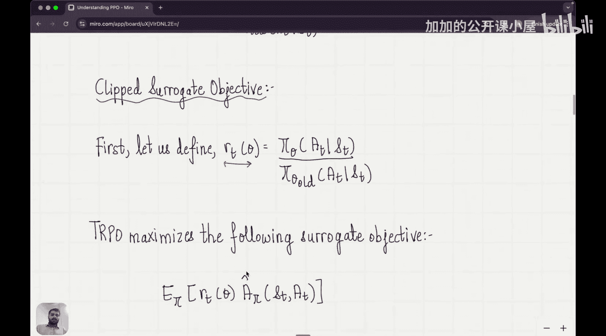

#  020：近端策略优化（PPO）


在本节课中，我们将学习一个名为**近端策略优化**的新算法。该算法是**基于人类反馈的强化学习**的核心。我们将从上一节介绍的信任区域策略优化出发，理解PPO算法的由来。

## 概述

在之前的课程中，我们学习了策略梯度方法。其核心是优化策略的性能度量。性能度量的梯度表达式为：

**公式：** `∇J(θ) = E[∇ log π(a|s) * A(s, a)]`

其中，`A(s, a)` 是优势函数估计，它衡量了在状态`s`下采取动作`a`相比策略的平均表现是好是坏。如果优势为正，我们希望加强该动作；如果为负，则希望抑制它。

一个梯度为上述表达式的目标函数可以写作：

**公式：** `L(θ) = E[log π(a|s) * A(s, a)]`

这个函数描述了我们在参数空间中要攀登的“性能山峰”。然而，在实践中，人们发现直接使用这个目标函数进行优化并不稳定。

## 从信任区域方法到PPO

为了解决稳定性问题，研究者引入了**信任区域方法**。这类方法在优化目标函数的同时，对策略的更新幅度施加了约束，防止新策略偏离旧策略太远。

其核心是一个带约束的优化问题：

**目标：** 最大化替代目标函数 `L(θ) = E[(π_θ(a|s) / π_θ_old(a|s)) * A(s, a)]`
**约束：** `D_KL(π_θ_old || π_θ) ≤ δ`

这里，`D_KL` 是KL散度，用于衡量新旧策略之间的差异，`δ` 是一个小常数，定义了信任区域的大小。

这个约束优化问题计算复杂，尤其是涉及矩阵求逆，非常耗时。因此，人们开始思考：能否找到一种方法，既具备信任区域方法**限制大幅更新**的优点，又像普通策略梯度方法那样**简单易实现**？

这个问题的答案就是**近端策略优化**算法。

## PPO的核心：裁剪替代目标函数

PPO通过一个巧妙的技巧来近似实现信任区域的效果，而无需解决复杂的约束优化问题。首先，我们定义一个比率：

**公式：** `r_t(θ) = π_θ(a_t|s_t) / π_θ_old(a_t|s_t)`

这个比率 `r_t(θ)` 衡量了新策略相对于旧策略的变化程度。如果比率远大于1，说明新策略显著增加了该动作的概率；如果比率远小于1，则说明新策略显著降低了该动作的概率。

PPO的裁剪替代目标函数定义如下：

**公式：** `L^CLIP(θ) = E[ min( r_t(θ) * A_t, clip(r_t(θ), 1-ε, 1+ε) * A_t ) ]`

让我们来分解这个公式：

1.  **未裁剪部分**：`r_t(θ) * A_t`。这就是TRPO中替代目标函数的核心部分。
2.  **裁剪操作**：`clip(r_t(θ), 1-ε, 1+ε)`。这个函数将比率 `r_t(θ)` 限制在区间 `[1-ε, 1+ε]` 内。`ε` 是一个超参数（例如0.2）。
    *   如果 `r_t(θ) > 1+ε`，它被裁剪为 `1+ε`。
    *   如果 `r_t(θ) < 1-ε`，它被裁剪为 `1-ε`。
    *   否则，保持不变。
3.  **取最小值**：最终目标函数是**未裁剪项**和**裁剪项**中的较小值。

这个设计非常精妙：
*   当优势函数 `A_t` 为正时，我们希望增加 `r_t(θ)`。但通过取 `min`，即使未裁剪项很大，目标函数值也会被裁剪项限制住，从而防止策略更新过大（即 `r_t(θ)` 变得远大于1）。
*   当优势函数 `A_t` 为负时，我们希望减小 `r_t(θ)`。同样，取 `min` 操作会确保目标函数值由裁剪项主导，防止策略更新过大（即 `r_t(θ)` 变得远小于1）。

**代码描述：**
```python
def ppo_clip_loss(r_t, A_t, epsilon=0.2):
    # r_t: 策略比率 (pi_new / pi_old)
    # A_t: 优势函数估计值
    # epsilon: 裁剪参数

    unclipped = r_t * A_t
    clipped = torch.clamp(r_t, 1-epsilon, 1+epsilon) * A_t

    loss = -torch.min(unclipped, clipped).mean() # 取负号是因为我们要最大化目标，但优化器通常最小化损失
    return loss
```

通过这种裁剪机制，PPO在鼓励策略向好的方向更新的同时，**自然地**将新策略约束在旧策略的邻域内，无需显式地计算KL散度约束。它获得了信任区域方法的稳定性，同时保持了算法实现的简洁性。

## 总结



本节课我们一起学习了近端策略优化算法。我们从标准的策略梯度方法出发，指出了其训练不稳定的问题。接着，我们回顾了通过引入KL散度约束来稳定训练的信任区域方法，并指出了其计算复杂的缺点。最后，我们重点讲解了PPO算法如何通过**裁剪替代目标函数**这一创新设计，巧妙地结合了两种方法的优点：它使用比率裁剪机制隐式地限制了策略的更新幅度，从而实现了稳定训练，同时其算法形式简单，易于实现和调优，这使其成为现代强化学习，特别是RLHF领域最流行的算法之一。