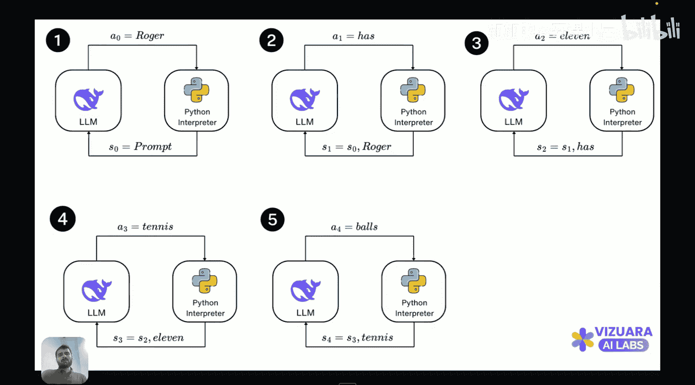

#  021：在LLM中应用强化学习｜强化学习阶段｜推理

在本节课中，我们将学习如何将强化学习应用于大型语言模型。我们将探讨如何将LLM的文本生成过程建模为强化学习问题，并理解其中的状态、动作和奖励机制。

到目前为止，我们已经探讨了强化学习的含义，回顾了经典的表格方法，并学习了如何处理状态空间巨大的情况，即使用函数逼近方法。随后，我们深入研究了策略梯度方法，该方法旨在直接寻找最优策略，而非通过动作价值函数间接优化。

在策略梯度方法中，我们首先学习了**策略梯度定理**，它允许我们计算性能指标的梯度。这为后续所有方法奠定了基础。我们首先学习了第一个策略梯度算法——REINFORCE算法。接着，我们探讨了演员-评论家方法，该方法从蒙特卡洛回报中减去一个基线，这个基线可以是价值函数本身。

之后，我们研究了如何修改这些策略梯度方法，以限制新策略与旧策略或基础策略之间的偏离。第一个引入此思想的算法是**信任区域策略优化**。它指出，虽然策略梯度方法有效，但如果不加以限制，策略更新可能导致学习过程不稳定。TRPO通过施加策略变化的约束来解决这个问题。

在TRPO的基础上，我们学习了**近端策略优化**。PPO认为TRPO的计算较为复杂，涉及难以计算的矩阵求逆。因此，PPO旨在结合普通策略梯度方法的简单性和TRPO引入的信任区域约束。PPO本质上使用一个裁剪函数来限制策略与基础策略的偏离，但避免了KL散度计算，使得计算大大简化。

如果您尚未学习这些内容，建议回顾之前讨论PPO和TRPO的三节课。

现在，我们的课程进入一个转折点。此前，我们一直在讨论作为通用方法的强化学习。接下来，我们将理解如何将这种方法应用于大型语言模型。

如何利用强化学习改进LLM本身就是一个极其有趣的问题。因为乍看之下，LLM并不明显能被表示为强化学习问题。原因在于，在强化学习中，有一个智能体与环境交互、接收奖励并改进。但LLM如何能表示为强化学习问题呢？最初思考这个概念时，我也感到困惑，甚至难以理解其中的状态、动作、策略和环境分别是什么。

然而，后来这变得非常清晰。尽管不那么直观，但将LLM建模为智能体-环境交互界面是直接可行的。现在，我将通过幻灯片帮助您理解如何将大型语言模型表示为强化学习问题。

在典型的强化学习设置中，有一个智能体执行动作，并从环境接收奖励。在智能体执行任何动作之前，它拥有一个特定的信息，称为**状态**。根据状态或接收到的信息，智能体采取动作并接收奖励。这就是智能体-环境交互界面。

现在的问题是，如何将其适配到大型语言模型？我们将具体看看状态和动作是什么。

首先，这里的**智能体就是LLM本身**。大型语言模型接收一些信息作为状态，这些信息可以来自用户或Python解释器。然后，**动作是大型语言模型预测的下一个词**。

让我们考虑一个具体例子。提示词是：“Roger有五个网球，他又买了两罐网球，每罐有三个网球。问题：Roger现在有多少个网球？”

智能体接收到的信息是提示词，因此第一个状态 **S0** 就是提示词本身。智能体接收此信息后，将采取一个动作，即预测下一个词。这里，智能体预测的下一个词是“Roger”。

然后，“Roger”被传递回环境，信息被更新。现在LLM拥有初始提示词和“Roger”，因此它采取的下一个动作是“has”。以此类推，您可以完成所有状态：状态 **S0** 是提示词；状态 **S1** 是 S0 + “Roger”；状态 **S2** 是 S1 + “has”；状态 **S3** 是 S2 + “11”；状态 **S4** 是 S3 + “tennis”。本质上，智能体采取的任何动作，都会被添加到LLM在下一轮迭代中接收的信息中。

因此，这就像一个迭代问题：智能体从状态 S0 开始，采取动作 a0，转移到状态 S1，采取动作 a1，转移到状态 S2，等等。我们在这里所做的是，将**答案补全过程**建模为一个智能体-环境交互界面，其中智能体是LLM本身，答案补全过程用状态和动作来描述。

**状态**是LLM到当前迭代为止已完成的所有词或标记的信息。**动作**是LLM预测的下一个标记或词。通过这种方式，答案补全可以被视为一系列状态-动作转换。

本节课中，我们一起学习了如何将大型语言模型的文本生成过程框架化为一个强化学习问题。我们明确了LLM作为智能体，其生成的下一个词作为动作，而不断累积的生成文本则构成了状态。这为后续应用PPO等强化学习算法来优化LLM的生成策略奠定了理论基础。