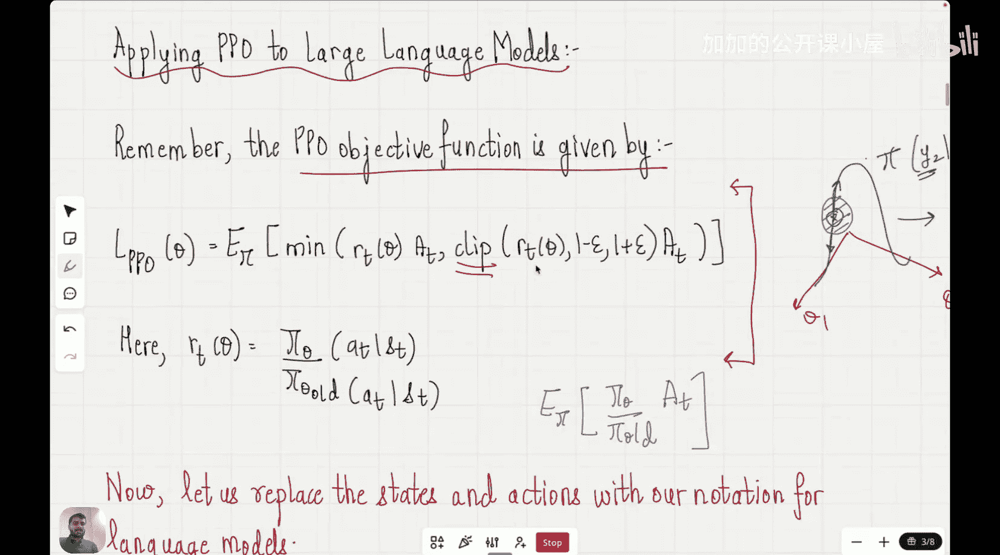

#  022：GRPO｜强化学习阶段

在本节课中，我们将要学习GRPO算法。这是首个成功利用强化学习在大语言模型中诱导推理能力的算法，它建立了强化学习与推理之间的关键联系。

## 概述

我们正处于完成课程中强化学习阶段的最后部分。现在，我们来到了一个非常关键的节点，将探讨首个利用强化学习在大语言模型中诱导推理能力的算法——GRPO。在GRPO发布之前，强化学习主要用于根据人类偏好对齐大语言模型，但强化学习与推理之间并无实质联系。这一联系是在GRPO算法发布后才得以建立。本节课，我们将理解GRPO的独特之处，以及它为何成为构建大型推理模型的标准方法。

## 强化学习框架下的LLM回顾

上一节我们介绍了如何将大语言模型表示为智能体-环境交互的强化学习框架，包括状态、动作、奖励和策略。现在，我们快速回顾一下。

考虑这个例子：提示是“Roger has five tennis balls he buys two more cans of tennis balls. Each can has three tennis balls, how many tennis balls does he have now.”，答案是“Roger has 11 tennis balls”。

答案本身可以被视为一系列状态和动作。第一个状态S0是LLM接收到的提示信息。之后，LLM采取一个动作，输出“Roger”。接着，状态更新为包含提示和“Roger”。LLM的下一个动作是输出“has”，这个过程持续到句子完成。

我们理解了状态和动作。那么奖励呢？在大语言模型中，奖励可以是主观的，也可以是客观的。例如，如果要求“写一首诗”，不同的人对同一首诗可能有不同看法。因此，LLM没有标准化的奖励。人们通常使用奖励模型，这些模型基于人类偏好数据进行训练。在ChatGPT等应用中，系统会尝试理解我们更喜欢哪个回复，这些数据被用来训练奖励模型以理解人类偏好。

关于策略，其定义是告诉智能体在给定状态下应采取哪个动作。根据我们对状态和动作的表示，我们的策略就是LLM本身。因为从定义上讲，LLM是一个被训练来预测下一个词概率的模型。因此，这是一个智能体与策略相同的特例。

## 关键符号定义

现在，我们来理解上一节讨论过的一些符号表示。

*   **提示**：记为 `x`，由一系列词元 `x1, x2, ..., xp` 组成。
*   **补全/输出**：记为 `y`，是大语言模型针对给定提示生成的输出文本。
*   **策略**：记为 `π_θ`，即LLM本身。因为LLM被训练来预测下一个词，并给出在给定序列后出现概率最大的词。

本质上，整个步骤可以这样表示：模型接收状态（即LLM输出的信息）。假设接收到状态S1（提示和“Roger”），它需要预测下一个词。我们的策略是LLM，它为我们提供所有动作的概率。我们知道“has”的概率最大，因此我们得到的输出是“Roger has”。

这可以表示为 `π_θ(y2 | x, y1)`，其中 `x` 是提示，`y1` 是之前的输出“Roger”。对于序列中遇到的所有状态，在完整答案生成之前，我们都进行此操作。第二个词元预测的概率分布由策略 `π_θ` 给出。第 `t` 个词元预测的策略符号为 `π_θ(yt | x, y<t)`，其中 `y<t` 是此时已生成的所有输出词元。

例如，如果我们需要在“Roger has”之后进行预测，即 `y3` 给定 `x, y1, y2`，其中 `y1` 是“Roger”，`y2` 是“has”，那么 `y3` 将是“11”，此时概率分布会不同，“11”将具有最大概率。

## 近端策略优化在LLM中的应用

现在的问题是，我们如何将目前学到的算法应用于这种表示为智能体-环境交互的大语言模型？我们首先来看近端策略优化，以及它究竟如何应用于微调大语言模型。

还记得PPO目标函数的作用吗？PPO告诉我们，你有一个给定的策略，需要根据获得的奖励来改进它。它构建了一个目标函数，以不允许策略与旧策略偏离太多。因此，它引入了一个裁剪操作，防止策略与旧策略产生过大偏差。

如果你现在不记得这个公式也没关系，我们来理解其背后的直觉。假设你处在这个参数空间 `θ1` 和 `θ2` 中。在策略梯度方法中，你试图做的是：你有一个由某个动作（例如 `π(y2 | x, y1)`）给出的曲面。假设我们位于此处。如果奖励是正的，那么我想沿着这个曲面上山以最大化这个概率；如果奖励是负的，我想下山。是上山还是下山，以及如何沿着这座山移动，由沿着该轨迹的梯度给出。因此，这个项应该包含梯度 `∇_θ`。我们使用梯度上升方法来上山或下山。

这些是普通的策略梯度方法。PPO所做的就是：PPO说，你可以根据梯度的符号上山或下山，但**不允许更新超出这个区域**。如果更新超出，就裁剪它，不要让策略更新变得太大。它施加了一个界限，以稳定策略的训练过程。这就是裁剪操作的作用，它本质上裁剪了你的目标。

普通策略梯度的目标实际上看起来像这样：`(π_θ / π_θ_old) * A_t`，其中 `A_t` 表示优势函数。而PPO所做的就是在这里施加一个裁剪函数，除此之外与普通策略梯度非常相似。

## 总结

本节课我们一起学习了GRPO算法的重要性及其出现的背景。我们回顾了如何将大语言模型置于强化学习框架下，定义了关键的状态、动作、奖励和策略。我们还探讨了近端策略优化算法如何通过引入裁剪操作来稳定大语言模型的训练过程，防止策略更新过大，这为理解GRPO算法奠定了基础。在接下来的课程中，我们将深入GRPO算法本身，看看它如何具体实现推理能力的诱导。