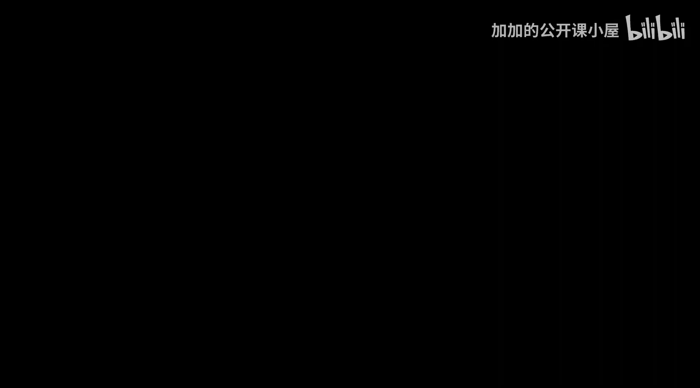
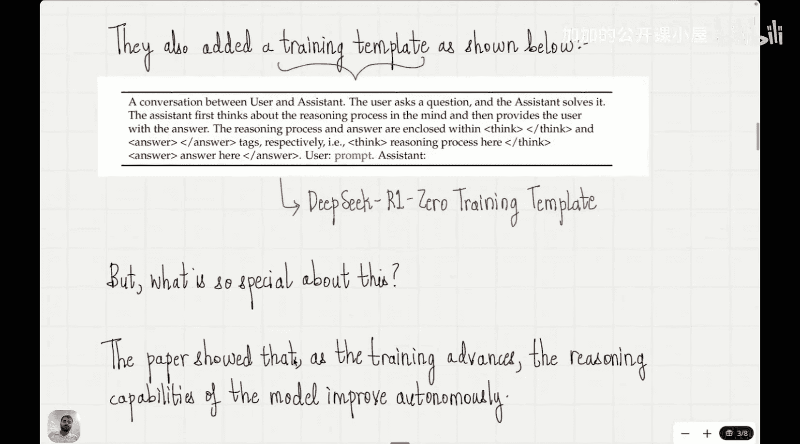

#  023：使用GRPO构建你的第一个推理模型

## 概述

在本节课中，我们将学习如何将GRPO强化学习算法与推理大语言模型连接起来。我们将回顾课程目标，理解DeepSeek R0模型如何利用GRPO和可验证奖励来构建推理能力，并最终了解如何将一个非推理模型转化为推理模型。

## 课程回顾与目标

我们已经完成了大约20节课，即将结束专注于纯强化学习的第二个章节。在开始第二章节的最后一课之前，让我们快速回顾一下本课程开始时设定的目标。

本课程的目标是理解推理模型如何工作以及如何构建它们。我们看到构建推理模型有四种主要方法。第一种是推理时计算扩展，我们的前三节课专门讨论了这种方法。

第二种方法是使用纯强化学习，接下来的15到16节课都致力于此。我们从经典强化学习基础，学习到现代强化学习算法，如TRPO、PPO和GRPO。

然而，我们尚未建立GRPO与推理模型之间的联系。这个联系在我们目前的方法中是缺失的。在今天的课程中，我们将搭建GRPO与推理模型之间的桥梁。这将标志着专注于纯强化学习的第二个模块的完成。

最后，我们还将看到如何通过使用GRPO技术，将一个非推理模型转化为推理模型，从而构建我们自己的推理模型。通过这个过程，我们将看到强化学习的力量与美妙。

## 连接GRPO与推理模型

现在，让我们深入本节课。今天的主要目标是建立GRPO与推理模型之间的联系。我们在本课程强化学习阶段所看到的一切，最终都是为了这节课做铺垫。

这个联系首次在2025年1月DeepSeek R论文发表时建立。这篇论文于1月22日发布，彻底改变了大语言模型的开发进程。此后，推理模型的进展非常迅速，一个接一个的新模型不断涌现，因为DeepSeek R为设计推理模型提供了一个蓝图。

在DeepSeek R1之前，他们推出的第一个模型是DeepSeek R0。这个模型有趣的部分在于，它使用GRPO作为强化学习算法，并且没有使用任何监督训练样本。这一点为什么重要，稍后会变得清晰，但请记住，DeepSeek R0使用了纯强化学习，而没有依赖可以用于微调模型的训练输入输出对。

## GRPO流程回顾

以下是GRPO流程。请记住，从上节课我们了解到，我们移除了价值函数模型。大语言模型给出不同的输出，采样多个输出，这些输出用于计算个体奖励，最终优势值直接从这些奖励中计算得出，我们不需要单独的价值函数模型。因此，GRPO流程的简洁性非常吸引人。

注意，这里我们仍然需要一个奖励模型来估计奖励。在开发DeepSeek R0时提出的问题是：我们能否也摆脱奖励模型？我们已经摆脱了价值函数模型，能否也摆脱奖励模型？答案是肯定的。

他们通过使用不需要模型、但可以通过外部工具验证的奖励，摆脱了奖励模型。这是什么意思？想象这个例子：我们给出输入“计算5乘以3加4”，我们的大语言模型给出答案“35”。为了交叉验证这个答案是否正确，你不需要一个基于输入输出数据训练的奖励模型，你可以简单地通过计算器验证，看看答案是否正确。

对于编码示例也是如此，如果你有一个要求对这些数字进行排序的输入，并且你编写了代码，你不需要奖励模型来验证代码是否正确。该论文使用LeetCode编译器来检查答案是否正确。因此，通过使用外部工具，我们可以获得客观的、具有特定值的奖励，其中没有主观性，我们不需要为这些数据训练奖励模型。

在没有奖励模型的情况下，修改后的GRPO流程如下所示。现在我们既没有价值函数，也没有奖励模型。因此，通过消除对单独奖励模型的需求，这个过程变得更加简单。

## DeepSeek R0的创新

这就是DeepSeek R0中使用的流程，但他们在此基础上增加了一个额外元素。除了这些用计算器、LeetCode编译器检查的准确性奖励外，他们还添加了所谓的格式奖励。

添加格式奖励是为了确保模型的“思考”过程被强制放在特定的标签内。因此，如果模型给出的答案没有包含思考标签，它就会受到惩罚，即获得负奖励。这样，模型就学会了提供能适应这些标签的答案。这些被称为格式奖励。

在DeepSeek R0中，强化学习算法是GRPO，奖励分为两种类型：第一种是针对可通过工具验证的准确性奖励；第二种是格式奖励。这个过程也被称为RLVR，即可验证奖励强化学习。

## 训练模板

在此之后，他们又增加了一个元素：训练模板。训练模板内容如下：用户和助手之间的对话。用户提出问题，助手解决问题。助手首先在脑海中思考推理过程，然后向用户提供答案。推理过程和答案分别包含在`` `<answer>` 答案 `</answer>`。因此，我们基本上是给出了一个训练模板，并要求我们的模型在编写答案时遵循此模板。我们没有告诉它如何思考，而是给出了一个更广泛的训练模板。我们只是告诉模型：首先在脑海中思考推理过程，然后给用户答案，并确保答案的格式正确。

这就是DeepSeek R0的训练模板。本质上，他们引入了三样东西：第一，他们摆脱了奖励模型；第二，他们引入了格式奖励；第三，他们添加了训练模板。其核心是用于计算优势值的GRPO算法。

## 核心发现

那么，这有什么特别之处呢？事实证明，随着训练的进行，模型的推理能力会自主提高。

## 总结

本节课中，我们一起学习了如何将GRPO算法应用于构建推理大语言模型。我们探讨了DeepSeek R0如何通过结合GRPO、可验证的客观奖励（如计算器验证）和格式奖励，在没有监督数据的情况下，引导模型自主发展出链式推理能力。关键在于利用外部工具提供奖励信号，并通过训练模板规范模型的输出格式。这标志着我们纯强化学习模块的完成，并为理解现代推理模型的构建原理奠定了坚实基础。