# 人工智能治理基础教程 P1：收益、风险与全球协同 🧠

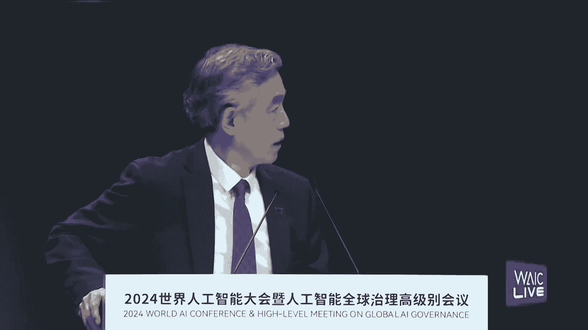

在本节课中，我们将学习2024世界人工智能大会开幕式上，多位专家关于人工智能治理的核心观点。课程将涵盖人工智能带来的宏观收益与潜在风险、中国的治理实践，以及构建全球协同治理体系的必要性。

## 概述：人工智能的双刃剑效应

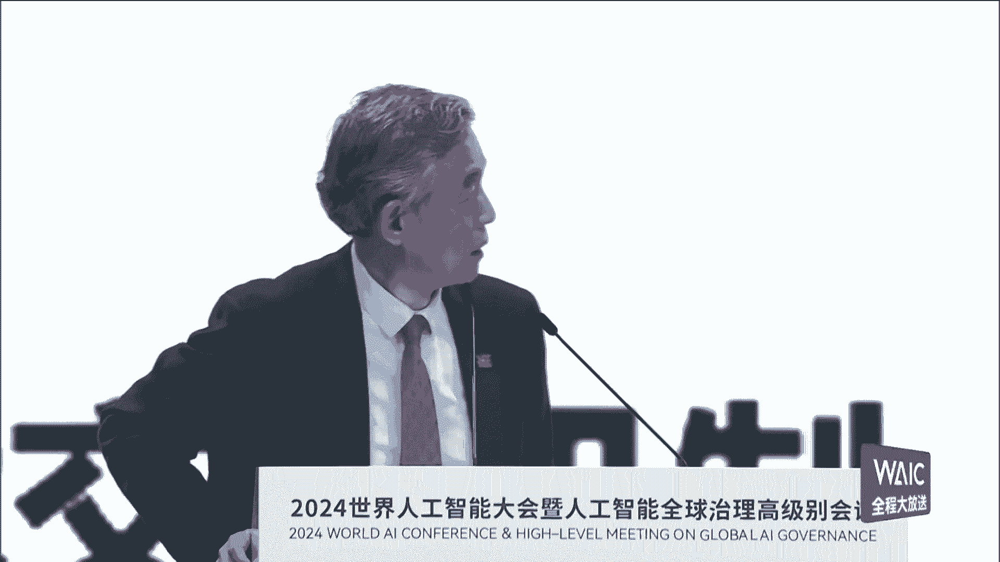

人工智能的发展如同一把双刃剑，在带来巨大机遇的同时也伴随着显著风险。理解其全貌是进行有效治理的第一步。

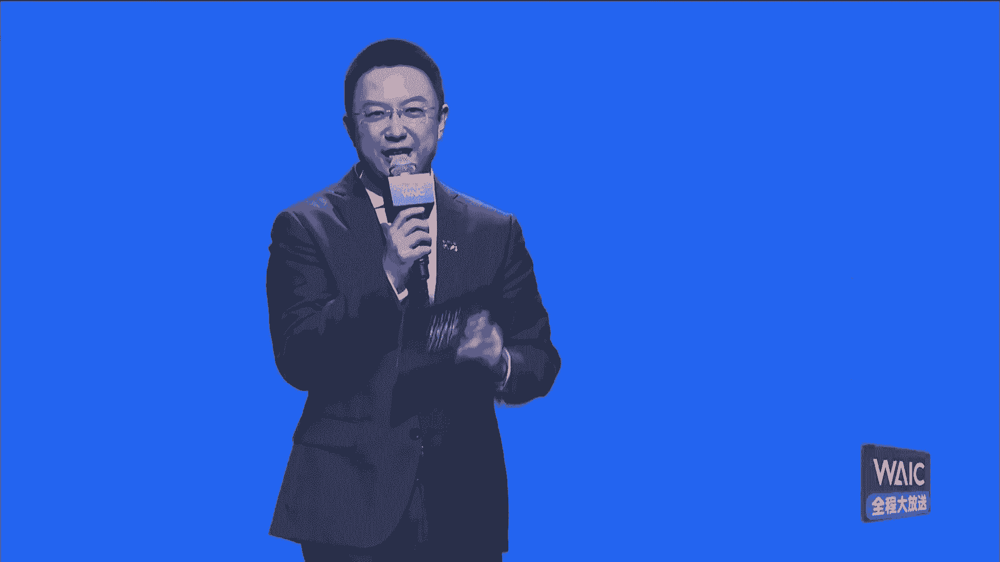

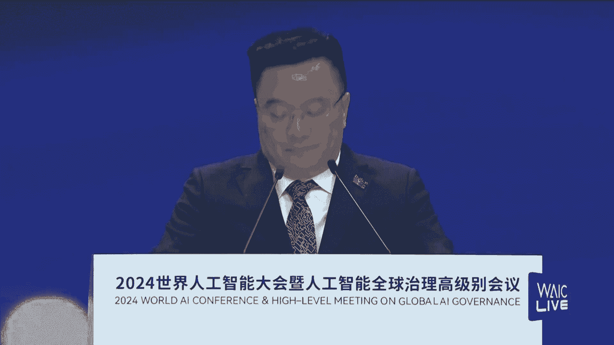

上一节我们概述了课程内容，本节中我们来看看人工智能的宏观影响。

## 人工智能的宏观收益与风险

清华大学薛澜教授从联合国可持续发展目标（SDG）的视角，分析了人工智能的宏观影响。SDG包含17个主要目标和169个具体指标，旨在2030年前推动人类社会更好发展。

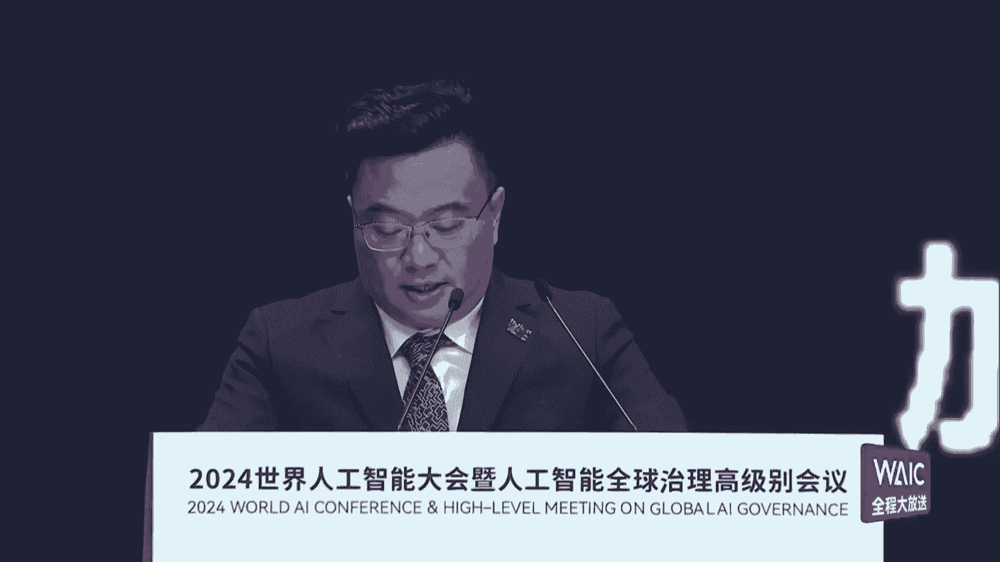

人工智能对这169个指标的影响评估显示：
*   **积极影响**：人工智能预计对其中134个指标产生积极的促进作用。
*   **潜在风险**：同时，也可能对其中约59个（35%）指标带来不利影响。

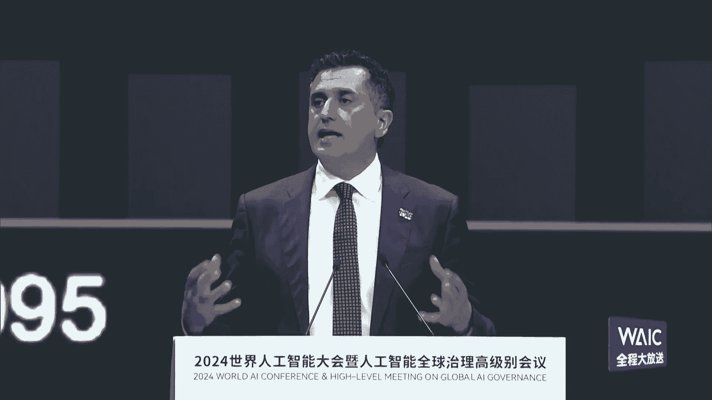

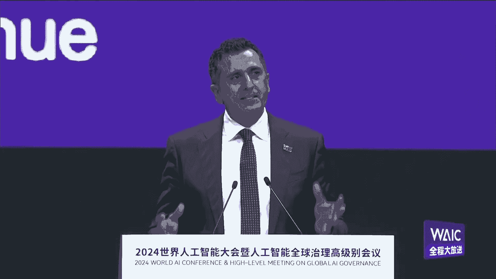

这表明，人工智能在推动经济发展、社会进步和环境保护三大领域潜力巨大，但其负面影响也不容忽视。

## 人工智能风险的分类

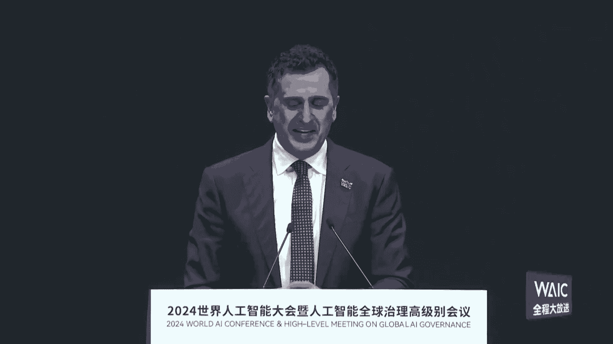

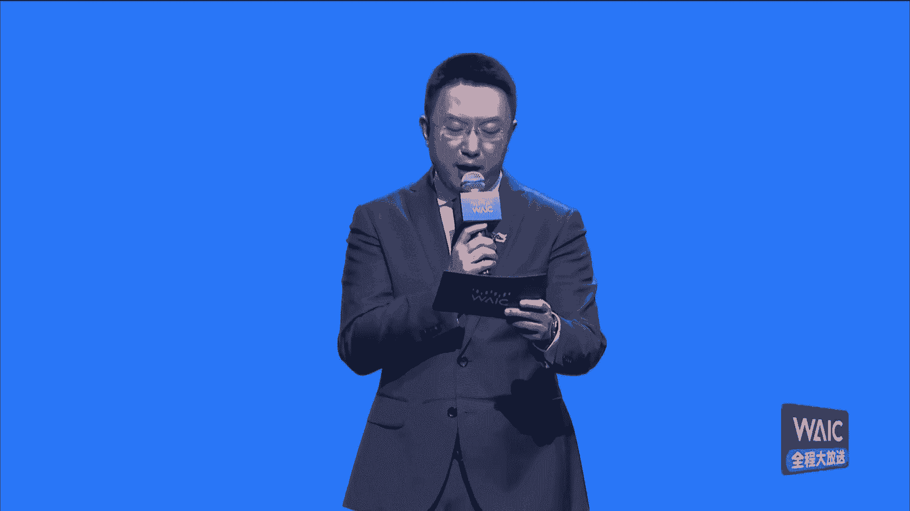

为了有效管理，我们需要对风险进行归类。薛澜教授将人工智能风险分为三大类：

以下是主要的风险类别：
1.  **技术内在风险**：包括模型的“幻觉”（Hallucination）问题，以及长远来看，具有自主性的人工智能系统可能对人类构成的威胁。
2.  **技术开发衍生风险**：包括数据安全、算法歧视、能源消耗等伴随技术开发过程产生的问题。
3.  **技术应用风险**：包括技术的误用、滥用，以及可能对社会就业结构产生的冲击。

## 中国的治理实践与体系

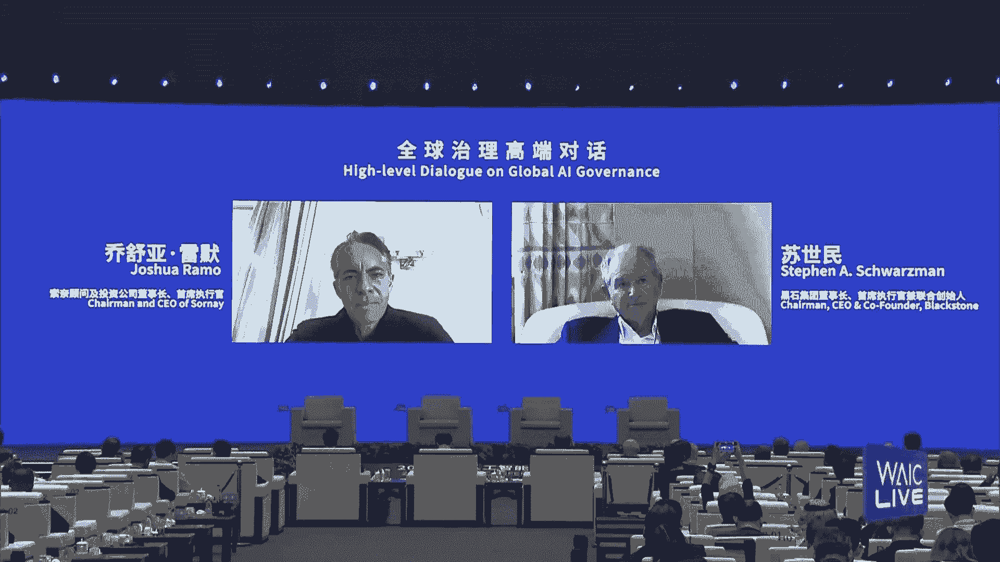

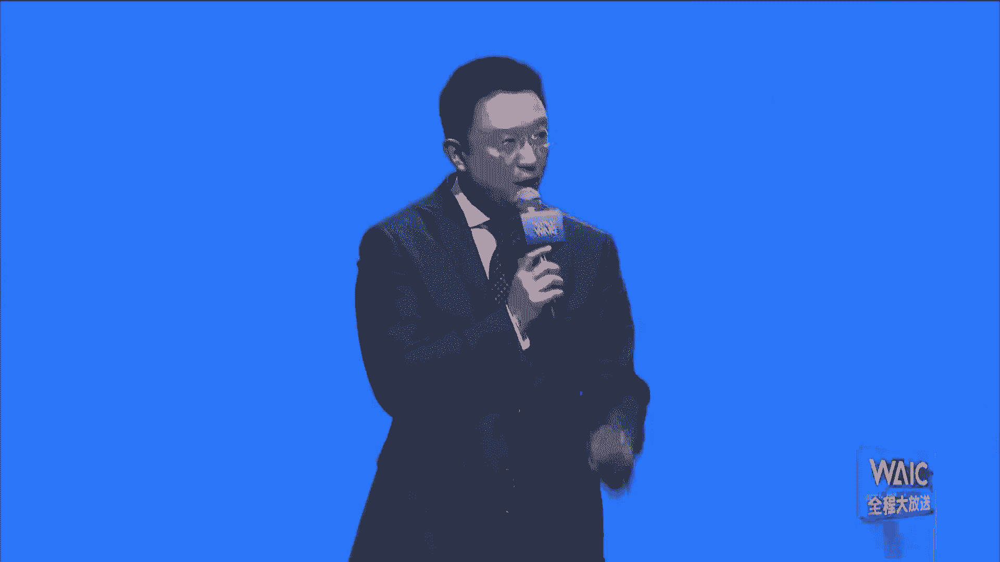

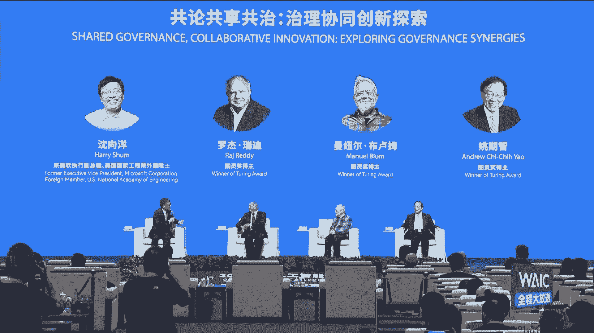

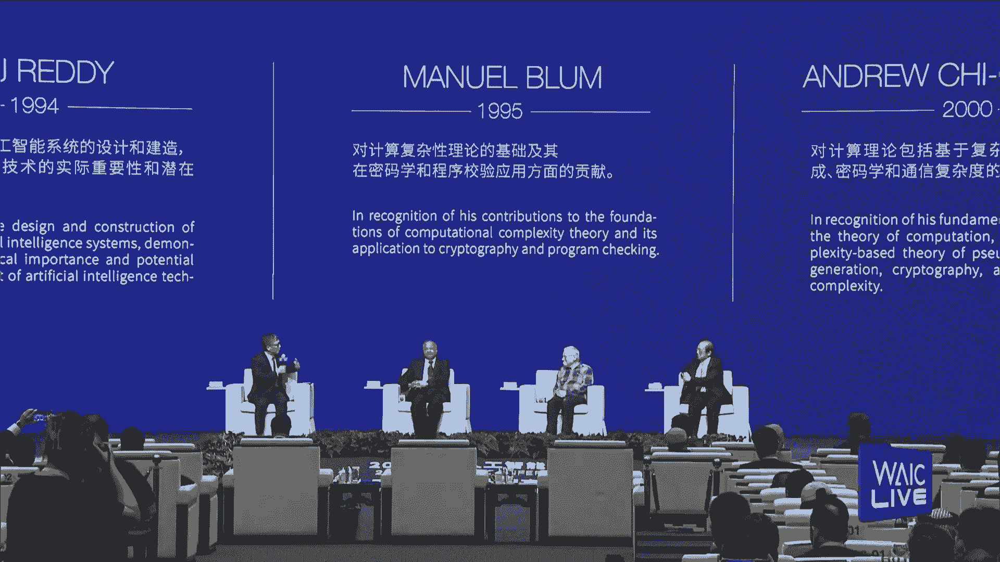

面对机遇与挑战，中国在过去几年中，已经着手构建一个多层次的人工智能治理体系。

以下是该体系的主要构成部分：
*   **底层规则**：2019年发布了《新一代人工智能治理原则》，并后续出台了伦理规范，确立了发展基调。
*   **法律法规**：在数据、算法、算力等关键要素，以及网络安全、个人信息保护等领域，出台了相应的法律法规。
*   **场景化规则**：针对自动驾驶、深度合成等具体应用场景，制定了专项治理规则。
*   **公众素养提升**：通过《提升全民数字素养与技能工作要点》等部署，提升社会对人工智能的认知和理解。

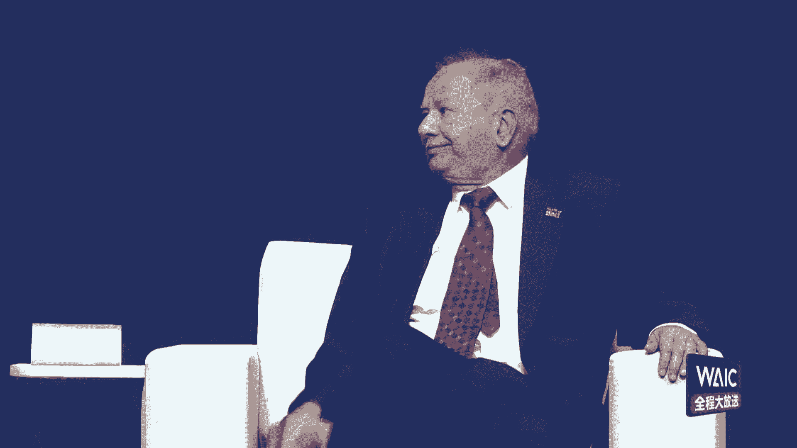

这个体系体现了 **“多维度、多层次、多领域、多举措”** 的治理思路，旨在统筹发展与安全。

## 全球治理的挑战与协同路径

尽管各国已有实践，但人工智能的全球治理仍面临严峻挑战，核心在于多种“鸿沟”的存在。

上一节我们了解了国家层面的实践，本节中我们来看看全球层面的挑战与合作。
*   **基础设施鸿沟**：全球仍有约25亿人处于离线状态。
*   **数字素养鸿沟**：公众理解和运用数字技术的能力存在巨大差距。
*   **发展与治理鸿沟**：各国在人工智能技术发展和治理规则上进度不一。

这些鸿沟不仅阻碍全球共同发展，也意味着一个国家的风险可能演变为全球性风险。因此，国际协同治理至关重要。

薛澜教授提出了全球协同的路径建议：
1.  **平衡发展与安全**：将发展与安全视为一体两翼，在关注安全的同时，必须着力解决发展鸿沟问题。
2.  **建立多边对话机制**：加强政府间的多边对话，共同制定规则。
3.  **发挥科学共同体作用**：依托全球科技力量，助力国际治理机制的完善。
4.  **强化联合国协调作用**：支持联合国等国际组织发挥综合协调作用，推动通过具有约束力的国际协议。

## 总结：走向协同治理的未来

本节课中，我们一起学习了人工智能治理的基本框架。我们认识到人工智能在促进全球可持续发展目标方面的巨大潜力，也系统梳理了其可能带来的技术、开发与应用风险。中国的治理实践为我们提供了一个多层次体系的范例。最后，我们明确了打破全球数字与发展鸿沟、通过国际对话与协作建立平衡且有效的全球治理体系，是确保人工智能朝着“科技向善”方向发展的关键。

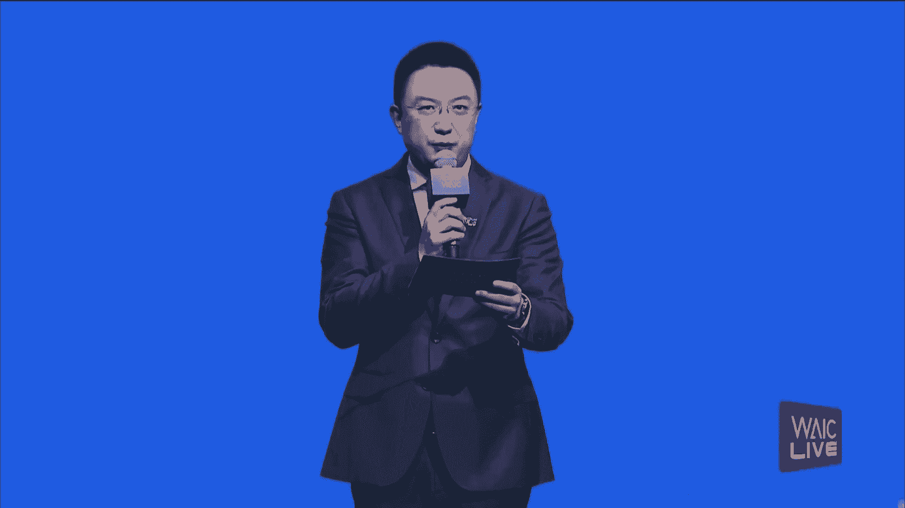

各方需要共同努力，让人工智能真正为人类的和平与发展作出更大贡献。