# 2：人工智能治理与未来发展 🌐

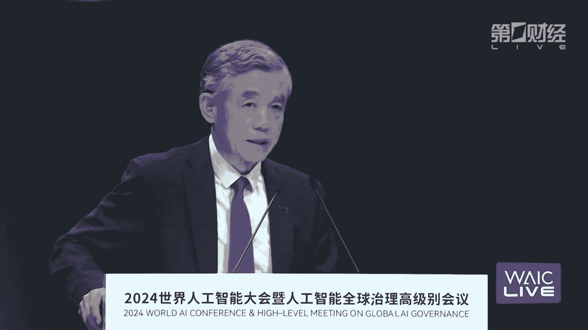

在本节课中，我们将学习2024年世界人工智能大会全体会议的核心内容。课程将聚焦于人工智能带来的宏观收益与潜在风险、中国在AI治理方面的实践探索，以及全球合作治理的必要性与技术路径。我们将通过多位顶尖专家和行业领袖的视角，深入理解如何平衡AI发展与安全，并探讨其未来方向。

---

## 人工智能的宏观影响与风险 ⚖️

上一节我们介绍了课程概述，本节中我们来看看人工智能带来的宏观收益与潜在风险。

人工智能的发展能够为社会带来广泛的收益。从宏观角度看，人工智能技术有助于推动实现联合国可持续发展目标（SDGs）。该目标包含17个主要目标和169个具体指标，旨在促进经济发展、社会进步和环境保护。研究表明，人工智能可能对其中134个指标产生积极的促进作用。

然而，人工智能也可能对其中约35%的指标（59个）产生不利影响。这些潜在风险不容忽视，主要可以分为三大类：

以下是人工智能潜在风险的分类：
1.  **技术内在风险**：包括模型的“幻觉”问题（`hallucination`），以及未来强自主性AI系统可能对人类构成的威胁。
2.  **技术开发相关风险**：涉及数据安全、算法歧视、能源消耗与环境影响等问题。
3.  **技术应用相关风险**：包括技术的误用、滥用，以及可能对社会就业结构造成的长期冲击。

因此，推动人工智能健康发展，最大化其收益同时将风险降至最低，是当前的核心议题。

---

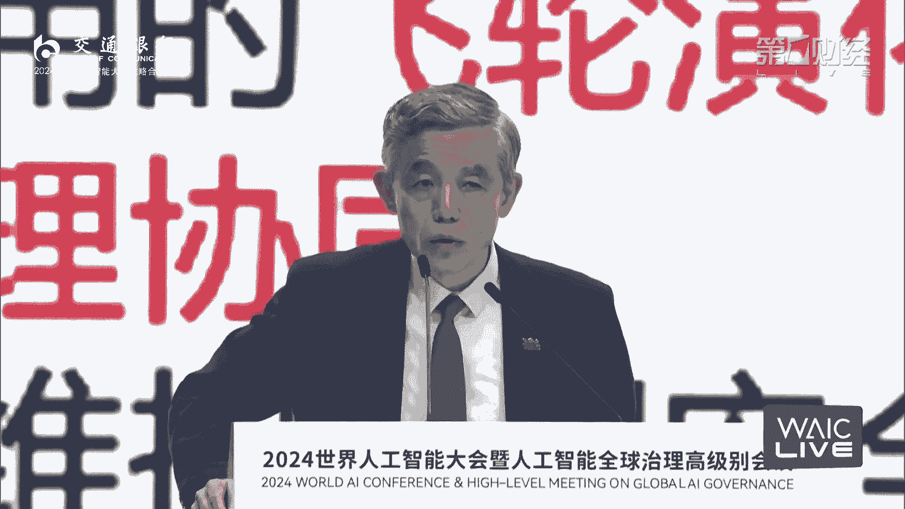

## 中国的AI治理实践 🏛️

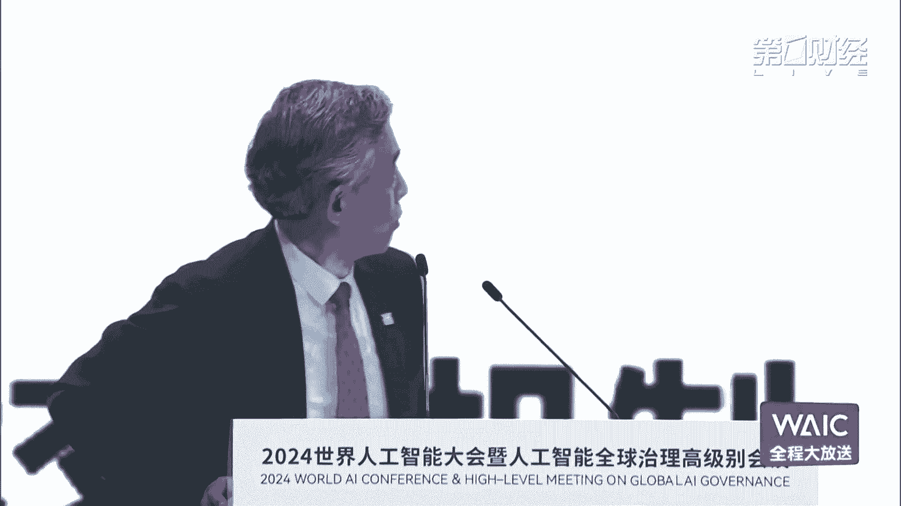

上一节我们探讨了AI的风险与收益，本节中我们来看看中国在人工智能治理方面的具体实践。

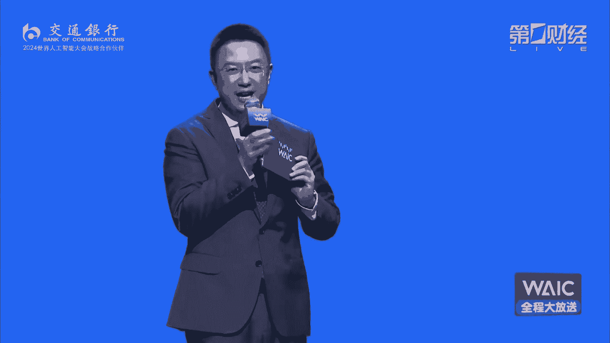

中国在过去几年中，已经建立起一个相对完整的治理体系，旨在统筹人工智能的发展与安全。这个体系是多维度、多层次、多领域且多举措的。

以下是中国AI治理体系的主要构成部分：
*   **底层规则与伦理**：2019年发布了《新一代人工智能治理原则》，后续又发布了伦理准则，为治理奠定基础。
*   **领域性法律法规**：针对算法、算力、数据等关键要素，出台了一系列治理规则。
*   **专项场景治理**：针对人工智能的具体应用场景，制定了相应的监管措施。
*   **公众素养提升**：通过《提升全民数字素养与技能工作要点》等部署，加强社会对人工智能的理解与认识。

这一体系强调发展与安全并重，并注重提升公众认知，以营造有利于人工智能创新且安全可控的社会环境。

---

## 全球挑战与治理路径 🌍

上一节我们了解了中国的治理经验，本节中我们将视野扩展到全球，看看人工智能发展面临的共同挑战与国际治理路径。

全球人工智能的发展仍面临多重鸿沟，这些鸿沟不仅是发展障碍，也可能转化为全球性风险。

以下是当前主要的全球性鸿沟：
1.  **基础设施鸿沟**：全球仍有大量人口处于离线状态。
2.  **数字素养鸿沟**：公民在数字技能和理解上存在巨大差异。
3.  **AI发展与治理鸿沟**：各国在AI技术发展和治理能力上不平衡。

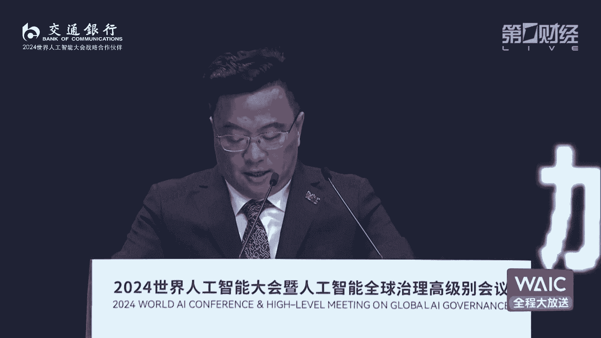

解决这些问题需要国际社会共同努力，将发展与安全视为一体两翼。目前国际社会对安全问题较为关注，但对发展鸿沟的关注仍需加强。

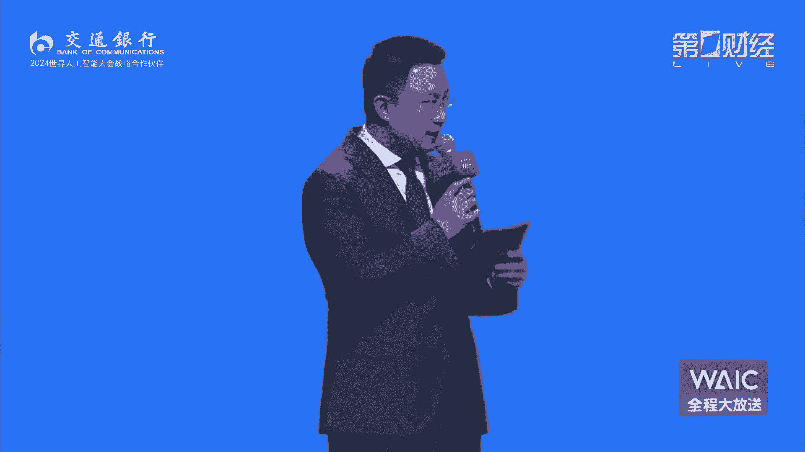

为构建有效的全球治理框架，需要多途径推进：

以下是推动全球AI治理的关键路径：
*   **加强政府间对话**：通过多边机制建立国际交流与风险防控体系。
*   **发挥科学共同体力量**：全球科技界应与企业、政府协同，助力完善国际规则。
*   **强化国际组织作用**：支持联合国等组织发挥综合协调作用，推动达成并落实关于AI安全与国际能力建设的协议。

最终目标是打破壁垒，加强合作，引导人工智能为人类和平与发展作出更大贡献。

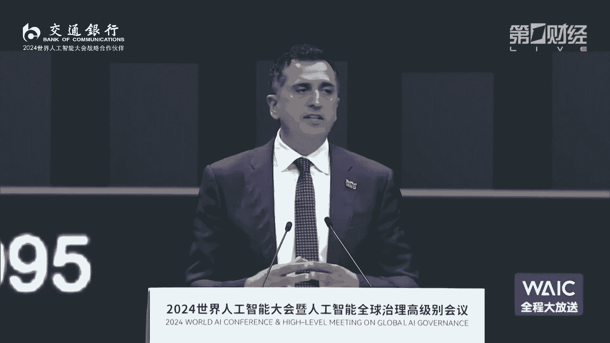

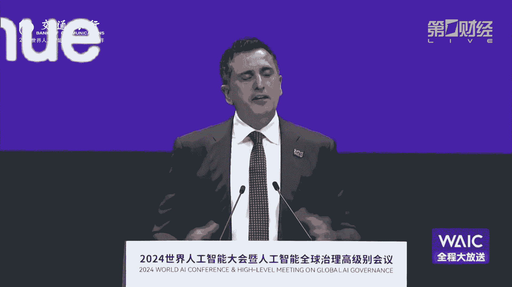

---

## AI安全与发展的45度平衡率 ⚖️

上一节我们讨论了全球治理的合作框架，本节中我们将深入一项具体的技术治理主张——AI的45度平衡率。

当前以大模型为代表的AI能力正呈指数级增长，但与之对应的安全能力（如红队测试、安全护栏、评估测量等）的发展却呈现离散化、碎片化且后置的特点。两者投入差距巨大，例如全球99%的算力用于模型预训练，仅不到1%用于对齐或安全优先的考量。

这种失衡导致AI的发展路径是“跛脚”的。我们真正需要追求的是可信的AGI，它必须兼顾安全与性能。因此，我们提出了“AI 45度平衡率”的技术思想体系。

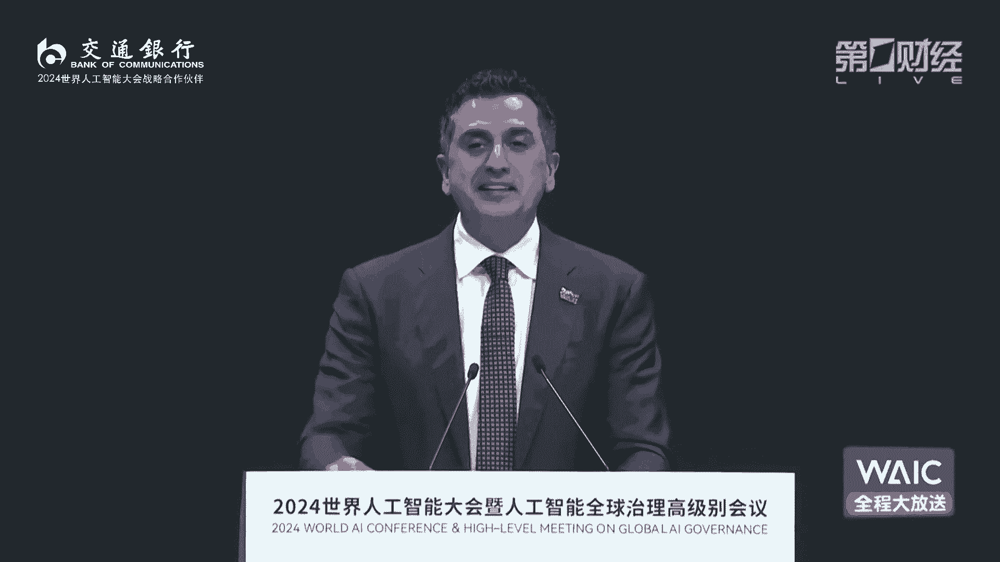

**公式**：`AI发展路径 ≈ 沿安全与性能的45度角方向`

该思想要求强技术驱动、全流程优化、多主体参与及敏捷治理。其实质是追求从长期看，AI的安全与性能大体上平衡发展，短期内允许波动，但不能长期偏离平衡。

---

## 实现平衡的技术路径：可信AI的因果之梯 🪜

上一节我们提出了平衡发展的目标，本节中我们探讨一条实现该目标的具体技术路径——以因果为核心的可信AI发展阶梯。

实现AI的45度平衡率可能有多种技术路径。上海人工智能实验室提出了一条名为“可信AI的因果之梯”的路径，致敬图灵奖得主朱迪亚·珀尔。该路径将发展分为三个递进阶段：

以下是“可信AI的因果之梯”的三个阶段：
1.  **泛对齐**：包含当前基于人类偏好的对齐技术（如RLHF）。但这类技术主要依赖统计相关性，而非真正的因果关系，可能导致错误推理和风险（类似“巴甫洛夫的狗”的条件反射）。
2.  **可干预**：探究AI行为的因果机制。技术包括人在回路、可解释性，以及新提出的“对抗演练”，旨在通过提升可解释性和泛化性来同时增强安全与能力。
3.  **能反思**：要求AI系统不仅能执行任务，还能审视自身行为的外在影响和潜在风险。技术包括基于价值的训练、因果可解释性、反事实推理等。

目前全球AI安全技术发展主要停留在第一阶段，部分尝试进入第二阶段。但要实现真正的安全与性能平衡，必须完善第二阶段并勇敢迈向第三阶段。

---

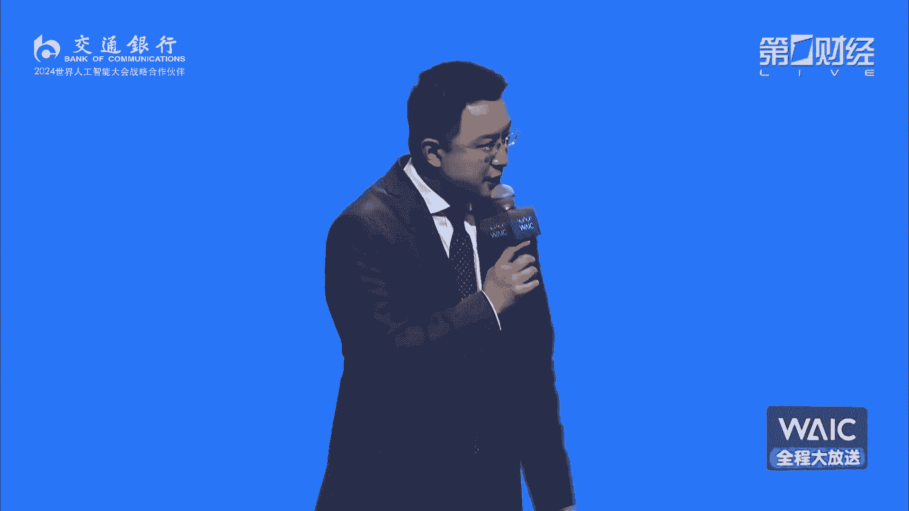

## 产业基础：半导体视角下的AI安全 🔩

上一节我们从算法层面探讨了安全路径，本节中我们将视角下沉到人工智能的物理基础——半导体芯片，来看产业界如何保障AI安全。

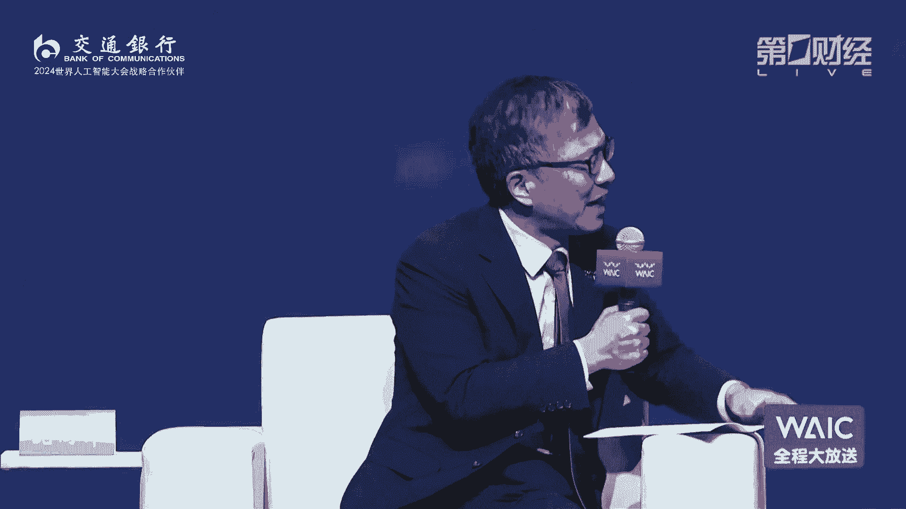

人工智能始于半导体芯片。过去60年，半导体行业实现了5万亿美元的销售额，而近期的增长几乎全部由AI驱动。AI需要庞大的基础设施来训练和运行模型。

历史上，芯片设计主要优化性能和能耗。而在AI时代，必须增加对**安全**和**保障**的优化维度。作为芯片设计软件提供商，新思科技利用AI加速芯片开发过程，提升效率并弥补人才缺口。

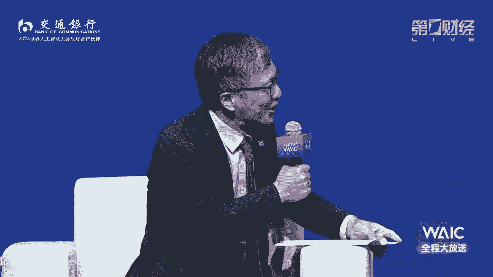

在芯片层面确保AI安全，产业界正在实践多项工作：

以下是从半导体角度保障AI安全的关键举措：
*   **合规与可追溯性**：确保芯片中每个组件的来源安全、可追溯，防止不合规部件引入，保护知识产权和隐私。
*   **能效优化**：优化芯片设计以降低能耗，这对于运行AI的大型数据中心至关重要。
*   **内部AI治理**：在企业内部建立“AI卓越中心”，教育员工认识AI伦理与风险，并负责任地将AI技术商业化。
*   **提升行业效率**：应用生成式AI等技术提升工程师效率，同时实现能耗降低（如减少30%）和开发效率大幅提升（如提升10-15倍）。

从硅基芯片到上层应用，构建安全、合规、合乎伦理的AI技术生态系统至关重要。

---

## 投资视角：AI如何重塑商业与风险评估 💼

上一节我们了解了硬件基础的安全考量，本节中我们将从投资视角，观察AI如何改变商业逻辑与风险评估。

AI不仅改变了企业运营方式，也深刻改变了价值评估框架。一些公司因成功融合AI而价值飙升，另一些则可能面临价值重估。对于持有长期硬资产的投资机构而言，评估AI的长期影响变得至关重要。

AI已成为投资决策的核心考量因素之一。投资机构需要以5到10年的周期视角，评估AI的深入发展将对所投企业业务产生何种影响。目标是在避免成为“意外的输家”的同时，抓住“大赢家”的机会。

在学术与产业互动方面，结构性变化正在发生。目前AI的重大突破多出现在商业界，因为企业能负担得起所需的巨大算力。大学虽然拥有顶尖人才，但在资源竞争中处于劣势。未来，需要促进学界与业界更深入的融合与相互尊重，以推动基础研究与产业应用共同健康发展。

---

## 科学家论道：AI的过去、现在与未来 🧠

上一节我们从商业角度分析了AI的影响，本节中我们聆听三位图灵奖得主从计算机科学根本出发，对AI治理与未来的深刻见解。

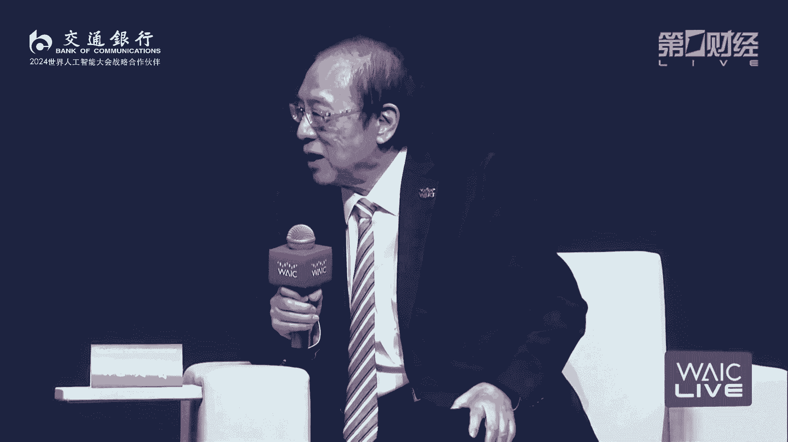

**拉杰·雷迪**强调，在关注风险治理的同时，不应忽视AI作为工具的巨大潜力。当前的重点应是研究如何让AI将人类的心智能力提升十倍、百倍，并改革教育体系，培养能熟练运用AI的下一代。

**曼纽尔·布鲁姆**分享了关于“意识”的研究。他介绍了“有意识的图灵机”模型，将意识类比为剧场：众多处理器（神经元）聆听“舞台”上的信息并做出反应。这个模型为理解智能和构建通用人工智能提供了新思路。

**姚期智**系统阐述了AI风险的三个层面：
1.  **网络安全风险的放大**：AI使传统数据安全挑战变得更为复杂。
2.  **无意识的社会风险**：AI可能快速颠覆社会结构，如导致大规模失业。
3.  **生存性风险**：这是最深刻的挑战，即创造出一个可能远超人类能力的物种。控制它与避免被它破坏之间的平衡，是计算机科学理论面临的终极问题之一。

科学家们一致认为，我们正处于激动人心的历史时刻。不应因过度强调安全而忽视AI带来的巨大机遇，也不应盲目发展而忽视潜在风险。对技术保持敬畏，并积极寻求解决之道，是科学共同体的责任。

---

## 总结与展望 ✨

在本节课中，我们一起学习了2024年世界人工智能大会全体会议的核心内容。

我们从宏观层面分析了人工智能带来的巨大收益与各类潜在风险。接着，我们梳理了中国在构建多维度AI治理体系方面的实践经验。面对全球性的基础设施、素养与发展鸿沟，我们探讨了通过国际合作、平衡发展与安全来推动全球治理的必要性。

在技术层面，我们深入探讨了“AI 45度平衡率”这一发展理念，并介绍了以因果推理为核心的“可信AI因果之梯”技术路径。从半导体产业的硬件安全基础，到投资领域的价值重估与风险评估，我们看到了AI对全产业链的深刻影响。

最后，三位图灵奖得主从计算机科学的本源出发，提醒我们既要积极利用AI放大人类能力，也要对其可能带来的根本性挑战保持清醒与敬畏。

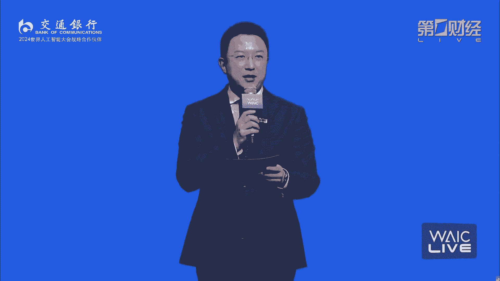

人工智能的未来需要**共商、共享、共治**。它融合了机遇与挑战、确定性与神秘性、严谨研究与大胆想象。只有通过全球智慧的持续携手与协同探索，才能确保这项革命性技术朝着科技向善、造福人类的方向健康发展。