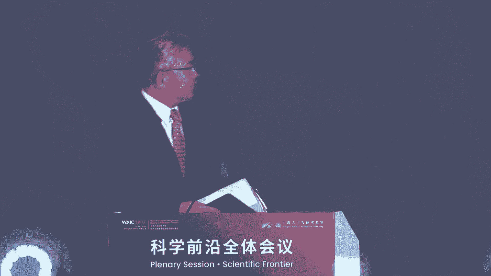

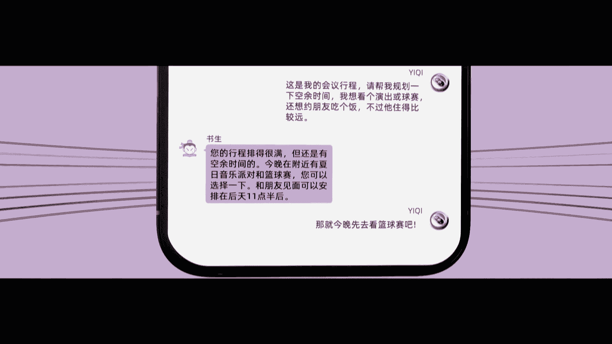

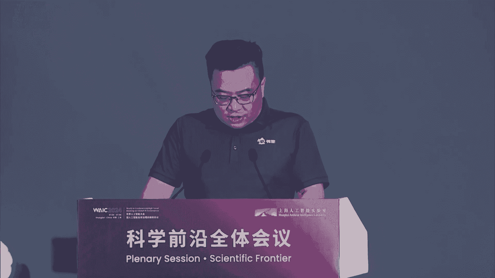

# 3：通用人工智能前沿进展与挑战 🧠  

## 概述  
在本节课中，我们将学习上海人工智能实验室在通用人工智能（AGI）领域的前沿探索，包括通专融合的发展路径、书生系列大模型的最新进展、多模态与气象海洋大模型的应用，以及国家级实验室的协同创新机制。课程还将涵盖全球人工智能创新指数分析，并探讨AI安全与负责任发展的重要性。  

---

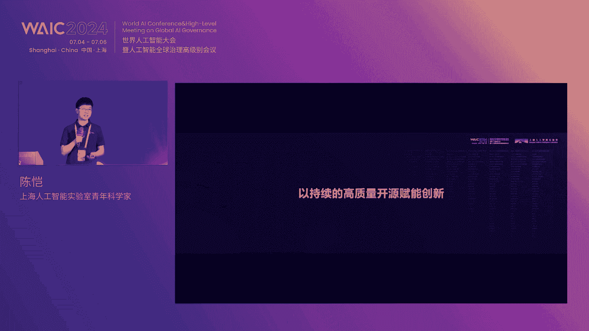

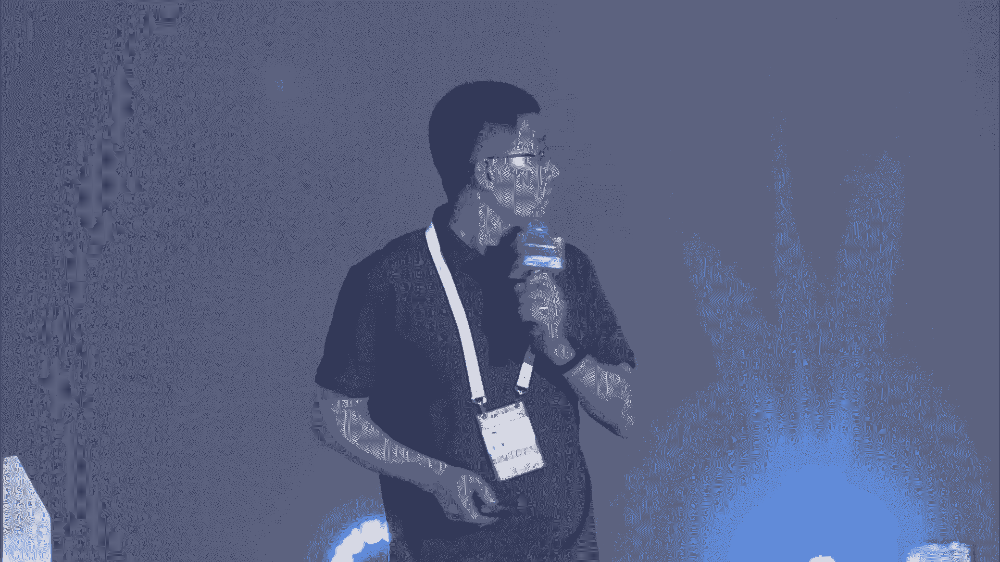

## 一、上海人工智能实验室的工作与挑战  

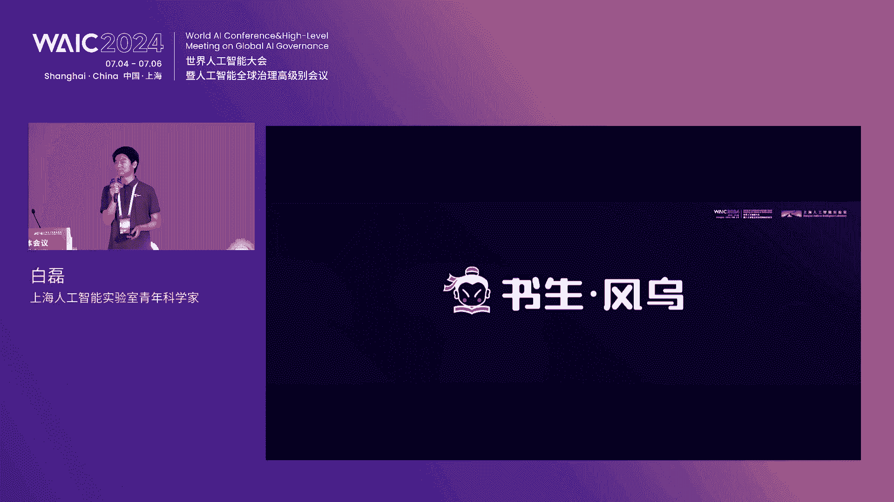

上海人工智能实验室在人工智能发展的重要阶段，面临算力能耗、专业应用适配及AGI发展路径等挑战。  

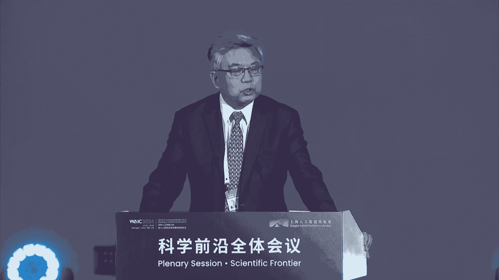

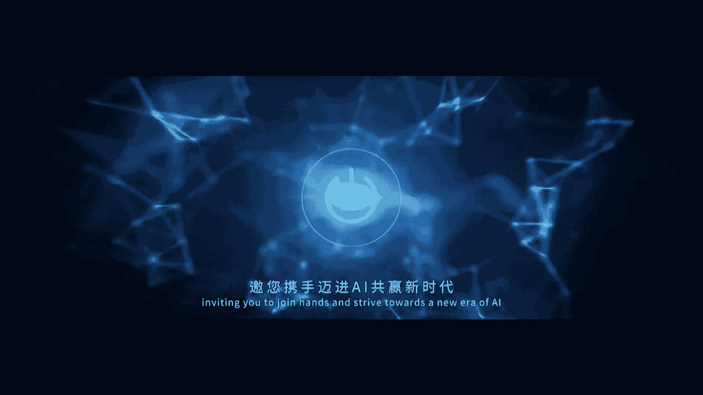

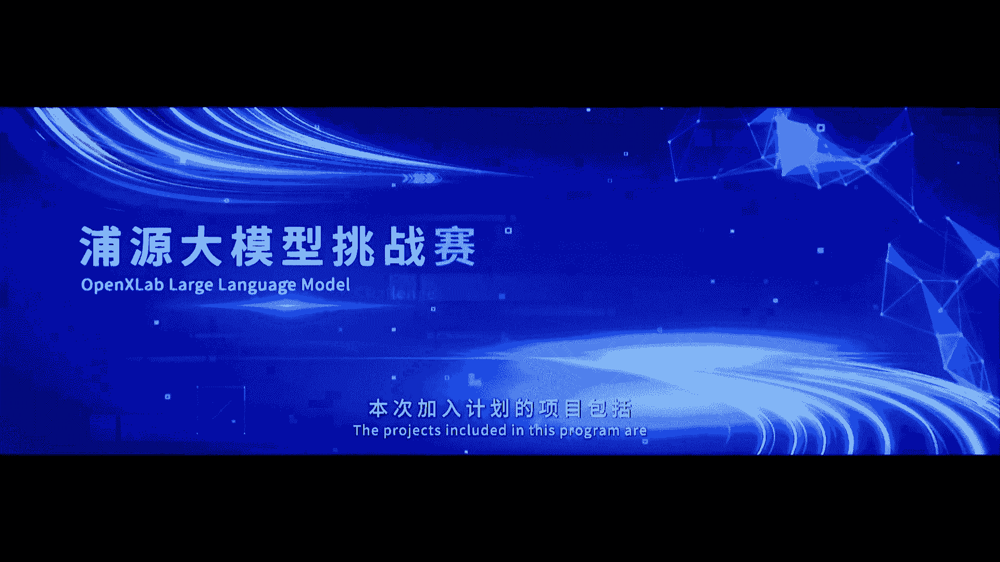

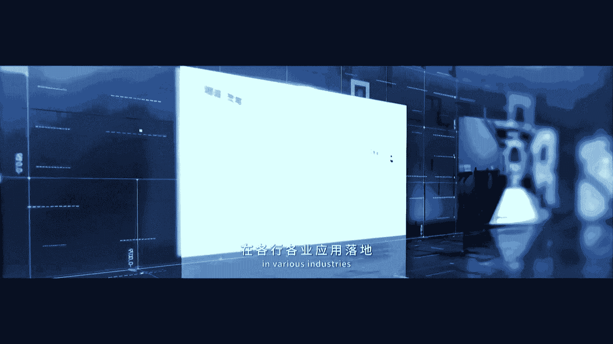

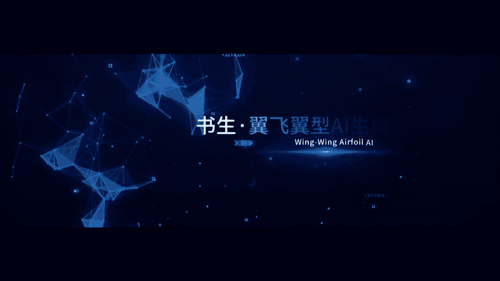

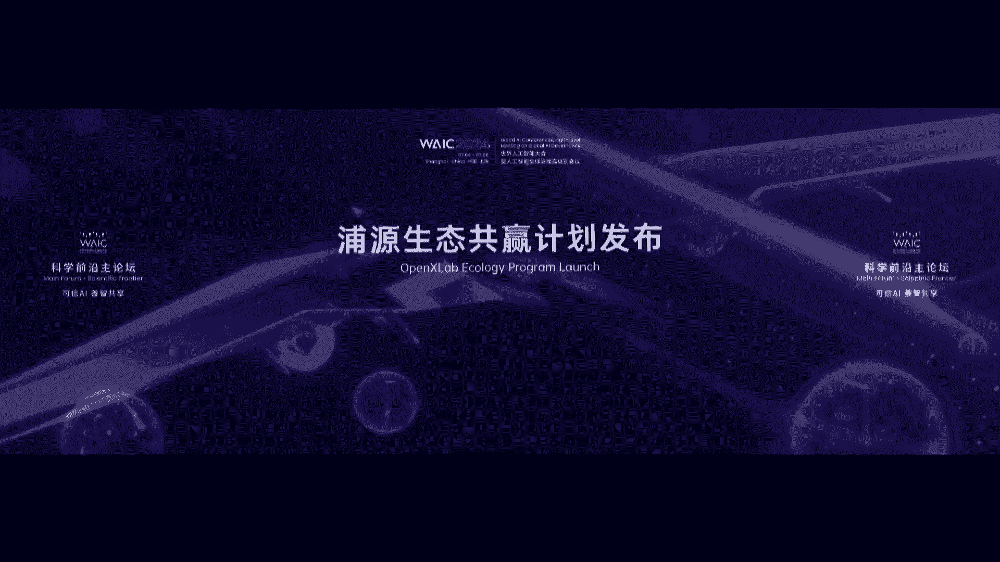

以下是实验室的核心工作方向：  
1.  **书生大模型**：展示AI在多个场景中的应用能力，如演讲辅助、休闲娱乐、体育分析等。  
2.  **通专融合路径**：提出AGI发展需兼顾泛化能力与专业性，通过基础模型层、融合协同层、自主进化与交付层的系统化设计实现。  
3.  **高效训练与推理**：通过稀疏数据合成、渐进式对齐等技术，以更低算力实现高性能模型，如书生·浦语2.5以70亿参数比肩700亿参数模型。  
4.  **科学发现应用**：利用大模型提出科学假设，例如预测药物疗效差异，并在后续实验中得到验证。  

---

## 二、通专融合的AGI发展路径  

上一节我们介绍了实验室的整体工作，本节中我们来看看通专融合的具体路径。周博文主任指出，AGI发展需在泛化性与专业性两个维度上协同演进。当前大模型在泛化能力上进展迅猛，但专业能力提升缓慢，且存在能耗高、幻觉等问题。  

通专融合的核心是找到“价值引爆点”，即模型在专业能力上超过90%的人类专家，同时具备强泛化能力。实现这一目标需要三层架构：  
1.  **基础模型层**：提升模型泛化能力，如书生·浦语大语言模型和书生·万象多模态模型。  
2.  **融合协同层**：结合泛化性与专业性，通过多智能体协同实现复杂任务规划与决策。  
3.  **自主进化与交付层**：强调AI在真实或仿真环境中的自主探索与反馈闭环，如“浦源·桃源”城市级具身智能训练场。  

---

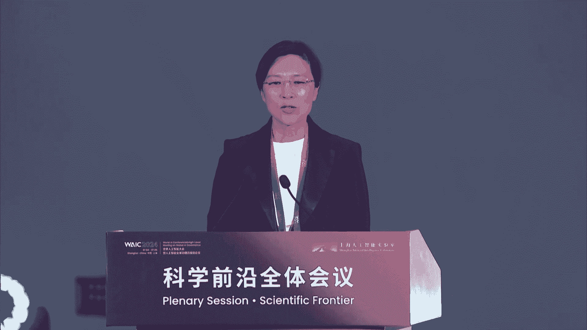

## 三、书生系列大模型的最新进展  

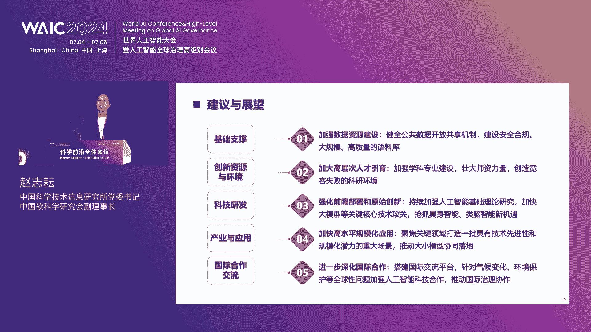

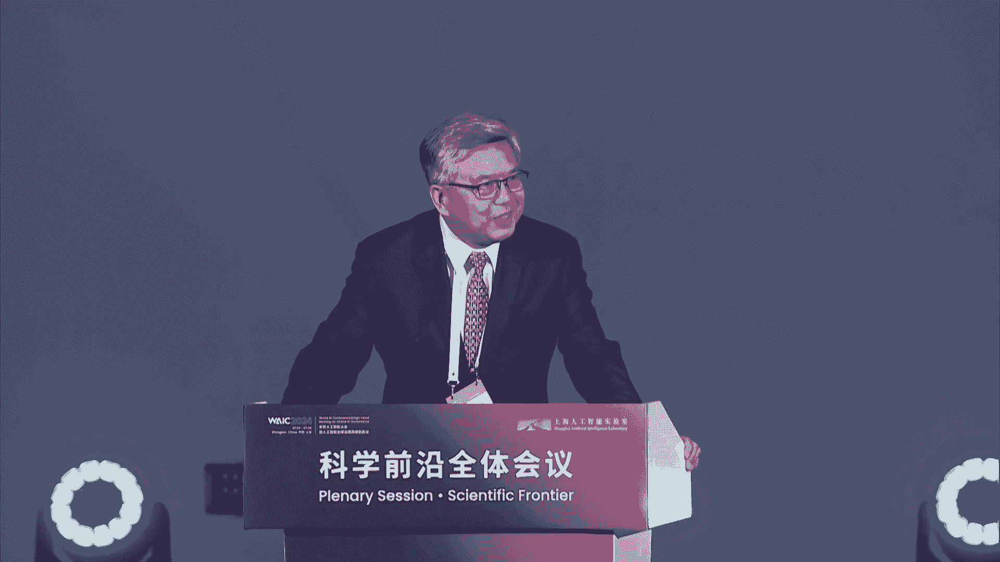

以下是书生系列模型的核心亮点：  
1.  **书生·浦语2.5**：  
    *   推理能力提升20%，支持100万token上下文，在数学评测集上性能提升100%。  
    *   通过模型飞轮与合成数据加速迭代，融合规则构造、模型扩充、反馈生成等多种数据合成方案。  
2.  **书生·万象多模态模型**：  
    *   支持图像、视频、文本、语音、三维、医疗等多种模态，性能比肩GPT-4V等顶尖闭源模型。  
    *   采用渐进式预训练与对齐技术，以较低成本实现高性能训练。  
3.  **风乌气象海洋大模型**：  
    *   覆盖短临预报、中期预报、气候预测全周期，实现全球10公里高分辨率气象建模。  
    *   风乌Ada端到端模型摆脱对物理分析场的依赖，效率提升1000倍以上。  

---

## 四、国家级实验室的协同创新  

在通专融合的背景下，国家级实验室的协同至关重要。钱锋院士、王耀南院士等专家指出，AI发展需“顶天立地”：  
*   **顶天**：研究大模型架构、训练算法、算力效率与数据可信度，突破现有技术瓶颈。  
*   **立地**：推动AI在智能制造、智能交通、智慧教育、智慧医疗等领域的赋能应用。  

各实验室需发挥优势，形成合力：  
1.  **虚拟现实实验室**：构建智能化虚实融合环境，实现虚实贯通。  
2.  **认知智能实验室**：聚焦语言理解与知识推理，让机器“能理解会思考”。  
3.  **多媒体信息处理实验室**：探索实时感知与脉冲神经网络，构建下一代智能系统。  
4.  **自主智能无人系统实验室**：研究多智能体协同与博弈，实现具身智能的群体智能涌现。  

专家呼吁建立“举国体制”，由国家层面统筹基础设施建设与重大任务布局，避免资源分散与低水平重复。  

---

## 五、全球人工智能创新指数与趋势  

赵志耘所长发布的《2023全球人工智能创新指数报告》显示：  
1.  **总体格局**：中美两国引领第一梯队，与第二、三、四梯队差距进一步拉大。  
2.  **发展趋势**：  
    *   大模型带动技术创新加速，产业界在模型开发上优势扩大。  
    *   生成式AI开源项目激增，人工智能企业数量与风险投资额回升。  
3.  **中国表现**：综合水平全球第二，但在高质量数据资源与原创能力上仍需加强。  

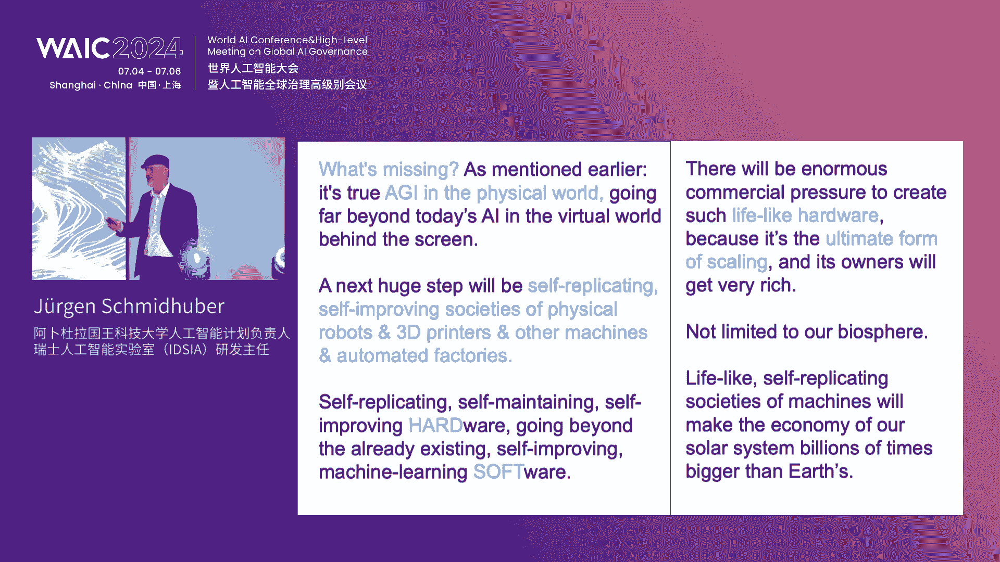

未来需在数据资源建设、人才引进、原始创新、规模化应用与国际合作等方面持续突破。  

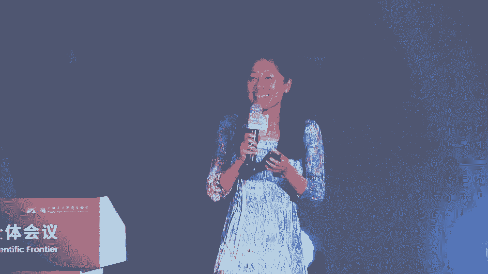

---

## 六、AI安全与负责任发展  

宋晓东教授强调，AI的负责任发展需关注三大挑战：  
1.  **可信AI**：  
    *   隐私泄露：大模型会记忆训练数据中的敏感信息，需发展差分隐私等技术。  
    *   对抗攻击：模型易受对抗样本、数据投毒等攻击，当前防御进展缓慢。  
2.  **滥用防范**：AI可能被用于语音克隆、社会工程、虚假信息等攻击，需开发监控系统与安全设计。  
3.  **数据经济**：通过Shapley值等框架公平分配数据贡献价值，建立负责任的数据经济。  

实现AI安全需推动“安全设计”，结合形式化验证与AI辅助证明，构建可证明安全的系统。  

---

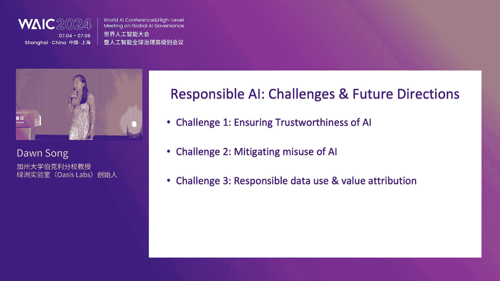

## 七、下一代AI架构的革新与挑战  

在圆桌讨论中，青年科学家们指出当前技术路径的局限与未来方向：  
1.  **Scaling Law的反思**：依赖算力与数据堆叠的路径可能遇到瓶颈，需探索更高效的架构与学习机制。  
2.  **因果推理能力**：当前大模型难以从被动数据中学习因果性，需设计新架构或利用多模态干预数据。  
3.  **生成模型演进**：Diffusion并非终点，需探索与自回归模型等的结合，并降低创新门槛。  
4.  **具身智能突破**：大模型可作为世界模拟器或奖励函数生成器，但需解决过拟合、规划能力不足等问题。  

未来最值得探索的方向包括：  
*   让多模态大模型具备因果推理与反思能力。  
*   发展超越Transformer的高效架构，实现“压缩即智能”。  
*   利用大模型内部知识推动科学发现与创新。  
*   构建安全、可信、隐私保护的AI系统。  

---

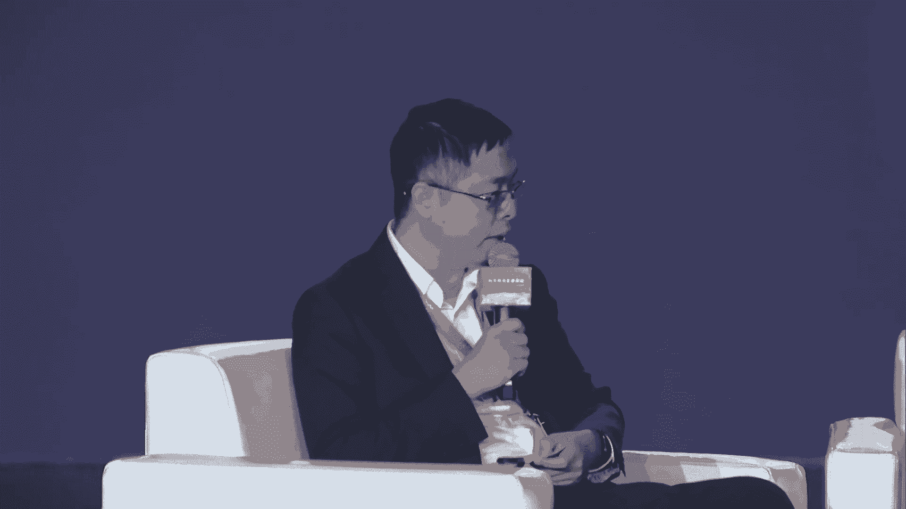

## 总结  
本节课中我们一起学习了上海人工智能实验室在通专融合路径上的前沿探索，包括书生系列大模型、风乌气象海洋模型的最新进展。我们分析了全球AI创新格局，探讨了国家级实验室的协同机制，并深入讨论了AI安全、下一代架构革新等关键挑战。未来，AGI的发展需在技术突破、应用落地、安全可信与全球合作中持续前行。正如周博文主任所言：“We must be there, we will be there.”