# 5：人工智能向善：创新扩大影响论坛全记录与解读 📘

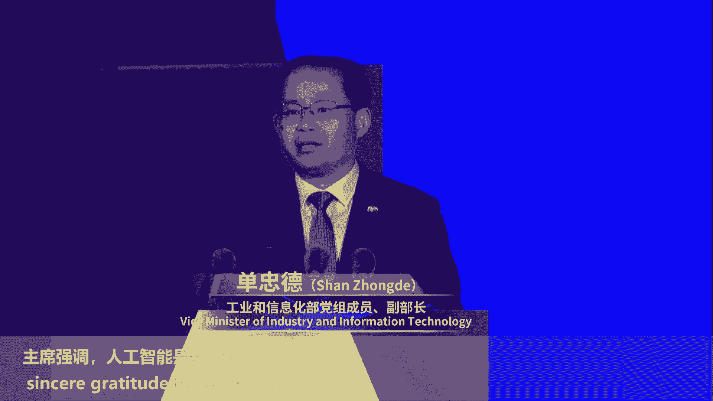

在本课程中，我们将学习“国际电信联盟人工智能向善：创新扩大影响论坛”的核心内容。我们将了解人工智能如何被用于推动联合国可持续发展目标，以及全球各界在人工智能治理、标准化和应用方面的努力与实践。

---

## 概述 🌍

本次论坛汇集了来自联合国机构、各国政府、科技企业及学术界的代表，共同探讨如何利用人工智能技术应对全球性挑战，并确保其发展符合“向善”与“以人为本”的原则。核心议题包括人工智能的治理、标准化、伦理以及其在医疗、通信、环保等关键领域的应用案例。


---

## 论坛开场与主旨演讲 🎤

论坛以一场融合视觉与声音的动态表演开场，艺术家将1940年至2024年的全球温度异常数据进行了“声音化”呈现，直观展示了气候变化这一紧迫议题。

随后，国际电信联盟及上海市政府的代表致开幕词。他们强调了人工智能作为新工业革命核心动力的巨大潜力，同时也指出必须关注其带来的伦理风险与治理挑战。中国代表介绍了本国在人工智能领域的快速发展，包括拥有超过4万家人工智能相关企业，并表达了与国际社会合作、共同完善全球人工智能治理的意愿。

上海市代表则分享了本地在推动人工智能“技术向善”方面的法规建设与产业培育工作，例如出台首部人工智能地方性法规，并致力于构建包容且审慎的监管框架。

---

## 联合国机构视角：人工智能与使命融合 🤝

本节我们介绍了联合国各专门机构如何利用人工智能推进其核心使命。

以下是联合国工业发展组织、国际电信联盟和联合国教科文组织代表的分享：

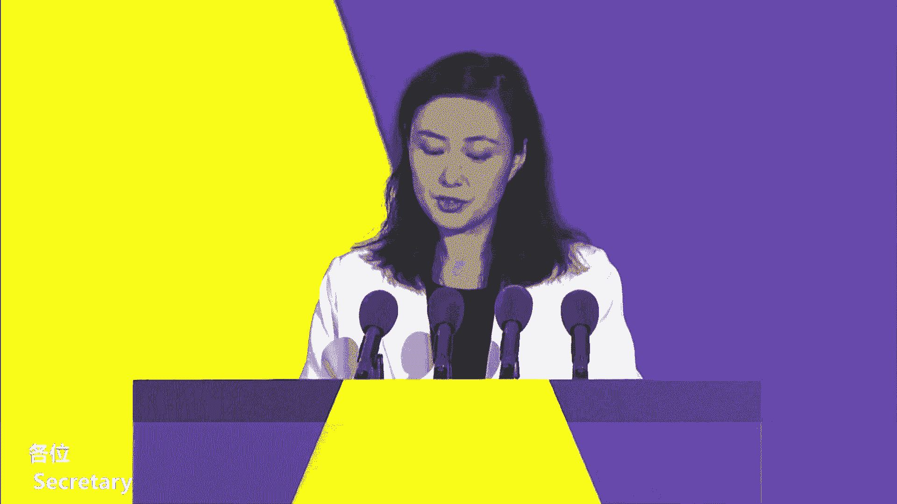

*   **联合国工业发展组织**：该组织将人工智能视为工业发展的“推动者”和“变革者”。其工作重点包括利用人工智能提升成员国（特别是发展中国家）的智能制造、能源效率及供应链管理水平，并通过能力建设帮助各国制定本国的人工智能战略。
*   **国际电信联盟**：作为联合国负责信息通信技术的专门机构，国际电联的核心工作之一是建立技术标准。目前，其已发布超过100项与人工智能相关的标准，涵盖多媒体水印、绿色技术等领域。同时，国际电联运营的“AI for Good”平台已成为连接全球创新者、政策制定者和专家，共同解决可持续发展挑战的关键网络。
*   **联合国教科文组织**：该组织长期关注新兴科技的伦理问题。其于2021年通过了全球首份《人工智能伦理问题建议书》，为193个成员国提供了在11个政策领域（如教育、数据、环境、性别平等）发展合乎伦理的人工智能的具体行动框架。其核心原则是确保人工智能服务于人的尊严与基本自由。

**过渡**：在了解了联合国系统如何从战略和伦理层面引导人工智能发展后，我们接下来将目光转向具体的实践与合作项目。

---

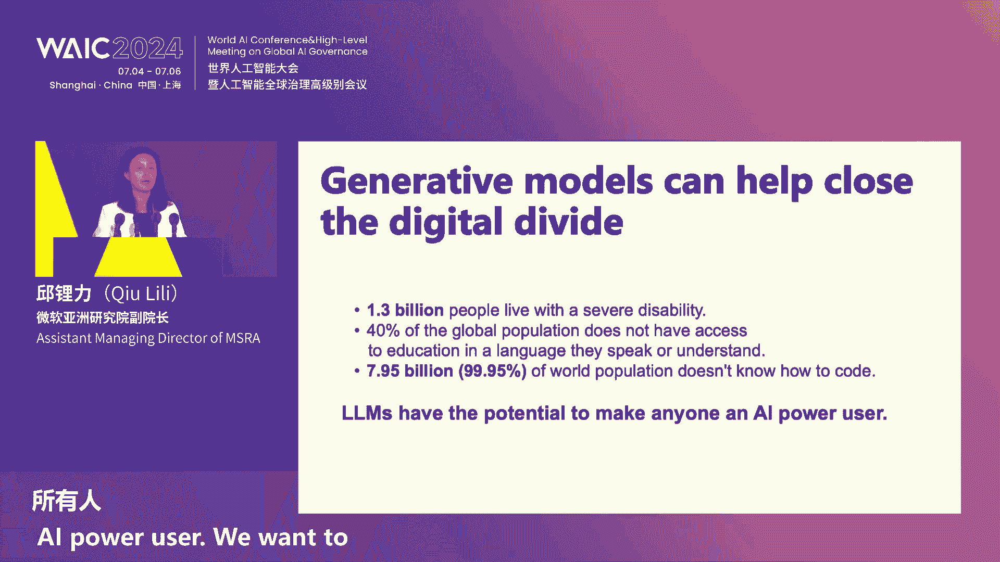

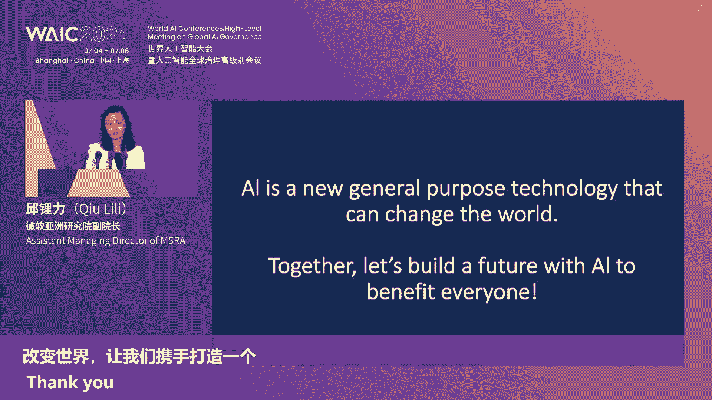

## 人工智能促进可持续发展的实践案例 📊

联合国各机构正在通过具体项目，将人工智能的潜力转化为实际影响力。

以下是正在开展的部分合作项目：


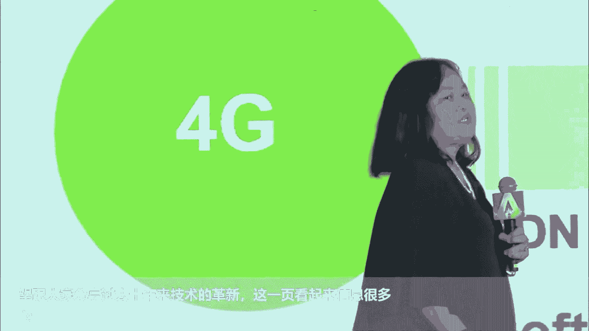

*   **人工智能促进健康**：与国际电联、世界卫生组织合作，聚焦于利用人工智能提升远程医疗和诊断的质量与可信度。
*   **自然灾害管理**：与联合国世界气象组织等机构合作，结合人工智能与气候专业知识，为弱势社区开发可持续的灾害预警和应对方案。
*   **数字农业**：与粮农组织等合作，利用人工智能创建动态程序，优化农业生产和资源管理。

**总结**：这些案例表明，通过跨机构、跨领域的协作，人工智能能够为解决健康、气候、农业等复杂挑战提供创新工具。


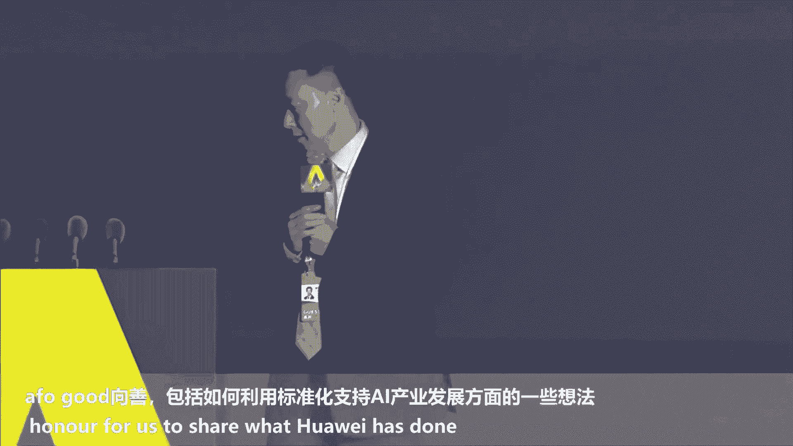

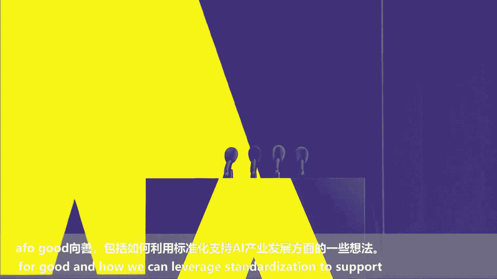

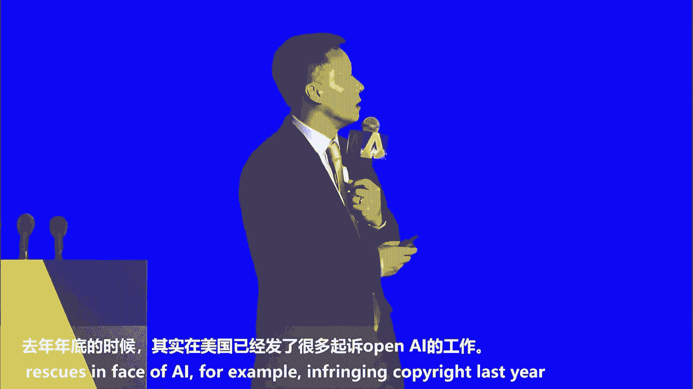

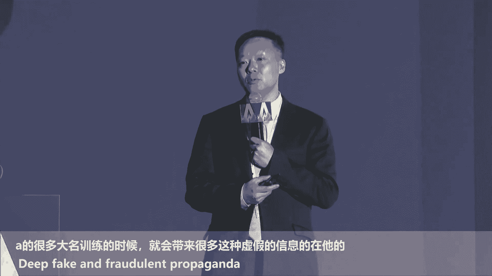

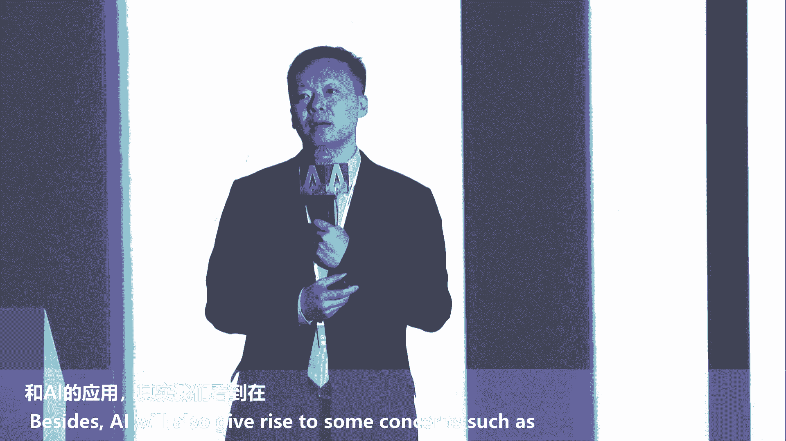

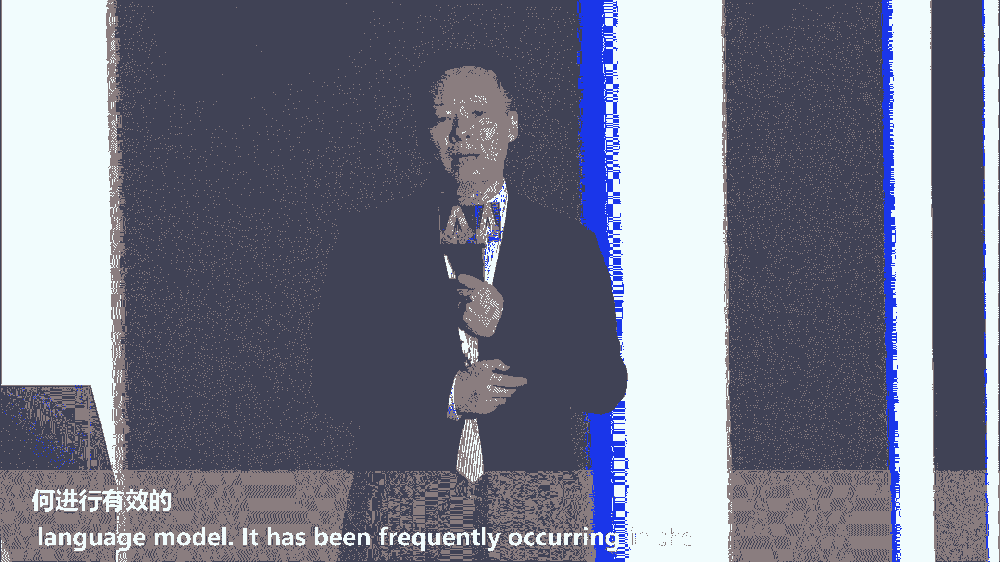

---

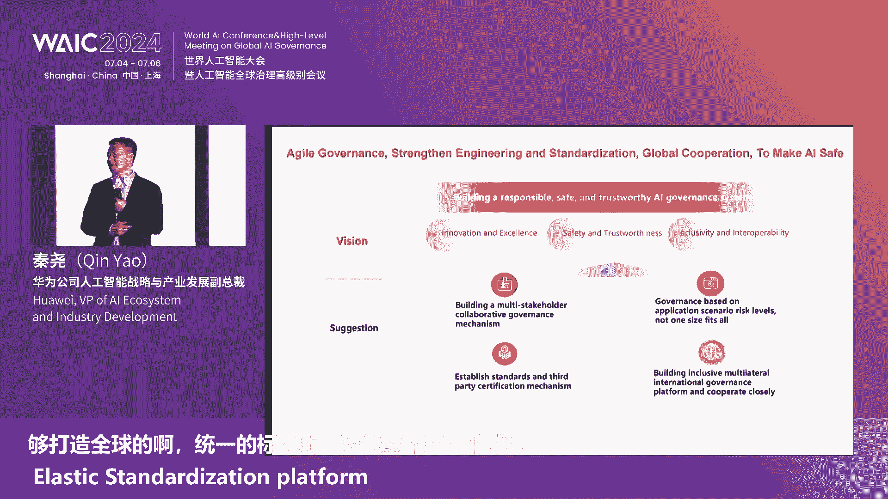

## 人工智能治理与国际合作 🏛️

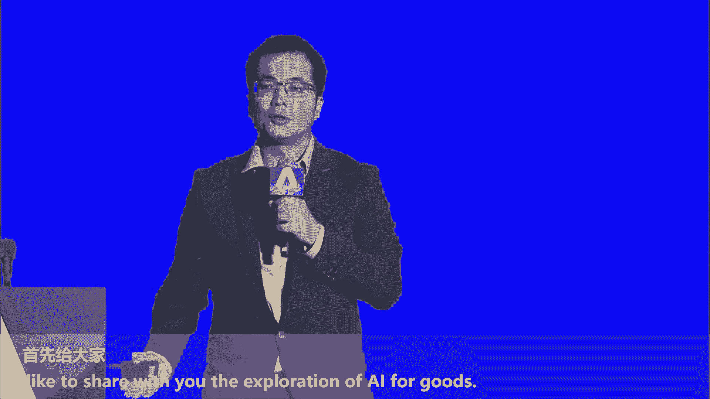

上一节我们看到了人工智能的应用实践，本节我们来看看如何通过治理与国际合作来引导其健康发展。

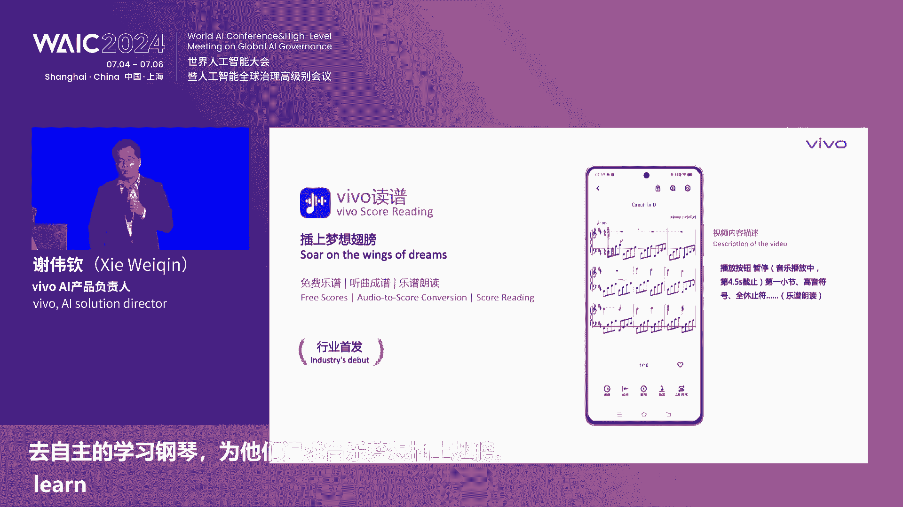

代表们普遍认为，联合国系统在制定标准、提供政策指导、搭建中立对话平台方面具有独特优势。当前的重点是采取平衡的方法，既要抓住人工智能带来的机遇，也要管理其风险。

关键行动方向包括：
1.  **弥合人工智能鸿沟**：通过能力建设、技能培训和在发展中国家建立卓越中心（如在上海新建的全球卓越中心），帮助其追赶人工智能发展浪潮。
2.  **推动标准与评估**：发展可测量、可测试的评估方法，并通过标准化工作为全球人工智能治理提供统一的技术基础。
3.  **强化实施与问责**：将已达成的伦理原则转化为实际行动，建立人工智能造成损害前的预防机制和损害发生后的补救机制，确保人类始终保有监督与控制权。

---

## 产业界实践：技术赋能与普惠包容 ⚙️

理论框架和治理原则需要落地。本节中，我们将看到来自领先科技企业的代表，分享他们如何将“人工智能向善”的理念转化为具体产品和服务。

**微软**展示了其在无线传感和医疗AI方面的研究，例如利用智能手机声波非接触式监测呼吸、开发脑电图基础模型辅助诊断神经疾病，旨在以保护隐私、节能的方式提升医疗可及性。


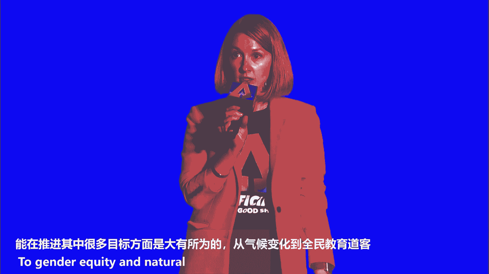


**阿里巴巴**介绍了其面向医疗和少数语言群体的AI应用。通过AI模型分析常规CT扫描辅助癌症早期诊断，并开发针对东南亚文化的专用大语言模型，以促进知识在欠发达地区的传播。

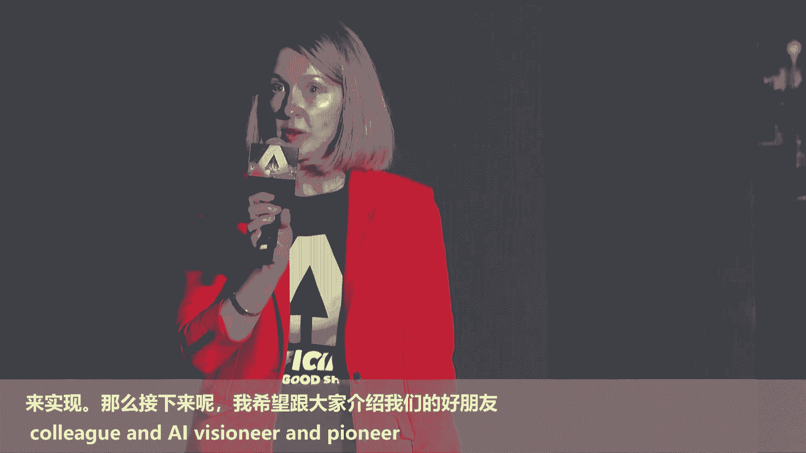

**中国移动**探讨了AI与6G的深度融合。强调未来的6G网络应从设计之初就具备“原生AI”能力，并指出高质量、标准化的网络数据开放对于训练AI、优化网络能效至关重要。


**华为**分享了其在AI治理方面的思考，提出需通过“发展认识问题，治理促进发展”。他们介绍了从训练数据、模型安全到内容合规、应用安全的端到端治理流程，并呼吁基于不同行业场景制定细化的AI治理标准。

**vivo**聚焦于利用AI提升残障人士的生活质量。其开发了实时语音转文字、手语识别、视觉辅助（如描述周围环境、识别物品）等功能，让听障和视障用户能更自由地沟通与探索世界。

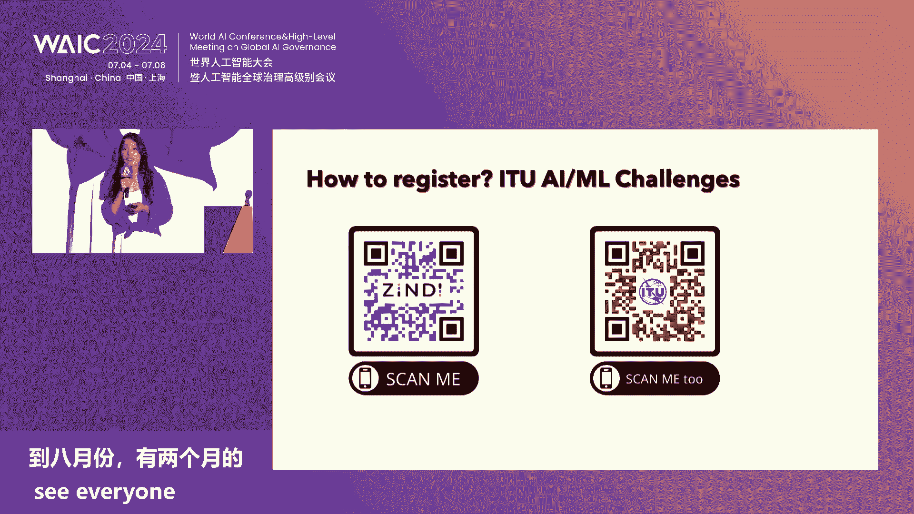

**核心概念示例（AI辅助诊断）**：
```python
# 伪代码示例：一个简化的AI医疗影像分析流程
def ai_medical_diagnosis(ct_scan_image):
    # 1. 图像预处理
    processed_image = preprocess_image(ct_scan_image)
    # 2. 使用训练好的AI模型进行分析
    prediction = trained_ai_model.predict(processed_image)
    # 3. 输出诊断建议（例如，标识可疑病变区域）
    diagnosis_report = generate_report(prediction)
    return diagnosis_report
# 该模型可以帮助放射科医生提高诊断效率和准确性。
```

---

## “AI for Good”影响倡议与全球挑战 🚀

国际电联正式发起了“AI for Good影响倡议”，旨在将对话转化为规模化行动。该倡议包括区域规划、扩展挑战赛、政策研究、标准制定和能力建设等内容，并宣布成立全球人工智能指导委员会，汇聚各界领袖共同塑造人工智能的治理方向。

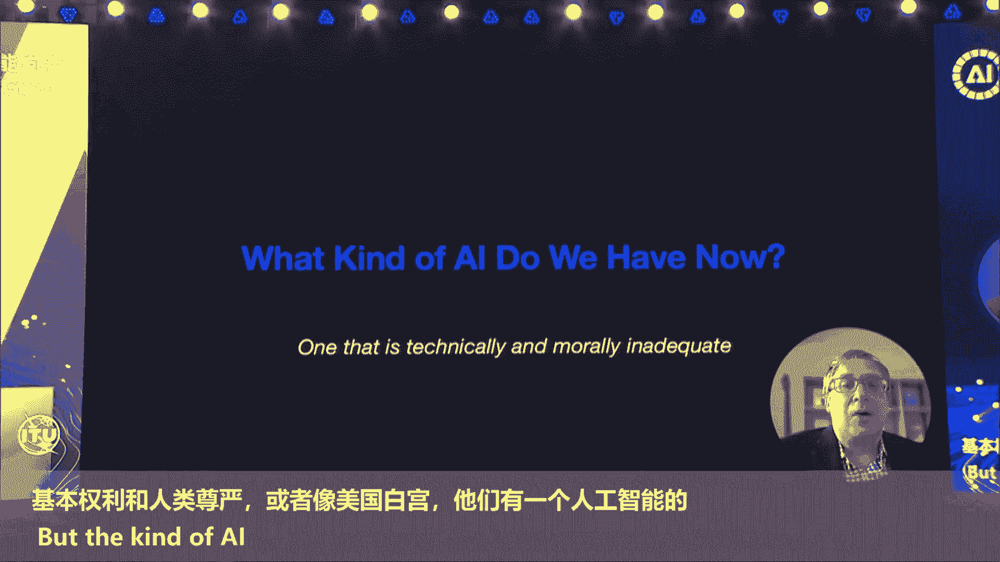

同时，论坛宣布了与国际电联合作的“机器学习挑战赛”，聚焦于利用AI降低移动网络能耗。参赛者需要利用真实网络数据，解决“5G网络流量预测”和“基站可再生能源智能调度”等问题，优胜方案将获得奖励并有机会在全球会议上展示。

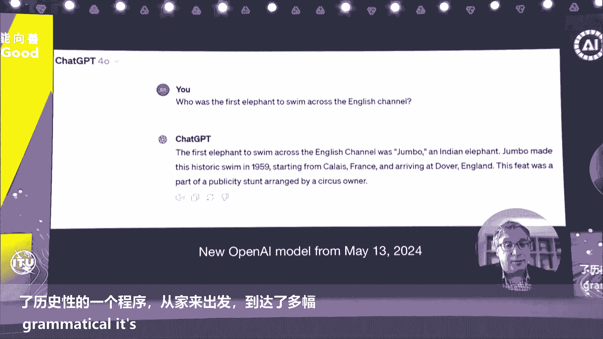

---

## 总结与展望 🔮

在本课程中，我们一起学习了“人工智能向善”全球论坛的核心内容。我们从联合国机构的战略视角，到产业界的具体实践，全面了解了人工智能在推动可持续发展目标方面的巨大潜力与当前挑战。

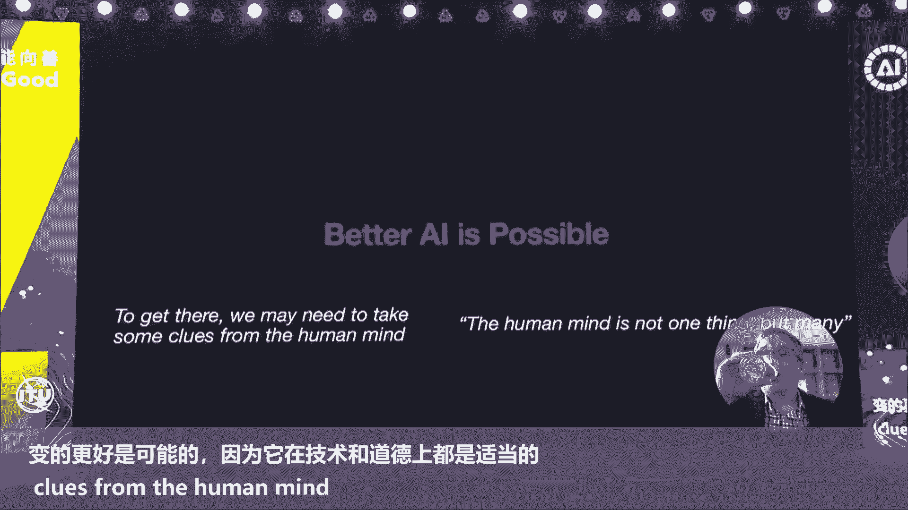

**关键共识总结如下**：
1.  **以人为本**：人工智能的发展必须坚持以人为中心，确保技术服务于人类福祉，扩大机会，保护基本权利。
2.  **治理与创新并重**：需要建立全球协同的治理框架和标准，以负责任的方式引导创新，在发展中迭代治理能力。
3.  **弥合鸿沟**：国际社会需共同努力，通过能力建设、技术转移和基础设施支持，缩小发达国家与发展中国家之间的“人工智能鸿沟”，确保技术红利普惠共享。
4.  **跨界协作**：应对气候变化、健康危机等全球性挑战，需要政府、企业、学术界和民间社会的深度合作。“AI for Good”平台正是这种协作精神的体现。

人工智能正在深刻改变世界。通过本次论坛的讨论我们认识到，唯有坚持合作、伦理与包容，才能确保这场技术革命引领我们走向一个更加公平、可持续和繁荣的未来。