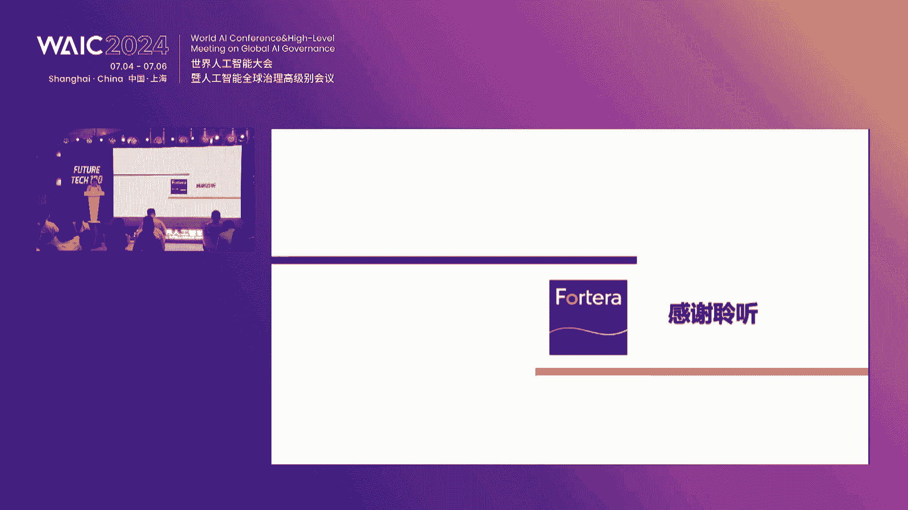
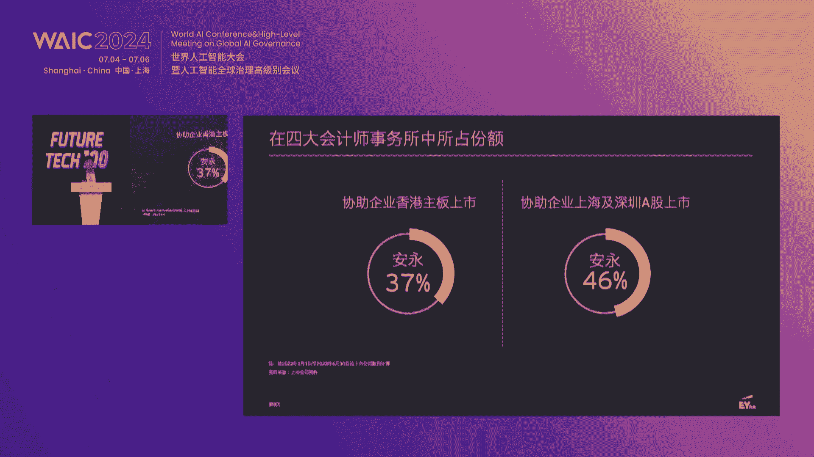
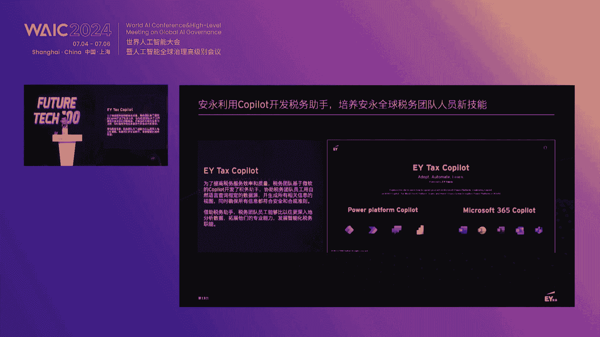
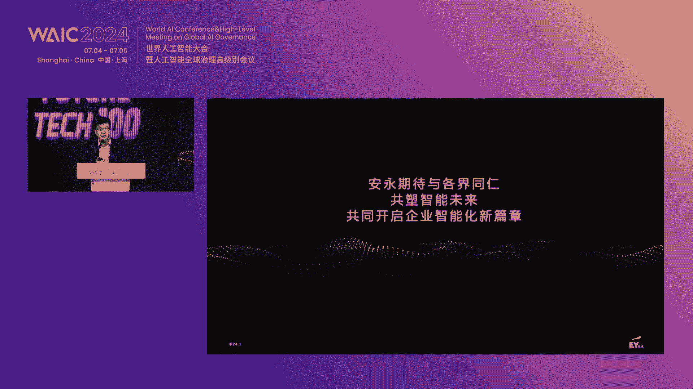
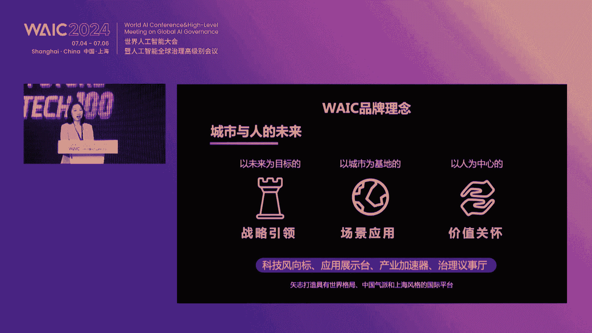
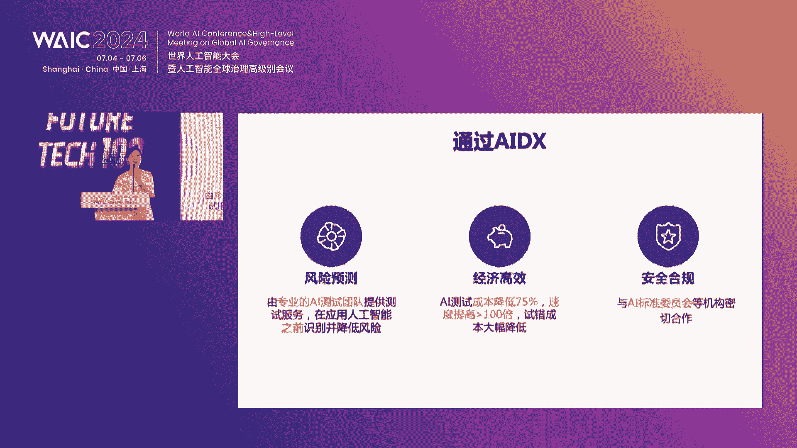
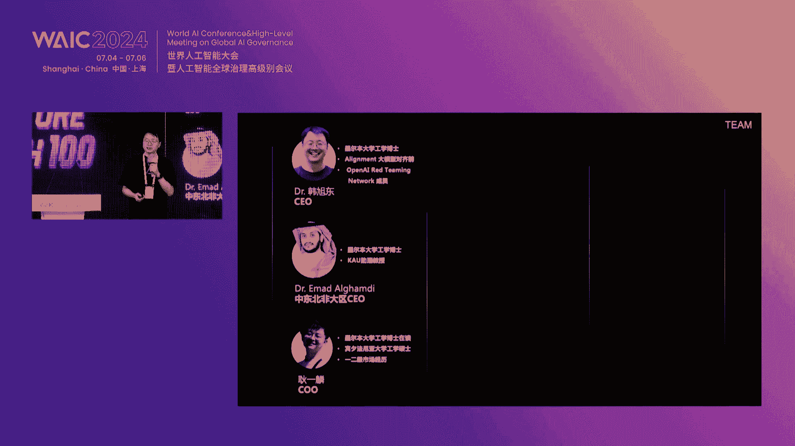
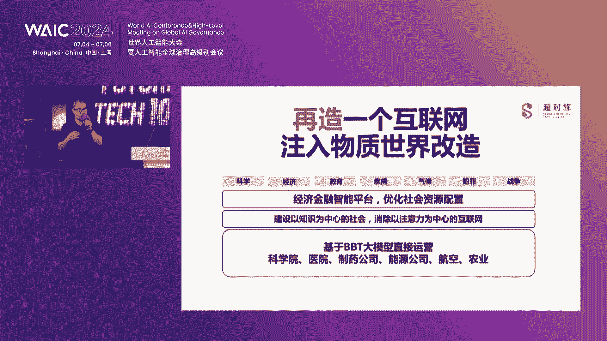

# 6：2024世界人工智能大会未来之星创新项目路演全记录 📝

在本课程中，我们将学习2024世界人工智能大会“未来之星”创新项目路演开幕式的完整内容，包括领导致辞、嘉宾主题分享以及四家前沿科技公司的项目路演。我们将深入了解人工智能产业的政策导向、投资趋势、技术融合以及大模型安全、测试、科学应用等核心议题。

---

## 开幕式致辞与领导讲话 🎤

尊敬的各位领导、各位来宾、女士们、先生们，大家下午好。欢迎大家来到2024世界人工智能大会“未来之星”创新项目路演开幕式的现场。

AI产业的发展不仅需要领军企业的带头示范，同时也需要创新企业和后起之秀携手共建生态，促进技术创新，为整个产业圈注入全新的活力。WAIC推出“创投生态合作伙伴计划”，并于2024世界人工智能大会特别打造“未来之星”创新项目路演，为创新企业提供具有前瞻性和发展潜力的舞台，助力未来产业的新一代行业大师和链主企业的诞生。

### 嘉宾介绍

以下是出席今天会议的各位领导及嘉宾：

*   上海市人才工作局规划研究处创业指导处李凯副处长
*   东浩蓝生金融集团总裁，上海东浩蓝生投资管理有限公司董事长陈辉峰先生
*   上海国有资本投资有限公司红腾资本总经理费菲先生
*   中移互联网有限公司云通信事业部副总经理黄敏华女士
*   安永大中华区数据智能咨询服务合伙人陈建光先生
*   东浩蓝生会展集团股份有限公司副总裁裘浩明女士

再次感谢各位嘉宾的到来。同时，主办方还邀请了科创板日报、头部科技等媒体朋友共同关注本次活动，并开通了线上多平台直播。

### 李凯副处长致辞

面对全球新一轮的科技革命和产业变革，上海正以前瞻视野与坚定决心，积极拥抱创新，加速推进新型工业化，着力培育人工智能这一新质生产力，构建开放包容、充满活力的创新创业生态系统。



近年来，上海正在全力打造“海聚英才”人才工作品牌，已基本形成了大赛、峰会、基地和路演大厅等系列活动和载体。其中，“海聚英才”全球创新创业大赛作为面向全球招才引智和招商引资的国际性赛会品牌，旨在促进创新链、产业链、资金链、人才链深度融合。

“海聚英才”全球创新创业大赛与世界人工智能大会这两个盛会都代表着时代的前沿。两者的结合无疑会进一步促进科技创新的合作交流，加速人工智能技术在各行业的应用推广。

我们深知人才是创新的根基，是推动产业蓬勃发展的关键力量。为此，上海积极搭建各类平台，促进产学研的深度融合，着力构筑人工智能产业高地。

### 陈辉峰董事长致辞

世界人工智能大会作为推动全球创新和产业变革的重要展会平台，更深层次地展现了各方在推动人工智能健康、安全、有序发展过程中的责任担当和价值理念。

投资人作为人工智能创新生态中最重要的组成部分之一，所怀有的价值取向将很大程度上影响这个生态圈的内生增长。如果将本届大会的主题延伸到投资的维度，我们的理解是“资本向善、责任创投”。

### 费菲总经理主题分享：投资视角下AI大模型生态发展



上一节我们聆听了领导们对产业生态的宏观展望，本节中我们来看看投资机构如何从资本角度解读AI大模型的发展。

党中央高度重视数字经济的发展。从2023年到2028年，全球大模型市场预计将实现5倍扩张。而中国凭借庞大的单一市场优势以及数字化转型的深厚基础，预计未来大模型市场将有8倍的增长，为本土大模型创业生态企业注入了强劲动力。



从产业链深度剖析来看，美国作为先行者，其大模型及人工智能产业趋于成熟。尽管我国在基础大模型领域已涌现出具备一定国际竞争力的企业，但在算力、模型构建、中间件以及应用等各环节仍面临与全球顶尖企业的显著差距。

面临挑战，我国企业展现出了非凡的决心和韧性，在多个领域已经取得了一定突破。上海作为中国人工智能与大模型产业的璀璨明珠，以其独特的创新生态和政策支持，成为企业成长的沃土。

上海国投福腾资本一直将人工智能产业作为重点方向，助推产业链核心环节的国产化。团队结合大模型产业的六大领域，正在建立起福腾的AI基金矩阵。

今后一段时间内，人工智能一定是引领新一轮科技革命与产业变革的战略性技术，具有溢出带动性很强的头雁效应。大模型领域的革命性创新也一定会出现，这就要求国资机构的使命不仅是战略投资者，更是资源撬动者、赛道引领者和生态构建者。

### 黄敏华副总经理主题分享：通话，让AI无处不在；AI让通话无所不能

资本为技术发展提供了燃料，而技术的落地则离不开与具体场景的融合。接下来，我们看看通信巨头如何将AI融入传统业务。



中移互联网有限公司是中国移动旗下专注于“通信+互联网”的专业公司。我们的5G-A AI智能通信解决方案，在本届世界人工智能大会中荣获了卓越人工智能引领奖。



我们的方案致力于AI与通信的融合，让每个用户都能实现大模型的自由。通过5G消息与大模型的融合，可以把传统的文旅短信变成用户AI服务的新入口。用户只要通过短信消息，就可以跟大模型去做对话和交互，获取到自己想要的信息。

同时，我们的“新通话”提供了通话中的同声传译服务。在正常通话里面，司机说的普通话会实时翻译给外国朋友听，双方都不需要下载APP或特殊终端，只要像平常一样打电话就可以享受到无缝的翻译服务。

以上两个案例展现了AI跟通信融合，如何让用户非常简单能够用上AI以及用好AI。其技术理念源自于我们对于网络和AI的一个共生的理念和技术。我们把通信网络做了开放，把音视频数据与互联网对接，同时也把算力网络和AI能力做了云边端的算力调度，能够使得在通信的过程中实时调用各种AI能力。

除了翻译功能与大模型结合，通话可以有更多的想象空间。例如，在打电话过程中可以发送语音表情、设置数字人形象；在工作场合可以用上AI来电速记；我们还推出了“视障”服务，如大字幕；以及针对诈骗场景的“守护宝”应用。

我们的新通话能力也支持对外开放，推出了新通话SDK。APP只要集成SDK之后，就可以随时调用我们新通话的一些能力。目前，中国移动拥有全球最大规模的网络和用户，我们基于庞大的通话入口构建新通话应用商店，欢迎开发者、能力方和渠道商来跟我们一起合作，共创AI生态，共享通信价值。

### 陈建光合伙人主题分享：AI驱动，企业服务智能化

通信技术展示了AI在C端应用的潜力，而在B端，AI同样正在深刻改变企业服务的模式。下面，让我们进入企业咨询领域。

安永是全球领先的审计、咨询、税务、战略与交易的专业服务机构之一。在大中华区，我们服务超过55年，服务过的客户包括众多全球五百强中国企业。

安永在内部一直积极推动和实践人工智能方面的应用。在众多领域，包括审计、产品研发、财务、HR、ESG咨询等，都大量采用了AI技术，用于帮助增长营收、提升效率或缓释风险。

去年随着大模型的职业推出，安永非常重视，投资了14亿美金建设了EY.ai平台。基于这个平台，我们把众多内部数据做了积累和打通，同时也给内部员工提供了大量不同的应用。

EY.aiQ是我们内部的大语言模型应用。我们投资了大量精力，结合过去在专业领域的积累，打造了EY.aiQ大模型来服务内部员工，大大提升了效率。例如，在审计领域，我们引入了生成式AI技术，能够非常快捷地从各种文档库中生成相关分析线索，发现异常。

我们还开发了税务助手、薪资助手、收款助手、合同助手等一系列AI应用。例如，合同助手可以自动识别、比对合同条款，判定合同风险，并给出相关提示。

在国内，我们也基于国内的大模型，开发了`mats.ai`（或称`Y.ai`）大模型平台。这款平台结合安永在财务、税务、审计、合同等垂直领域积累的大量数据，以大模型为基础，结合自研系统和企业数据分析引擎，帮助客户快速应用相关模型。

整个安永可以帮助不同的企业提供全面的人工智能服务，包括人工智能规划、人工智能治理服务，以及与初创企业联合，将产品部署到客户侧，提供相应的开发实施和落地服务。

### 裘浩明副总裁介绍：世界人工智能大会未来生态合作新途径

最后，让我们从大会主办方的视角，了解世界人工智能大会如何构建持续的创新生态。

今年是世界人工智能大会创办第七年，我们在H3馆首创了“全域链接馆”，做了一些新的尝试。整个大会遵循“战略引领、场景应用和以人为中心的价值关怀”的品牌理念，致力于打造有世界格局、中国气派和上海风格的世界级AI行业盛会。

我们的`future tech`板块精选了112个优质项目，这些项目来自于上海的AI基金、上海国投、奇迹创坛、亚马逊加速器等。在三天中，我们有30多场项目路演，来自80多家投资公司的140多位投资人现场评项目。同时，在舞台中心还有应用场景发布和采购商对接，有几十场需求配对会，现场有超百亿的采购资金。

未来，世界人工智能大会将打造365天AI全域链接，做到与人才生态、学术生态、产业生态、创投生态、国际生态融为一体，共创、共建、共荣、共赢、共享、共治。我们将举办“预见论坛”、产业对接走访、线上AI基点对话、青少年未来领航营等活动，并拓展国际生态合作。

东浩蓝生的人工智能项目致力于打造全球领先的人工智能生态服务商。我们借助WAIC平台，用好WIC平台，把整个行业带动起来，助力于整个产业的发展。

---

## 创新项目路演环节 🚀

开幕式为我们描绘了广阔的产业图景，而真正的创新活力来自于一线的创业公司。本节中，我们将聚焦四家各具特色的科技初创企业，看看他们如何用技术解决具体问题。

以下是本场路演的四个项目：

### 1. 北京阿莱蒙科技有限公司：大模型安全落地与人机价值对齐



我们做的是大模型的安全落地以及人机价值对齐。“对齐”指的是人工智能和人类的价值观以及意图对齐。可以说，目前所有人工智能的问题都是对齐问题。

我们认为大模型成功落地的先决条件是安全。在中国的独特环境中，模型的安全性是市场进入的首要门槛。在未来三年内，AI公司的安全成本将提升至所有AI研发投入的50%。

我们拥有行业领先创新的大模型对齐技术，包括新发布的“大模型`Aligner`”对齐新范式。我们提供全周期的安全解决方案，包括模型部署前的安全漏洞检测、训练中的RLHF到部署后的外置修正器，可以成功降低大模型的调优成本，显著提升性能与安全性。

我们的技术已实现应用。去年我们首个复现GPT-4 RLHF效果，并帮助百川智能等公司进行大模型SFT与对齐，助力其获得网信办牌照。我们目前是百川、360、智谱、阿里等公司的官方ISV，帮助其落地大模型。

我们拥有多家头部客户，包括中国电信、移动、工行、万华等，在医疗和法律领域有较强输出。团队核心成员来自北京大学，在产业界和安全监管界都有较强影响力。

**核心概念示例（对齐技术）**：
```python
# 简化的安全修正器概念代码
class SafetyAligner:
    def __init__(self, base_llm):
        self.llm = base_llm
        self.safety_filter = load_safety_rules()

    def generate(self, prompt):
        raw_output = self.llm.generate(prompt)
        aligned_output = self.apply_alignment(raw_output, prompt)
        return aligned_output

    def apply_alignment(self, text, prompt):
        if self.safety_filter.is_unsafe(text, prompt):
            # 使用对齐模型进行修正或重写
            text = self.correction_model.rewrite(text, prompt)
        return text
```

### 2. Aex Tech：一站式人工智能检测平台



我们搭建一个一站式人工智能检测平台，为人工智能保驾护航。AI在带来便利的同时也会犯错，存在风险。例如，自动驾驶模型可能将卡车误认为天空导致事故；AI生成的虚假信息也被用于诈骗。

人工智能的风险与问题主要包括：鲁棒性与安全问题、数据和模型的隐私问题、公平和道德性问题，以及模型不可解释的问题。

人工智能是一个发展非常快的新行业，不像传统软件或电子设备有成熟的检测认证体系。现有AI模型在进入市场时，缺乏统一和官方的第三方认证检测，这是很危险的事情。各国政府都已将AI管控和治理作为国家策略。

我们提供一站式解决方案，用户只需将数据和模型上传，通过简单操作即可生成测试报告和认证证书。我们的服务包括：传统AI模型的风险评估（鲁棒性、安全性、隐私性、公平性、可解释性）、大模型安全与质量评估、生成式内容检测（AIGC识别）、数据安全扫描以及企业咨询与培训。

我们的平台能帮助客户降低75%以上的测试成本，提高100倍以上的测试速度，大幅降低试错成本。团队源自新加坡高校科研团队，在AI检测与安全方向有7-8年技术积累，发表30多篇顶会论文，成员多参与过AI标准制定。

### 3. 立百智恒科技：自动化AI测试沙盒平台

我们提供自动化的AI测试沙盒平台。随着AI智能体（如Apple Intelligence）的发展，其行动安全成为新的风险点。例如，智能体可能被恶意指令诱导，执行转发邮件等危险操作。

为了解决智能体及具身智能的安全问题，我们构建了自动化的AI测试沙盒平台。方案源于我们过去一年多在大模型开发中遇到的真实需求，拆解成任务、评估器和测试环境三个模块。

我们分享了过去一年在安全测试中遇到的问题与解决方案：
1.  **测试集本土化**：针对中文测试集缺乏问题，我们提出了CMMLU，成为中文大模型最权威评估标准之一。
2.  **降低评估成本**：我们将大模型推理加速技术（如vLLM）应用于测评，将评估成本降低了20倍。
3.  **生成式安全测评**：我们提出了“Do Not Answer”生成式任务，对大模型安全进行三级拆解测评。该工作入选了斯坦福AI指数报告。
4.  **降低评估成本（再次）**：针对生成式结果评估成本高的问题，我们使用专有小模型替代GPT作为评估器，实现了200倍的成本降低，并将项目开源。
5.  **智能体（Agent）评估**：我们构建了基于Agent的事实性检测评估器，并开源了该项目。针对复杂Agent流程，我们进行拆解评估，准确率提高20%，成本降低80%。
6.  **动态测试构建**：针对静态测试集易被泄露用于预训练的问题，我们使用Agent动态构建测试。

我们将这些能力产品化，提供了统一的评估器API，可评估客观题、主观题、实验题，评估准确性大于GPT评估器，并能节约超过50%的成本和30%的时间。

我们团队从MBI孵化，兼具创业者、AI安全研究者及大模型开发者三重身份。我们立足于中东北非地区，提供标准化产品走向全球市场。

### 4. 超越对称上海技术有限公司：前沿科学大模型

我们研发的科学大模型“前沿大模型”，是一个跨尺度、跨结构、跨学科，用于理解和研究物质世界的基座大模型。

我们认为，AGI（通用人工智能）实现的最高标志，是人工智能能够帮助人类解答理论物理最前沿的问题。因此，我们的`Big Bang Transformer`模型围绕探索物质世界最深层次问题（如宇宙起源、标准模型、量子引力）而开发。

我们开发了一个能同时学习理论和实验的大模型。我们采集了全球物理、天文、航天等领域约50个大型科学装置和项目的实验数据，围绕此数据集训练了基座科学模型。

我们的模型已在多个场景应用：
1.  **粒子物理**：与中科院高能所合作，用大模型对撞机实验产生的粒子数据进行识别，识别准确率比人类最佳算法提高约10%。
2.  **材料发现**：用大模型替代传统的密度泛函理论计算，预测材料性能，可将新材料发现周期从5-10年缩短至5个月。我们正与上海硅酸盐研究所等合作寻找高性能材料。
3.  **流体力学与水治理**：构建了全方位的流体力学训练基座，用于预测湖泊治理中的关键指标（如透明度、叶绿素浓度），并与上市公司德林海合作。
4.  **生物统一建模**：将RNA、DNA、蛋白质的一维序列和三维结构进行统一表征，让模型学习，用于制药、蛋白质设计等任务。

构建统一科学大模型的优势在于，物质世界本身由不同尺度和结构构成。我们的技术旨在将所有尺度和结构的信息统一映射到同一向量空间进行学习。我们认为此次AI革命是“物质世界的革命”，而非仅仅信息革命。只有能解决物质世界问题的模型才具有真正价值。



---

## 总结与展望 🌟

在本节课中，我们一起学习了2024世界人工智能大会“未来之星”路演的完整内容。

我们从大会开幕式看到了**政策制定者**对构建AI创新生态的决心，**投资机构**对深耕产业链、做“耐心资本”和“积极资本”的承诺，以及**产业巨头**在推动AI与通信、企业服务融合方面的实践。

在路演环节，我们深入了解了四家前沿初创企业的技术：
1.  **阿莱蒙科技**聚焦于大模型安全落地的“最后一公里”——**价值对齐**，确保AI符合人类意图与价值观。
2.  **Aex Tech**致力于建立AI的“质检中心”，提供**一站式检测平台**，为AI模型的安全与质量保驾护航。
3.  **立百智恒**专注于用**AI测试AI**，通过自动化沙盒平台解决智能体（Agent）等复杂AI系统的评估难题。
4.  **超越对称**则雄心勃勃地构建**统一科学大模型**，旨在让AI理解并探索物质世界的根本规律，推动基础科学突破。

这些分享共同揭示了一个趋势：AI的发展正从追求规模参数，走向与**安全、治理、测试、垂直应用**和**基础科学**深度融合的新阶段。资本、政策、技术与场景正在上海这个世界人工智能大会的平台上紧密链接，共同塑造一个可信、可靠且富有创造力的智能未来。