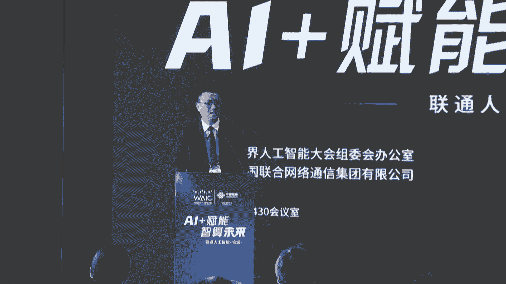
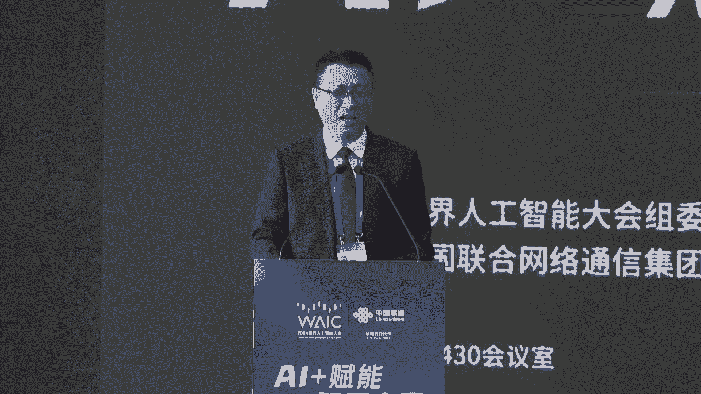
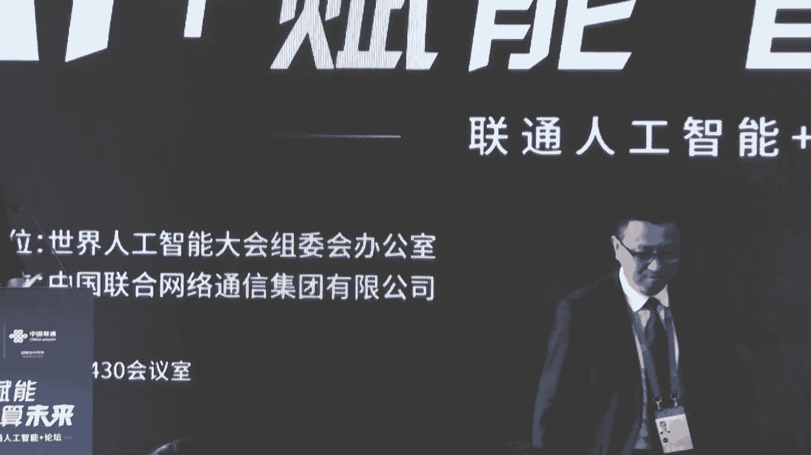
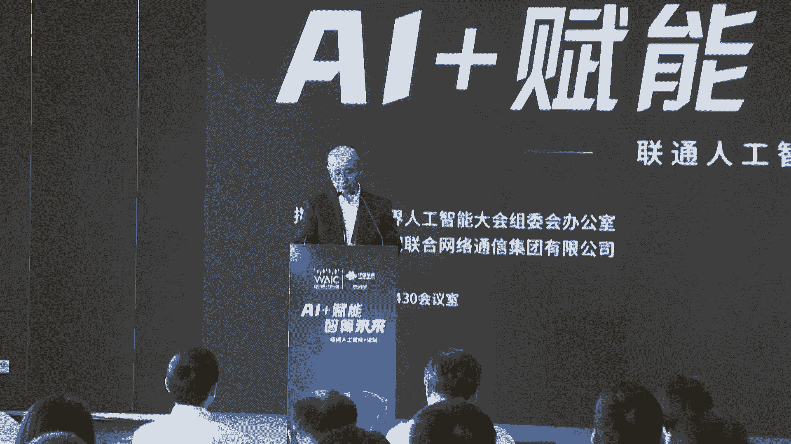
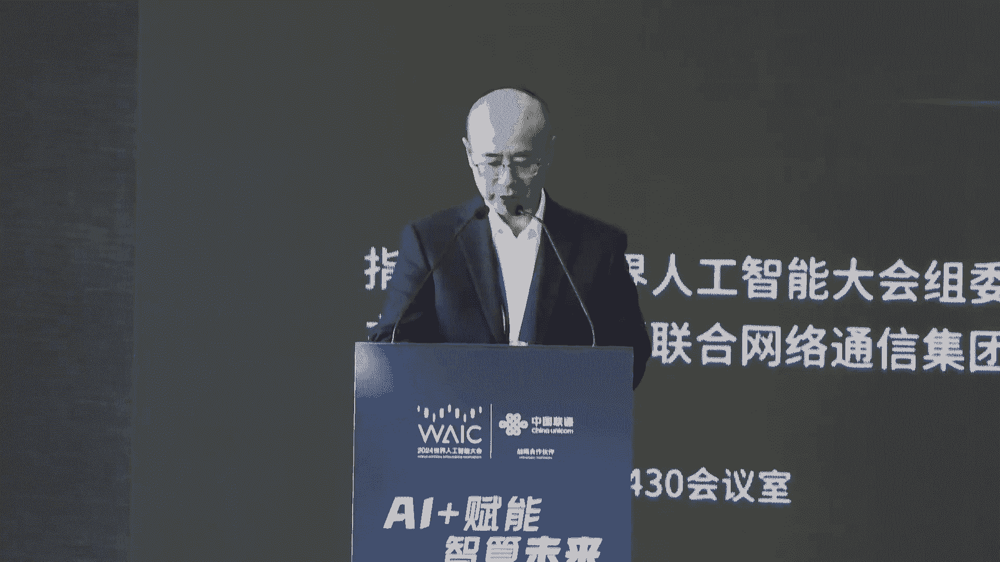
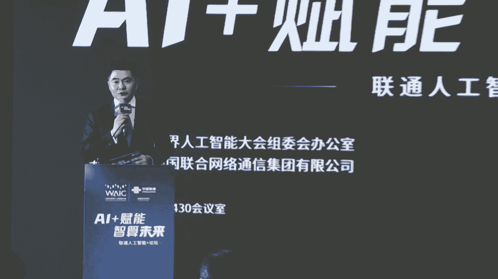
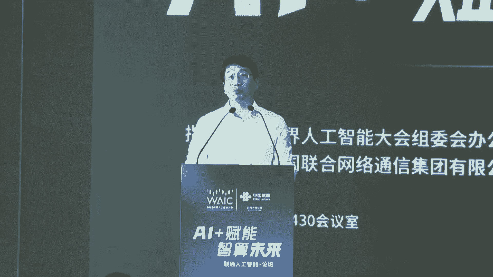
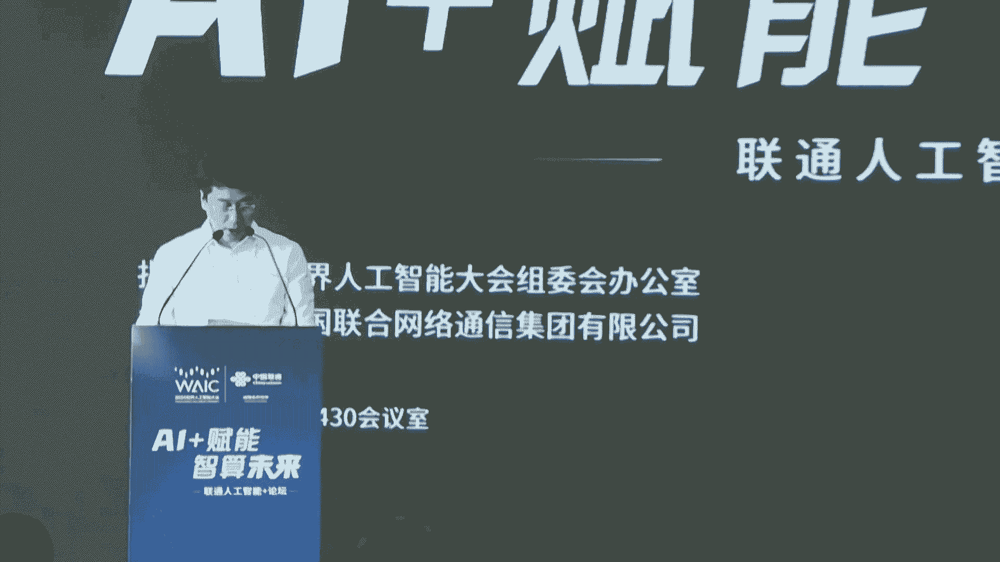

# 7：AI+赋能 智算未来 - 联通人工智能论坛解读教程

## 概述
在本节课中，我们将学习并梳理“AI+赋能 智算未来”联通人工智能论坛的核心内容。我们将重点关注中国联通在人工智能基础设施、大模型应用及产业赋能方面的战略布局与实践案例，并理解其如何助力上海构建人工智能高地。课程内容将严格遵循原文含义，以清晰、直白的方式呈现。

---

## 第一节：论坛背景与战略意义 🎯

本次论坛于2024年世界人工智能大会期间举办，主题为“AI+赋能 智算未来”。论坛强调，人工智能是引领新一轮科技革命和产业变革的战略性技术。加快发展新一代人工智能，是赢得全球科技竞争主动权的重要战略抓手。

中国政府高度重视人工智能发展，2024年政府工作报告首次写入“人工智能+”。上海作为改革开放前沿，正积极探索并推动人工智能技术的发展和应用，培育新质生产力。中国联通作为数字信息运营服务的国家队，积极落实“人工智能+”行动，旨在通过本次论坛推动AI基础设施、大模型研发与行业应用发展，助力上海人工智能产业生态集聚。

---

## 第二节：中国联通上海临港智算中心发布 🏗️

上一节我们介绍了论坛的战略背景，本节中我们来看看中国联通在算力基础设施方面的核心布局——上海临港智算中心。

国家信息中心指南指出，智算中心投资对AI核心产业及相关产业增长带动效应显著。中国联通提前布局，建设了上海临港智算中心。

该中心是高规格的国家级跨境数据流通枢纽节点，具备以下六大“极致”特性：

以下是其核心创新特性：
*   **极致产出**：每亩机架数高达173架，远超行业平均水平。
*   **极致可靠**：供电架构采用 **2N**，制冷架构采用 **N+1**，满足高等级标准。
*   **极致灵活**：可适配 **4kW** 到 **60kW** 的不同功率密度应用场景。
*   **极致安全**：具备六重安防体系和三路通信线路接入。
*   **极致低碳**：采用光伏、储能、液冷等技术，整体 **PUE < 1.25**。
*   **极致运营**：利用智慧运营平台实现智能化高效运营。

该中心将全面赋能千行百业数字化转型，助力上海构筑具有国际影响力的人工智能高地。

---

## 第三节：领导致辞与政策导向 📜

在智算中心发布后，多位领导发表了致辞，进一步明确了政策方向和对企业的期望。

上海市经信委副主任张洪涛指出，人工智能正深入千行百业。上海已备案34个大模型，未来将继续加大投入，突破核心技术，提升算力支撑，并激发应用活力，赋能产业转型升级。他肯定了中国联通作为重要节点在算力底座领域的贡献。

上海市通信管理局副局长戴斌强调，算力是支撑AI发展的核心资源。上海在用算力规模和运力指数全国第一，智能算力占比超35%。他对上海联通提出三点希望：
1.  加强算力基础设施建设。
2.  开展国产计算技术研发，提高生产要素自主可控性。
3.  协力共筑算力产业新生态。

中国联通上海市分公司副总经理刘彤表示，中国联通将持续加大算力基础设施布局，扩大临港智算中心规模，并推进青浦算力枢纽节点建设。同时，联通的“远景”大模型体系将在本次论坛亮相。

---

## 第四节：联通智算能力体系详解 ⚙️

基于领导的战略指引，中国联通详细阐述了其面向人工智能时代的能力体系。上海联通网络部总经理叶强介绍了公司在智算基础设施（资源层）的三大核心能力：AIDC、AI算力和AInet（算力网络）。

**1. 适配智算特性的AIDC**
上海联通形成了“东西两翼”的AIDC资源布局。重点介绍了位于临港的“国际数据港”：
*   **区位优势**：毗邻国际海缆登陆站，具备国际业务落地“零时延”优势。
*   **部署能力**：满足大规模智算集群部署的四大高要求——高密度、高用电容量、高组网要求、高安全可靠。整个园区最终可具备 **10万卡** 计算集群部署能力。

**2. 多元并进的AI算力**
上海联通坚持国产与主流算力并进原则：
*   **国产智算中心**：采用国产化算力+RoCE网络架构，全液冷配套，单集群可满足万亿参数模型训练。
*   **主流智算中心**：采用最先进的 **H800** 芯片与 **NDR 3.2T** 组网架构，未来将扩展至万卡规模。

**3. 以网强算的AInet**
网络是运营商之本，中国联通升级新一代算力网络：
*   **算内网络**：采用IB和RoCE架构，通过 **RDMA** 及算网一体调优技术，已实现集群算效整体提升 **20%** 以上。
*   **算间网络**：打造高速直达、弹性服务的智联网络，并研究 **ODUk+RDMA** 长距无损技术，打造“数据高铁”。
*   **路算网络**：构建城市内、长三角、全国 **1ms/5ms/20ms** 的算力时延圈，通过 **SRv6** 和切片技术保障用户体验。

为确保高效运营，中国联通启动了“AI星火燎原”工程，培养专家团队，打造端到端的专业化智算服务体系。

---

## 第五节：远景大模型与行业应用实践 🤖

拥有了强大的算力底座，人工智能的效能最终要通过模型和应用来体现。中国联通人工智能创新中心副主任丁鼎介绍了联通的“远景”大模型体系及行业落地思考。

联通观察到，当前AI发展面临从“亮眼”到“好用”的挑战，包括：场景数据有限、模型调优人才短缺、数据安全风险等。

因此，联通提出了面向政企的AI落地路线：
1.  **技术+需求双轮驱动**：不单纯追求超大规模参数，而是寻求算力、数据与模型版本的最佳性价比组合。
2.  **模型+工具的应用范式**：百亿级参数模型结合 **RAG**、智能体等工具，往往能取得更好效果。
3.  **专属定制服务**：将行业专家升级为具备大模型操作能力的专家。
4.  **可信的数据运营服务**：解决数据安全问题，培育本地化运营人才。

基于此，联通打造了 **1（一套基础模型）+1（一个大模型平台）+M（多种行业模型）** 的“远景”大模型体系。该体系已在政务、工业等领域展开实践：
*   **政务领域**：在成都、辽宁等地，应用于政策解读、12345热线工单自动填写与分拣、城市事件智能识别等。
*   **工业领域**：在南京港，通过“小模型初判+大模型精判”，将质检准确率提升5个百分点以上；在浙江服装企业，辅助产品设计。

丁鼎强调，未来将是“算力+算法+数据+场景”的共研共创模式。联通也正推动“远景大模型市场”建设，开放算力、模型平台和能力，共建产业生态。

---

## 第六节：产业合作与生态共建案例 🤝

人工智能的价值在于赋能千行百业。论坛邀请了几家代表性企业，分享了与联通合作的“AI+”实践案例。

**中共一大纪念馆：红色文化元宇宙**
副馆长阮竣介绍了与联通共建“数字一大”元宇宙项目的探索。项目通过数字化文物、打造VR体验空间、发行数字藏品等方式，构建红色遗址数字世界，让红色文化传播跨越时空，更具沉浸感。

**中国商飞：国产民机智能运维**
大飞机智能运维创新中心主任彭焕春分享了基于 **5G+AI** 的国产民机航线智能检查项目。项目旨在开发便携式智能检测设备，利用AI视觉算法辅助机务人员检查飞机外表面损伤，并通过5G网络实现远程专家协同，提升检查效率和飞机运行安全。

**罗氏诊断：医疗器械数字化服务**
转型与战略总监邢月春介绍了AI在体外诊断（IVD）领域的应用。罗氏诊断与联通合作，打造了智能客户服务平台，实现报修智能预警、AI自助答疑、坐席辅助等功能。通过数字化手段，提升了仪器可用性和客户服务体验，最终让病患受益。

**智慧足迹：经济大模型**
CEO张岩介绍了作为联通经济军团打造的“经济大模型”。该模型定位为经济研究人员的AI助手，具备智慧问数、知识问答、文献学习、智能报告生成等功能。它融合了宏观经济数据、产业链数据及联通人口大数据，为经济分析提供了新工具。模型采用 **RAG** 技术增强知识时效性，并利用 **AI Agent（智能体）** 架构处理复杂任务。

---

## 第七节：联合倡议与生态新征程 🌱

在论坛的最后，中国联通上海市分公司政企BG常务副总裁周京代表“算助申城”上海市算力产业联盟，发出了新征程联合倡议：

以下是三点核心倡议：
1.  **打造算力高地**：促进大模型迭代，推动“+AI”向“AI+”转变，赋能千行百业。
2.  **构建算力产业生态**：汇聚芯片、硬件、平台、模型等产业链上下游企业。
3.  **加强产学研合作**：推动算力资源开放共享，夯实算力底座。

随后，中国联通携手木西、随幻、摩尔线程、曙光、超聚变、华坤振宇、华为、阿里、燧原、无问芯穹、蓝马、智谱等众多产业链合作伙伴，共同启动了“生态共创新征程”仪式，标志着产业生态将进一步壮大，共同助力上海打造全球人工智能高地。

---

## 总结
本节课中，我们一起学习了“AI+赋能 智算未来”论坛的核心内容。我们从国家战略与上海定位出发，深入了解了中国联通以 **上海临港智算中心** 为核心的算力基础设施布局，及其 **“远景”大模型体系** 的产业赋能思路。通过政务、工业、医疗、文化、航空等领域的真实合作案例，我们看到了“AI+”如何切实落地并创造价值。最后，产业联盟的新征程倡议表明，构建开放、协同的生态是推动人工智能高质量发展的关键。中国联通正以“国家队”和“主力军”的身份，与合作伙伴携手，全力推进人工智能与实体经济的深度融合。