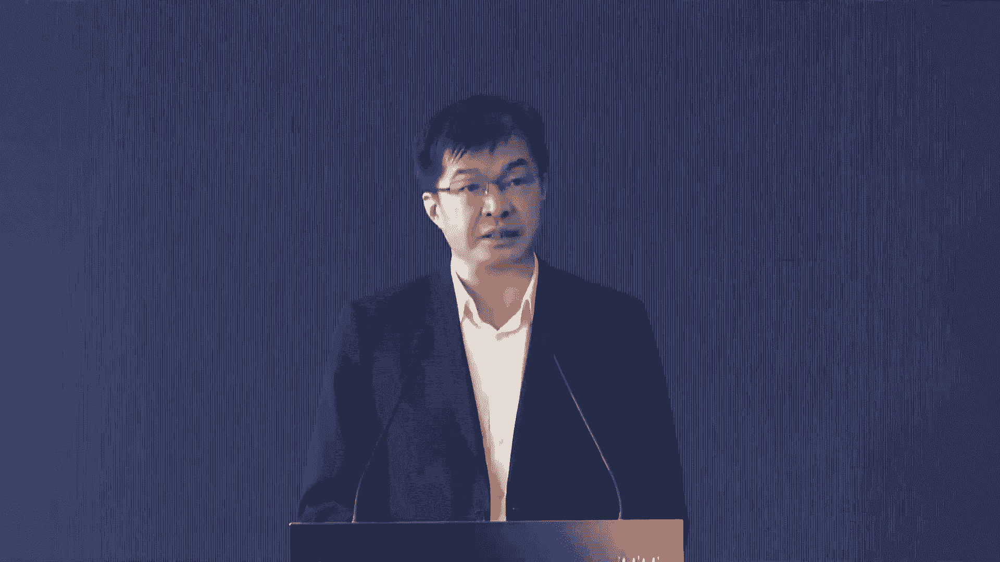
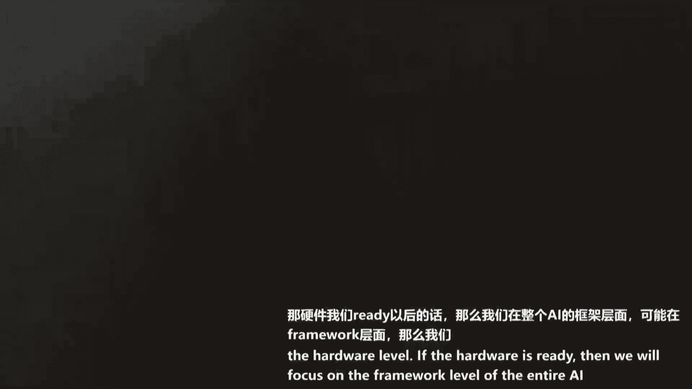

# 8：AI基础设施与算力生态构建教程 🚀



## 概述
在本节课中，我们将学习人工智能（AI）基础设施的重要性、当前面临的算力挑战，以及如何通过技术创新和生态协同来构建高效、开放、普惠的AI算力底座。课程内容基于“智启新章·算引未来”AI基础设施论坛的核心讨论，涵盖政策导向、技术实践、产业应用及生态构建等多个维度。

---

## 1. AI作为新质生产力与基础设施的关键性 🤖


近年来，AI技术作为新质生产力，正以其强大的创新能力深刻影响着各行各业。AI基础设施是否稳定、充沛且具有高性价比，对进一步提升AI生产力至关重要。

**核心公式**:
```
AI生产力 = f(算法, 数据, 算力)
```
其中，**算力**是算法与数据高效结合的基石。

---

## 2. 人才与政策：上海AI产业高地的建设 👥

上一节我们介绍了AI生产力的公式，本节中我们来看看人才与政策如何为算力提供支撑。

随着AI技术的持续创新及我国AI产业的快速发展，国家对AI人才的需求日益旺盛。上海持续推进高水平人才高地建设，着力打造AI产业人才的集聚高地。

**关键数据**:
*   上海AI领域产业人才总数约25.7万人，占全国三分之一。
*   35岁以下青年人才占比超过67.5%，形成了国际化、年轻化、专业化的多层次AI产业人才梯队。

**政策支持**:
以下是上海为AI人才定制的一系列优惠政策：
*   **引进**：积极引进海内外高层次和紧缺急需人才。
*   **培养**：推动产学研用深度融合，加强本土人才培养。
*   **保障**：在生活保障、安居环境等方面提供贴心服务。
*   **生态**：不断优化人才发展服务生态，聚焦人才关心的关键小事。

---

## 3. 智能算力：大模型发展的基石与挑战 ⚙️

上一节我们看到了人才政策的支持，本节中我们聚焦于支撑大模型发展的核心——智能算力。

自GPT诞生后，大模型的能力远超此前的AI技术。智能算力作为大模型行业发展的基石，正以前所未有的速度和规模发展，成为推动产业变革的关键力量。

**当前挑战**:
在智算成为AI产业发展关键要素的背景下，国内算力生态面临独特挑战：
*   **生态差异**：国外生态相对集中（如英伟达、AMD），而国内生态非常分散，形成了“百模大战”和众多国产芯片并存的局面。
*   **生态竖井**：虽然物理上已将不同种类的算力构成集群，但在软件栈上难以协调打通，导致算力使用方面临复杂的工程挑战。

**核心目标**:
构建 **AI Native基础设施**，旨在打破异构生态竖井，高效整合多元算力，实现“M种模型”到“N种算力”的灵活适配与全量利用。

---

## 4. 异构千卡大模型混训实践 🧩

上一节我们指出了异构算力的挑战，本节中我们来看一个具体的破局实践——异构千卡大模型混训。

无问星琼联合研究团队，发布了业内首个支持在6种不同芯片上进行交叉混合训练的大规模模型异构分布式训练系统。

**面临的核心挑战**:
1.  **通信**：不同硬件使用不同的通信库，如同使用不同语言，需要高效互通。
2.  **分布式训练效能**：异构卡之间的性能差异可能拖垮整体训练效率。

**解决方案**:
*   **通用集合通信库**：实现不同芯片间的高效通信。
*   **非均匀流水线并行拆分方案**：根据硬件效率分配最适合的任务。
*   **混训性能预测工具**：在训练开始前预测最优拆分策略。

**实践成果**:
*   实现了多种芯片组合下90%以上，最高达97.6%的集群算力利用率。
*   完成了96种不同芯片组合的千卡规模异构混训。
*   该能力已集成至无问星琼的Findora平台，成为全球首个支持千卡异构混训的平台，可支持700亿参数以上大模型的训练。

**代码示意（核心思想）**:
```python
# 伪代码：异构集群任务调度与拆分
def heterogeneous_training_scheduler(cluster_resources, model):
    # 1. 性能预测
    performance_prediction = predict_performance(cluster_resources)
    # 2. 非均匀任务拆分
    split_strategy = non_uniform_split(model, performance_prediction)
    # 3. 分发任务并启动训练
    dispatch_tasks(split_strategy)
    start_training()
```

---

## 5. 高效调度与容错：保障算力稳定可用 🔄

上一节我们解决了如何用起异构算力的问题，本节我们探讨如何让算力集群更稳定、高效地被用户使用。



高效的调度系统和强大的容错机制是保障大算力集群稳定运行的关键。

**调度系统优化**:
*   **统一纳管**：支持十种以上芯片，建设超万卡级算力系统。
*   **智能调度**：平均任务调度延迟在毫秒级，集群资源利用率保持在90%以上。
*   **高可用**：多租户场景下集群服务等级协议（SLO）可达99.95%。

**容错系统增强**:
*   **有效训练时长**：提升30%。
*   **异常检测成功率**：提升至70%。
*   **检查点读写效率**：提高20倍，大模型异常中断时间可缩短至5分钟内。

---

## 6. 工程化实践：智能算力运营的样板 🏗️

上一节从平台方视角看了调度优化，本节我们从运营方视角看智能算力的工程化实践。

上海智能算力科技有限公司作为第三方算力服务商，为大规模模型训练提供算力支持，其实践提供了重要样板。

**运营模式与挑战**:
*   **模式**：基于IDC资源、云操作系统和行业理解，提供第三方算力服务，心无旁骛支持大模型研发。
*   **挑战**：需解决国产GPU商业化迭代、单卡算力密度、异构混训、跨数据中心调度、软件生态开放等多层次工程问题。

**破局思路**:
需要从**芯片加速迭代**、**算力密度提升**、**集群效能优化**、**跨集群弹性调度**、**软件生态开放**五个层面协同解决，并与上下游企业（如无问星琼）紧密合作。

---

## 7. AI应用赋能：以人才评鉴为例 🎯

基础设施的完善最终是为了赋能应用。本节我们看一个AI在人力资源领域的具体应用案例——AI面试官。

猎聘集团推出的AI面试官“多面Doris”，基于大语言模型重塑了人才评鉴流程。

**系统架构与核心能力**:
*   **底层理论**：基于麦克利兰冰山模型、胜任力模型等。
*   **核心机制**：“一模三问两评一防”
    *   **一模**：基于岗位的胜任力模型。
    *   **三问**：基于胜任力模型提问、基于简历提问、智能深度追问。
    *   **两评**：通过锚点对比和多模态（语义、语音、表情）分析进行科学评分。
    *   **一防**：实时防作弊系统，包括身份校验、背景监测、AI生成内容检测等。
*   **产品体验**：交互简单，支持面试官形象定制，自动生成智能报告。

**应用效果**:
*   将某餐饮企业招聘周期从3周缩短至1天。
*   招聘成本降至原来的1/6到1/10。
*   实现了招聘流程的标准化、科学化，降低人为因素影响。

---

## 8. 圆桌讨论（一）：AI 2.0时代的新基建思考 💡

在AI 2.0时代，如何发展新基建以迎接智能新时代？本节汇总了产业专家的核心观点。

**AI Native基础设施的特点**:
*   **垂直深度**：需要针对AI负载特点，从芯片、框架、语言到操作系统进行全栈优化。
*   **本土化创新**：在中国多元异构的算力生态下，中间层（Infra）的打通与建设尤为关键。
*   **软硬件协同**：需要更开放的生态，让应用、算法、芯片实现深度协同优化。

**端侧AI的机会与挑战**:
*   **必然性**：端侧智能设备将越来越多，AI能力将更贴近用户，甚至改变流量入口和利润分配。
*   **挑战**：受限于功耗、算力，需在模型压缩、芯片设计、端云协同等方面进行更极致的优化。
*   **差异化**：端侧工作负载与数据中心不同，需针对单用户、低延迟、高隐私等场景设计专用优化策略。

**生态构建的关键**:
*   **协同共赢**：需要芯片厂商、Infra公司、应用企业、高校、政府形成合力，以“组团”方式对抗单点技术差距。
*   **开源开放**：积极拥抱开源生态，降低开发者和用户的迁移与使用成本。
*   **产研结合**：通过竞赛、课程、书籍等方式培养开发者生态，为长远发展储备人才。

---

## 9. 圆桌讨论（二）：计算瓶颈的破局之术 🛠️

面对算力需求的指数级增长与摩尔定律的放缓，如何突破计算瓶颈？本节汇集了硬件与软件专家的见解。

**破局的多维路径**:
1.  **算法创新**：Transformer架构可能面临瓶颈，需要探索如MoE（混合专家）等新架构，从根本上提升计算效率。
2.  **芯片与系统级优化**：
    *   **先进封装**：利用Chiplet等技术提升单芯片算力密度。
    *   **系统架构**：借鉴NVLink Switch等思想，通过定制化系统（如NVIDIA的GB200 NVL72）提升集群效率。
    *   **DSA设计**：针对大模型计算特征，在微架构层面进行定制化加速。
3.  **软件与编译优化**：通过Triton等编译优化技术，可显著提升训练性能（如案例中提升65%）。
4.  **能效比**：液冷等散热技术对建设高密度、绿色数据中心至关重要。

**有效算力公式**:
```
有效算力 = 硬件算力 × 调度效率 × 软硬结合效率 × (1 - 故障损失率)
```
必须从硬件、调度、软件优化、稳定性四个维度共同提升有效算力。

**开放生态的实践**:
*   **分层合作**：与服务器厂商、Infra伙伴、互联网大厂、高校建立不同深度的合作。
*   **拥抱开源**：紧密跟进开源模型社区，快速适配，满足应用厂商敏捷迭代的需求。
*   **降低门槛**：通过兼容主流生态、提供易用工具、培养开发者社区，逐步构建自主生态。

---

## 总结
本节课中，我们一起学习了：
1.  **AI算力**是新时代的关键基础设施，是国家与产业竞争的战略焦点。
2.  中国正通过**政策引导**和**人才培养**，加速建设AI产业高地。
3.  面对国内外**算力生态差异**，需要通过**异构混训**、**智能调度**等技术打破“生态竖井”。
4.  **AI Native基础设施**的核心是实现软硬件深度协同，让算力易用、好用、普惠。
5.  从**算力运营**的工程化实践，到**AI面试**等具体应用，展现了算力赋能千行百业的巨大潜力。
6.  突破算力瓶颈需要**算法、芯片、系统、软件**的多维创新，以及**全产业链的开放协同**。
7.  构建健康、繁荣的算力生态，离不开**开源开放、合作共赢**的理念，以及持续不断的**开发者生态建设**。

最终目标是推动大模型应用成本实现数量级下降，让AI像水电一样，成为触手可及、无需关心其背后复杂技术的基础设施，真正走进千行百业、千家万户。