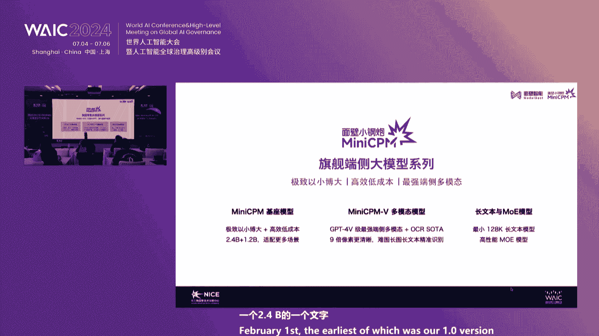
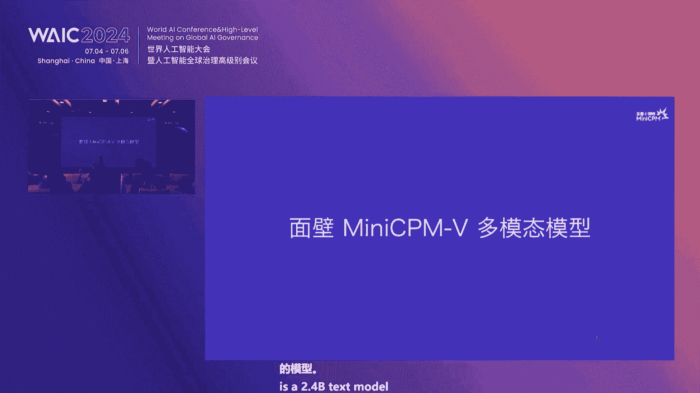
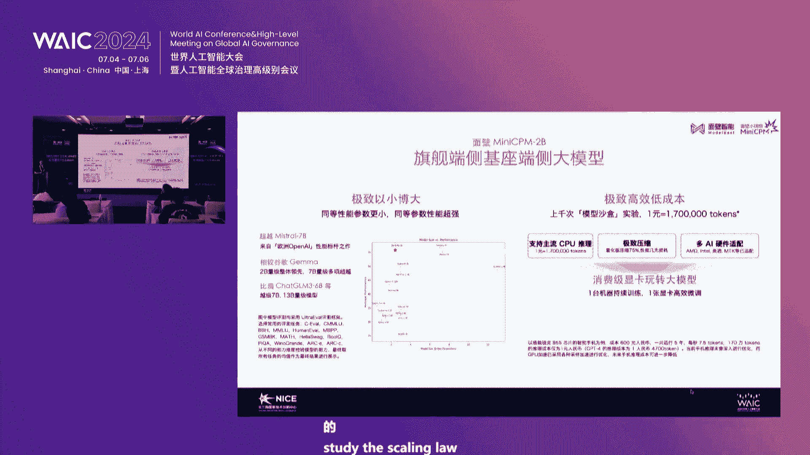
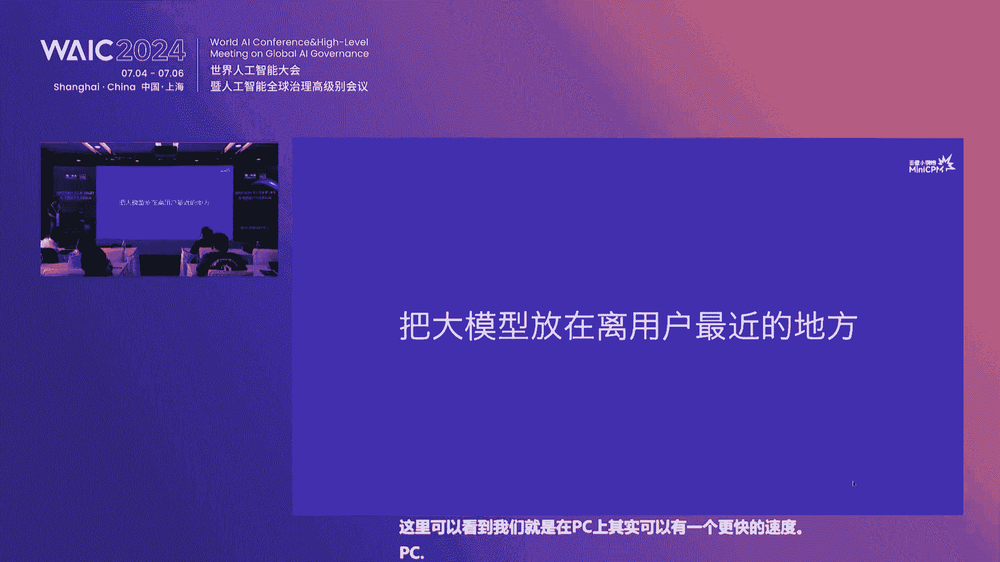
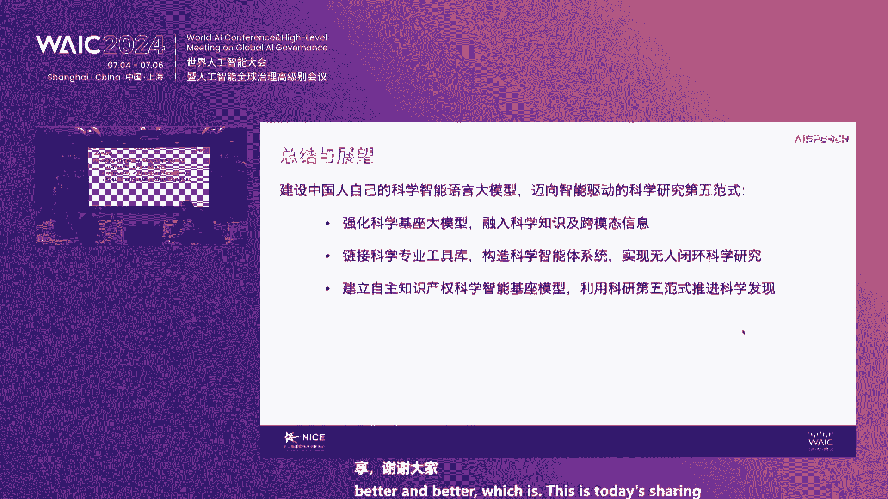
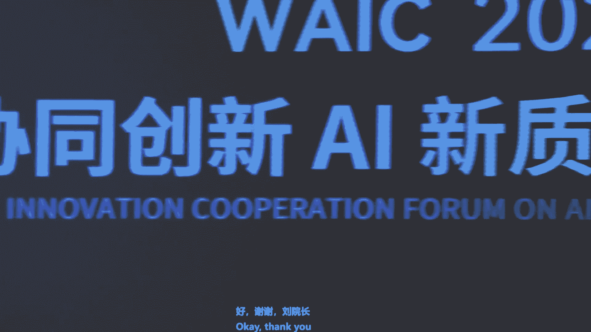

# 9：人工智能新质生产力发展论坛核心观点与趋势解读 🚀

在本课程中，我们将学习2024年长三角协同创新AI新质生产力发展论坛的核心内容。课程将系统梳理多位院士、企业家及专家关于人工智能发展趋势、产业应用、教育变革及中国机遇的深度见解，帮助初学者构建对AI前沿发展的整体认知。

## 概述 📋

本次论坛聚焦人工智能作为新质生产力的核心驱动力，探讨了其在关键技术突破、跨行业协同、人才培养等方面的巨大潜力。与会专家从技术趋势、产业落地、算力挑战、教育革新等多个维度，描绘了AI赋能千行百业的未来图景。

---

## 一、人工智能发展的五大趋势 🔮

上一节我们概述了论坛的整体情况，本节中我们来看看中国工程院院士张亚琴提出的关于大模型与生成式AI的五大核心趋势。

张亚琴院士指出，当前大模型发展呈现五个明确方向：

1.  **多模态、跨模态及多尺度融合**：智能体将能处理和理解文字、声音、图像、视频、激光雷达点云、生物DNA序列等多种形态和尺度的信息。
2.  **智能走向边缘（Edge AI）**：大模型将从云端下沉，部署到个人电脑、手机、汽车、电视等各种终端设备上，实现更即时、更隐私的本地化智能。
3.  **智能体（Agent）的全面发展**：AI将具备更强的自主性，能够规划任务、自我升级、自我编程和自动试错，成为能独立完成复杂目标的智能体。
4.  **物理智能（具身智能）的崛起**：AI将与物理世界深度结合，通过无人车、无人机、机器人等载体与真实环境交互，学习“世界模型”，实现“既会读书，也会走路”。
5.  **生物智能的远期展望**：长远来看，AI将与人类大脑、器官等生物体连接（如脑机接口），形成AI与人类智能（HI）融合的新形态。

**核心公式/概念**：
*   **多模态**：`智能体 = f(文本， 图像， 音频， 视频， 传感器数据...)`
*   **具身智能**：`智能体 + 物理身体 + 环境交互 -> 世界模型`

---

## 二、通用人工智能（AGI）的实现路径与时间线 ⏳

在了解了五大趋势后，我们自然关心这些趋势将引领我们走向何方。张亚琴院士对通用人工智能的实现路径和时间做出了预测。

他认为，当前基于算力和数据堆砌的“规模定律”在未来5-10年仍将有效，但效率瓶颈终将出现。预计5年左右，可能会出现一个全新的AI架构，该架构需包含**三层记忆系统**（类似人类的DNA记忆、短期记忆和长期记忆），并提升推理能力和透明度。

关于AGI实现，他预测需要**15-20年**，并分为三个阶段：
1.  **信息智能**：多模态AI在文字、视频上通过图灵测试（部分已实现）。
2.  **物理/具身智能**：无人驾驶、机器人等能在物理世界通过图灵测试，预计还需5-10年。
3.  **生物智能**：实现脑机接口等深度融合，可能再需5年。

**核心观点**：AI的影响常被“短期高估，长期低估”。当前的AGI定义更侧重于在各领域完成任务的能力超越人类，而非拥有自我意识或情感。

---

## 三、人工智能的产业应用蓝海：以农业为例 🌾

理论趋势最终要服务于产业实践。接下来，我们以农业为例，看看AI与机器人技术如何开辟新的产业蓝海。德国国家工程院院士张建伟深入阐述了这一领域。

农业正面临劳动力短缺、老龄化、精细化需求提升及可持续发展等全球性挑战，这为AI和机器人提供了绝佳场景。农业机器人的发展路径如下：

以下是农业机器人的关键应用环节：
*   **自主导航与物流**：在无标准基础设施的农田实现自主移动和运输。
*   **机器视觉与监测**：用于产量预测、成熟度判断、病虫害检测和作物分级。
*   **智能除草**：在禁用除草剂的趋势下，利用AI识别并物理清除杂草，市场潜力巨大。
*   **自动化采摘**：针对草莓、蓝莓等高价值作物，是技术攻坚的重点方向。

**核心技术栈**：
```python
# 农业机器人系统简示
农业机器人系统 = {
    “感知层”: [“多传感器融合(SLAM)”, “高分辨率视觉”, “光谱分析”],
    “决策层”: [“多模态大模型”, “强化学习”, “任务规划”],
    “执行层”: [“灵巧操作机械臂”, “自主导航底盘”, “特种作业工具”],
    “平台”: [“ROS”, “边缘计算单元”, “物联网终端”]
}
```

张建伟院士强调，**具身智能**是农业机器人的未来。它要求AI具备时间序列理解、空间认知、主动感知和与物理世界安全交互的能力，这与传统AI有本质区别。

---

## 四、算力基础与产业协同的挑战与机遇 💻

当AI技术寻求落地时，算力与产业协同成为不可回避的基础议题。国家超级计算无锡中心主任杨广文教授和多位产业界代表在圆桌讨论中聚焦于此。

**算力挑战**：中国面临算力生态建设的重大挑战。当前国产AI芯片架构多样，但缺乏统一的软件生态、应用生态和标准规范，导致算力使用率不高和开发门槛高。
**核心观点**：“国产化替代”不是简单替换硬件，而是需要硬件、软件、应用、人才共同构建一个繁荣的生态体系，这是一个长期目标。

**产业协同实践**：
*   **T3出行（崔大勇）**：在出行领域应用“阡陌大模型”，提升供需匹配效率约10-15%，改善安全与客服体验。预计2027年成为自动驾驶商业化运营的拐点。
*   **清华无锡研究院（陈一伦）**：认为AI最大的机会在于与物理世界结合的“具身智能”（自动驾驶、机器人），中国拥有场景和供应链的独特优势。
*   **云启资本（韩毅）**：从投资视角看，AI应用正从“数字世界”向“物理世界”延伸。当前在营销、客服、法律咨询、内部增效等“脑力劳动中的体力活”环节落地最快，能直接创造经济价值。

**长三角的协同机遇**：长三角地区算力基础雄厚、产业需求旺盛、制造业链条完整，具备构建算力网络、制定协同标准、推动AI与制造业深度融合的独特优势。

---





## 五、人工智能时代的教育与人才范式变革 🎓





技术的发展最终取决于人才。香港科技大学（广州）协理副校长熊辉教授尖锐地指出了AI时代教育与人才需求的根本性变革。

熊辉教授将人类智能分为四重境界，并指出大模型已在前两重境界超越人类：
1.  **博闻强识**（记忆知识）❌ 机器已超越
2.  **触类旁通**（跨领域应用知识）❌ 机器已超越
3.  **一叶知秋**（推理与预测）⚠️ 机器正在快速逼近
4.  **无中生有**（原始创新）✅ 人类仍具优势

因此，教育必须转向培养机器不擅长的能力：
*   **提问能力**：提出关键和深刻问题的能力。
*   **鉴赏能力**：鉴别价值、判断优劣的能力。
*   **创新能力**：从0到1的颠覆性创造能力。

**教育重心转移**：应从过度追求“人类知晓且可言传的知识”（这部分价值在下降），转向重视：
1.  **可意会不可言传的知识**（如动手实践、模型调参）。
2.  **AI赋能的启发式创新**（用AI改变科研范式）。

**人才类型**：中国需要从培养大量“金手指”（卓越工程师），转向培养更多“金头脑”（具有创新思维和领导力的战略人才），由“金头脑”带领“金手指”创造“金苹果”（重大创新成果）。

---

## 六、前沿探索：端侧模型与科学智能 🔬



最后，我们关注两家前沿公司的技术探索，它们代表了AI模型发展的两个重要方向：普惠化和专业化。

**1. 面壁智能（李大海）：让大模型走向终端**
*   **核心洞察**：提出“大模型摩尔定律”——模型的知识密度每8个月翻一番。这意味着同等智能水平所需的算力在持续下降。
*   **技术路径**：研发高性能的**端侧小模型**（如MiniCPM系列），使其能在手机等设备上高效运行，解决云端推理成本高、数据隐私等问题。
*   **愿景**：实现智能的“无所不在”，让AI更普惠、更经济地融入千行百业。

**2. 斯比驰 & 上海交大（于凯）：AI for Science（科学智能）**
*   **核心洞察**：提出科研“第五范式”——由**通用人工智能驱动**的联动任务科学研究，而不仅是数据驱动的单点突破。
*   **实践案例**：开发化学领域的专业大模型“化学东风”（KMDFM）。它不仅是知识库，更能理解分子结构、谱图等多模态数据，进行**人机协同的推理、反思和实验规划**，向“虚拟研究员”目标迈进。
*   **关键挑战**：科学智能需要**可靠性优先**的模型架构，而不仅是生成多样性或普通准确性。

**3. 第四范式（胡石伟）：构建行业AI基础设施**
*   **核心观点**：行业AI的核心不是简单地将知识灌入大模型，而是用AI解决行业**关键竞争力问题**（如效率、质量、壁垒）。
*   **方法论**：企业需构建“劳动 -> 数据 -> 模型 -> 价值”的闭环。AI价值源于业务过程中产生的数据，并反哺业务形成增强回路。
*   **生态建设**：需要行业核心技术与生态设备共同升级，才能完成数据的采集与决策的执行。

---

## 总结 🎯

本节课中，我们一起学习了2024年长三角AI新质生产力发展论坛的精髓：

1.  **技术趋势明确**：AI正向多模态、边缘化、具身化、与生物融合的方向演进，AGI可能在15-20年内以特定形式实现。
2.  **产业应用广阔**：农业等传统行业因劳动力、精细化需求成为AI蓝海，具身智能是核心。
3.  **基础挑战待解**：算力生态建设、国产化替代是长期而艰巨的任务，需要产学研协同攻坚。
4.  **教育亟待变革**：必须从知识灌输转向培养提问、鉴赏和创新能力，培育更多“金头脑”。
5.  **前沿探索活跃**：端侧模型推动AI普惠化，科学智能（AI for Science）开启科研新范式，行业AI需构建数据与价值闭环。



论坛共识在于，中国发展AI拥有**应用场景丰富**和**制造业体系完整**的独特优势。抓住机遇的关键在于深化技术突破、推动产教融合、构建开放生态，最终让人工智能真正成为驱动千行百业高质量发展的新质生产力。