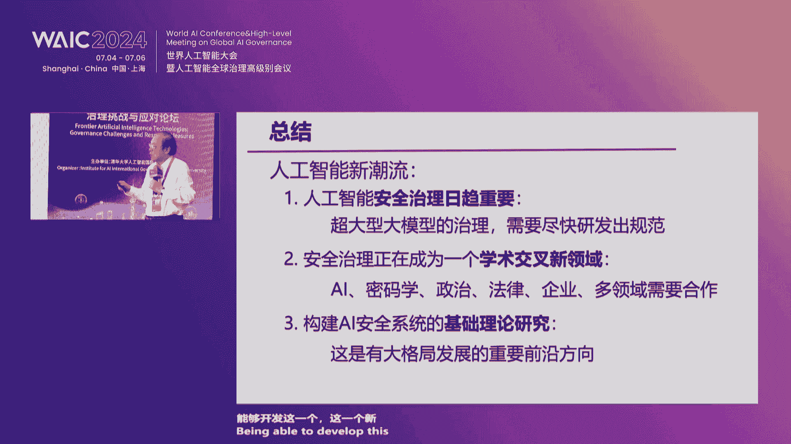
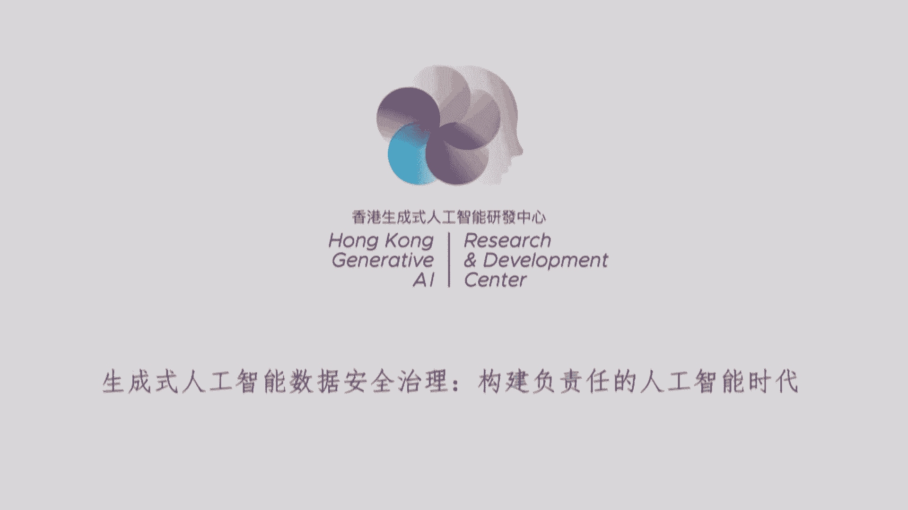
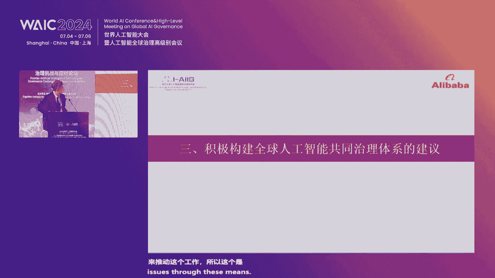
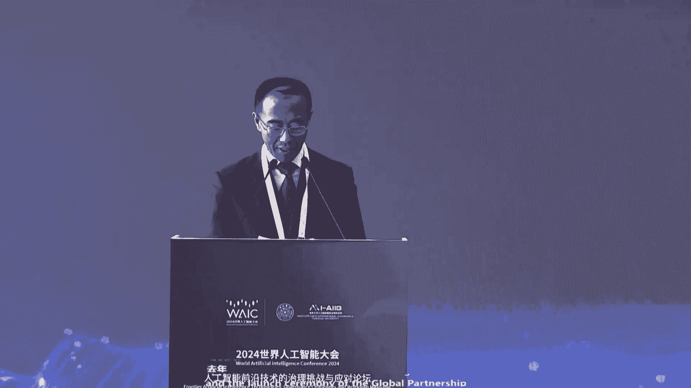
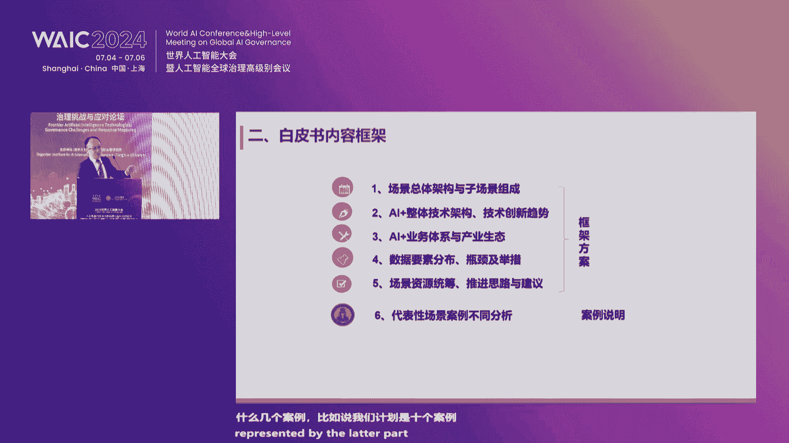

# 10：人工智能前沿技术治理挑战与应对措施论坛 🎤

在本节课中，我们将学习人工智能前沿技术，特别是生成式人工智能所面临的治理挑战，以及国际社会、学术界和产业界提出的应对措施。课程内容整理自一场汇集了多位顶尖专家的论坛讨论。

---

## 概述：人工智能治理的关键十字路口

当前，人工智能的治理发展已经走到了关键的十字路口。生成式人工智能所带来的挑战是前所未有的。在这个关键时间点上，我们必须意识到人工智能治理也面临着空前挑战。

首先，人工智能技术的发展速度远远快于监管制度调整的速度。首当其冲的便是发展与治理的平衡问题。其次，人工智能所引发的问题前所未有，这使得人工智能监管变得空前复杂。没有任何一个监管机构能够单独管理好人工智能涉及到的各个方面。其三，随着国际格局变化和中美关系复杂化程度的加深，我们越来越认识到，国际社会不太可能形成一个单一的全球性机构来管理和监管人工智能发展的方方面面。因此，就特别需要加强国与国之间、不同领域之间人工智能治理的沟通与合作。

在这样的背景下，我们齐聚世界人工智能大会，组织这场论坛，专门研讨人工智能的治理挑战与应对方案。

---

## 第一节：人工智能安全治理的研究走向 🤖

上一节我们概述了人工智能治理的宏观背景，本节中我们来看看姚期智院士从信息技术角度对AI安全治理研究走向的深入分析。

姚期智院士指出，大模型带来了新的风险前沿。以下是其主要风险类别：

*   **信息智能风险**：大模型幻觉产生的错误信息可能误导人类；大模型滥用导致虚假信息泛滥；侵犯知识产权等行为变得更容易。
*   **物理与生物智能风险**：未来智能机器人进入家庭和工厂，将带来物理风险；AI控制的仪器失控可能造成生物灾难。
*   **生存性风险**：通用人工智能的快速增长可能带来失控风险，对人类社会构成生存危机。

面对这些风险，治理路径可以从技术和时间两个维度分类。

以下是主要的治理路径：

*   **短期工程与系统路径**：应用传统信息安全技术、生物技术、核技术中的风险分类、评估与管控方法。
*   **长期核心理论研究路径**：深入研究AI核心理论，理解AI安全的机理，研究大模型的对齐方法。
*   **政策与技术结合路径**：积极探索与技术匹配的治理条例和监管措施。

---

## 第二节：大模型时代的数据安全新挑战 🔐

上一节我们介绍了AI安全的宏观风险与治理路径，本节中我们聚焦于大模型时代一个具体而紧迫的挑战：数据安全。

姚院士以两项研究为例，说明了大模型带来的新问题。

以下是两项具体的研究案例：

1.  **隐私数据提取攻击**：研究发现，通过特定算法诱导大模型生成文本，可以从中提取出训练数据中包含的个人隐私信息（如住址、年龄），这类似于人类回忆起多年前读过的内容。
2.  **用户隐私保护难题**：用户在使用大模型时，其查询问题本身可能泄露隐私。研究致力于开发可行方案，让大模型能够回答用户问题，同时不获知用户的具体问题内容，这借鉴了传统数据安全中的多方安全计算思想。

总体来看，当前大模型时代的数据安全研究尚处早期，类似于网络安全发展初期“攻防博弈”的阶段。未来的重要方向是发展一套核心理论，使研究更系统化。

---

## 第三节：构建可证明安全的AI系统 🛡️

除了应对具体问题，从长远看，有没有一劳永逸的解决方案？本节我们探讨构建可证明安全的AI系统的宏大构想。

姚院士介绍了两个有潜力的研究方向。

以下是两个前沿的研究构想：

*   **有益的人工智能**： Stuart Russell 提出的“Assistance Game”从博弈论角度出发，旨在设计始终以人类利益为依归的AI系统。其核心是避免预先给定固定的奖励函数，而是让AI通过与人类持续对话来理解并满足人的需求。
*   **可证明安全的AI**： 该构想旨在将计算机科学中“可证明安全”的形式化方法推广到AI系统设计。思路是使用一个经过数学证明是安全的小型“白盒”模型作为中介，所有人类与强大AI的交流都必须通过这个安全中介进行，从而防止AI通过花言巧语误导人类。

这些研究旨在为AI安全治理提供根本性的理论基础。

---

## 第四节：人工智能安全治理的当务之急 ⚡

从理想的研究构想回到现实，本节我们探讨当前人工智能安全治理最紧迫的任务。

姚院士重点阐述了两大当务之急。

以下是当前治理工作的重点与挑战：

*   **发展与评估对齐方法**： 发展如监督微调、强化学习微调等技术，使AI与人类价值观对齐。同时，建立评估大模型安全性的方法与平台。挑战在于方法的可扩展性、对模型能力的影响，以及评估本身的系统化和鲁棒性不足。
*   **结合国情优势，简化治理**： 在全球共识下，结合本国优势进行治理。例如，中国拥有完善的实名制身份验证系统和丰富的新科技风险管控经验（如无人机、金融科技）。可以借此建立AI大模型分级体系，实现实体ID映射和全产业链监控，简化治理流程。

---

## 第五节：人工智能全球治理的展望 🌍

上一节我们讨论了国家层面的治理举措，本节我们将视角上升到全球层面，看看国际组织对人工智能全球治理的展望。

联合国秘书长人工智能顾问机构成员马瓦拉校长（视频演讲）提出了促进人工智能高效治理的多方面建议。

以下是其建议的核心要点：

*   培育发展与风险并存的文化。
*   建立确保AI伦理使用的法律框架，关注透明度、问责和公平。
*   建立统一的AI标准。
*   起草治理AI开发、使用和影响的法律。
*   治理数据、算法、计算系统和AI应用。

马瓦拉校长还介绍了联合国大学全球人工智能网络，该网络旨在联合学术界、产业界、政策制定者和民间社会，共同应对AI挑战，并特别关注赋能全球南方国家。

---

## 第六节：生成式人工智能的数据安全治理 💾

数据是AI的基础，其安全治理至关重要。本节我们聆听产业界专家对数据安全治理的见解。

香港科技大学郭毅可教授（通过数字分身演讲）阐述了数据安全治理的路径。

以下是其演讲的核心内容：

*   **国际治理趋势**： 各国立法谨慎，避免阻碍创新。欧盟采取全面立法（如《人工智能法案》），英美则偏向市场驱动。数据治理与隐私保护紧密相关。
*   **前沿技术应用**： 区块链技术可增强数据完整性与安全性；加密和匿名化技术（如差分隐私）是保护数据的关键；严格的访问控制、权限管理以及监控和审计也至关重要。
*   **治理路径总结**： 需建立健全法规、采用先进技术、加强国际合作并遵守最佳实践，以推动负责任和安全的AI应用。

---

## 第七节：全球人工智能治理的中国方案 📘

中国在人工智能治理方面有何思考和方案？本节我们通过一份联合研究报告来了解。

清华大学薛澜教授介绍了《全球人工智能治理与中国方案》研究报告的核心观点。

报告提出了构建全球人工智能治理体系的若干主张：

*   **求同存异，凝聚共识**： 构建公平公正、综合平衡的国际治理体系，统筹发展与安全。
*   **统筹四个关键方面**： 统筹发展与安全；统筹伦理、立法、标准、测评等治理工具；统筹国内治理与国际治理；统筹既有经验与新的实际问题。
*   **尊重规律，合作共赢**： 加强算力和数据共享，降低重复建设成本；保障不同治理框架间的互操作性，倡导开放标准与开源技术。

---

## 第八节：圆桌对话：治理挑战与多方共治 💬

理论探讨之后，本节我们通过一场圆桌对话，聆听多位中外专家对具体治理挑战的碰撞与思考。

对话由中国政法大学张凌寒教授主持，涵盖了以下核心议题：

*   **最大风险**： 专家指出，短期风险包括失业、虚假信息泛滥；长期最严峻的风险是通用人工智能（AGI）可能带来的失控和生存性危机。当前最大的问题是对这些风险缺乏全球共识。
*   **平衡发展与安全**： 产业界代表认为，治理应为发展护航，需在发展中治理。建议采取分类分级治理，针对不同风险等级和场景（如医疗与商品推荐）采取不同措施，避免一刀切。
*   **多方主体的角色**： 各方需具备参与治理所需的资源（如学界需要算力和平台，政府需要人才，企业需要明确的规则和反馈渠道）。不同社会结构下，各主体的参与方式不同。
*   **全球治理机制构想**： 有专家提出“全球人工智能挑战框架公约”的设想，即先达成高层级原则共识，再针对具体问题（如安全风险）制定由主要国家参与的议定书，最终推向全球。
*   **弥合智能鸿沟**： 关键在于确保全球南方国家不被排除在AI价值链之外。与其期待所有国家都建立大模型，不如通过技术合作、能力建设（如ICT学院）、以及开发满足当地需求的应用（如小语种互译），使其融入全球AI生态。治理应聚焦于真正跨国界、需国际合作解决的问题。

---

## 总结

本节课中，我们一起学习了人工智能前沿技术治理的多维度挑战与应对。我们从宏观风险（生存危机）谈到具体问题（数据安全），从技术构想（可证明安全AI）谈到现实举措（对齐与评估），从国家方案（中国实践）谈到全球合作（联合国框架）。关键共识在于：人工智能治理极其复杂，需发展治理并重，需多方协同共治，需在全球共识下尊重国情差异。最终目标是以人工智能的“善治”，推动人工智能向“善”发展，让全人类共享技术红利。