# 11：人形机器人与具身智能发展论坛全记录 📝

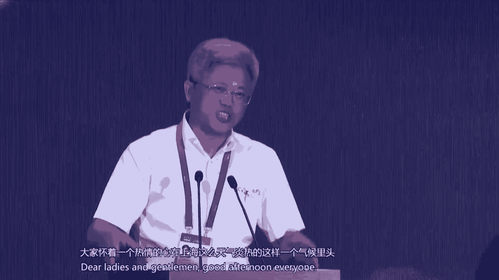

在本课程中，我们将学习2024年7月4日“人形机器人与具身智能发展论坛”的核心内容。本次论坛汇聚了全球顶尖的专家学者、企业家和创新者，共同探讨了人形机器人领域的最新技术、应用前景和发展趋势。我们将对论坛的致辞、主旨报告、技术发布及圆桌讨论进行系统梳理，重点关注技术突破、产业应用和未来挑战。

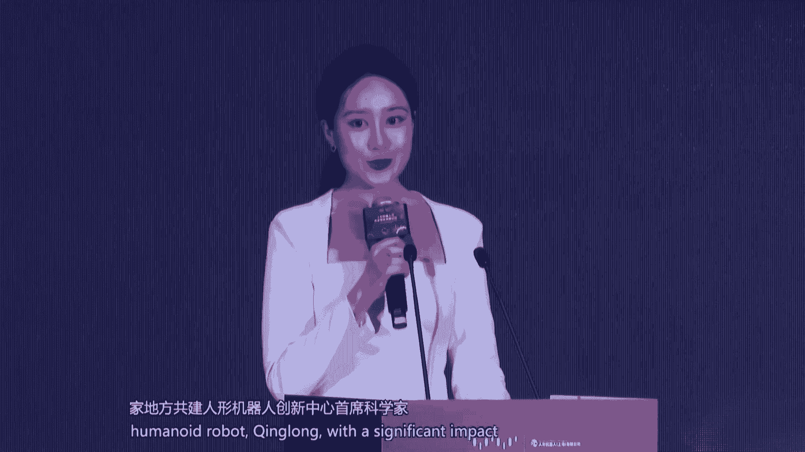

---

## 论坛开幕与致辞 🎤

本次论坛由世界人工智能大会组委会指导，国家地方共建人形机器人创新中心、中国电子学会等机构承办，主题为“人形机器人与具身智能发展”。

上海市人民政府副秘书长庄木弟在致辞中指出，人工智能是新一轮科技革命的核心驱动力。上海将着力推动人形机器人产业高质量发展，赋能新型工业化。具体举措包括：
*   **开展核心技术研发**：推动产学研协同，攻关共性关键技术。
*   **推动产业生态集聚**：打造产业集聚区，做好配套服务。
*   **推动示范应用落地**：以重大场景为牵引，探索“机器人即服务”新模式，争取3年内实现千台级应用规模。
*   **打造产业发展共性底座**：围绕开源机器人本体、大模型、数据集，构建支撑全国人形机器人发展的关键底座。

中国科学院毛明院士在致辞中强调，人形机器人是跨学科研究的典型，涵盖了机械、电气、计算机、认知科学乃至生物学。从产业角度看，它正成为智能制造、医疗健康、家庭服务等行业的变革力量。据预测，全球人形机器人市场规模年增速超过20%，市场潜力巨大。

中国电子学会理事长徐晓兰在致辞中提出，人形机器人是“人工智能与机器人融合创新的产物”，是诸多前沿技术的集大成者。她介绍了中国电子学会在工信部指导下，发起成立“中国人形机器人百人会”、筹建标准化技术委员会等工作，旨在从核心技术突破、应用场景拓展、产业生态建设三方面推动产业发展。

---

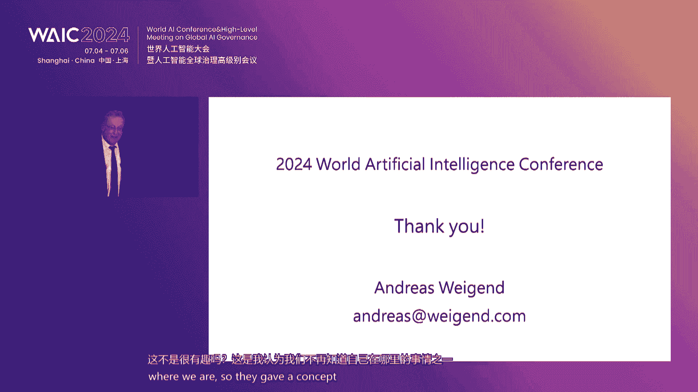

## 重磅发布：全球首款全尺寸开源人形机器人“青龙” 🤖

国家地方共建人形机器人创新中心首席科学家姜磊主持发布了全球首款全尺寸开源人形机器人“青龙”，旨在破解人形机器人面临的“一高五难”（硬件、软件、软硬解耦、知识积累、人才聚集、安全应用难）问题。

### 1. 机器人平台技术
由梁振杰博士介绍。“青龙”机器人秉持强对标、通用化、智能化、多模态的设计原则。
*   **基本参数**：身高1.85米，体重80公斤，集成43个主动自由度。
*   **动力系统**：搭载具有能量回收和稳压管理的电源系统，支持3-4小时全工况续航。
*   **关节模组**：搭载两类10种共31个关节，最大关节扭矩396牛·米，最大扭矩密度达200牛·米/公斤。
*   **操作系统**：腿部采用高扭矩密度电机加低减速比行星减速器方案；上肢采用高功率密度电机加谐波减速器的SEA（系列弹性驱动器）方案。
*   **灵巧手**：搭载七自由度、集成触觉感知的五指灵巧手。
*   **控制系统**：采用高速以太总线系统，并搭载具备400TOPS算力的具身智能控制器。

### 2. 具身智能技术
由田充博士介绍。团队打造了“朱雀”具身大脑和“玄武”小脑模型。
*   **朱雀大脑**：以多模态大模型为核心，负责感知、任务理解和决策调度。
*   **玄武小脑**：负责具体任务执行，分为轨迹规划模块和运动控制器。轨迹规划基于端到端模仿学习；运动控制融合了强化学习和基于全身动力学的模型预测控制（MPC）方法。
*   **演示**：机器人能通过语音指令理解人类意图，并完成“整理桌面”等任务。

### 3. 开源数据集
由邢博洋博士介绍。数据是驱动具身智能的核心。创新中心致力于构建“白虎”数据集，目标在3年内联合生态伙伴完成1PB（拍字节）清洗后数据集的构建。数据采集方式包括：
*   **全身运动捕捉**：用于采集走、跑、跳、抓、拿、放等技能数据。
*   **视觉手部捕捉**：用于毫米级灵巧作业数据采集。
中心提供标准化的数据采集、评估、管理工具，并通过开源社区加速数据标准和专用标准的建立。

### 4. 智能训练场
由刘宇飞博士介绍。为解决“场景应用难”和“高质量数据获取难”的问题，需要建设智能训练场。
*   **目标**：搭建模拟产线，规模化采集数据，并建立检测评估基地。
*   **架构**：分为“感、存、算、学、用”五个部分，涵盖数据采集、存储、技能训练（模仿学习与强化学习）和场景应用。
*   **规划**：2024年在上海打造100家人形机器人训练场；2027年期待在全国搭建1000家。

“青龙”机器人随后在现场亮相，展示了其初步能力。所有设计资料将在开源社区 **openloong.org.cn** 发布。

---

## 主旨报告精选 💡

上一节我们介绍了中国在人形机器人开源平台方面的突破，本节中我们来看看国际专家和产业界的前沿思考。

### 报告一：人工智能之后，人类还能做什么？
*   **主讲人**：Andreas Weigend（亚马逊前首席科学家）
*   **核心观点**：AI的价值在于其对决策的影响。当AI在创作（如文本、音乐、绘画）上已难以与人类区分时，我们不应与之“竞赛”，而应与之“协作”。人类独有的价值可能在于**亲身参与和体验**，例如现场欣赏音乐会时全神贯注的投入和欣赏。此外，人类内在的、私密的体验（如情感、疼痛）也是AI难以完全复制的。他引用诺贝尔奖得主Daniel Kahneman的观点，提醒我们关注那些可能无法被数据完全捕捉的人类特质。

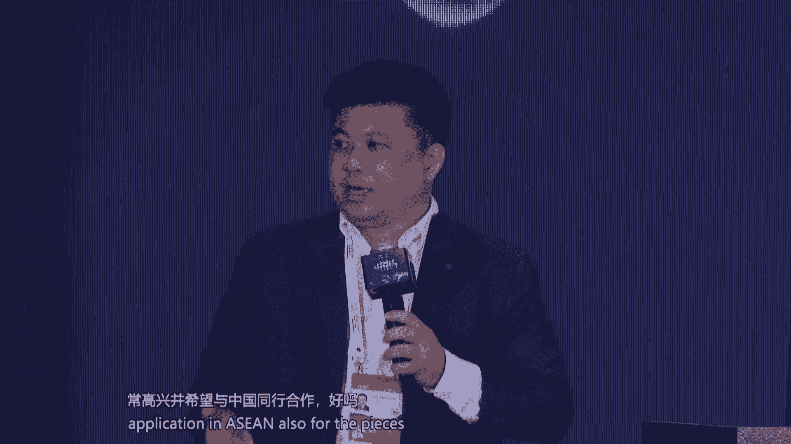

### 报告二：东盟制造业中人形机器人的潜力与前景
*   **主讲人**：陈智生（东盟智慧产业联盟）
*   **核心观点**：东盟制造业市场增长稳定，但各国发展阶段不同。人形机器人在东盟的落地面临高初始成本、技术整合、劳动力习惯等挑战。机遇在于东盟快速的工业化进程、劳动力成本上升以及对自动化解决方案的需求。建议中国企业与东盟的研究机构、大学合作，进行数据和技术共享，并关注各国不同的政策与激励框架。

### 报告三：穷澈具身大脑与具身技能库
*   **主讲人**：卢策吾（穷澈智能联合创始人）
*   **核心观点**：解决具身智能Scaling Law（规模定律）问题的关键在于降低训练空间的不确定性。穷澈智能提出了两大技术路径：
    1.  **物理常识大模型**：将像素理解提升到物理表征理解（如物体的旋转轴、材质属性），大幅降低数据需求。
    2.  **力位混合大模型**：在决策中融合力觉和位置信息，使控制更鲁棒、更接近人类“下意识”行为，减少计算量。
团队通过自研仿真平台和低成本数据采集方案（如外骨骼），构建了大规模力位混合数据集，并发布了“穷澈大脑”产品，提供可任意组合的原子技能库。

### 报告四：具身智能是实现AGI的最有效途径
*   **主讲人**：王兴星（宇树科技创始人兼CEO）
*   **核心观点**：当前的大语言模型缺乏对物理世界时空和因果的理解，而**具身智能**通过与物理世界的交互学习，是实现通用人工智能（AGI）更有效的途径。他类比“缸中之脑”思想实验，指出脱离肉体的智能如同活在梦境中。宇树科技展示了其在四足机器人（如Go2）和人形机器人（如H1、Z1）上的运动控制成果，并认为通过深度强化学习，人形机器人的运动能力很快将超越人类。他强调，AI发展已成为一种“信仰”，需要更大胆的投入和探索。

### 报告五：银河通用：具身多模态大模型系统探索
*   **主讲人**：王鹤（北京大学助理教授）
*   **核心观点**：通用机器人需要“任务通用性”和“环境通用性”。当前成本和技术下，采用“轮式底盘+上半身”的复合形态是实现全空间作业的务实选择。他指出，依赖遥操作采集真实数据成本高昂且不可持续，**仿真与合成数据**才是实现泛化能力的关键。其团队通过合成10亿规模的灵巧手抓取数据，清晰观察到了具身智能的Scaling Law效应。基于合成数据训练出的“大脑”（多模态理解）与“小脑”（泛化操作）系统，已能完成开放词汇的指令任务，并在无人零售场景中实现了97%以上的任务成功率。

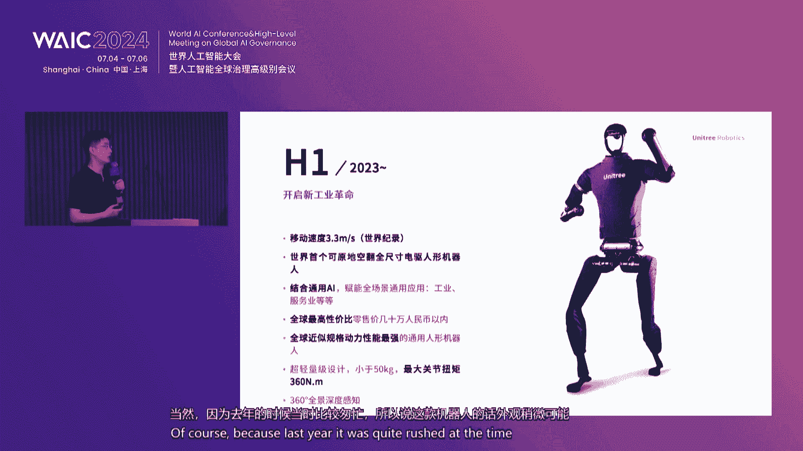

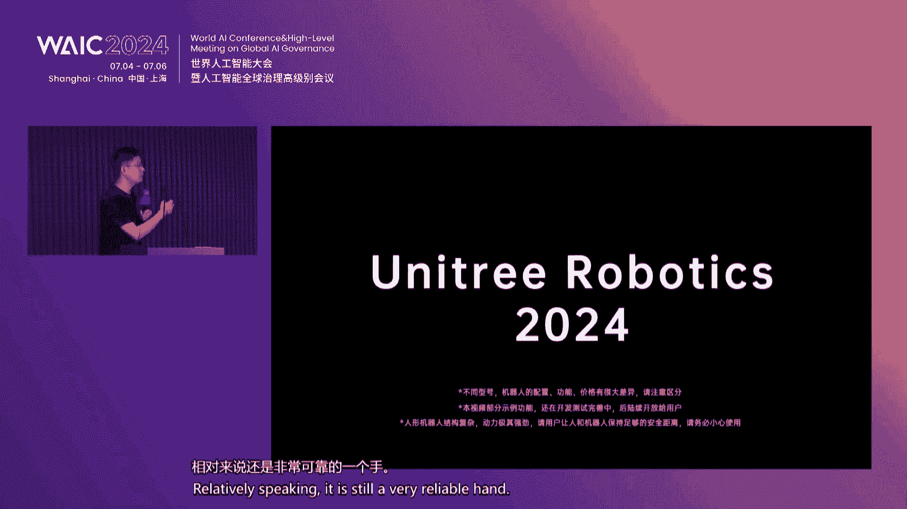

---

## 开发者技术分享 🛠️

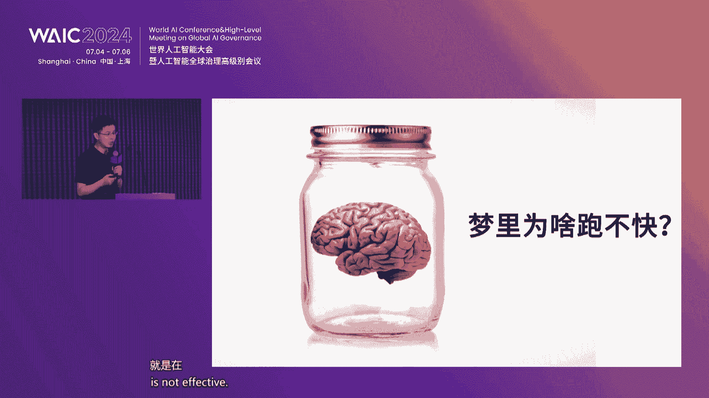

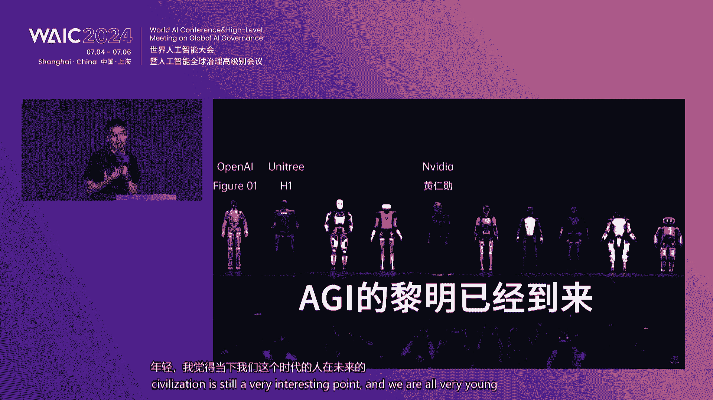

以下是两位青年开发者带来的前沿研究分享。

### 分享一：通过自监督实现AI的终身学习
*   **分享人**：胡宇航（哥伦比亚大学博士生）
*   **核心观点**：当前AI缺乏人类那种**渐进式、可迁移的终身学习能力**。他倡导通过自监督学习，让AI像人类一样，在已有知识基础上快速学习新技能。他展示了两个工作：
    1.  **人脸机器人共情**：让机器人通过照镜子（自监督）学习控制面部肌肉，理解表情与情感的关联。
    2.  **整洁概念建模**：将整洁场景视为“有序的句子”，让AI通过观察大量整洁与混乱的图片（自监督），学会整理物品，赋予机器人“审美”和内在动机。

### 分享二：面向安全、敏捷和可交互的机器人
*   **分享人**：孙一凡（卡耐基梅隆大学博士生）
*   **核心观点**：机器人发展需兼顾**安全性、敏捷性和交互性**。其所在实验室的工作分为三层：
    *   **应用层**：在导航、运动、操作领域取得进展，如动态避障、人机协作装配、人形机器人遥操作等。
    *   **能力层**：关注跨平台的深层能力，如具身感知（柔性触觉传感器）、人机交互（AR技术）、自动化任务集成。
    *   **理论层**：为核心算法提供安全保证，如提出“完全策略优化（APO）”算法，优化策略表现的下界，控制风险。同时，开发了**Guardian强化学习环境**，集成了基准算法库和多种机器人模型，以促进社区研究。

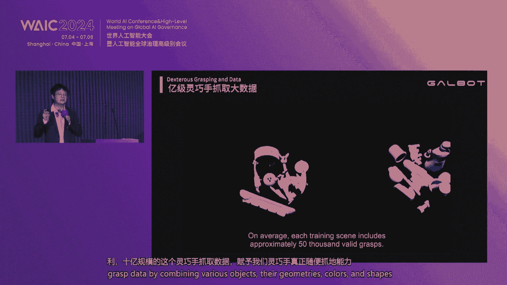

---

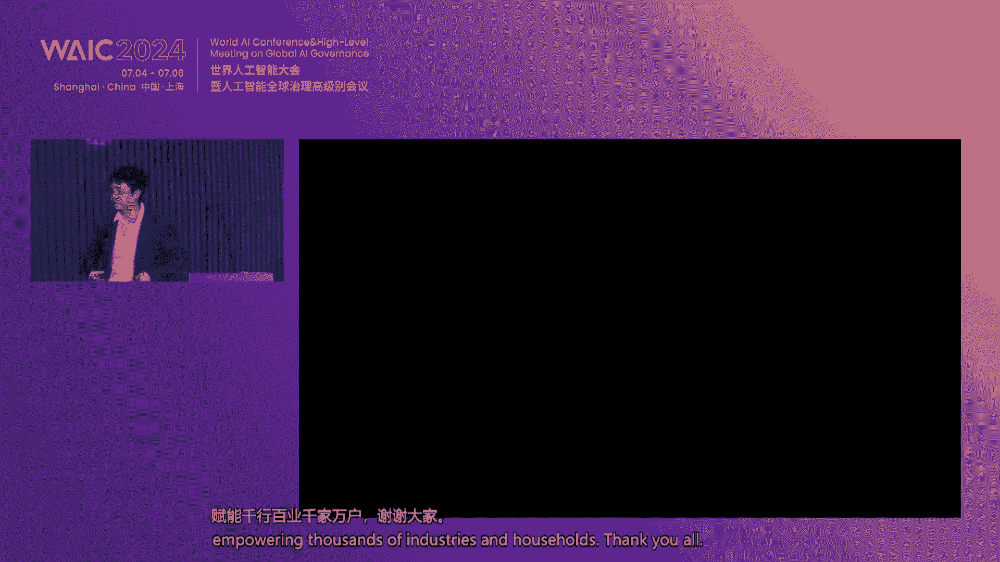

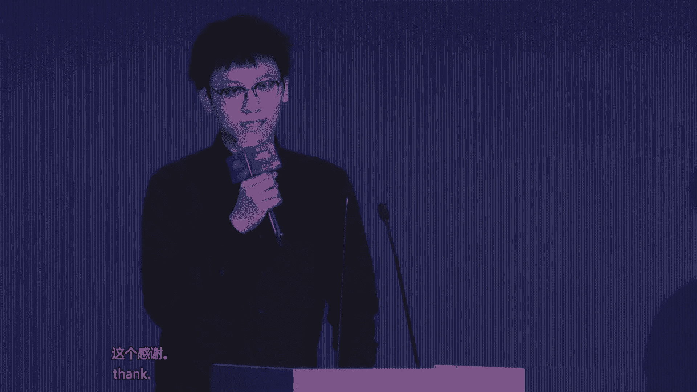

## 圆桌对话：场景落地与产业应用 💬

本节中，我们将聆听四位专家关于人形机器人如何从实验室走向市场的深度讨论。

*   **主持人**：姜磊（国家地方共建人形机器人创新中心首席科学家）
*   **嘉宾**：
    *   张建伟（中国工程院外籍院士）
    *   高峰（上海交通大学教授）
    *   齐国胜（国双科技董事长）
    *   苏航（清华大学研究员）

**核心讨论要点如下：**

1.  **技术突破方向**：
    *   **张建伟**：需在**空间理解**（动态语义建模）、**时间轴操作**（使用工具）、**交互功能**三个维度实现从非具身到具身的跨越。这需要“具身智能”（身体进化，如软硬结合驱动）和“具身AI”（大脑进化）的共同进步。
    *   **高峰**：从机械角度看，电机驱动可能不是最终方案，未来或需向“人工肌肉”等感知驱动一体化方向发展。应用驱动研发，应聚焦**真空、深海、飞机/汽车总装**等特定高危或复杂场景。

2.  **产业发展路径**：
    *   **齐国胜**：人形机器人是“终极生产力工具”。其发展极其复杂，需要建立**产学研用融一体化的创新联合体**。在推进各行各业数字化转型的过程中，积累高质量业务场景数据，用于构建世界模型和训练机器人。
    *   **苏航**：发展具身智能的核心是提升**泛化能力**，从而通过规模化生产降低单机成本。构建通用的世界模型短期内不现实，应围绕典型场景进行。当前真实数据量远不足，需**仿真与真实数据结合**。

3.  **人才培养与生态建设**：
    *   **苏航**：现有教育体系面临AI时代的挑战，如何培养跨学科的机器人人才是需要反思的问题。
    *   **共识**：人形机器人发展必须依靠**创新链、产业链、资金链、人才链“四链融合”**。学术界需面向真实产业问题，产业界需保持耐心，共同推动。目标不是简单仿人，而是实现超越人类智能、解放生产力的工具。

---

## 总结 🎯

在本课程中，我们一起学习了“人形机器人与具身智能发展论坛”的核心内容。我们看到了中国在开源人形机器人平台“青龙”上的突破，涵盖了硬件设计、具身智能、数据集和训练场等完整技术栈。我们也聆听了国内外专家对技术路径（如物理常识模型、力位混合控制、合成数据）、产业前景（如特定场景落地、生产力工具属性）和未来挑战（如数据、成本、人才）的深刻见解。

论坛达成的基本共识是：人形机器人是多项前沿技术的集大成者，其发展道路漫长且复杂，但潜力巨大。未来需要产学研用紧密协同，以场景和应用为牵引，通过开源开放、数据共享、生态共建的方式，稳步推动这项未来产业健康发展，最终让机器人技术造福人类社会。