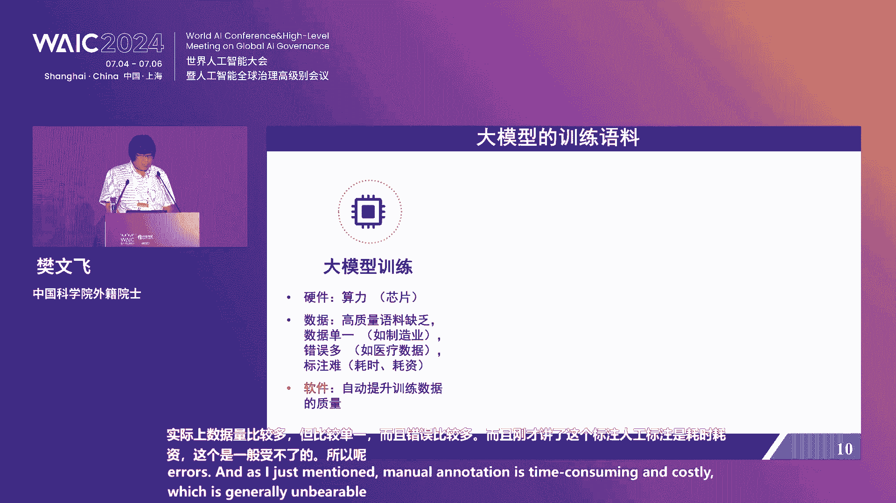
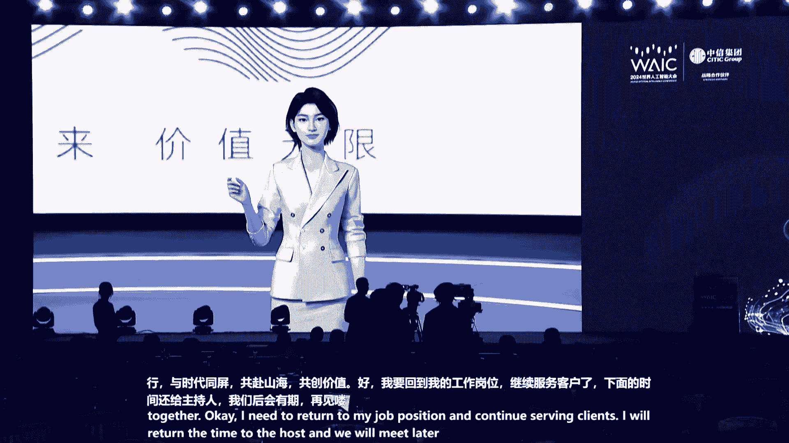

# 12：人工智能投融资趋势与中信实践 🚀

## 概述
在本节课中，我们将学习2024世界人工智能大会投融资主题论坛的核心内容。课程将涵盖人工智能的宏观发展环境、技术前沿趋势、产业应用实践以及金融资本如何支持科技创新。我们将重点关注上海的发展战略、中信集团的综合金融服务模式，以及产业界与投资界对AI未来的洞察。

***

## 一、论坛开幕与领导致辞 🎤

尊敬的各位来宾，本次会议即将开始，请您尽快就座，并将手机等通讯设备关闭或置于静音状态。

欢迎大家来到2024世界人工智能大会投融资主题论坛的现场。我是来自中信证券的朱叶新，担任本次论坛的主持人。

首先，介绍出席今天论坛的嘉宾：
*   上海市副市长陈杰
*   中信集团党委副书记、副董事长、总经理张文武
*   中国社科院学部委员于永定
*   中国科学院外籍院士樊文飞
*   中远海运集团党组成员、副总经理陈扬帆
*   中信集团党委委员、执行董事、副总经理王国权
*   中信金控总经理曹国强
*   以及其他来自政府、产业界、投资界和学术界的领导与专家。

人工智能是引领未来的战略性技术，是新一轮产业变革的核心驱动力。本次论坛旨在与国内外顶尖学者、产业界和投资界专家交流碰撞，共同探索人工智能产业发展趋势及在投融资领域的前行之路。

***

### 1.1 上海市领导致辞：打造人工智能创新高地 🌉

上海作为人工智能的重点创新之城，正在积极推动人工智能的科研储备、招商引资和应用实践。

上海市副市长陈杰在致辞中指出，人工智能是新一轮科技革命和产业变革的重要推力。上海在抢抓人工智能机遇方面取得了显著进展：
*   **大模型**：通过国家备案的大模型数量达到34个。
*   **创新平台**：成立了国家和地方共建的人形机器人创新中心，并发布了公版机。
*   **算力与数据**：正在组建大规模计算集群，并加强高质量语料供给。
*   **产业规模**：人工智能产业规模超过3800亿元，位居全国前列。
*   **生态建设**：设立了总规模1000亿元的三大先导产业母基金，40余家机构入驻大模型创新生态社区“模速空间”。

面向未来，上海将重点推进以下工作：
1.  **算力基础设施**：加快芯片研发，打造算力集群，推动异构计算训练。
2.  **模型发展**：追踪国际先进水平的万亿级大模型，同时积极推动各行各业应用的垂类模型。
3.  **数据语料**：依托浦江国家实验室打造国家语料库，加强数据加工与市场化供给。

陈杰副市长呼吁投资界更加关注在上海人工智能产业生态发展中涌现的大量初创型中小企业，并给予金融资本支持。上海将继续营造一流营商环境，深化与国内外企业、科研院所和投资机构的合作。

**过渡**：上一节我们了解了上海作为创新前沿城市的发展蓝图。接下来，我们将视角转向本次论坛的主办方之一——中信集团，看看这家综合性企业集团如何践行金融与科技的融合。

***

### 1.2 中信集团领导致辞：金融与实业并举，支持AI发展 💼

中信集团是金融与实业并举的国有大型综合性跨国企业集团，也是数字化转型的先锋。

中信集团总经理张文武在致辞中表示，中信集团坚持“两手抓”：
*   **一手抓金融支持**：融合金融资源，全力服务人工智能产业和科技创新企业发展。
*   **一手抓技术应用**：聚焦人工智能技术应用，推动自身产业转型升级。

在金融支持科技发展方面，中信集团主要从四个方向发力：
1.  **强化股权融资功能**：成立中信股权投资联盟，管理规模超3000亿元，发挥券商优势提供融资服务。
2.  **强化信贷服务功能**：创建区域科创中心和200余家科技先锋支行，科技金融贷款余额达3500亿元，服务专精特新企业。
3.  **强化跨境服务能力**：打造以香港为支点的跨境服务体系，助力企业走向全球资本市场。
4.  **强化智能驱动**：在智能投顾、投研、风控等场景实现创新应用，提升服务精准性。

在产业应用方面，中信集团推动人工智能与传统产业深度融合：
*   **完善创新体系**：建成137个创新平台，在金融基础设施、生物育种等领域突破关键技术。
*   **促进产业升级**：以中信泰富特钢和中信戴卡为例，通过AI技术深度融合，在研发、生产、能效等方面取得显著改善，成为全球“灯塔工厂”。

张文武总经理表示，中信集团将进一步发挥综合金融优势，支持科技型企业发展，加大投资力度，开放应用场景，与各界朋友携手把握人工智能发展趋势。

**过渡**：在了解了政策与产业层面的宏观布局后，我们需要思考：人工智能的蓬勃发展需要怎样的宏观经济环境作为土壤？接下来，我们将聆听经济学家的分析。

***

## 二、主题演讲：宏观环境与技术前沿 📈

### 2.1 宏观经济视角：为AI发展创造良好环境 📊

中国社科院学部委员于永定发表了题为《加大财政扩张力度，力争实现5%GDP增速》的演讲。

他指出，人类经济发展主要由科技革命推动，但科技发展也离不开繁荣稳定的经济环境。当前，实现今年5%的GDP增长目标至关重要，有助于扭转经济增速的下降趋势，提振市场信心。

通过从需求侧（消费、投资、净出口）构建简单的预测模型进行分析：
*   **公式**：GDP增速 = (消费占比 × 消费增速) + (投资占比 × 投资增速) + (净出口占比 × 净出口增速)
*   基于年初假设（消费增速5%，净出口贡献为0），为实现5%的GDP目标，需要基础设施投资增速达到约11.7%。
*   结合1-4月实际数据（消费增速4.1%，制造业投资增速9.7%，房地产投资增速-9.8%，基建投资增速6%），为抵消消费放缓的影响，当前基础设施投资增速需达到约12.7%。

这意味着存在较大的资金缺口。于永定委员建议，应实施逆周期调节的财政政策，通过增发国债来支持基础设施投资，从而稳定经济增长，为包括人工智能在内的科技发展创造良好的宏观经济环境。

**过渡**：宏观经济的稳定为技术创新提供了基础。那么，人工智能技术本身目前处于什么阶段？又有哪些值得关注的方向？接下来，让我们转向技术专家的视角。

***

### 2.2 技术前沿洞察：AI = 机器学习 + 逻辑推理？ 🧠

中国科学院外籍院士樊文飞发表了题为《AI等于机器学习加逻辑推理》的演讲。

他首先指出当前风口上的大模型存在明显缺陷：
1.  **可解释性与溯源困难**：欧盟法规要求AI决策必须可解释。
2.  **“不可能三角”**：理论证明，大模型难以同时满足**准确性、公平性和鲁棒性**。
3.  **逻辑表达能力有限**：尚未达到一阶谓词逻辑水平。
4.  **幻觉问题**：可能产生看似合理实则错误的信息，在关键领域代价高昂。
5.  **投入产出反思**：巨大的算力和数据投入对生产效率的实际提升有待验证。

因此，他建议投资界关注大模型，但不必盲目跟风。行业大模型对精度要求更高，挑战也更大。

樊院士提出，AI赋能产业的目标应是“成本低、见效快、可解释”。他介绍了一种将**机器学习模型作为谓词嵌入逻辑框架**的方法，开发了“钓鱼城”系统，实现了机器学习与逻辑推理的统一。该系统在多个行业应用中取得成效：
*   **新能源电池**：将电芯化成分容流程从120小时缩短至4小时，产能提升80%，误差率仅万分之六到千分之一。
*   **网络攻击预测**：在头部央企上线，将攻击识别精度提升85%以上。
*   **新药研发**：在靶点识别和老药新用方面，预测结果与实验高度吻合。

此外，樊院士还给出其他投资建议：
*   **数据准备基地与算力基地同等重要**：高质量的训练数据是提升模型性能的关键，其技术门槛不亚于算力。
*   **关注基础软件**：中国在标准化基础软件（如数据库）领域与国外差距巨大，但意义重大。他介绍了团队自研的“崖山”数据库系统，在性能与生态兼容上表现优异。

**总结**：大模型机遇与挑战并存，并非唯一选择。逻辑推理与机器学习结合、数据质量提升工具以及基础软件等领域都蕴藏着重要的投资机会。

**过渡**：技术突破需要产业落地，而产业升级离不开金融活水的灌溉。接下来，我们将深入了解中信集团如何系统性构建科技金融服务体系。

***

### 2.3 中信实践：构建科技金融服务体系 🔄

中信集团副总经理王国权分享了集团服务科技创新、支持新质生产力发展的实践。

中信集团着力构建 **“以股权投资为主，股、贷、债、保联动”** 的科技金融服务体系：
1.  **打通股债联动全链条**：近三年累计完成股权和债券融资9.7万亿元，助力245家企业上市。构建评估企业创新能力的“第四张报表”，科技金融贷款余额超3500亿元。
2.  **创新股权服务新模式**：以中信股权投资联盟为牵引，管理基金规模超3000亿元，聚焦“投早、投小、投长期、投硬科技”，直接投资孵化超1000家科创企业。
3.  **推进专精特新全覆盖**：为国家级专精特新企业提供全牌照、全周期解决方案，服务覆盖率超70%。
4.  **构建综合服务新体系**：首创“人家企社”服务体系的中信企业家办公室，聚合资源破解企业成长烦恼。

面向未来，中信集团将从以下方面加大服务力度：
*   **加大股权投资**：聚合长期资金，聚焦前沿技术，加强投后管理，拓展多元退出渠道。
*   **优化信贷供给**：创新信贷产品，打好“投贷联动”组合拳，关注企业专利、成长性等指标。
*   **放大债券势能**：拓宽科创债发行主体，加大品种创新力度。
*   **构筑保险防线**：健全多方共保体系，树立全生命周期保险服务理念。
*   **健全协同生态**：开展信息共享、机制共建、拓宽融资渠道。

**过渡**：金融服务的最终目的是赋能实体产业。在人工智能时代，传统产业巨头如何转型？让我们看看航运领域的实践。

***

### 2.4 产业应用案例：AI赋能智慧航运 🚢

中远海运集团副总经理陈扬帆分享了集团构建数字化供应链的实践。

中远海运聚焦三个面向搭建数字化供应链：
1.  **面向内部的数字运营**：运用AI优化全球运营。例如，**90%的空箱调运**通过AI实现；船舶配载方案生成时间从小时级缩短至分钟级；通过航线优化，船队每月节油达1200吨。
2.  **面向客户的一体化解决方案**：为不同客户提供标准化、行业化、战略嵌入式的物流服务，并迭代行业垂类大模型“COSHIPPING”。
3.  **面向合作伙伴的全球供应链生态**：牵头创立基于区块链的全球航运商业网络（GSBN），提升国际贸易效率。其中，**区块链提单**解决方案已签发超22万单，大幅降低贸易成本与风险。

陈扬帆总期待与金融企业深化合作：
*   **转变融资方式**：利用区块链、IoT、AI等技术，基于供应链真实数据构建智能风控模式，降低中小企业融资门槛。
*   **创新投融资产品**：探索符合航运科技类企业的多元化金融产品，更好推动产业升级。

**过渡**：产业与金融需要更紧密的链接平台。作为综合金融服务平台的代表，中信金控如何发挥作用？

***

### 2.5 平台赋能：中信金控与股权投资联盟启动 🌐

中信金控总经理曹国强介绍了金控平台如何汇聚金融全牌照优势，服务科技创新。

中信金控旗下持有银行、证券、信托、保险、基金等全金融牌照，致力于提升财富管理、资产管理和综合融资三大核心能力。为更好地服务实体经济，创设了中信股权投资联盟。

**中信股权投资联盟服务体系**旨在打造以股权投资为主，股、贷、债、保联动的支撑体系：
*   **股**：提供境内外IPO、并购重组、再融资等服务。
*   **贷**：提供积分卡、科创贷、成果转化贷等特色信贷产品。
*   **债**：提供科创债、科创票据等债券承销服务。
*   **保**：搭建担保与风险共担体系，提供科创企业专属保险。

联盟通过“中信企业家办公室”为企业提供“人、家、企、社”多维度综合服务，陪伴企业全周期成长。

随后，论坛举行了 **“中信股权投资生态圈”启动仪式**，标志着多方合作全面提升科技金融服务能力的新起点。

**过渡**：在了解了各方的实践后，我们需要站在更高的视角，洞察全球人工智能的趋势与中国的独特机遇。接下来是智库研究报告的发布。

***

## 三、趋势发布与市场展望 🔭

### 3.1 智库报告：人工智能的全球趋势与中国机遇 📄

中信证券首席科技分析师许英博发布了中信智库研究报告《人工智能的全球趋势与中国机遇》。

报告指出，全球市值最高的三家公司（微软、苹果、英伟达）分别对应了PC、移动互联网和人工智能三轮科技浪潮。英伟达过去20年市值增长1000倍，其“起飞式增长”背后是长达30年、累计超400亿美元的研发投入。

报告总结了五大全球趋势：
1.  **大模型持续迭代**：AGI从“冲刺”变为“马拉松”。
2.  **算力规模蓬勃成长**：科技巨头竞争AI高地，未来算力市场预期巨大。
3.  **高品质数据或将耗尽**：合成数据的重要性显著提升。
4.  **AI应用逐渐落地**：在硬件端（AIPC、AI Phone、机器人）和软件端（Copilot）看到进展。
5.  **AI驱动电力需求增长**：节能技术（如液冷）重要性凸显。

报告同时分析了中国的五大机遇与挑战：
1.  **算力供需不平衡**：国产算力方案重要性提升。
2.  **大模型算法差异化发展**：在跟进中寻求场景突破。
3.  **“三化”并举**：以AI反哺信息化、数字化，提升企业竞争力。
4.  **AI+产业**：凭借丰富场景和私域数据形成差异化优势。
5.  **数字能源兴起**：能源是AI计算基石，孕育新投资机遇。

**过渡**：科技创新企业的发展离不开资本市场的支持。我国的资本市场为科技企业提供了哪些助力？

***

### 3.2 资本市场视角：服务科技自立自强 💹

上海证券交易所市场发展部副总经理卢大雄分享了资本市场服务科技创新的举措。

上交所科创板自设立以来，就致力于服务国家高水平科技自立自强，主要服务“硬科技”企业。具体措施包括：
*   **坚持硬科技定位**：完善科创属性评价指标，确保企业符合国家战略、掌握关键核心技术。
*   **构建稳定生态体系**：推出双创债、科创债等创新融资品种，设立多元化上市标准，已支持54家未盈利企业上市。
*   **优化政策制度**：畅通上市公司融资渠道，优化并购重组机制。2022年至2024年6月底，科创板公司再融资募资合计2279亿元，用于科技创新领域。

卢总表示，交易所将加速完善金融支持政策体系，全面提升服务科技创新的能力。

**过渡**：理论、趋势和平台都已明晰，最终要落实到具体的金融服务行动上。中信体系内的金融机构有哪些具体实践？

***

## 四、中信金融实践分享 🏦

### 4.1 银行实践：中信银行的科技金融答卷 📝

中信银行投资银行部总经理匡彦华介绍了中信银行打造差异化科技金融的“六大特色”：
1.  **体系引领**：设立专职团队、专门风控体系和专项资源。
2.  **服务新质生产力**：聚焦国家重大科技项目、专精特新企业，覆盖率分别达49%和61%。
3.  **创新驱动**：提供全生命周期产品，如纯线上“科创易贷”、打破传统审批逻辑的“积分卡”审批等。
4.  **面向资本市场**：陪伴高价值科技企业成长，助推其登陆资本市场。
5.  **构建多元生态**：汇聚政府、园区、私募、券商等资源，赋能企业。
6.  **深化协同联动**：借助中信集团协同效应，与投行资委会、股权投资联盟深度合作。

### 4.2 证券实践：股权投融资助力科技金融 📈

中信证券首席投资官高愈湘分享了股权投资市场的观察与中信证券的实践。
当前市场呈现“募资本土化/国资化”和“投资偏好两极分化”的特点。尽管市场经历调整，但新一代信息技术、人工智能等领域仍不断涌现优秀企业。

证券公司可提供全产业链服务：
*   **直接投资**：作为耐心资本筛选标的。
*   **投行服务**：提供财务顾问和保荐承销服务。
*   **研究支持**：提供宏观、产业到公司的全视角智力支持。
*   **交易服务**：提供上市后的股权质押、大宗交易等综合服务。

中信证券的投资策略包括：培育耐心资本、以全球化视野助力中国企业出海、践行国家战略从“换道超车”和“自主可控”角度寻找优质企业。

### 4.3 投资控股实践：创投点亮科技 💡

中信投资控股副总经理金建华指出，人工智能发展面临“死亡之谷”高概率、创投行业“投资难、成长难、退出难”三座大山的挑战。

中信集团凭借**金融、产业、科技**三大综合优势，提出两大特色投资策略应对挑战：
1.  **产业和资本联动**：与产业龙头、上市公司合作，解决投资的专业性、安全性和流动性问题，关注“看得准、投得进、长得大、退得出”。
2.  **境内和境外联动**：利用海外网络，将愿意进入中国的高科技企业引进来，加速国内科技进程。

**过渡**：在了解了各机构的实践后，让我们最后听听产业界与投资界在一线碰撞出的思想火花。

***

## 五、圆桌对话：产业与资本的双向奔赴 💬

圆桌嘉宾围绕“投融资助力人工智能产业发展”展开讨论，核心观点如下：

*   **产业资本 vs. 财务资本**：
    *   **产业资本**（如小米）更注重战略协同和长期布局，能陪伴早期项目，周期更长。
    *   **财务资本**需考虑回报周期和退出，但在产业发展中提供重要流动性和保障。
    *   两者协同发力，产业资本指明方向，财务资本提供流动性。

*   **投资布局思路**：
    *   **小米集团**：通过“自研+投资”布局，自研小爱同学、智能驾驶等，同时投资多家大模型公司。
    *   **摩根资产管理**（二级市场）：跟随产业发展进程投资，当前阶段关注