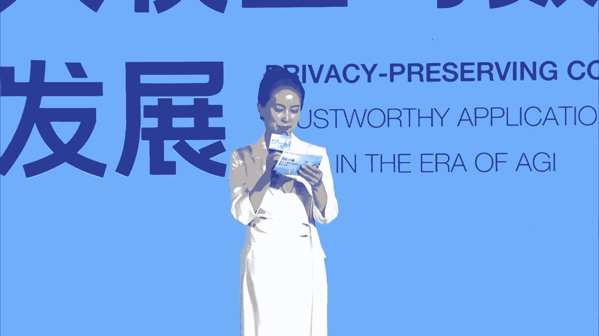
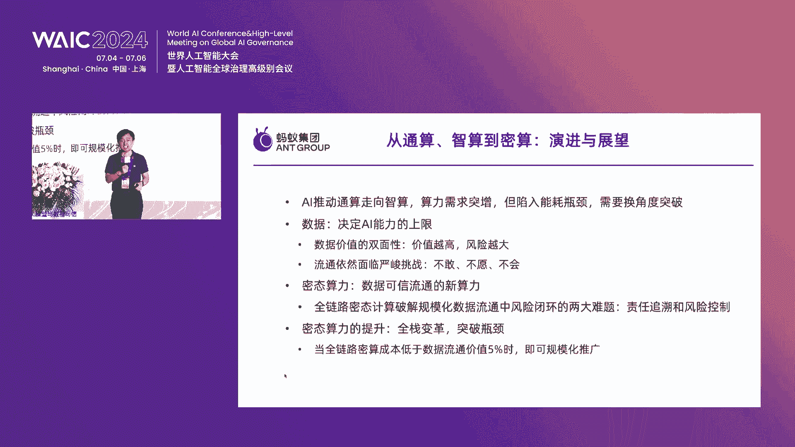
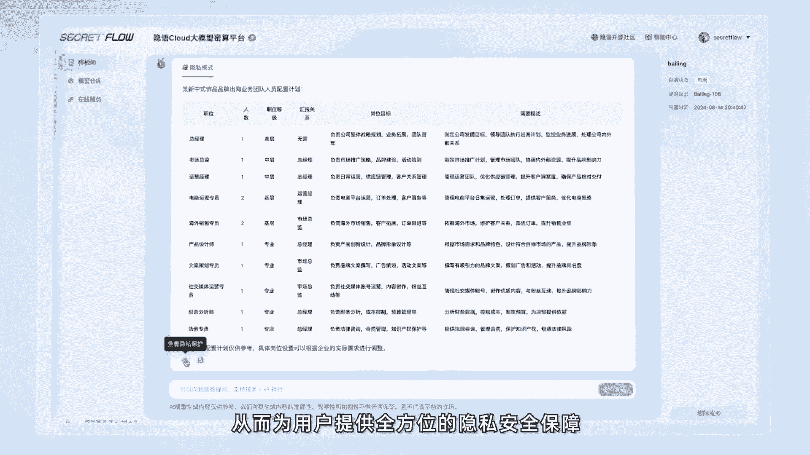
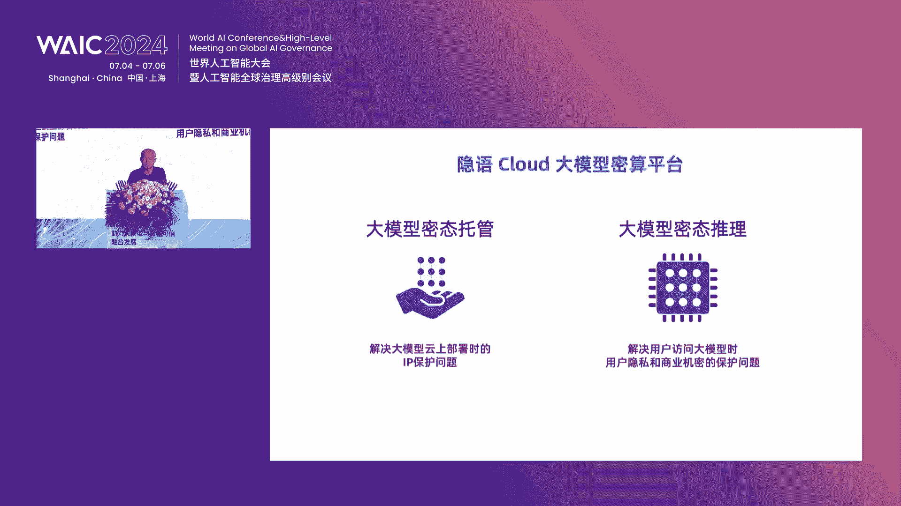

# 15：隐私计算与大模型数据可信融合 🛡️🤖

## 课程概述
在本节课中，我们将学习隐私计算如何作为关键技术，解决大模型发展中的数据安全与隐私挑战，并促进数据要素的可信流通与价值释放。课程内容整理自行业论坛的多位专家分享，涵盖了技术原理、行业实践、法律视角及未来展望。

---

## 第一节：隐私计算的重要性与时代背景 🌍

我无法亲临上海世界人工智能大会现场，但很高兴通过视频与大家交流。

尊敬的各位领导、来宾、女士们、先生们，线上的观众朋友们，大家下午好。欢迎来到2024世界人工智能大会“隐私计算助力大模型与数据可信融合发展论坛”。我是主持人霞飞，很荣幸与大家相聚。今年已是隐私计算论坛陪伴大家的第四年。

在充满变革与机遇的AGI时代，大模型重构了技术底座，加速了行业的颠覆性变革。其中，高质量专业数据的流通与共享，是推动大模型技术应用快速进步的关键要素。

如何运用隐私计算解决数据大规模应用带来的安全及隐私挑战，已成为行业热点话题。今天，我们齐聚一堂，集结众多海内外顶尖高校的著名教授以及行业专家，重点探讨这一议题。

期待本次交流能够全面链接产业链各环节，构建起隐私计算互联网生态圈，探寻平衡数据利用与隐私保护的最佳路径，助力大模型与数据可信融合发展。

---

## 第二节：开幕致辞与隐私计算的核心价值 🎤

首先，请允许我荣幸地介绍今天出席活动的领导与发言嘉宾。

接下来，让我们以热烈的掌声，有请加州大学伯克利分校计算机科学教授宋晓冬女士为本次论坛致辞。

大家好，谢谢大家。这次能为会议致辞非常荣幸。因为我长期在美国任教，所以这次致辞用英文来讲可能比较顺利，请大家包涵。

大家好，非常荣幸能为这次重要的隐私计算会议致开幕词。我是宋晓冬，加州大学伯克利分校计算机科学教授，也是伯克利全校性“负责任去中心化智能中心”的主任。

我长期从事隐私计算领域的研究，因为我个人坚信这是一个非常重要的问题。如今，随着AI技术的进步和广泛应用，这个问题变得愈发重要。

众所周知，AI技术的巨大进步主要由三个关键点推动：算法、算力和数据。在算法方面，本质上同类的算法已存在很长时间。当然，算力方面有很大改进，但只要有资金，就可以购买算力。归根结底，数据是构建优秀模型的重要壁垒，也是任何公司或机构构建特定应用模型的独特资产。

当我们谈论数据并利用数据赋能AI时，当然面临许多挑战。首先，由于隐私担忧等问题，大量数据仍被锁在数据孤岛中，许多有价值的数据未被充分利用。有讨论和估计认为，当前的基础模型已经使用了互联网上大部分可用的文本数据。然而，我们仍有许多非公开的、私有的宝贵数据，如果能利用这些数据构建更好的模型，将极具价值。

数据用于构建AI的另一个重要问题是，大量数据本质上是由用户贡献的，包括创作者、艺术家等。但不幸的是，这些用户贡献的数据所产生的价值，并未公平地归属回原始数据生产者和创作者。这带来了另一个挑战。

展望未来，我们如何构建更好的模型，如何更好地解决这些数据相关问题？隐私计算提供了一项关键技术，既能解锁这些数据的价值，也能恰当地将数据创造者和生产者贡献的价值归属回去。

隐私计算可以为AI模型的更好发展和AI技术的更广泛应用提供重要的基础技术。

谈到隐私计算技术本身，它实际上涵盖广泛谱系，包括硬件辅助技术（我们称之为可信执行环境TEE或安全飞地），以及完全基于密码学解决方案的纯软件方案，包括全同态加密、安全多方计算，甚至零知识证明等技术。

一件令人兴奋的事情是，我们在所有这些不同前沿都看到了隐私计算的巨大进步。在基于密码学的解决方案方面，我们从算法和实现层面都看到了改进。这类技术在过去几年中甚至出现了数量级的性能提升。同时，也有关于为其中一些技术（如同态加密）构建硬件加速器的讨论和实际规划。

另一方面，硬件辅助解决方案，即安全飞地TEE，我们也看到了巨大的进步。我自己的工作涵盖了两方面。但特别地，我想以硬件解决方案（TEE和安全飞地）为例，分享一些观点和例子。

如你们所知，我的团队与伯克利及其他合作者在大约五六年前开发了第一个开源、端到端的安全飞地，名为Keystone。我们当时的目标是认识到构建安全飞地的重要性，它可以作为构建安全系统的基础，并赋能隐私计算以解锁数据的价值。同时，我们也认识到实现透明度和建立开放生态系统的重要性，以确保整个社区能够验证这类解决方案的安全性，因此开源解决方案至关重要。

当时，我们还启动了一个名为“开源安全飞地研讨会”的会议。实际上，包括英特尔、Arm、谷歌等全球众多组织（我认为超过30家）齐聚一堂，讨论安全飞地的未来发展。

我可以分享几个轶事。一是大约五年前，英伟达团队访问了伯克利。我们当时的目标是说服英伟达，尽管我们有CPU的安全飞地，但为GPU配备安全飞地或机密计算能力也非常重要。我们解释说这不会太困难，而且会非常有帮助。我不确定我们对此有多大贡献，但当H100推出机密计算功能时，我们真的非常高兴看到这一点。

在研讨会上，如我所说，我们大约五六年前启动。五年前，我做出了一个预测：十年内，大多数芯片都将拥有安全飞地。现在五年过去了，我们还有五年时间来验证我的预测是否正确。但至少目前，我认为我们正走在非常好的道路上。现在，大多数服务器CPU芯片已拥有安全飞地。而且，随着英伟达GPU具备机密计算能力，未来所有先进的英伟达GPU芯片都将拥有机密计算能力。我认为，在隐私计算领域，这是一个惊人的时代。我们可以预见，未来几年，随着新芯片投入云端，大多数云服务器实际上都将拥有安全飞地能力。

有了硬件方面的这种支持，以及我提到的基于密码学的软件方案方面的许多投资，我认为隐私计算领域正处于一个拐点。许多事情，即使我们多年前就在讨论这些问题，但当时无论是硬件还是软件方案都尚未完全成熟。现在我非常兴奋，我认为整个领域真的来到了一个拐点。

有了这项技术，正如我之前提到的，它具有巨大的能力和影响力。一是当然可以为数据提供更强的安全性和隐私保护，也能为计算结果提供更好的完整性保证，从而真正作为安全和隐私保护计算的基础。

另一部分是，鉴于数据具有非竞争性属性。与物理对象不同，只有一个人可以持有该对象。但对于数据，一旦数据被他人复制，原始数据所有者就失去了对该数据副本的控制。这也是为什么我们真的需要隐私计算技术，这样我们可以在数据上进行计算，同时确保数据不会被复制或窃取。

这本质上可以帮助形成一种新型资产，称为数据资产。据我了解，中国现在也有数据保护以及数据资产的新政策。隐私计算本质上是构建数据资产的基础构件和平台。没有隐私计算，我们就无法谈论数据资产。数据不是资产，因为任何人如果想在数据上计算，就必须复制数据，然后你就会失去对数据的控制。因此，隐私计算是数据资产的必要组成部分和赋能者。

回到数据对AI和构建AI模型的重要性，隐私计算因此也是构建更好AI的关键赋能者。

我还想稍微拓宽一下范围。本次活动聚焦于隐私计算，但我也想简要地进一步拓宽范围，说明一些其他相关主题，这些主题在讨论隐私计算和数据资产时也非常重要。

一个部分是，如我们所知，隐私问题非常复杂，本质上发生在多个层面。一是在计算层面，即隐私计算。另一层面是保护计算结果，防止其泄露原始输入的敏感信息，因为原始输入可能是敏感的。我们与其他合作者的一些工作表明，这些AI模型即使我们能完全保护计算过程，但学习到的模型本身实际上可能记住大量原始敏感训练数据。攻击者仅通过查询模型，甚至无需知道模型细节，就可以从原始训练数据中提取敏感信息。因此，在我们训练这些AI模型和发展AI技术时，除了计算层面，我们还需要思考这一层面的隐私问题，以保护计算结果不泄露原始输入的敏感信息。

再进一步拓宽，当我们谈论数据资产时，正如我最初提到的，另一个重要问题是，我们也希望确保最终输出（例如训练好的AI模型）在产生价值并获得价值时，这些创造的价值也能恰当地归属回原始数据贡献者。尤其是展望未来，确保AI技术真正惠及每个人非常重要。因此，探索如何恰当地将创造的价值归属回原始数据贡献者，对于公平的价值归属以及为数据贡献者提供良好激励以贡献更多数据非常有帮助。我们早期的一些工作首次提出了一个使用夏普利值的严格数据估值框架，以计算数据估值，即模型创造的价值如何归属回原始数据点等。当然，这仅仅是第一步，仍有许多开放性问题。实际上，将价值归属回原始数据贡献者（包括创作者等）的最佳方式是什么？例如，AI模型潜在的版权问题或版权侵权问题也是当今的一大问题。

首先，正如我提到的，我对隐私计算处于拐点感到非常兴奋。最后，我想以我的几个预测结束。第一个预测我重复一下，即使五年前，我也说过十年内大多数芯片将拥有安全飞地。我希望这能在五年内真正实现。下一步是，十年内，大多数计算将以隐私保护的形式进行，例如在安全飞地中。最后，我们希望未来能看到数据资产成为一种重要的资产类型，也能看到新型实体（如数据信托等）被创建，以帮助管理用户数据，并帮助用户从其数据中获得更大价值。

在此，我欢迎大家参加这次关于隐私计算的重要会议。谢谢。

感谢宋教授的精彩发言。相信未来隐私计算作为基石，必将推动大模型与数据的可信融合发展。

---

## 第三节：行业实践：绿色算力与数据可信流通 ⚡

接下来，首先有请金和平先生上台为大家分享。

尊敬的各位朋友，今天借世界人工智能大会的机会，跟各位分享一下我们三峡集团在人工智能产业生态构建方面的一些实践。

应用生态大家都非常清楚，算力、算法和数据缺一不可。在此基础上，可以支撑众多的应用。三峡集团在整个算力、算法、数据方面，围绕长江流域以及可再生能源（水、风、光等能源）的开发，做了一个系统完整的布局。

首先是先进绿色算力方面。大家最近听得比较多的是马斯克以及西方很多观点都提到，算力的尽头是电力，因为所有的0和1都离不开电的支撑。近年来，特别是去年大模型爆发后，算力增长引发了新一轮对数据中心基础设施，即电力供给、能源供给的快速增长。

过去的普通计算、云计算、超算在未来算力需求和能源消耗中的比重会逐渐降低。人工智能计算离不开能源的支撑。这里有个大概数据，不同口径统计不一样，目前整个数据中心的耗电量大概在2到3个三峡的年发电量之间（三峡多年平均发电量约1000亿度）。实际上，今后整个算力对电力需求的增长，相对于其他行业会上升得更快，这个比重会越来越大。特别是大模型训练带来的能源消耗是巨量的。所以，绿色算力，包括蚂蚁等互联网公司以及国际算力巨头，都要求能源消耗绿色化，这也带来了很大挑战。

算力加能源，从我们国家战略布局上看，也很早就提出来了，包括发改委近几年的“东数西算”布局。因为西部绿色能源更加富集，能够把算力逐步向西部引导。工信部出台的算力基础设施也提出了算力加能源的耦合模式。未来的电力系统，能量供给的主体肯定会向以风光为主的新能源替代方向变革，国际上也是一样。我们国家每年电力供应的增量80%以上都来自于风和光。但从能源行业来看，算力未来将是增长最快的负荷之一。目前负荷增长最快的是电动车，每年的电力消耗增长也非常快。而且在全球范围内，未来终端能源消费中，煤、油、气目前占比最高，但未来要完成“3060”双碳目标，也要往电能上转。数据中心显然是一个非常重要的、也是增长最快的电力消费场景之一。

所以，算力需求的快速增长，也将有效带动能源生产和消费模式创新，促进能源行业绿色低碳转型和能源产业的高质量发展。

在绿色数据中心、绿能算力协同耦合的模式上，总的来看，在我们国家还没有得到很好的破题，目前还处于初步探索阶段。第一种当然是绿电直供型，即能源企业依靠自身电站发电，绿电直供数据中心。例如，我们在三峡坝区所在地建了一个目前体量最大的零碳数据中心，依靠自己的水电绿电直供。

第二种是绿电交易型。目前电网上的电还是以火电为主，很多企业就付出额外溢价购买绿电。例如，苹果的iCloud数据中心在乌兰察布、贵州都是以这种模式，购买电网中绿电企业直供的绿色电力。

第三种是源网荷储一体化数据中心。这种模式目前也还只是初步探索，例如中国电信在青海做了尝试，三峡也做了很多探讨。

还有一个是在数据要素流通方面。今天论坛的主题是可信数据计算流通，我们也在做一些探索型的工作。三峡主要在长江流域的开发、治理和保护方面，是国家的国家队。我们在这一块构建了一个围绕流域开发治理的数据要素流通交易平台。

长江流域不用讲，上海就属于长江流域，是我们国家经济绝对的主要引擎，经济总量和人口都占近一半，拥有丰富的数据资源和广阔的应用场景，包括经济、社会、生态、交通、水资源、能源等。

我们正在做的一个工作是，面对长江流域开发治理保护的各项专项业务目标，打造一个可信数据空间。当然，这个可信数据空间除了共享、交易、流通以外，也可以为目前的大模型提供训练数据。我个人的观点是，我们国家发展大模型最大的优势还是我们的语料和场景，由于产业发展速度快，相对于美国可能更加丰富。我们可以为模型训练数据企业提供一个安全可控的分析平台。刚才教授讲到的各种技术，包括数据不动、程序动、可用不可见、分享价值等，我们都在不同的组织之间应用。长江流域的可信数据空间或流域要素流通平台，不光涉及企业，也有政府、科研单位、社会组织。数据在不同组织之间流动，不光是技术，还有不同的模式，是我们打造的一个数据要素汇聚平台。

另外，在模型层面，我们也打造了一个行业大模型，取名叫“大禹”大模型。因为我们是治水出身的。大家都知道，我们在长江上游建的骨干水库主要功能是防洪。我可以骄傲地跟大家讲，这两天上海如果没有受到洪水侵害，肯定是因为我们上游的几大水库都减小了下泄流量。我昨晚从武汉赶过来，武汉办公楼门前的江滩平台已经被淹了。平时我们可以在长江边散步，但这两天不行。三峡这几天下泄的流量，来水大概2万多立方米每秒，我们仅下泄一半。所以，这样一个面向水、电行业的整体架构，我们分为基础层、行业层和应用层来构建大模型的整体解决方案。

当然，技术层我们主要用行业内的通算层面，与业界如百川、星火、华为、电信等都有合作，做通用的大模型AI服务。在行业垂直AI服务方面，我们做了大量工作，比如防洪、水资源管理、泥沙、电站运维巡检等，构建这些垂直模型。在场景方面，我们具体在电力生产、防洪和泥沙方面开展了一些探索工作。

其实，现在做行业大模型有很多，特别是传统产业有一个“不可能三角”：泛化性、经济性和专业性。如果做得太通用，对行业不适应；模型规模过大，训练成本过高，传统产业难以承受；泛化能力强了，专业性又不够。所以，行业大模型是人工智能落地的最后一公里。从通才往专才转移，我们经过近两年的实践，做了大量探索，在高性价比、泛化能力强、保证数据安全方面都做了一些探索。时间关系不细讲，我们还在路上。

“大禹”模型是国内首个水利水电行业大模型。现在的知识问答已经相对成熟。过去，防洪“20年一遇”、“30年一遇”、“百年一遇”都搞不清楚。经过大量语料训练后，可以非常专业、权威地解答，包括对员工的培训、数字提升方面起到了很好的作用。办公助手等通用功能上，也为企业提升运营效率做了一些有益探索。

我们未来的布局是在三位一体战略下构建AI应用生态。首先是绿色算力的供给能力。三峡是全世界生产绿色电（不含碳的电）最多的企业，每年不含碳的电量超过4000亿度。我们的风光装机是5000多万千瓦，水电装机能力和发电量都是世界领先。特别是海上风电，算力需求较大的区域，我们都有规模非常大的海上风电开发，也在布局深海海上风电。这一块，世界上最大的清洁能源源源不断地供应上海，上海有将近三分之一的电来自三峡集团的六座大坝。

零碳数据中心我刚才也提到，我们在三峡坝区已经打造了一个。另外，我们在韶关和腾讯合作，在内蒙古与华为合作，都在进行一些算电协同。刚才跟电信的宝骏总交流时，他特别说对算电协同或绿电算力耦合特别感兴趣，希望我们能形成一个相对成熟的模式，现在还属于探索阶段，因为电力体制比较复杂。但我们在三峡坝区已经打造出了一种成功模式，包括节能方面利用江水能源。

在可信数据流通方面，长江流域数据要素平台分了10多个专业，数据商店也分了10多个分店，有不同的“店长”。举个简单例子，水文数据（水的流量和水位），各个单位都在建水文站，长江委、三峡、各地政府都在建。要形成一个完整的水文数据，我们却形成不了，怎么办？他的数据也不可能完全共享，资产是人家的。通过可信计算、数据流通的相关技术，能够把很多专业数据形成一个完整的数据产品，大家来进行共享、互换或交易。我们组建了长江数据要素联盟，产学研用各单位参与，以武汉为中心，有几十家单位参加。这个平台目前已经上架了100多款产品，交易量还不算太大，我们也想跟在座的各位企业家、科研单位一起探讨，把这块做大。

例如，我们做的流域水体含沙量动态监测、泥沙问题、建水库后泥沙下泄情况、地震地质灾害监测等，都是很专业的数据。

在可再生能源领域，我们最近建设了首个AI靶场。过去，水、风、光都是不确定的自然资源，预测总是不准，特别是中长期更不靠谱，短期也不行。我们建立了一个可再生能源AI靶场，用于气象高精度预测和功率预报，即水电、风电功率预测、光伏功率预测。特别是在风功率预测靶场，中国最领先的功率预测厂家都已到我们的靶场来PK。我们选用最好的模型为风电场服务，考核损失电量一下子降低了20%，精度提高得非常快。这对整个能源系统的安全和场站经营运行效益提升都非常显著。水温预报我们也来做靶场，这个月训练数据就会出来。

最后，我热诚地希望大家，三峡集团作为全世界最大的清洁能源企业，愿意和在座的各位合作。我们上游做好绿色能源供给，中游为各位提供我们丰富的场景和积累的各方面数据，下游也可以为大家提供丰富的场景，包括我们的靶场，提供一个大家相互提高、竞技的AI舞台和靶场，共同推动整个长江流域或未来清洁能源开发的高质量发展。

好的，感谢金总的精彩演讲。我们相信，先进绿色算力、可信流域数据、大禹行业模型三位一体的应用实践，一定会构筑可再生能源领域的人工智能示范标杆。

---

## 第四节：从通算、智算到密态算力：演进与展望 🔐

接下来有请蚂蚁集团副总裁、首席技术安全官韦韬先生，