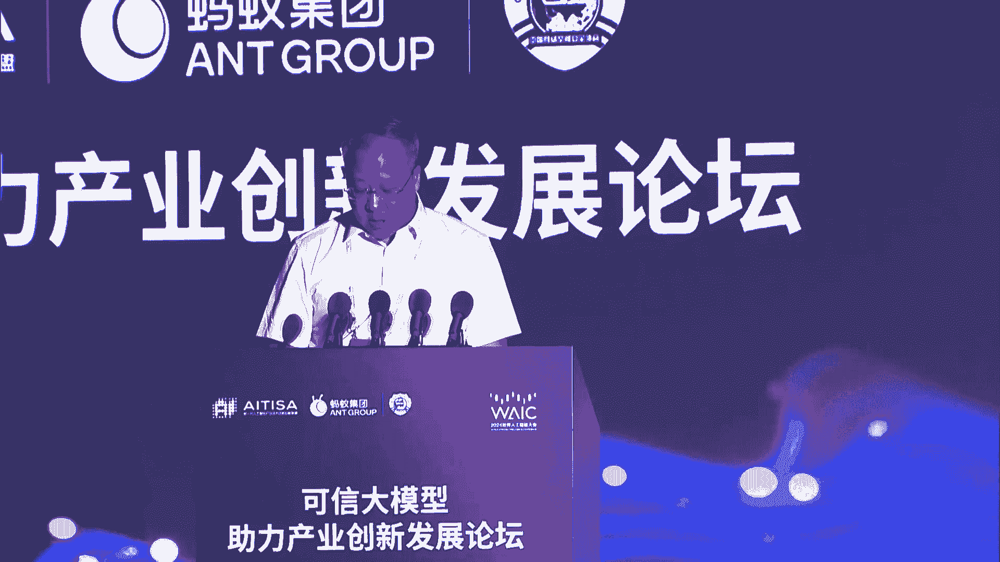
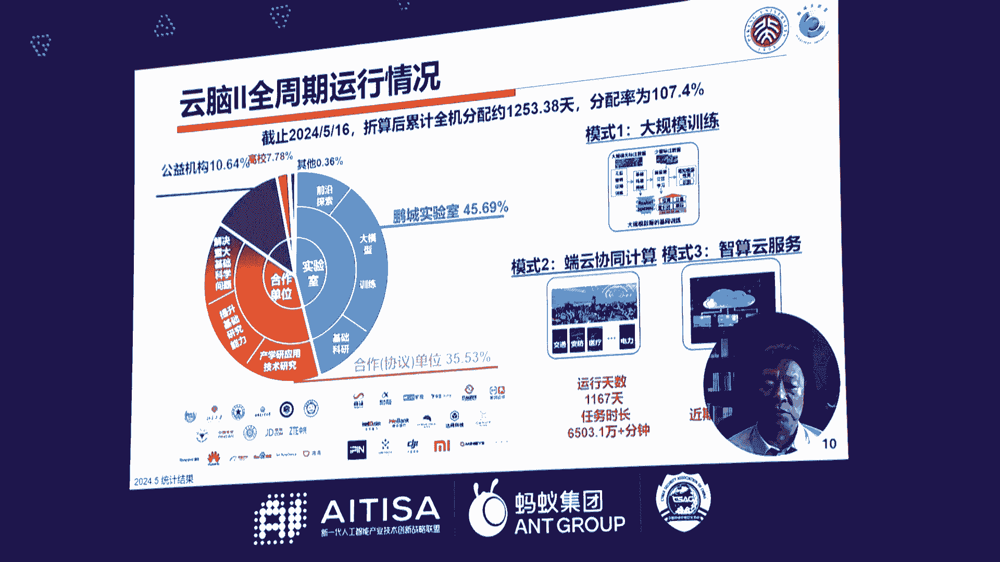
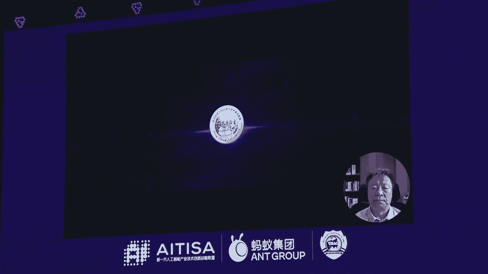
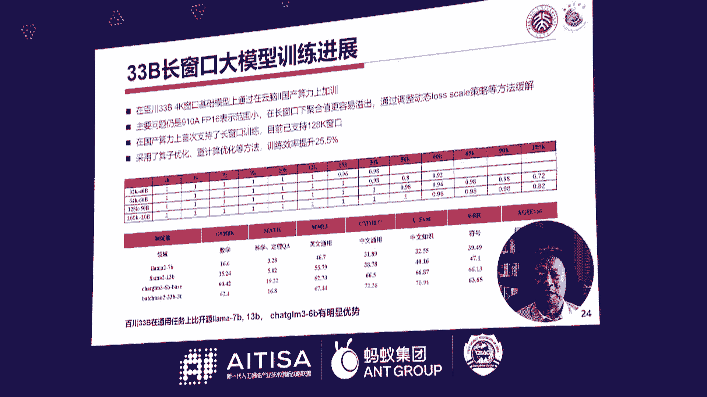
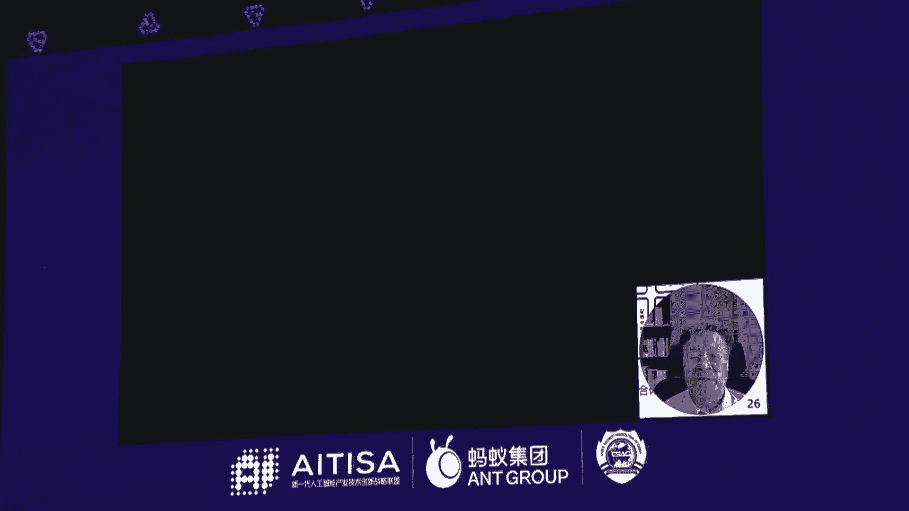
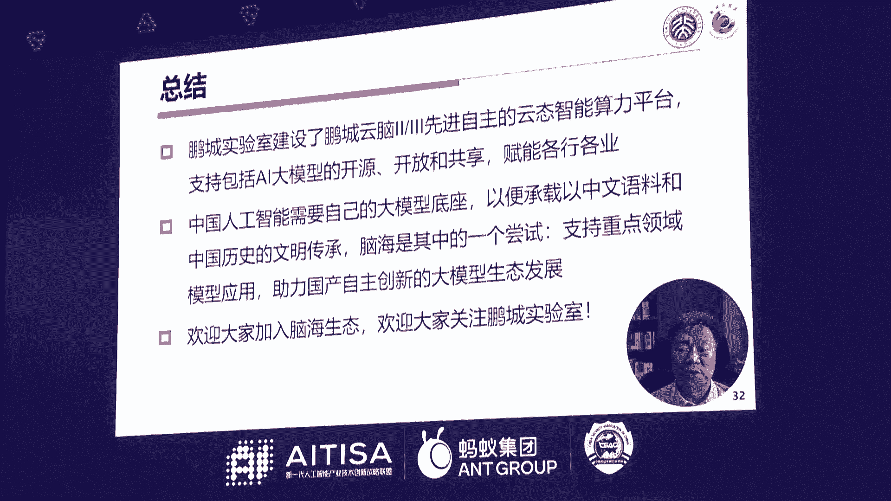
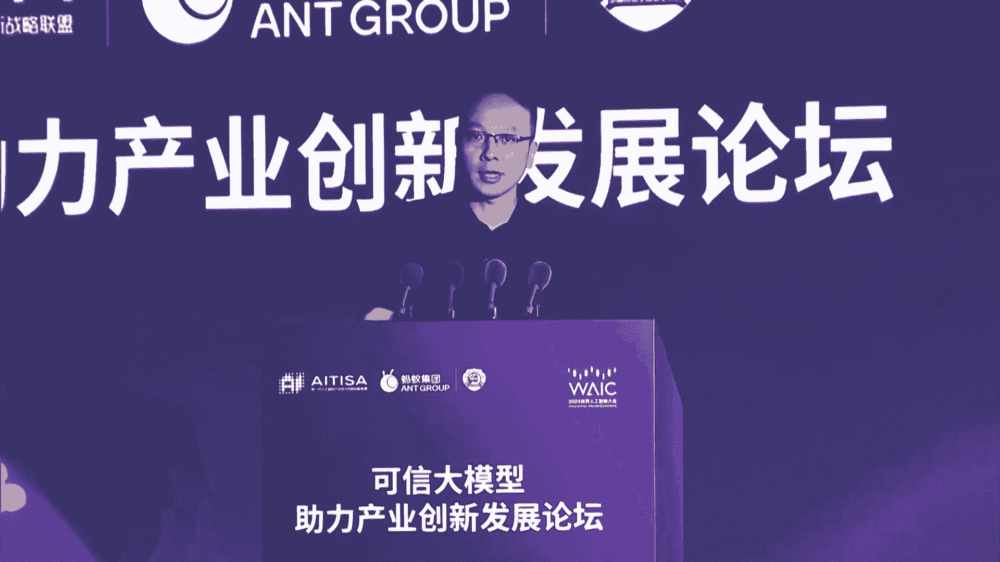
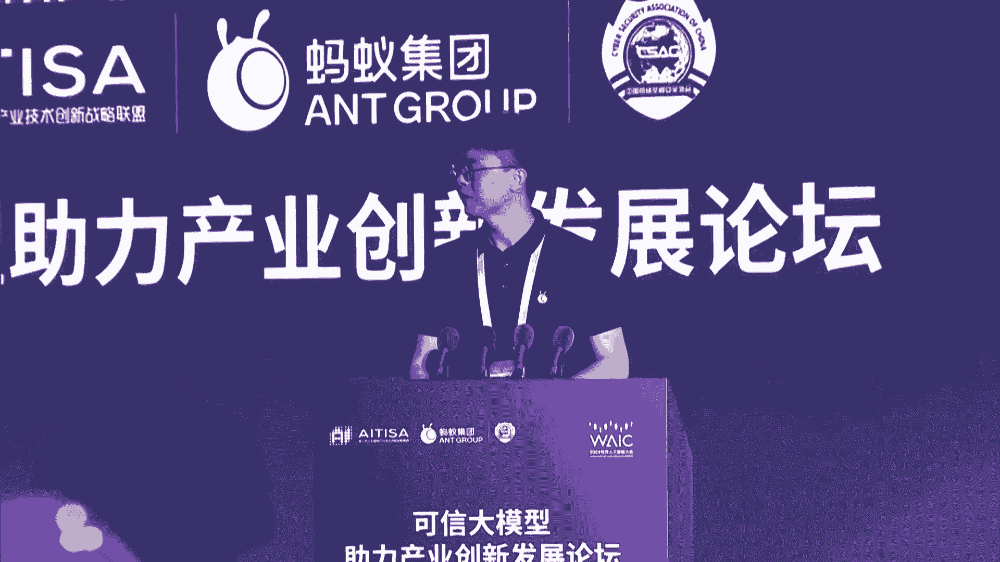

# 16：可信大模型助力产业创新发展论坛精华教程 📚

## 概述
在本节课中，我们将学习2024年世界人工智能大会“可信大模型助力产业创新发展论坛”的核心内容。课程将涵盖大模型技术的发展现状、可信人工智能的构建、产业应用实践以及未来展望。我们将以简洁明了的方式，整理并翻译论坛中的关键发言，帮助初学者理解大模型技术及其在产业中的创新应用。

---

## 篇章一：大模型产业应用的机遇与挑战 🚀

### 1.1 论坛开幕与领导致辞
本次论坛由世界人工智能大会组委会办公室指导，新一代人工智能产业技术创新战略联盟主办，蚂蚁集团承办。论坛主题为“可信大模型创新应用，激活产业新智生产力”，旨在探讨如何打造准确、专业、真实、严谨、可控、透明、安全合规的可信大模型，推动其助力千行百业高质量发展。

中央网信办网络安全协调局副局长王银康在致辞中强调，人工智能是新一轮科技革命和产业变革的重要驱动力量。他提出四点关于人工智能安全治理的看法：
- **坚持包容审慎、确保安全的原则**：鼓励创新，同时对危害国家安全、社会公共利益的风险及时采取措施。
- **坚持风险导向、敏捷治理的原则**：科学认定和分类风险，动态更新防范措施。
- **坚持纪管结合、协同应对的原则**：综合运用技术和管理措施，明确各环节安全责任。
- **坚持开放合作、共享共治的原则**：推动全球人工智能安全治理国际合作，共享最佳实践。

工业和信息化部科技司副司长刘伯超在致辞中提出三方面建议：
- **强化技术支撑**：加强人工智能治理基础理论和前沿技术研发，特别是可解释性研究。
- **加快产业实践**：产学沿用各方携手加强风险研判与规则共商，构建人工智能发展治理提升的正向循环。
- **坚持开放合作**：推进数据开放共享，强化政策规则标准对接，推动建立科学合理的人工智能国际治理体系。

### 1.2 推动发展可信人工智能
中国网络空间安全协会理事长赵泽良以“老程序员”的身份分享了对大模型发展的思考。他指出，当前的大模型（基于Transformer的语言模型）在生成任务中存在不确定性，但在分析和判断任务中表现优异。因此，应重视大模型在专业领域、细分领域和垂直领域的应用。

赵泽良还提到，大模型的发展需要注重理论创新，突破现有技术框架。他呼吁关注大模型对环境的影响，并科学有效地发展技术，避免盲目追求参数规模和数据量的增长。

### 1.3 鹏程云脑与脑海系列大模型
中国工程院院士、鹏程实验室主任高文介绍了鹏程云脑计算平台和鹏程脑海系列大模型。鹏程云脑2是目前全球计算密度最高、算力规模最大、训练速度最快的AI计算平台，连续8次在Top500榜单中夺冠。鹏程云脑3正在建设中，算力将达到16000P。

鹏程脑海系列大模型包括7B、33B和200B三个版本，其中200B模型训练成本接近5亿人民币。高文院士强调，中国需要自己的大模型底座，以应对国际技术限制。鹏程脑海模型将通过开源方式，赋能产业生态发展。

---

## 篇章二：大模型技术创新与应用基础 🛠️

### 2.1 大模型进展与思考
智源研究院理事长黄铁军从技术角度分析了大模型的发展。他指出，大模型基于神经网络训练，其智能来源于数据驱动，而非人为设计的规则。这种自底向上的方式使得大模型具有强大的能力，但也带来了不可解释性和不确定性。

黄铁军将通用人工智能（AGI）分为五个级别：
- **Level 1**：认知水平低于人类，可替代部分人类智能。
- **Level 2**：认知水平全面超越人类，但仍可建立理性信任。
- **Level 3**：具备具身智能，感知和运动能力超越人类。
- **Level 4**：产生自我意识。
- **Level 5**：人工智能自主发展，不再依赖人类数据。

他认为，当前大模型处于Level 1阶段，未来10到20年可能逐步向更高级别发展。

### 2.2 垂直领域大模型与人工智能体
浙江大学人工智能研究所所长吴飞介绍了“智海”系列垂直领域大模型。他指出，大模型的核心能力在于预测下一个单词，并通过下游任务微调，将这种能力迁移到实际应用中。垂直领域大模型（如司法、教育、金融）通过高质量领域数据训练，能在特定任务上媲美甚至超越通用大模型。

吴飞还提到，人工智能体（AI Agent）是大模型与工具结合的关键，能够将大模型的“大脑”与“手和脚”连接起来，完成复杂任务。浙江大学已将人工智能纳入通识课程，培养学生的人工智能素养。

### 2.3 大模型可信应用架构
中国信息通信研究院人工智能研究所所长魏凯分享了大模型可信应用架构的思考。他指出，大模型在行业中的应用正从简单场景向复杂场景延伸，但落地过程中仍面临诸多问题。他提出从五个方面体系化保障大模型应用的可信性：
- **数据源头**：加强训练数据和微调数据的质量管理。
- **模型专业增强**：结合知识计算与概率推理，提升模型专业性。
- **内容生成可控性**：通过检索增强生成（RAG）和工具调用，增强生成内容的可控性。
- **智能体开发**：将大模型封装为智能体，提升生产力。
- **持续迭代与评测**：通过全生命周期监测和评测，优化模型表现。

魏凯强调，金融、医疗、政务等行业对大模型可信性要求极高，需要产业上下游共同努力推动技术创新和生态协作。

### 2.4 蚂蚁百灵大模型多模态能力升级
蚂蚁集团副总裁徐鹏介绍了蚂蚁百灵大模型在多模态能力方面的升级。蚂蚁百灵大模型通过原生多模态架构，实现了文字、图像、视频、语音的联合处理能力。这种架构支持动态扩展，能够灵活适应新模态数据的加入。

徐鹏演示了多模态大模型在智能生活管家、智能金融管家和AI就医助理等场景中的应用。蚂蚁集团通过强化学习、奖励模型扩源等技术，提升模型的安全性和实用性。未来，蚂蚁将继续与产业伙伴合作，推动大模型在严谨行业的规模化应用。

### 2.5 多模态遥感大模型
武汉大学教授张永军介绍了蚂蚁集团与武汉大学联合研发的多模态遥感大模型“SkyCi”。该模型基于全球超过2000万个样本训练，参数规模达20亿，覆盖高分光学、多光谱、时序光学等多种模态数据。在17个公开数据集的测试中，SkyCi在7项遥感解译任务中均名列第一。

SkyCi具备多模态信息融合和跨任务通用解译能力，在自然资源调查、农作物监测、视觉导航等领域有广泛应用潜力。目前，SkyCi处于定向开源阶段，未来将全面向学术界开放。

### 2.6 从ChatGPT发展看大模型技术创新
OpenAI原研究员肯尼斯·斯坦利通过线上分享，探讨了大模型技术创新的实践与展望。他指出，当前大模型在创造性任务中仍存在局限，但通过外层算法（如进化算法）引导，可以探索设计空间，生成训练数据中不存在的新设计。

斯坦利认为，大模型在兴趣提取和匹配等任务中表现优异，可能是当前的“杀手级应用”。未来，大模型的发展需解决数据稀缺、架构创新等问题，同时关注多模态能力和人机协作的应用前景。

---

## 篇章三：大模型产业应用与创新实践 💡

### 3.1 高峰对话：大模型爆款应用的N种可能
在高峰对话环节，多位行业专家探讨了大模型爆款应用的可能性。以下是对讨论要点的整理：

**大模型发展阶段**：
- 大模型技术仍处于早期阶段，类似上半场的起跑阶段。
- 开源生态尚未完全成熟，需要进一步开放以促进应用创新。

**爆款应用方向**：
- **C端应用**：对话助手、图像生成、视频创作等场景有望爆发，但需底层技术进一步突破。
- **B端应用**：知识密集行业（如医疗、金融、法律）是大模型落地的主要场景，通过提供“心智生产力”赋能行业。
- **智能体**：智能体作为人与大模型的桥梁，有望成为爆款应用，降低使用门槛。

**行业落地挑战**：
- 数据可获取性、质量和版权问题是行业应用的主要障碍。
- 需要与行业用户深度共创，结合领域知识和数据，实现场景化落地。

**职业与教育影响**：
- 大模型不会完全取代人类，而是提高供给，创造新的就业机会。
- 人工智能将成为基础工具，每个人都需要掌握相关技能。
- 教育方式需调整，注重培养创造力和跨学科能力。

**未来展望**：
- 明年B端应用将加速落地，C端应用百花齐放。
- 未来2到3年，可能出现颠覆行业工作流程的应用。
- 个人数字分身和完全的个人助理是值得期待的方向。

### 3.2 支付宝多模态医疗大模型发布
蚂蚁集团大模型应用部总经理顾进捷介绍了支付宝在医疗领域的AI布局。支付宝医疗健康频道已服务8亿用户，接入3600多家医院。基于百灵大模型的多模态能力，支付宝推出了全国首个城市级健康数字人“安诊儿”、医保数字智能体“杭州医保小智”等应用。

支付宝多模态医疗大模型支持千亿参数规模，具备原生多模态架构，可实现语音、视频、文字的联合交互。在体检报告解读、毛发检测等场景中，识别准确率超过90%。此外，蚂蚁还推出了医疗可信一体机解决方案，支持国产化芯片和密态计算，加速医疗AI应用落地。

---

## 总结
本节课中，我们一起学习了可信大模型助力产业创新发展的核心内容。我们从论坛开幕与领导致辞开始，了解了人工智能安全治理的重要原则。随后，我们探讨了大模型在产业应用中的机遇与挑战，包括垂直领域应用、可信架构构建和多模态能力升级。最后，我们通过高峰对话和医疗大模型发布案例，看到了大模型在行业中的创新实践和未来潜力。

大模型技术仍处于早期阶段，但其在知识密集行业的应用已展现出巨大价值。未来，随着技术进一步成熟和生态协作深化，大模型将为千行百业的高质量发展注入新动力。希望本教程能帮助你初步理解大模型技术及其产业应用，为后续学习打下基础。