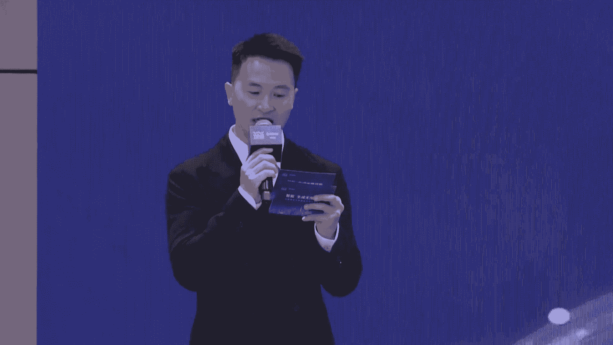
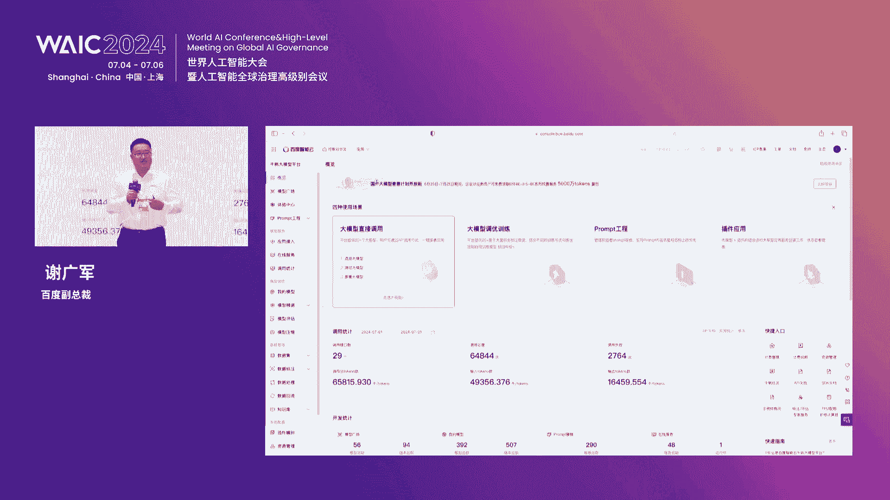
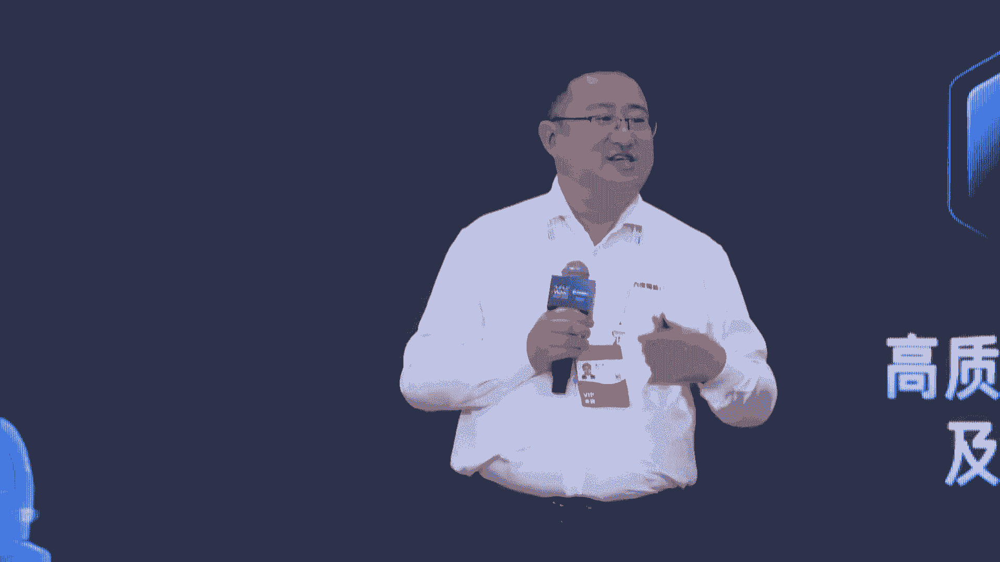
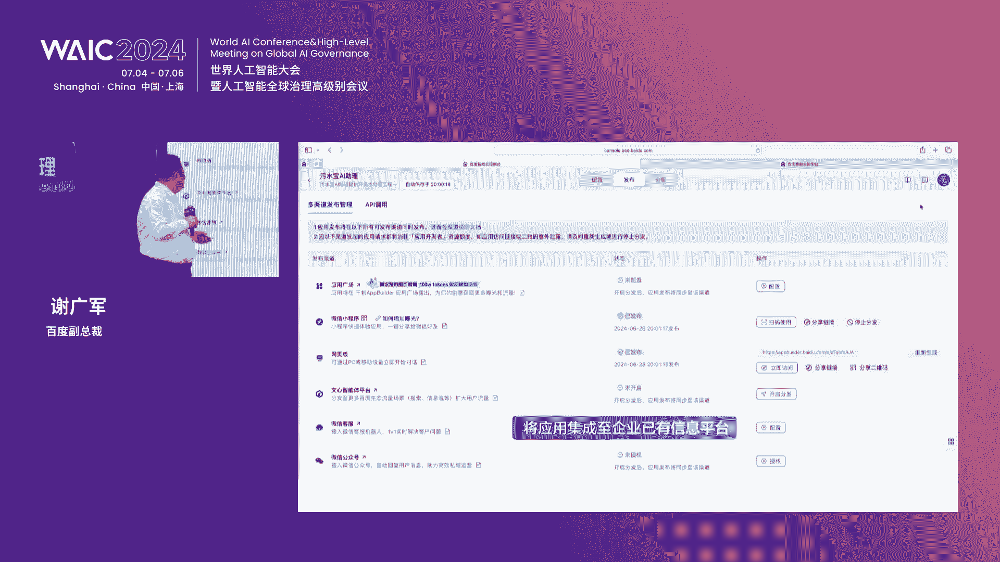
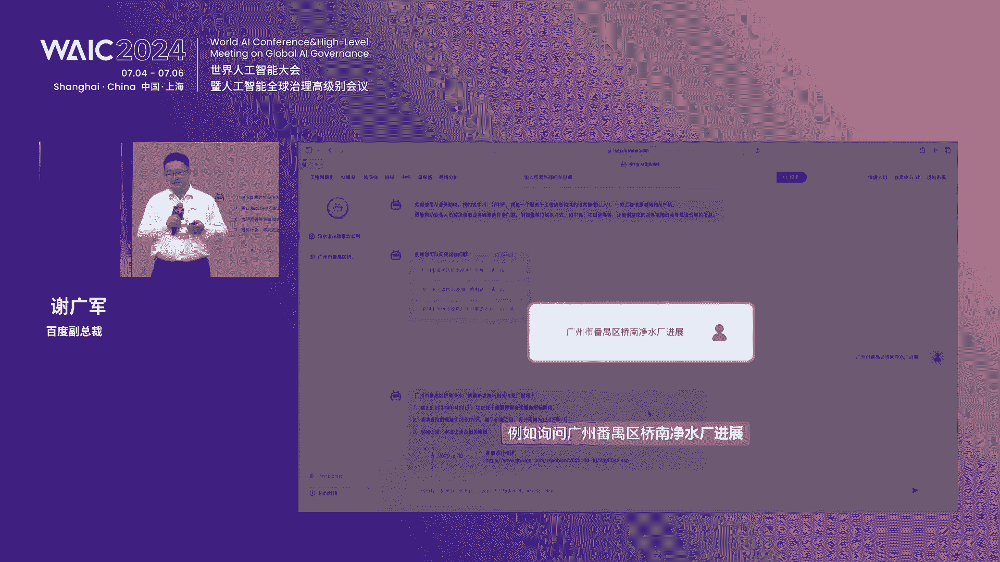
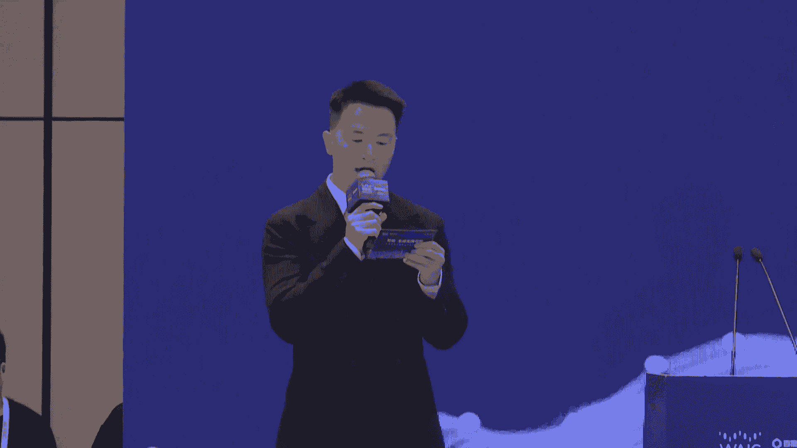
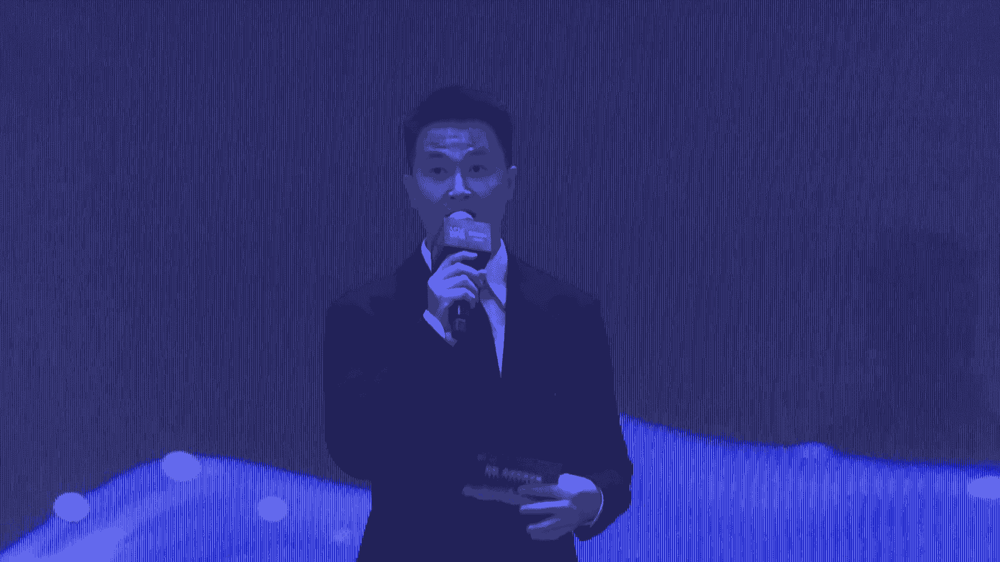

# 17：大模型赋能产业智能化实践教程 📚

## 概述
在本节课中，我们将学习百度智能云如何通过其“千帆”大模型平台，推动人工智能大模型在千行百业中的落地应用，并助力新质生产力的发展。课程内容涵盖了大模型产业的发展现状、核心平台架构、关键技术突破以及在交通、医疗、教育、城市治理等多个领域的实际应用案例。

---

## 第一节：大模型产业的现状与机遇 🌱

近年来，AI大模型以前所未有的速度改变和重塑着我们的生产和生活。从智能制造到智慧医疗，从金融科技到教育创新，其强大的数据处理能力、深度学习的洞察力以及跨领域的泛化能力，正在重新定义行业边界。

大模型的发展初期，类似于毛竹的生长。毛竹在最初的几年里主要在地下拓展根系，一旦破土而出，便能在短短几周内长到十几米高。当前，人工智能和大模型也正处于这样一个产业爆发的初期阶段。虽然尚未出现现象级的爆款应用，但在过去一年中，大模型已经开始在行业中快速渗透，展现出前所未有的积极性和创新力。

从战略洞察来看，未来三年大模型最大的机会在于应用端。科技企业、国企、央企和大型民营企业将率先享受到这一波红利。大约两三年后，才可能在消费端（C端）出现颠覆性的产品。

---

## 第二节：降低大模型应用门槛的关键 🔑

当前，产业界关注的核心是“产业”和“场景”两个关键词。要让大模型真正创造价值，关键在于降低其使用门槛，并将其与具体的产业场景深度融合。

百度智能云的实践路径是：首先由技术专家深入产业，理解业务逻辑和生产流程，亲自下场为企业提供服务。在验证了价值后，将这些重构的经验、技术组件、行业Know-how和最佳实践沉淀到“千帆”平台中。目前，该平台已服务超过10万家企业、500多个行业应用场景和几十万个原生应用。

为了进一步降低行业客户的使用门槛，百度在通用“千帆”平台之上，还推出了行业增强版，如工业版、交通版、政务版、金融版等，封装了各垂直领域的独特需求。

---

## 第三节：千帆大模型平台的核心架构 🏗️

百度构建了完整的大模型产业化落地技术栈，主要分为三层：

1.  **算力层：百度百舸AI异构计算平台**
    *   **核心功能**：提供稳定、高效、易运维的AI异构计算平台。
    *   **关键技术突破**：实现了“多芯异构协同训练”，允许同一集群中不同品牌、不同厂商的AI芯片协同工作，训练效能可达单一芯片的95%-97%，显著降低了企业的算力成本。

2.  **模型层：千帆Model Builder（大模型开发平台）**
    *   **核心功能**：不仅预置了百度文心系列模型及众多开源、三方模型，更重要的是提供了一整套大模型开发工具链。
    *   **关键升级**：
        *   **模型效果提升**：支持DPO、KTO等新的人类对齐方式，使模型输出更符合用户偏好。
        *   **成本优化**：支持INT8、FP8等量化压缩方法，降低推理成本与延迟。
        *   **数据增强**：独家提供“混合训练”功能，平台预置大量（可用不可见）数据样本，可帮助企业在精调模型时，既补充垂直领域语料不足的问题，又能防止模型遗忘通用能力。

3.  **应用层：千帆App Builder（AI原生应用开发平台）**
    *   **核心功能**：极大简化AI原生应用的开发。
    *   **关键特性**：
        *   **丰富组件**：提供60多种工具组件。
        *   **交互升级**：支持开发3D数字人交互应用。
        *   **工作流编排**：通过可视化拖拽方式，将业务流程编排为确定性的执行步骤，无需编写代码。
        *   **企业级知识库**：提供可扩展、策略可配、安全稳定的知识库增强（RAG）能力。
        *   **RAG with 百度搜索**：独家能力，将百度搜索引擎的实时、海量信息与大模型总结能力结合，用于垂类问答场景。
        *   **灵活部署**：全面支持公有云、私有化及混合云部署模式。

---

## 第四节：行业应用实践案例 🏥

以下是千帆平台在不同行业的具体应用案例：

### 案例一：医疗领域 - AI医生助理
*   **解决痛点**：医生工作繁忙，书写病历、重复问诊耗费大量精力。
*   **解决方案**：基于千帆平台训练医疗垂类大模型，打造具备“听说读写”能力的AI医生助理。
*   **实现功能**：
    1.  在诊室聆听医患对话，自动生成病历和医嘱草稿。
    2.  在病房跟随医生查房，辅助记录。
    3.  术后根据医生口述，自动生成手术记录。
*   **效果**：服务了45家医院和1.5万家基层医疗机构，将医生从繁琐事务中解放出来，使其能更专注于诊疗决策和患者关怀。经对比，其模型性能达到国外同类模型的1.7倍。

### 案例二：教育领域 - AI赋能医学考试培训
*   **解决痛点**：传统医学教育依赖题海战术和视频课程，医护人员学习耗时⻓、效率低。
*   **解决方案**：基于20年积累的医学知识图谱和百亿级用户数据，结合千帆大模型平台，打造场景化、个性化的AI学习产品。
*   **实现功能**：
    1.  **智能测评**：识别用户薄弱知识点。
    2.  **AI出题**：针对薄弱点生成个性化练习题。
    3.  **千人千面**：为不同用户提供定制化的学习路径。
*   **效果**：AI产品上线十天，累计使用人数突破10万，日均活跃用户提升11%，显著提升了学习效率。

---

## 第五节：智慧交通与城市治理实践 🚗

大模型与车路云一体化技术结合，正在深刻改变交通和城市治理模式。

### 实践一：百度“车路云图”4.0方案
*   **技术融合**：将交通大模型的能力融入车、路、云、图全要素。
*   **车端突破**：发布基于大模型的自动驾驶系统，第六代无人车成本降低一半以上，安全冗余达到十层。
*   **路侧突破**：基于BEV+Transformer技术重构路侧感知，动态事件识别准确率高达99.999%。
*   **云端突破**：发布智能计算操作系统“万源”，提升全要素数据的感知、预测和解读能力。
*   **应用场景**：
    *   **赋能L4自动驾驶**：提供超视距感知和盲区预警，提升安全性。
    *   **服务L2网联车**：提供动态信息服务、车位预约、精准导航等，已与多家车企达成前装合作。
    *   **服务城市管理**：在高速公路上减少封路时长，提升运营收入；在城市区域实现信号灯智能协调，降低车均延误20%以上。

### 实践二：苏州交警的AI交管探索
*   **合作模式**：与百度建立联合实验室，探索AI在交管领域的应用。
*   **应用场景**：
    1.  **疏堵保畅**：利用大模型对全路网数据进行规律发现和智能优化，实现动态子区划分和信号配时调整，提升整体通行效率。
    2.  **安全防控**：
        *   **动态风险**：通过视频流实时监测路口，预警右转盲区碰撞风险，并通过路侧设备或车载系统提醒驾驶员。
        *   **静态风险**：智能识别信号灯故障、标志标线残缺等隐患，并自动派单维护。
    3.  **出行服务**：打造具备交管知识的“数字交警”，通过导航、社交媒体等渠道，向公众精准推送交通政策、管制信息和实时路况，提供在线答疑服务。

### 实践三：绍兴智慧快速路的数据价值探索
*   **建设基础**：全国首条支持L4级自动驾驶的城市快速路，积累了海量车路协同数据。
*   **数据价值化路径**：
    1.  **摸清家底**：梳理快速路自身产生的各类感知数据。
    2.  **数据融合**：与绍兴市公共数据（如气象、应急等）进行碰撞融合，形成更有价值的“数据资产”。
    3.  **价值变现**：探索将融合后的交通数据以“数据产品”形式在上海数据交易所挂牌交易，实现数据价值市场化。
*   **启示**：智慧交通建设应“适度超前”，为后续叠加AI大模型等新技术预留空间，从长远看是节约成本的。

---

## 总结
本节课我们一起学习了百度智能云“千帆”大模型平台如何通过降低技术门槛、提供全栈工具链和深入行业场景，推动大模型从技术走向产业应用。我们看到，在医疗、教育、交通、城市治理等多个领域，大模型正在像“毛竹”一样，经历前期扎根后开始破土而出，展现出强大的赋能潜力。其核心价值在于与具体产业场景深度融合，解决实际业务问题，实现降本增效和体验升级。未来，随着技术与场景的持续碰撞，大模型必将催生出更多创新应用，智能生成无限可能。