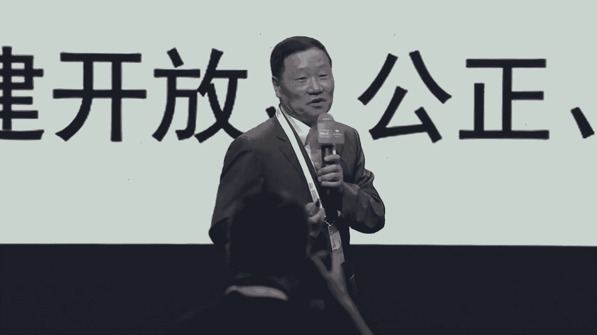

# 18：智能向善，开放共治——人工智能与金融融合治理教程 📚

在本节课中，我们将学习人工智能（AI）与金融行业融合发展的现状、机遇、挑战以及治理体系的建设。课程内容基于“智能向善，开放共治”论坛的讨论，涵盖了政策背景、技术应用、风险挑战和治理框架等多个方面。

---

## 一、论坛背景与致辞 🎤

当前，新一轮科技革命持续推动金融智能化发展，以生成式AI为代表的前沿技术已进入商业应用新阶段。为加快金融强国建设，做好金融“五篇大文章”，并与全球各界共同推动人工智能产业可持续健康发展，本次论坛应运而生。

### 领导致辞要点

**上海市经济和信息化委员会总工程师葛东波指出：**
*   上海人工智能产业规模持续扩大，企业数量接近400家，产业规模近4000亿元。
*   上海正全力推动人工智能大模型创新发展，加快打造世界级产业集群。
*   未来将加速赋能金融行业，探索新型治理模式，坚持多方共治。

**交通银行党委书记、董事长任德奇指出：**
*   人工智能正以前所未有的广度和深度赋能千行百业。
*   AI与金融加速融合也带来了安全、伦理等新风险新挑战。
*   交通银行积极将智能化手段融入金融“五篇大文章”体系建设，并强化AI在风险管理中的应用。

---

## 二、主旨演讲：人工智能治理体系建设 🏛️

上一节我们了解了论坛的背景与宏观方向，本节中我们来看看如何构建具体的人工智能治理体系。

**中国证监会原主席肖刚分享了以下核心观点：**

**1. 全球AI发展特点与治理现状**
*   **产业界主导**：前沿AI模型主要由产业界开发。
*   **开源趋势**：开源基础模型占比越来越高。
*   **成本高昂**：前沿大模型的训练算力成本急剧上升。
*   **专利爆发**：人工智能专利和出版物数量爆炸式增长。
*   **规则竞争**：全球AI竞争已从技术领域延伸到规则制定领域。

**2. 中国的人工智能治理倡议**
中国提出的全球人工智能治理倡议包括：
*   坚持以人为本，智能向善。
*   建立风险等级测评评估体系。
*   支持在联合国框架下讨论成立国际人工智能治理机构。

**3. 加快我国人工智能治理体系的建议**
*   **基本理念**：坚持以人民为中心，以人为本，智能向善。
*   **基本目标**：发展与安全并重，促进与规制并行。**公式：发展 ∩ 安全 ≠ Ø**
*   **基本原则**：包括和谐友好、公平公正、包容共享、安全可控等。
*   **法规体系**：应采用 **综合性立法 + 场景立规** 的多层次法规体系。
*   **治理机制**：实施风险分级分类监管，采取 **正面清单 + 负面清单** 模式。

---

## 三、主旨演讲：人工智能在金融领域的应用与建议 💹

了解了治理框架后，本节我们聚焦于AI在金融领域的具体应用与挑战。

**中国人民银行原副行长李东荣的分享要点如下：**

**1. 应用正在加速深化**
*   国家高度重视，产业规模已超5000亿元。
*   金融行业政策环境持续优化，发布了多项行业标准。
*   应用场景快速扩展，涵盖智能客服、量化投资、内部效率提升等。

**2. 需要关注的问题**
*   **算法风险**：存在算法黑箱、歧视、模型缺陷难解释等问题。
*   **算力挑战**：算力成本投入大，需进一步统筹“东数西算”。
*   **数据挑战**：面临数据隐私保护、数据质量不均衡等挑战。

**3. 五点发展建议**
*   坚持以人为本，科技向善。
*   切实加强风险监管和基础支撑建设。
*   加强数据安全和消费者保护。
*   注意系统性提升人工智能的能力和水平（数据、人才、生产关系）。
*   把握主动，切合实际，为金融业务带来实质性提升。

---

## 四、主旨演讲：数字金融新途径与AI治理 🤖

上一节我们讨论了应用与挑战，本节我们来看金融机构如何实践并应对治理问题。

**交通银行党委委员、副行长钱斌的分享聚焦于实践与治理：**

**1. AI技术发展趋势**
*   **算力**：集约化成为新趋势，需提升效能、降低能耗。
*   **数据**：合成数据有望成为数据扩充新来源。
*   **算法**：多模态成为算法跃迁新方向。

**2. AI与金融融合实践（交通银行案例）**
*   **践行以人为本**：运用AI进行客户精准画像、重塑业务流程（如远程视频核实）。
*   **服务实体经济**：打造产业图谱、构建科技型企业评价模型、搭建ESG评价体系。
*   **强化风险防控**：在信用风险、操作风险、合规风险（如反洗钱）领域应用AI模型。

**3. 推动AI安全可信发展的关键**
*   **坚守科技伦理**：防止算法歧视、隐私泄露，建立模型审计机制。
*   **加强算力资源整合共享**：建议研究建立国家级云计算底座和金融算力云。
*   **强化数据供给与治理**：建立高效的数据标注治理体系。
*   **推动大模型生态建设**：产学研融合，发展“小而美”的垂直行业模型。
*   **完善AI工程化人才培养**。

---

## 五、专题分享：公共数据的开放与价值 📊

AI的发展离不开数据，本节我们探讨公共数据这一重要资源如何开放并实现价值。

**清华大学五道口金融学院研究员张建华的分享基于实证研究：**

**1. 公共数据开放的主要模式**
*   **政府开放平台模式**：数据由各部门自行上传，激励性较弱。
*   **授权运营机构模式**：由政府委托专业机构运营，能更好保证数据质量。

**2. 研究结论**
*   公共数据开放对地方经济增长、财政盈余和企业创新均有积极贡献。
*   **授权运营模式**对专业性、创新性的促进作用更显著。
*   **开放平台模式**对普惠性、协调性发展的作用更积极。
*   较好的模式是两者结合，既保证全面开放，又通过专业机构提升数据质量与价值。

---

## 六、案例分享：金融行业AI大模型实践 🏦

理论需要实践验证，本节我们通过具体案例了解AI大模型在银行业的落地。

**中国工商银行首席技术官吕仲涛介绍了工行实践：**

**1. 建设历程与体系**
工行按照 **“三大支柱、一加X范式”** 思路，建成企业级千亿级金融大模型技术体系。
*   **算力**：建成全栈国产化AI算力云。
*   **算法**：采用商用+开源并行路线，建成多层次大模型算法矩阵。
*   **数据**：打造金融知识工程，构建万亿token高质量数据集。

**2. 应用范式与场景**
*   **“1”指金融智能中枢**：处理复杂任务规划与工具调用。
*   **“X”指多种专业范式**：如知识检索、智能投研助手、交易助手等。
*   **典型场景**：在金融市场领域，智能交易助手将询价交易效率提升3倍。

**3. 风险与安全**
*   **技术固有风险**：如可解释性弱、隐私泄露隐患。
*   **恶意利用风险**：如AI攻击AI。
*   **防护措施**：从模型安全、数据安全、应用安全三方面建立全域守护安全平台。

**4. 未来展望**
*   做深大模型技术支撑能力。
*   做大数据资产建设。
*   做强大模型人才队伍建设。
*   加快行业联合创新。

---

## 七、成果发布与圆桌讨论 🚀

最后，我们通过成果发布和专家讨论，展望AI在金融领域的未来。

**1. 成果发布**
*   **交银易监管数字化集成服务平台**：运用AI技术提供全生命周期资金监管服务，适用于工程项目、交易担保、投后管理、预付费等场景。
*   **人工智能联合创新成果**：交通银行与科大讯飞、华为等成立联合创新实验室，形成 **“1个能力平台 + 1套治理体系 + N个应用场景”** 的框架，在信贷、客服、风控、办公等领域落地多项AI应用。

**2. 圆桌论坛核心观点**
以下是专家们围绕大模型金融应用的讨论要点：
*   **国产化必要性**：在当今形势下，发展自主可控的AI底座必要且紧迫。
*   **应用效能**：在特定场景（如投顾服务、代码生成）已能显著提升效率（数倍提升）。
*   **投入产出考量**：当前仍属高投入期，需坚定投入并保持耐心，同时进行预算管控。
*   **监管建议**：可参考 **分级分类监管** 思路，对直接进行金融决策的环节严格监管，对工具类应用适度放开；倡导监管与行业共治。

---

## 课程总结 📝

本节课中，我们一起学习了人工智能与金融融合发展的全景：
1.  **趋势与机遇**：AI是发展新质生产力的重要引擎，正深度赋能金融业，提升服务质效。
2.  **风险与挑战**：需重点关注算法黑箱、数据隐私、算力成本、科技伦理等风险。
3.  **治理体系**：应建立 **以人为本、智能向善、开放共治** 的治理框架，采取 **发展与安全并重、促进与规制并行** 的策略，构建 **综合性立法与场景立规相结合** 的法规体系。
4.  **实践路径**：金融机构应夯实数据底座，加强产学研合作，聚焦场景创新，同时强化模型全生命周期治理和风险防控。
5.  **未来共识**：推动AI在金融领域的健康发展，需要政府、监管、金融机构、科技企业和社会各界协同努力，确保技术 **可信、可靠、可控**，最终赋能实体经济，守护人民美好生活。