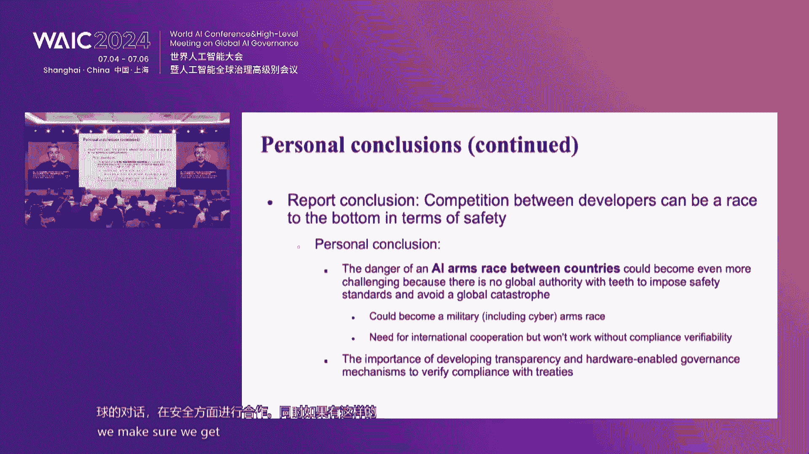
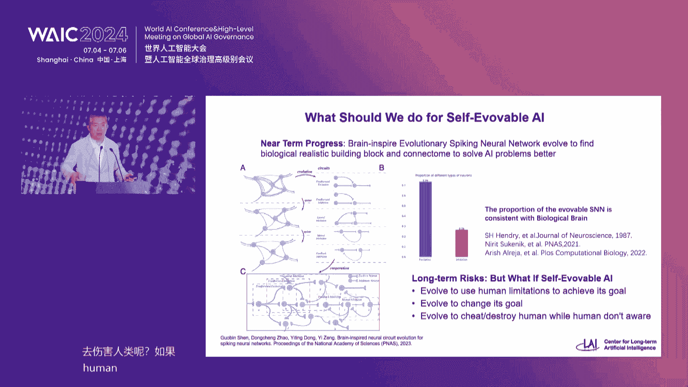
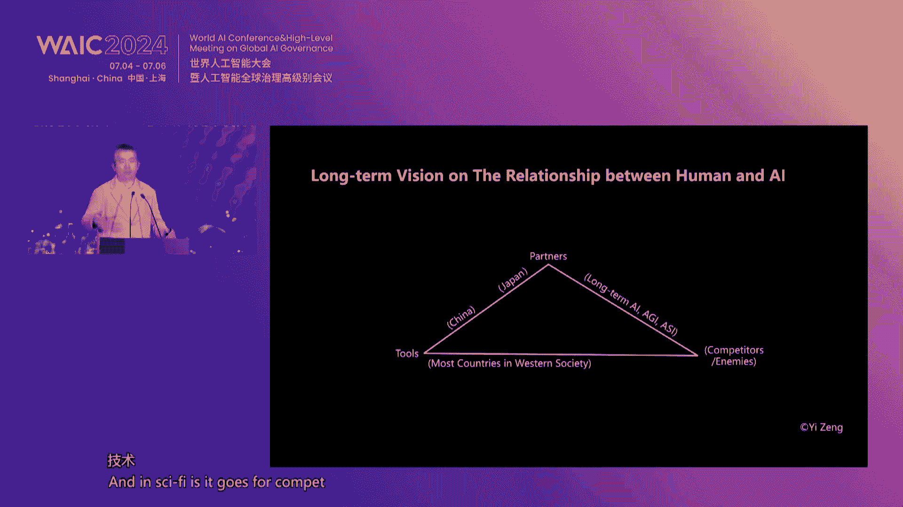
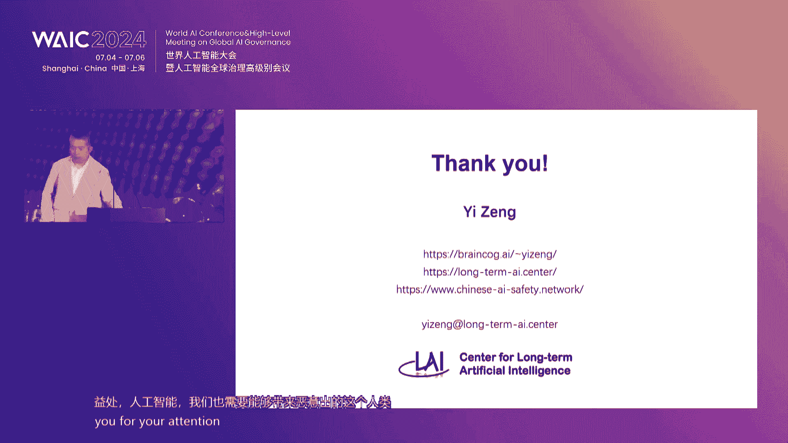
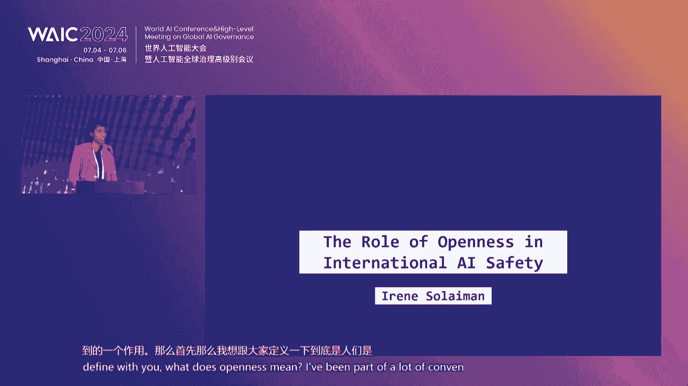
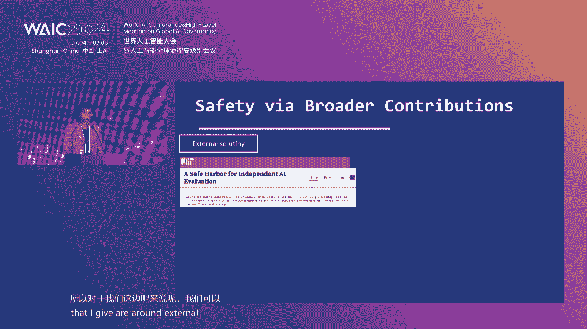
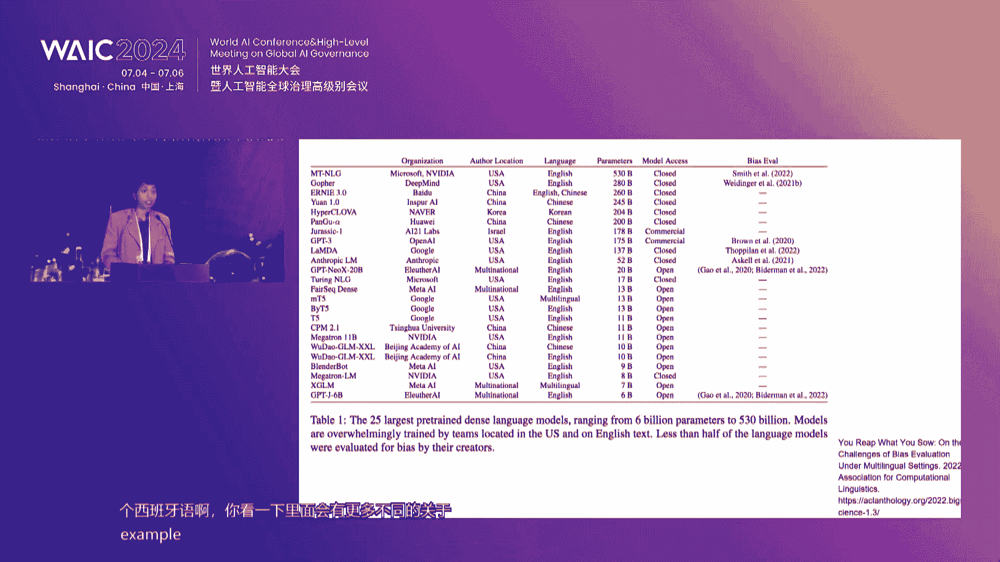
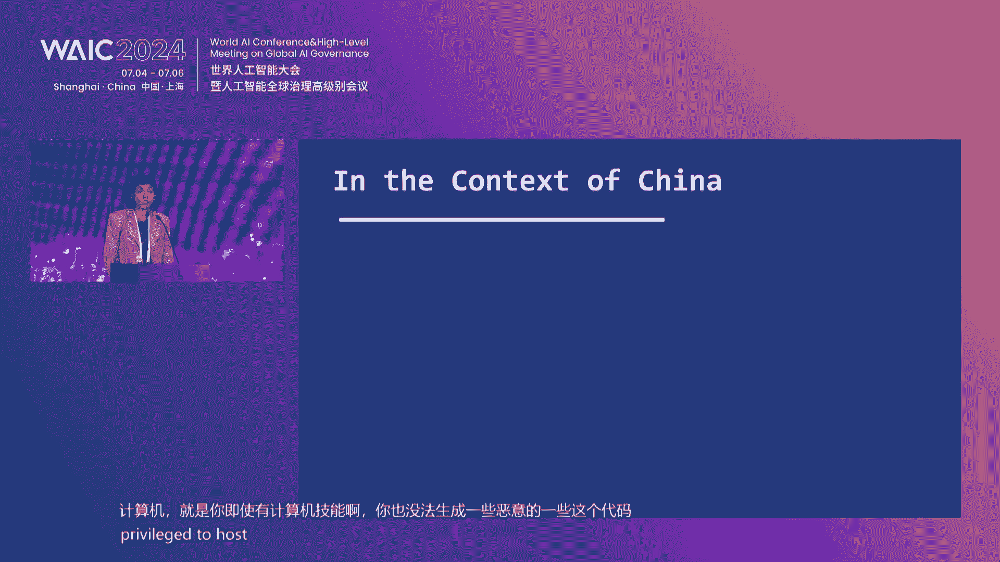
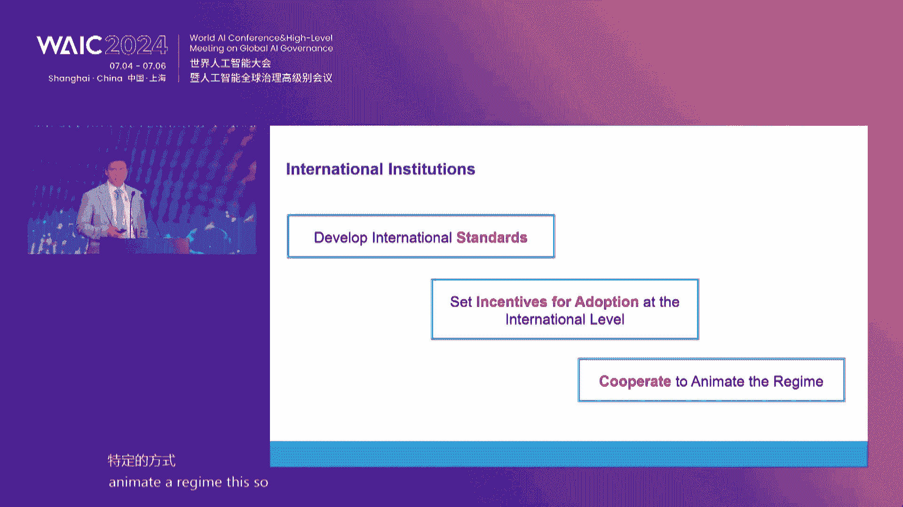

# 19：前沿人工智能安全与治理论坛 🧠

## 课程概述
在本节课中，我们将学习2024年世界人工智能大会“前沿人工智能安全与治理论坛”的核心内容。课程将涵盖人工智能安全研究、安全评测、安全治理以及国际合作四大主题，旨在帮助初学者理解当前AI领域面临的关键挑战与应对策略。

---

## 第一部分：前沿AI安全研究 🔬

上一节我们介绍了课程的整体框架，本节中我们来看看前沿AI安全研究的具体内容。

### 1.1 通用人工智能的风险评估
图灵奖得主Yoshua Bengio牵头发布了第一份先进AI安全国际科学报告。该报告由30个国家、欧盟和联合国提名的专家委员会共同参与，对通用型AI的安全风险进行了科学评估。

**核心概念**：报告指出，目前**没有已知的方法**能有效预防AI的滥用风险和失控风险。

### 1.2 风险的主要类别
报告将风险分为三类：
*   **恶意风险**：人们利用AI从事非法或不道德活动，如诈骗、深度伪造、网络攻击等。
*   **故障风险**：AI系统出现非预期的负面后果，如产品安全问题、偏见歧视，甚至失控。
*   **系统性风险**：AI技术与社会互动产生的风险，如对劳动力市场的影响、AI鸿沟、市场集中度以及环境影响。

### 1.3 技术挑战与研究方向
当前AI安全技术面临诸多挑战：
*   **模型不可解释性**：我们不完全理解神经网络如何做出特定决策。
*   **安全防护易被绕过**：现有的安全对齐方法（如SFT、RLHF）容易被“越狱”攻击或通过微调移除。
*   **评估方法的局限性**：现有的安全评测多为“抽查”，无法提供定量的安全保证。

**研究方向**：需要加大对AI安全研究的投入，探索如**表征工程**、**安全设计**等新方法，并推动国际合作。

---

## 第二部分：AI安全评测 🧪

上一节我们探讨了AI安全研究的挑战，本节中我们聚焦于如何评估AI系统的安全性。

### 2.1 评测的类型与生命周期
评测应贯穿AI系统的整个生命周期：
*   **研发阶段评测**：在模型训练的不同节点进行安全基准测试。
*   **部署前保证评测**：由独立于开发团队的专家进行，旨在确保系统安全性。
*   **行为评测 vs. 能力评测**：既要评估模型在典型使用下的平均行为，也要探测其可能产生高风险行为的“尾部”能力。

### 2.2 评测的最佳实践
以下是进行有效AI安全评测的一些关键原则：
*   **提示词敏感性**：评测需考虑不同措辞的提示词可能引发不同结果。
*   **评估对象**：既要评估底层基础模型，也要评估最终面向用户的完整系统。
*   **对抗性使用**：必须评估系统在对抗性攻击下的表现。
*   **基线对比**：评估风险时，需与没有该AI模型时的替代方案（如网络搜索）进行对比。

### 2.3 中国的实践：大模型安全评测
中国信息通信研究院建立了AI安全评测基准框架，并按季度开展评测。评测维度包括：
*   **内容安全**：防止输出法律禁止的内容。
*   **数据安全**：防止个人隐私和企业机密泄露。
*   **科技伦理**：评估价值观、心理健康、公序良俗等方面。

**挑战**：攻击手法不断翻新，模型的安全护栏容易被绕过，需要建立动态、敏捷的治理技术生态。

---

## 第三部分：AI安全治理 ⚖️

上一节我们了解了如何评测AI安全，本节中我们来看看如何从政策和治理层面应对这些风险。

### 3.1 治理原则：从风险到价值
当前的AI治理多以风险为基础，但存在局限：
*   **风险难以量化**：许多风险（如隐私侵害、歧视）难以像传统风险那样计算概率和损害。
*   **存在不可预见风险**：AI可能带来前所未有的风险类型。

因此，需要**超越风险治理**，迈向**基于价值的治理框架**，在发展中保障安全。

### 3.2 不同地区的治理视角
*   **新加坡**：秉持“谦逊”态度，采取迭代学习的方法，先推出软性法规和指南，根据反馈和观察不断校准。同时注重提升全民的AI素养和能力。
*   **法国**：强调开放源码和数字公地，将其视为建设主权数字基础设施的战略。同时关注弥合数字鸿沟，避免AI加剧社会分层。
*   **美国**：当前AI领域法规很少，治理讨论集中在行政命令、立法路线图和州级法案。思路包括利用现有部门法规、通过诉讼形成判例，以及探索“安全设计”的正式验证方法。
*   **中国**：形成了“发展与安全并重”的治理特色，探索分层治理（如生成式人工智能管理办法），并积极推进人工智能基础设施建设（数据、算力）。治理理念强调“以人为本，智能向善”。

### 3.3 治理建议
*   **建立分级分类体系**：对能力最强、风险最高的前沿大模型施加更严格的规范。
*   **实体映射与内容标注**：AI生成内容应被明确标识，智能体应有明确的归属主体。
*   **加大安全投入**：建议将至少10%的AI研发资金投入到安全和伦理方向。
*   **设立安全红线**：明确禁止AI进行无限制的自我复制、接管关键基础设施等行为。

---

## 第四部分：国际合作 🌍

上一节我们讨论了各地区不同的治理路径，本节中我们探讨如何通过国际合作应对这一全球性挑战。

### 4.1 国际合作的必要性与挑战
AI的效益与风险都是全球性的，其供应链、研发和应用跨越国界。然而，国际合作面临地缘政治竞争、技术不确定性、制度复杂性等挑战。

**关键障碍**：中美科技合作自2017年以来迅速恶化，涉及基础研究、商业技术乃至前沿技术的交流都受到限制，形成了“寒蝉效应”。

### 4.2 开放科学与多元参与
*   **开放的价值**：开放科学（如开源模型、工具、数据集）能促进创新、缓解偏见、分散权力，让更广泛的研究者和社区能够审查、评估和贡献，这对于安全至关重要。
*   **开放的定义**：开放不仅是模型权重的开放，更是一个包含数据、评估集、文档等在内的系统化透明工程。
*   **多元参与**：没有任何一个组织能拥有确保AI对所有人群都安全所需的全部视角和专业知识，需要全球多元主体的贡献。

### 4.3 构建国际治理生态系统
需要建立一个多层次、网络化的国际治理生态系统：
*   **联合国**：应发挥核心协调作用，编织全球治理网络，确保“不让任何国家掉队”。
*   **国际标准与报告机制**：各国需合作制定AI安全国际标准，并建立计算资源使用和大型模型训练的国际报告机制，以增加透明度。
*   **框架公约**：可考虑制定“全球AI挑战框架公约”，先就高级目标和原则达成快速全球协议，再通过具体议定书处理武器化、失控等具体风险。

**合作路径**：在竞争背景下，可优先推动“平行安全”，即中美等技术方在各自语境下通过专家对话、技术交流、联合评估等方式，各自建设安全能力，为未来的高层协议奠定基础。

---

## 课程总结 🎯
本节课中，我们一起学习了前沿人工智能安全与治理的核心议题：
1.  **安全研究**：认识到AI存在滥用、故障和系统性风险，且当前防护手段不足，亟需加大研究投入。
2.  **安全评测**：评测需贯穿全生命周期，采用多种方法，并重视第三方评估和动态对抗测试。
3.  **安全治理**：各国治理需平衡发展与安全，探索符合自身价值观的路径，并考虑分级管理、设定红线等具体措施。
4.  **国际合作**：面对全球性挑战，必须通过开放科学、多元参与和构建新型国际机构来加强合作，共同将AI安全作为一项全球公共产品来建设。

人工智能的安全治理是一项长期而艰巨的任务，需要技术专家、政策制定者、企业和社会各界持续对话、共同努力。