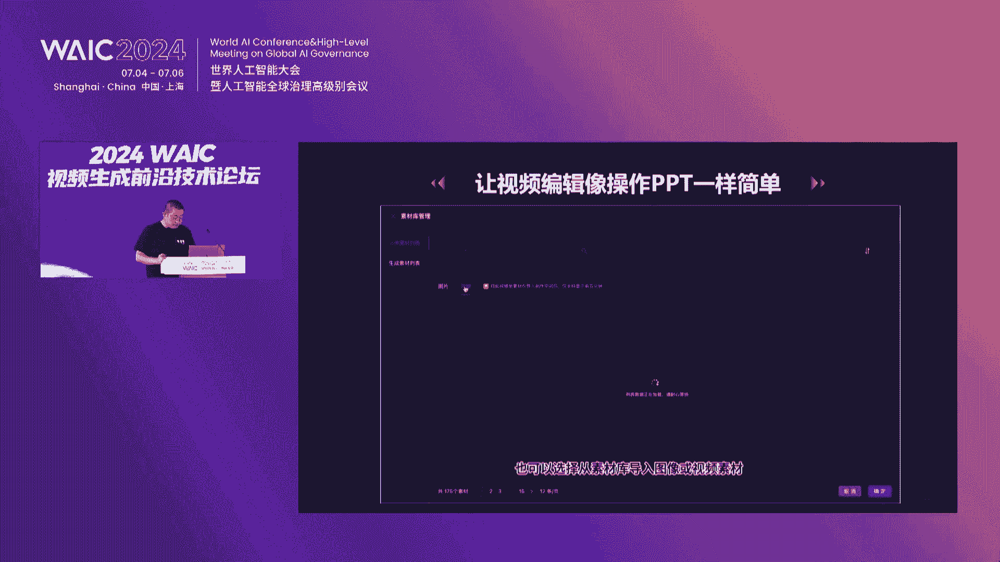
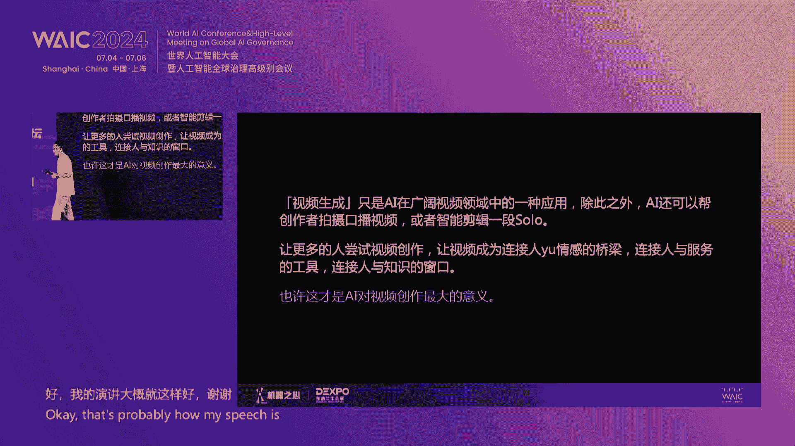
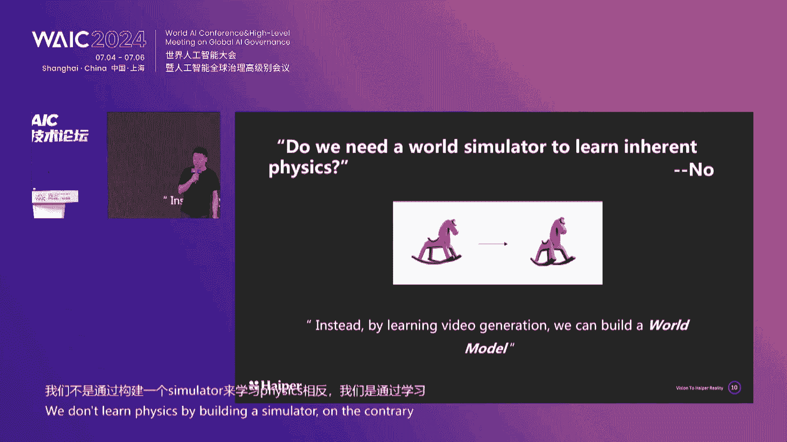

# 20：2024 WAIC 视频生成前沿技术论坛 🎬

在本节课中，我们将学习2024年世界人工智能大会（WAIC）视频生成前沿技术论坛的核心内容。论坛汇集了来自学术界、产业界和投资界的专家，共同探讨了AI视频生成的技术现状、应用挑战与未来机遇。我们将整理并提炼各位嘉宾的演讲与讨论要点，以教程形式呈现，帮助你系统性地理解这一前沿领域。

---

## 论坛开场与背景介绍

尊敬的各位来宾，现场及线上的观众朋友们，大家上午好。欢迎大家来到2024 WAIC视频生成前沿技术论坛。我是今天活动的主持人，机器之心联合创始人兼主编李亚洲。

我们知道，在ChatGPT之后，SORA引爆的视频生成绝对是今年最热的技术与应用方向之一。但是，视频生成领域又处在一个非常早期的阶段，而国内也正在进入爆发的前夕。因此，我们就想组织这样一场论坛，为大家学习了解视频生成技术提供一个平台。

本次活动由组委会办公室主办，机器之心执行，上海科技有限公司与东浩兰生集团有限公司共同承办。在活动开始前，我为大家介绍一下我们今天的活动环节。

首先，我们邀请到了视频生成领域的四位专家、学者为大家来做主题分享。也邀请到了来自学界、业界、创业公司、知名投资机构的嘉宾，共同围绕视频生成的技术与应用，展开两场深度的圆桌讨论。希望我们今天的活动能够让大家收获满满，不虚此行。

好的，那我话不多说，我们今天的活动就正式开始。首先让我们有请今天的第一位分享嘉宾，阿里巴巴达摩院视频生成负责人陈伟华先生。他的分享主题是：达摩院寻光——下一代AI视频创作平台。掌声有请。

---

## 第一节：达摩院寻光AI视频创作平台 🛠️

大家好，很荣幸今天有机会站在这里为大家介绍达摩院新推出的一款AI产品：寻光视频创作平台。

过去的一年对于AI视频生成来说是一个历史性的时刻。一年前，市面上还很少有这种面向公众的“文生视频”模型。但短短的几个月内，我们目睹了几十款视频生成模型的问世。越来越多的人开始通过文字提示或者图像提示的技术来制作自己的视频。

其中一个有代表性的时间点是今年2月份SORA的发布。SORA让大家看到了AI视频生成在高清晰度、高保真、高质量方面的巨大潜力和价值。OpenAI曾邀请了一些视频制作团队去对SORA进行试用。其中一个比较知名的团队是来自多伦多的Shy Kids团队。他们利用SORA制作了一个短片叫做《Airhead》（气球人）。相信很多人都看过这个片子，非常有创意的内容，也非常优秀地把创意和AI技术进行了一个完美的结合。

但是今天，此时此刻，我们想聊一聊它背后的一个故事。在Shy Kids团队做分享的时候，其主创人员就表示，SORA很酷，但是它的生成过程其实是很难控制的。整个短片其实是由多个视频片段组成的。但是在生成不同的视频片段时，很难保证主角始终是这个长着黄色气球脑袋的人。有的时候上面会出现一张脸，有的时候甚至气球都不是黄色的。因此，整个短片并不是SORA直接输出的一个结果，其中引入了大量的人工后期编辑，才能呈现出最终的效果。因此，Shy Kids团队也表示，视频内容的控制其实是创作中最大的一个需求，也是今天我们算法所面临的一个最大的挑战。

所以，今天我们要介绍的产品——达摩院寻光视频创作平台，是我们在调研了现有的视频创作工具，走访了许多视频创作者之后，打造的一款工具性的产品。今天的各种视频生成大模型已经让大家感受到了AI技术带来的福利，给短视频制作提供了各种各样的素材。在有了这些素材之后，我们希望能进一步提升视频制作的效率，去解决视频后期编辑中的各种问题。我们的目标就是用AI能力去重塑传统视频制作的整个流程，去打造AI时代的全新视频工作流。

寻光视频创作平台最大的两个特点，就是能让用户实现对视频内容的精准控制，同时可以保持多个视频中角色和场景的一致性。

### 平台亮点一：直观的交互与分镜组织

首先，平台的第一大亮点是在交互方面。我们希望让整个编辑过程像做PPT一样简单直观，容易上手。在我们的平台上，每个视频是由多个分镜头组成的。

以下是平台在分镜组织方面的核心功能：

*   **分镜生成与上传**：用户可以在平台上从剧本自动生成一组分镜头，也可以自己上传原始的视频，由算法去切分成多个分镜头。
*   **灵活的查看与调整**：在创作空间里，用户可以很方便地查看每一个分镜头。一个场景内的多个分镜头也可以收起或展开。场景之间可以通过拖拽来进行顺序的调整，场景内的镜头也可以进行拖拽。
*   **内容的添加与生成**：同时，我们可以支持在任意位置上进行分镜头的添加或者删除。在新建的空白分镜头中，我们可以调用图生视频或者文生视频的能力去产生新的内容，也可以添加自己已有的各种素材。

那么对每个分镜头来说，我们可以对它里面的视频进行单独的编辑。从右侧的这个工具栏中，我们可以选择我们想要的合适的编辑功能，对分镜头视频中的所有细节去进行进一步的精细化的编辑。

### 平台亮点二：基于语义的智能编辑能力

其实讲到编辑，特别是这种精细化的编辑和控制，我们希望能够提供一个完整的、智能的编辑能力，可以让用户去理解用户的意图，在语义层面而不是在像素层面对视频做一个编辑。同时，我们希望一个视频里的所有元素都是可以被编辑和修改的，这样可以给用户提供一个最大的自由度。

这里我们提供了包括视频整体层面的修改，如风格、运镜、帧率、清晰度、画质。同时，我们也可以对视频中的任意局部元素或目标进行精细化的操作，比如人体、人脸、前景、背景等等。

在这些功能中，我们首先想要强调的是一组基于视频图层的编辑能力。因为在我们对用户的访谈过程中，我们就发现，视频图层几乎是所有视频创作者提到的频次最高而且最迫切的一个需求。所以我们平台首次地把视频图层相关的各种能力，以一个系统性的方式完整地呈现给用户。

#### 视频图层功能详解

以下是基于视频图层的核心功能：

*   **前景图层生成**：在前景图层里，用户可以通过输入文本，我们就可以产生符合文本描述的、并且具有透明背景的视频。在传统的视频生成的能力基础上，用图层这样一种更灵活的方式来产生内容。比如说可以看到下面这一排里面有一个警车，其实是我们的生成结果可以做到警车的车窗玻璃是透明的，也就是说可以让他很自然地放到其他场景中，以一个图层的形式放进去。
*   **图层拆解**：同时，有时用户会上传自己的视频素材。那其实我们也提供了图层的拆解能力。用户在视频的第一帧选出自己想要提取的一个物体，那我们的算法会把整段视频中的这个物体对应的内容全部拆解出来，形成一个独立的带透明背景的视频图层。就比如这里的小和尚和这里的这个女孩，我们都是可以拆解出来的。左下角这个女孩这个视频其实我们值得说一下，就是说看这里面可能会有书本、有女孩、还有蝴蝶，其实这些我们都是可以做拆解的。我们可以把一个视频拆解成多个图层。以这个女孩为例，其实我们可以看到，我们的拆解算法还是非常精细的，比如这个头发的飘动，其实我们都是可以拆解出来的。
*   **图层融合与场景控制**：当我们的素材都以图层的形式存在的时候，那我们就可以将不同的前景图层和不同的背景进行融合。图层的融合这样就可以组合成更多的新的视频来。比如刚才我们提取的这两个前景，就可以把它跟不同的背景进行融合，形成新的视频。前面其实我们提到的视频创作中，多个分镜头场景的一致性是非常重要的。我们其实想做到的就是一个场景的可控。那其实场景的可控主要靠的是什么呢？其实我们就发现，当图层融合能力已经让我们实现了视频背景的任意切换的时候，那我们就可以把不同的前景放到同样的场景中，实现场景的一致性。比如刚才提取的这两个前景，我们就可以给它放到一个类似的场景环境中，这样就可以让他们有一个剧情上的一致性。同时，我们也提供了支持多场景的一键式替换，比如一次性就把所有的分镜头的场景，统一替换成另一个场景，比如说这里的这个室内实验室的一个场景。

#### 角色控制与一致性保持

那么除了场景控制之外，我们知道我们其实也支持对人物的控制，来实现多剧情里的人物的这种一致性。

以下是角色控制的核心功能：

*   **角色库与自定义**：首先，我们提供了一个角色库。用户可以通过文字描述生成这种自定义的角色，也可以上传自己预设好的一些角色形象。
*   **一键换脸**：我们的人脸控制功能可以将所有视频中的某一个角色，全部替换成角色库中用户想要的一个角色。比如说这个女警，然后再比如说把所有的换成这个黑人的女孩。整个这些操作我们都是可以一键完成的。
*   **多人同时换脸与嘴型适配**：这里值得一提的平台，同时我们也支持对视频中的多个人物进行同时的换脸。比如说这段视频中前面这个穿蓝衣服的角色，我们可以替换成上面左边的这个帅哥，然后现在的这个绿衣服的角色，我们可以替换成右边这个帅哥。我们不仅是替换了某一段视频，我们实际上整个剧情的所有人都能一键替换，相当于换了两个角色在进行这场故事的演绎。那可以看到我们的替换可以很好地适配整个视频，不存在失真错位的状况，同时整个视频中人脸的移动也都是非常流畅的。那么这是再给大家另一个例子。值得注意的时候，可以看一下这个例子，在我们的替换过程中，我们就会适配原来视频中的人的嘴型，就是说保证人在说话过程中，即使把脸换了，我们的嘴型说话也都是没有问题的，表情和之前也都是一致的。

那么利用这个能力，我们就可以随意地去设置我们的视频的角色。我们希望就是让每个人都能成为这个故事的主角，也希望每一个故事可以去被不同的人去演绎。

### 全局与局部元素的编辑能力

我们知道，就像前面说的，我们的视频都是由各种不同的元素组成的，包括场景、包括人脸。那其实就像前面说的，它主要分为全局的这种元素，还有这种局部的元素。那下面我们就来介绍一下，我们对视频全局元素的这种编辑能力。

以下是全局编辑的核心功能：

*   **风格迁移**：首先是这个风格的迁移。我们可以将视频转化成各种不同、各式各样的风格，比如说莫奈风、浮世绘、水彩、水墨、卡通等等。我们一共提供了20多种的风格，可以让用户进行随意的切换。同时我们对各种视频，都是可以支持这种一键式的风格切换的。
*   **运镜控制**：其实我们平台也支持对画面做一个运镜的控制。镜头的运动是影视语言的一种表达，可以使画面变得更加的生动、有运动感。那其实我们这里不仅支持运镜，我们还支持了多种运镜方式的添加。这里给大家展示几种大家可能常用到的一些例子，从左到右分别是这种左右的平移、上下的移动、推进拉远以及左右环绕。
*   **帧率提升（视频超分）**：接下来介绍一下这个帧率的控制。那么有些视频其实由于拍摄的现场，其实它的帧率会比较低，播放起来其实会有一个卡顿。那么平台我们提供了一个帧率控制的功能，可以通过提升视频的帧率，来让这个视频运动变得更加的丝滑。比如说左侧这个视频中的这个火花的喷溅，大家可以看到是有这种明显的卡顿的，这是由于帧率比较低问题造成的。但是用我们的功能处理之后，可以看到这个火花的喷溅，就会变得非常的顺滑和连续。

那么以上几个是在视频整体层面做的一个编辑的能力。那么在视频的这个局部元素、局部目标我们也提供了很多的能力。

以下是局部编辑的核心功能：

*   **运动控制**：比如说这个运动控制。其实运动控制是一个比较有意思的一个功能。其实现在有些平台也会提供类似于笔刷这种方式来实现运动的控制。但是我们的运动控制，可以让用户更精准地指定运动的一个方向。比如说左侧的这个船，我希望它从右滑动到左边，那么只需要选中这个船，然后朝左进行一个拖拽，那就能实现一个船的移动的效果。
*   **目标消除**：其实平台还提供了这个目标消除的能力。对视频中的这些干扰物体，我们可以实现一键的消除。无论像左边的这个面积比较大的这些人物，还是说像中间的这个酒瓶、鱼这种在屏幕正中央的干扰物，以及向右侧这种左上角的小船，其实我们都可以做到和谐的去除。
*   **目标新增与替换**：那么对应于这个消除能力，其实平台也支持了这个目标新增的功能。比如说在原视频是一个空旷的海面，用户可以选定一个区域，输入想要新增的一个物体，比如说一个船，那我们就可以在海面上添加一艘船出来。可以看到我们这个船是顺着水流移动的，是可以很好地和这个海面做一个和谐的、一致的运动。那下面这个例子其实是从左边到中间，这个视频其实是我们添加了一个风筝，天空上的一个风筝。那其实有了这个新增的能力之后，我们也可以对目标进行一个修改和替换。比如像右下角第三个视频，这样我们去把这个风筝换成一个气球。那这样的话，其实利用以上的这些能力，我们可以对视频中的每一个局部目标，都可以被精准的定义和修改。

### 总结与展望

今天我们发布了寻光视频创作平台，是一个专门为视频创作者打造的一个工具性平台。它提供了更简易的分镜头的组织形式，以及丰富的视频编辑能力，比如说基于视频图层的生成、拆解、组合，以及像运动控制、视频超分、风格迁移、目标的消除、新增、替换等等。同时，我们也支持了对多个视频中场景和人脸的控制，来保持人物和场景的一致性。

这个视频其实就是我们对整个平台能力的一个综合的展示。那我们相信，今天我们正处在AI视频生成的巨大变革之中。工欲善其事，必先利其器。我们希望寻光视频创作平台就是每一个人手中的利器，是每一个创作者自己的专属的视频工作室。那在这个平台上，我们希望AI与创作者之间能够紧密高效地协作，创意和想象力不需要被工具所限制。我希望寻光视频创作平台能跟各位创作者一起去开启一个更繁荣的视频生态。

那么最后，欢迎大家扫码申请我们的内测资格，也欢迎来到达摩院的展台，跟我们进行更多的交流。谢谢大家。

---

**好的，感谢陈老师的分享。刚才那套二维码出来之后，大家都在夸夸地拍照，感觉这个平台肯定会火的。再次感谢陈老师的精彩分享。**

上一节我们介绍了达摩院寻光平台如何通过图层、分镜和控制技术来提升视频创作的效率与可控性。本节中，我们来听听来自学术界的视角，探讨视频生成的底层技术挑战与新的解决思路。

---

## 第二节：面向矢量化的媒体内容生成 📐

感谢机器之心的邀请。今天很开心，又看到了很多老朋友。我今天的分享可能包括视频，但可能比视频的范围更广一点，因为我们这么多年来一直在做全媒体的这样一个生成，包括图像、视频以及三维的内容。而且今天我的分享可能更加偏我们一些前沿的底层。

那首先可能要稍微泼一点冷水。如果大家一直在用这些生成类的工具的话，我相信这些问题多多少少都会遇到。我们现在生成类的算法，包括视频、包括图像、包括三维的东西，我们可以遇到很多这种结构性的问题和细节性问题。比方说，通常会多一样多生长出一样东西，或者少一样东西，或者手穿模穿到人的身体里面。然后有的时候生成的衣服上的这些logo，突然间变得很模糊了。那如果对视频来说，像这种精细化的视频，特别是具有这种物理规则的视频，其实目前为止是挺难生成的。

那么究其原因，我们都知道，现在所有的生成式的智能从本质上讲它无非就是一个采样的过程。视频是一个非常高维度的空间，比图像更高。如果我们给予更多的训练数据，如果我们把采样精度降得更低一点的话，那么相信我们能够生产出更好的内容。这个就是为什么我们现在有Scaling Law，为什么有Stable Diffusion是不停的采样。但是这个是有天花板的，大家都知道是有天花板，因为我们的维度空间太高了。一定要做到万无一失、千真万确的话，恐怕以目前的技术框架来说，其实是有一定的难度的。更何况我们对于算力的约束，其实还是很大的。

这里列举了我们目前包括大语言模型、包括图像视频类的生成模型的一些算力指标。我们看到现在都是几十T、上百T甚至上千T的这样一个水平。那么我想，未来生成式的智能的一个发展趋势，它肯定会下沉到端侧。那么对于端侧来说，我完全不可能用这种无限制的大算力的采样的方式去解决问题。那么可以想象，我们是需要有一些新的架构、新的计算方式、或者叫新的一些底层技术，来支撑这样一个更加高效、更加高质量的生成的方法。

那么我们可以看到，为什么我们现在那么吃算力？我们现在那么消耗数据和算力的资源？其实就是一个我们神经网络的黑盒化。对于生成的网络，我们完全不知道这里面哪一个节点跟我们的要去生成、要去控制的内容有关。我们不知道我们输入的prompt的某一个词，到底在这样一个节点里面的哪一个、哪几个单元是有关联的。我们也不知道我们输出的这样一个人脸的某个地方的一个形状，是跟我们这个神经网络里面的哪几个单元是有关的。其实我们更需要的是做一种白盒化的生成技术。

比方说，如果我们能够将视频中的内容能够实例化到我们的网络参数的话，那么实际上我们可以精确地去操控我们生成的内容。但是要解决这样一个参数对齐问题的话，其实究其本源，本质上还是一个数据内容的表征问题。不管是图片还是mesh还是视频，实际上目前我们的基础表征还是这种规范化的网格。那么规范化的网格，它实际上是跟语义是不对齐的，我们并没有实例化的概念。这就导致了为什么我们现在去网络去算，我也不知道他在算什么，我也不知道他能够算出什么，反正我们给很多的数据，它最终总能生成我们期待的结果。

但是，如果我们有一种新的表征方式，它能把我们视频中的内容、把我们的这些内容以及各种内容的属性，比方说我们的颜色、我们的纹理、我们的光照、我们的形状，能够把它具象化、实例化、解耦开来，而且能够针对性地建模的话，那么这样一种表征实际上是特别适合生成式的人工智能。

那么朝着这样一个方向，实际上我们团队在这两年也做了一个新的内容表征的框架。比方说像这样一个框架里面，我们无论是对2D的图像也好、3D的物体也好、或者是视频也好，我们可以先做一个空间语义的结构，可以把它分成语义的部件，比如说手、脚、耳朵。然后对于每一个部件，我们实际上是可以进行一个矢量化的表达。我们可以通过我们过去的一些非常好的工具，比方说像贝塞尔曲线，或者是NeRF的这种曲面，我们可以把它进行矢量化的表征。然后我们可以把解耦的一些语义、解耦的一些视频的视觉的属性，比方说光照、纹理、形状，可以把它通过控制点的方式去放在我们控制的形状的一个边界，甚至是内部。如果我们要生成这个形状内部的东西的话，只需进行这样一个神经网络的采样就可以了。最近我们的一些像类似于隐式表达的一些方法，就特别适合这样的采样。

那么这样一来，我们整个视频、我们整个视觉的内容，可以拆分成这样一系列的矢量表征。那么我们对于生成和编辑的话，我们想去编辑哪个内容，对于它我们进行相应的采样就行了。

### 矢量化表征的优势与应用

那么这个就是利用我们现在的矢量化表征的框架，做的二维图像的生成和编辑。我们可以看到它的优势还是非常明显的。

以下是矢量化表征的核心优势：

*   **高精细度重建**：首先，对于不同风格的图像来说，我们目前通过矢量化的生成和编辑方式所重建的图像，它的精细度是非常高的。我们过去可能怀疑，对于这种动画类的图像，可能矢量的重建会比较好，对于自然图片可能矢量重建就有点问题。但是我们实验表明，其实只要是对于我们的控制点去寻求一个更好的表达方式的话，其实它可以把我们的精细程度控制得非常好。
*   **无损