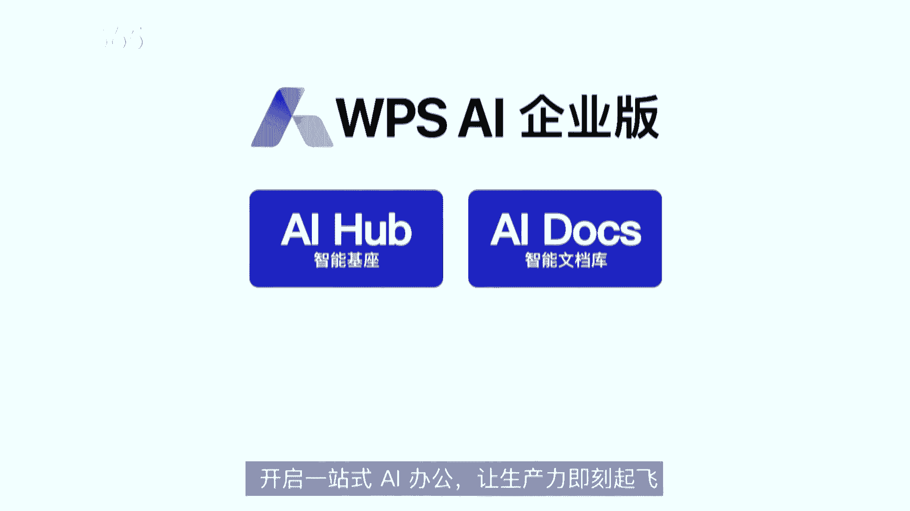
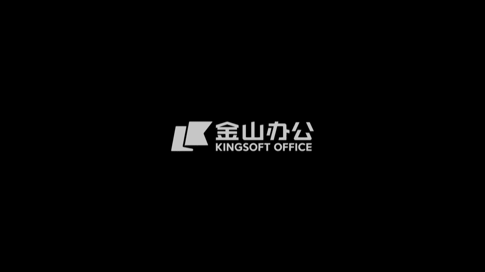
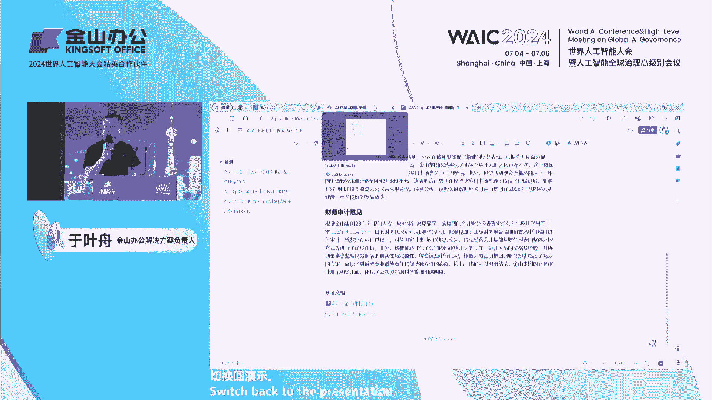

# 23：探索AI办公最佳实践 🚀

在本节课中，我们将学习金山办公在AI办公领域的最新战略与实践。课程内容涵盖面向个人、政府及企业的AI产品发布，通过具体功能演示，展示AI如何提升办公效率、优化工作流程并赋能组织数字化转型。

---

## 一、 AI办公的战略演进与发布

上一节我们介绍了课程的整体框架，本节中我们来看看金山办公AI战略的升级与核心发布。

自2023年发布以来，WPS AI持续创新。经过一年的实践，其战略从1.0升级至2.0。新的战略不再仅从AI能力（如AIGC、Copilot、Insight）角度划分，而是从用户场景出发，聚焦三个核心领域：

1.  **面向个人用户（To C）的WPS AI办公助手**
2.  **面向政府（To G）的WPS AI政务版解决方案**
3.  **面向企业（To B）的WPS AI企业版**

金山办公CEO张庆源指出，经过市场验证，纯粹的LUI（语言用户界面）交互模式在办公效率场景中存在局限。因此，WPS AI 2.0采用了 **AGUI（智能图形界面）加 LUI 的整合交互方式**，旨在提供更自然、高效的办公体验。

---

## 二、 WPS AI办公助手：四大效率神器

上一节我们了解了AI办公的战略布局，本节中我们将深入探讨面向个人用户的四大AI办公助手。

经过产品实践，WPS AI将能力整合为四个具体的助手，帮助用户从不同维度完成日常工作。以下是这四个助手及其核心功能：

### 1. AI写作助手
写作助手整合了AI续写、润色、扩写等能力，旨在让写作更流畅。
*   **AI伴写**：在用户写作时，AI实时预测并给出后续句子建议（以灰色文字显示）。用户若满意可按 `Tab` 键采纳，若不满意可继续自行输入，AI会根据新内容调整建议。**公式**：`用户输入 + AI预测 -> 按Tab采纳/继续输入`。
*   **AI全文润色**：将AI润色与WPS的“修订”功能结合。AI会以修订模式标注修改处，并在右侧说明修改原因，用户可以逐条接受或拒绝，且原文格式得以保留。

### 2. AI阅读助手
阅读助手帮助用户快速理解和消化文档内容。
*   **AI总结**：可快速解析长文档（如学术论文），提取关键词、研究结论、方法等重点信息。
*   **AI解释**：在阅读时，遇到不熟悉的概念（如“二阶贝齐尔曲线”），可直接让AI在上下文语境中进行解释，无需跳出文档搜索。

### 3. AI数据助手
数据助手旨在简化数据处理、分析与可视化流程。
*   **AI表格操作**：通过自然语言指令，让AI执行复杂操作。例如，输入“删除空白行”，AI会自动生成并执行相应的JS代码来完成清理。**代码示例（模拟）**：`AI.执行(“删除表格中的空白行”)`。
*   **AI函数**：提供特殊的AI函数，可对表格中的文本字段进行智能分类。例如，使用 `WPSAI.classify()` 函数，可自动将大量用户反馈归类为“服务态度”、“产品质量”等类型。
*   **AI数据问答与可视化**：支持自然语言转Python代码。用户只需提出如“按产品分类统计总利润并画柱状图”的要求，AI即可在云端执行数据分析并返回交互式图表。

### 4. AI设计助手
设计助手帮助用户将注意力集中在内容创作，而非样式排版上。
*   **AI排版**：对于纯内容文档（如毕业论文），AI能自动识别章节标题、摘要等语义，并一键套用预设的排版样式（如国家标准、各高校论文格式）。
*   **风格克隆**：可以将一个已设计好的PPT的风格要素（配色、字体、主题）自动提取并应用到另一个内容PPT上，实现快速风格统一。
*   **AI图片滤镜**：统一PPT中风格各异的图片。选择一个滤镜（如“好莱坞”），可将其一键应用到所有图片，使整体视觉风格保持一致。

---

## 三、 WPS AI政务版：可信、高效的公文助手

上一节我们看到了AI如何提升个人办公效率，本节中我们来看看AI在垂直的政务办公场景中的应用。

政务办公场景具有格式严谨、用语规范、安全要求高等特点。WPS AI政务版是针对此场景打造的垂类解决方案，其核心是 **一个经过专门训练的政务办公模型**。

该模型具有以下特点：
*   **专精公文**：基于海量政务语料训练，并经过百万级人工精标数据调优，“从小读公文长大”。
*   **安全可信**：支持全面信创化部署（客户端与服务端），兼容国产GPU。所有AI生成的回答均提供**来源追溯**，确保信息准确、可查。
*   **流程融合**：将AI能力深度融入公文“撰写-修改-校对-排版”的全流程。

政务版主要提供三大类功能：
1.  **智能问答**：回答政务相关问题，答案均附带出处引用，支持延伸阅读。
2.  **公文写作**：支持在写作前添加“参考文献”，AI结合素材生成大纲；支持交互式分段撰写、内容扩写、文本润色和智能校对。
3.  **辅助工具**：提供一站式智能检索、智能查重等功能，并可集成到现有政务系统中。

---

## 四、 WPS AI企业版：构建企业大脑，先备“燃料”

上一节我们探讨了AI在政务领域的深度应用，本节中我们转向更广泛的企业场景，看看AI如何赋能组织。

金山办公的企业AI愿景是 **帮助每个组织构建自己的“企业大脑”**。WPS AI企业版包含智能基座（AI Hub）、智能文档库（AI Docs）和智慧助理（Copilot Pro）三大组件。

在与超过100家企业客户共创后，金山办公总结出一条关键经验：**建设企业大脑，必须先储备AI“燃料”——即企业的知识资产**。如果AI不懂企业的专有知识、流程和文档，就无法真正发挥作用。

**AI Docs智能文档库** 是准备“燃料”的核心工具，它是一个一站式的企业非结构化数据治理方案，具有四大特性：
1.  **升级简单**：对于已使用WPS云文档的客户，可一键将现有工作文件夹升级为智能文档库。
2.  **解析强大**：依托金山30年文档技术，能精准解析复杂格式的文档（如多栏排版、含图表公式的PDF），确保信息提取准确。
3.  **权限继承**：与WPS完整的文档权限体系打通，AI问答时自动进行权限校验，确保员工只能获取其有权访问的信息。
4.  **文档结构化**：通过自然语言描述，即可从大量文档（如合同）中批量提取指定字段信息，并可通过API对接其他业务系统。

**实践路径建议**：企业启动AI办公的最佳实践是 **先部署智能文档库，推动文档上云**，将散落在员工电脑、邮件、OA附件中的知识集中化管理。当AI拥有了充足、准确的企业知识“燃料”后，才能通过智能问答、智能创作等应用，真正提升员工效率，并逐步与业务系统集成，构建专属的“企业大脑”。

---

## 课程总结

本节课中我们一起学习了金山办公WPS AI 2.0的战略全景与落地实践。我们从面向个人的四大AI办公助手（写作、阅读、数据、设计）看到了AI如何提升单点工作效率；从政务版看到了AI在垂直场景中如何做到安全、可信、流程融合；从企业版学到了构建组织级AI能力的关键在于 **先行治理和沉淀企业知识资产**。AI正从“玩具”变为真正的“工具”，深入办公核心流程，驱动办公领域新质生产力的发展。