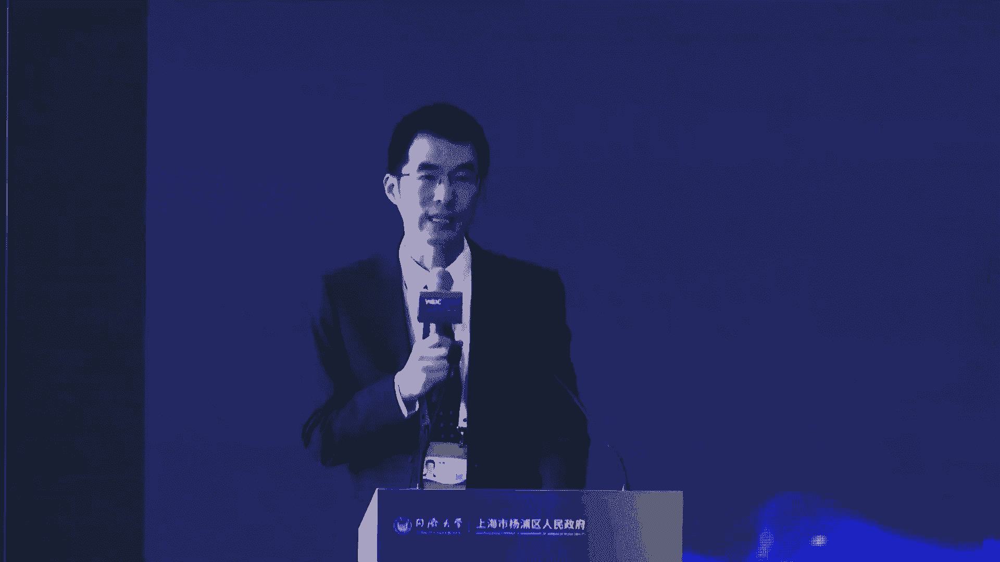
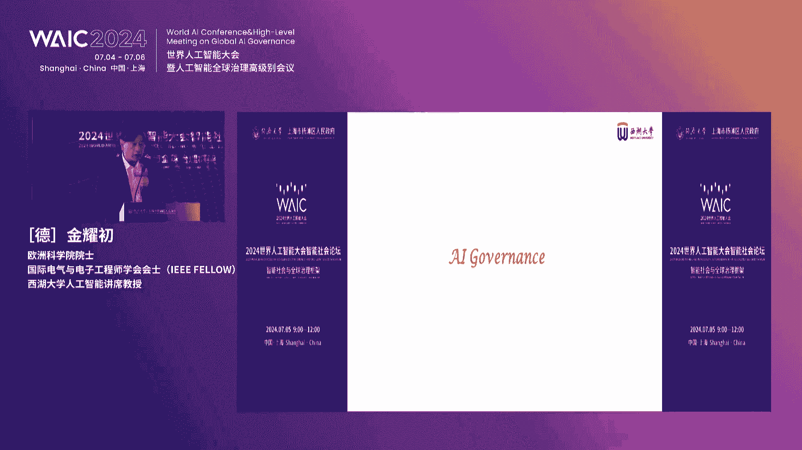
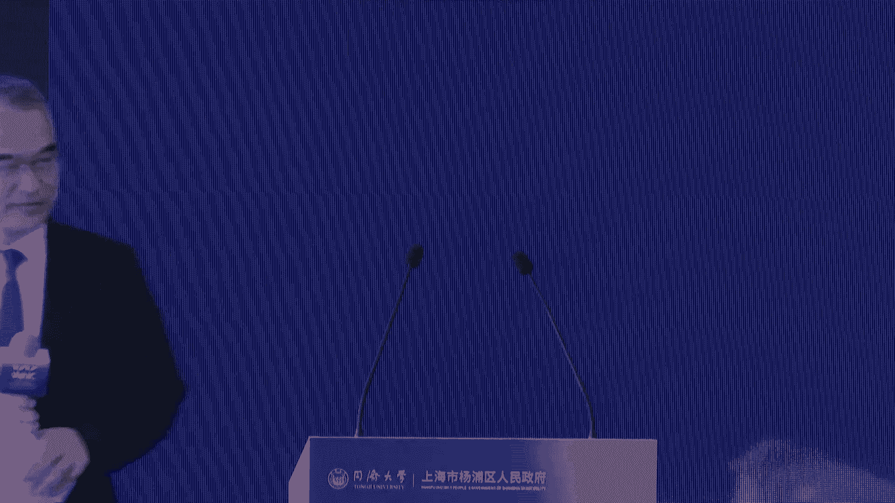

# 25：智能社会与全球治理框架 🧠🌐

## 课程概述
在本节课中，我们将学习2024年世界人工智能大会智能社会论坛的核心内容。课程将聚焦于人工智能（AI）技术的发展、其带来的社会影响，以及构建全球治理框架的必要性与挑战。我们将从政策制定、技术应用、社会治理和国际合作等多个维度进行探讨。

---

## 一、论坛开幕与领导致辞 🎤

本次论坛由同济大学与上海市杨浦区人民政府联合举办，主题为“智能社会与全球治理框架”，旨在促进人工智能向善发展，造福人类社会。

### 领导致辞要点
以下是各位领导致辞的核心内容：

*   **上海市网信办副主任杨鑫**：强调中国高度重视人工智能发展与全球治理，提出了“全球人工智能治理倡议”。杨浦区与同济大学共建的国家智能社会治理实验综合基地取得了显著成果，未来应加快推出服务治国理政的实验成果、落地前沿技术应用，并强化国际合作。
*   **上海市教育委员会副主任王浩**：指出人工智能是上海着力发展的先导产业，教育需主动拥抱智能时代。他建议妥善平衡治理与发展、深入应用场景探索治理规则，并加强人工智能科技和治理人才的培养。
*   **同济大学党委书记方守恩**：介绍了同济大学在人工智能领域的战略布局与成果，包括一系列国家级研究平台和“人工智能赋能学科创新发展行动计划”。学校将全面加快构建人工智能赋能教育教学的新形态。
*   **杨浦区委副书记、区长周海英**：阐述了杨浦区在构建以数字经济为核心的产业体系和探索智能社会治理方面的努力。杨浦将着力打造人工智能产业新高地，并用心开拓智能社会治理实验田。

**过渡**：在了解了宏观的政策导向与区域实践后，接下来我们将具体看看论坛上发布了哪些重要的研究成果与实践项目。

---

## 二、专题成果发布 📚

本环节集中发布了一系列由同济大学、杨浦区及合作单位取得的智能社会建设相关成果。

### 发布成果列表
以下是发布的五项主要成果：

1.  **数字孪生底座IS3基础设施智慧服务系统**：由同济大学自主研发，旨在将传统物理基础设施快速改造为数字基础设施，支撑数字治理、经济和生活的各类应用。其核心公式可概括为：**物理设施 + 数字化改造 = 数字孪生底座**。
2.  **负责任人工智能风险管理指南**：由艾森哲与同济大学联合编制。指南将AI风险分为对人、对组织、对生态三个层面，并建议企业从合法合规、嵌入原则、领导推动、建立文化四个维度进行管理。企业可根据成熟度（领军探索者、创新建设者、实践起步者）采取相应行动。
3.  **全球人工智能治理数据库**：由同济大学开发建设，旨在汇集全球人工智能治理相关的政策、法规与案例，为研究与实践提供数据支持。
4.  **人工智能伦理、法律与智能社会治理系列丛书**：共12本，由同济大学、杨浦区国家智能社会治理实验综合基地等单位策划出版，系统探讨相关前沿议题。
5.  **上海市杨浦区十大垂类大模型应用场景需求榜单**：面向全社会“揭榜挂帅”，征集包括智能文娱、智能制造、智慧教育、智慧医疗等十大垂直领域的大模型落地方案，促进AI与实体经济深度融合。

**过渡**：这些成果展示了从技术底座到治理框架、从理论研究到场景应用的全面探索。那么，来自全球的顶尖专家学者对此又有哪些深刻的见解呢？

---

## 三、主旨演讲精要 🎓

六位国内外专家围绕智能社会的机遇、挑战与治理分享了他们的见解。

### 专家观点摘要
1.  **金耀初教授（西湖大学）**：回顾了AI发展历程，指出当前大模型仅有约60%的输出与人类认知吻合。他系统梳理了AI在安全性、隐私、公平性、可解释性等方面的风险及技术应对方案，并比较了中、美、欧治理法规的异同。他强调，治理应聚焦于AI产品与应用，而非单纯限制技术。
2.  **吴志强院士（同济大学）**：基于十年城市智能化实践，提出了“海主义”（HI，Human+AI）理念，强调人与AI的深度合作与共生共创。其五项原则是：**人本互动、透明互信、安全互保、互动互控、伦理互吁**。
3.  **Gabriele Mazzini（欧盟委员会，线上）**：详细解读了欧盟《人工智能法案》。该法案采用基于风险的分级监管模式，禁止不可接受的风险（如社会评分），对高风险AI系统实施严格准入（CE认证），并对通用人工智能模型（特别是具有系统风险的模型）设定了透明度与安全义务。
4.  **Matt Sheehan（卡内基国际和平研究院）**：探讨了中美AI对话。他认为政府层面达成硬性协议困难，但“自上而下”的信号释放和“自下而上”的“平行安全”实践（科学家、企业、学者间的交流与最佳实践分享）更为现实且重要。
5.  **Lu Kai（耶鲁大学）**：对比了中美AI治理生态的差异。美国治理权力分散，强调自愿准则与言论自由；中国则呈现从中央到地方、从政府到企业的多层次治理特征。他建议在开源AI、医疗AI、地方治理等具体领域加强对话。
6.  **苏俊教授（清华大学）**：从社会科学角度指出，AI在形成新质生产力的同时，也带来了信息茧房、群体极化、劳动替代、能源消耗等深层社会挑战。他呼吁精英、政府、群众和企业共同参与治理，为智能社会嵌入人文精神，探索“智能人文”发展道路。

**过渡**：专家们的演讲从技术、伦理、法律、国际关系等多角度勾勒出智能社会治理的复杂图景。那么，在具体的圆桌对话中，实践者们又碰撞出了哪些火花？

---

## 四、圆桌对话：治理的实践与碰撞 💬

本环节围绕AI治理中的核心矛盾与可行路径展开了深入讨论。

### 对话核心议题与观点
*   **全球治理与合作**：李仁涵教授指出，AI基础理论体系尚未建立，导致结果不可控，治理至关重要。他认为中、美、欧治理模式各具特色，需在技术标准、知识产权、法律法规和共同监管上加强合作。他强调，**没有中国参与的全球AI治理是难以想象的**。
*   **安全与发展的平衡**：钟宁华教授以宏观经济预测和地方债务风险识别为例，说明了AI在经济治理中的赋能作用。平衡安全与发展的关键在于对训练数据的有效治理与隐私保护。
*   **数字权利与社会创新**：吕鹏教授认为，维护数字时代的社会权利，除了立法与监管，更需要通过“社会创新”，利用技术手段（如社区治理APP）解决具体社会问题，赋能公民。
*   **企业视角**：陈浩（字节跳动）从实践出发，认为当前AI技术本质仍是概率模型，远未达到威胁程度。企业看到的是AI在翻译、知识问答等场景中提升效率、替代重复性工作的巨大价值，当前应更关注如何让其蓬勃发展以增进福祉。
*   **总结**：李仁涵教授用一句话总结：“AI是否要被关到笼子里？当前不一定，不远的未来必须。” 这揭示了发展与治理之间的动态平衡关系。

---

## 课程总结 🏁

本节课我们一起学习了智能社会建设与全球治理框架的前沿探讨。我们了解到：
1.  **政策层面**：中国正积极推动人工智能向善发展与治理，并通过国家实验基地进行前沿探索。
2.  **技术层面**：数字孪生、大模型等技术的发展既带来了效率革命，也伴生着安全、伦理等风险。
3.  **治理层面**：全球主要经济体采取了不同的治理路径，但加强跨国、跨领域对话与合作已成为共识。
4.  **未来方向**：构建智能社会的核心在于追求“人机共生”（海主义），平衡发展与安全，并最终以人文精神引领技术发展，实现“为万世开太平”的愿景。

智能社会的治理是一项长期、复杂且需全球共商共建的系统工程，需要政府、企业、学界与公众的共同努力。