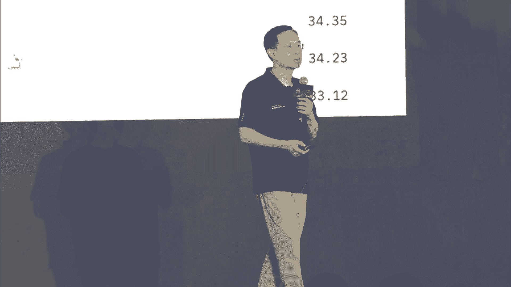

# 27：模型即服务（MaaS）加速大模型应用落地 🚀

## 概述
在本节课中，我们将学习模型即服务（MaaS）如何加速大模型在各行各业的落地应用。课程内容整理自阿里云主题论坛，涵盖了从大模型技术发展、开源生态、端侧部署到产业实践的全链条知识。我们将深入探讨核心概念，并通过公式和代码示例帮助初学者理解。

---

## 一、 开场致辞与行业背景

尊敬的各位来宾，阿里云“加速大模型应用落地”主题论坛活动即将开始。请尽快就座，并将手机调至静音模式。

人工智能已成为社会关注的焦点，大模型与AIGC技术正推动产业革命，催生新的商业模式。AI正成为引领时代发展的重要引擎，推动社会向智能化、数字化迈进。本次论坛汇聚产学研各界嘉宾，旨在深度探讨大模型的前沿技术、开发经验与应用落地。

上海市经济和信息化委员会副主任汤文侃先生为论坛致辞。他指出，大模型技术创新体系加速演进，已进入全面应用阶段。上海正着力打造世界级人工智能产业集群，具体表现在三个方面：
1.  **大模型龙头企业不断集聚**：全市已有34款大模型通过备案，应用于制造、金融等领域。
2.  **自主可控计算生态不断升级**：突破关键环节，已有数十款智能芯片流片量产，并建成规模化智算中心。
3.  **要素资源能级不断提升**：通过大模型语料数据联盟，已开源4200亿token的语料数据。

面向未来，上海将夯实产业基础底座、加速人工智能落地应用、培育开源活跃生态。

---

## 二、 阿里云MaaS体系进展

上一节我们了解了行业背景，本节中我们来看看阿里云在模型即服务（MaaS）体系内的最新进展。阿里云首席技术官周靖仁先生指出，以模型为中心延展技术体系至关重要。

阿里云在两年前首次提出Model as a Service概念，如今已成为云上AI服务发展的重要方向。MaaS涉及多个层次：底层云计算支持、模型生态发展、开发者环境以及业务场景适配。

### 1. 模型层：通义大模型与开源战略
阿里云在模型创新上持续发力，通义千问系列模型能力不断增强。同时，阿里云坚持开源策略，旨在降低模型使用门槛，促进AI产业发展。

以下是通义开源模型家族的部分矩阵：
*   **通义千问-Qwen2**：新一代开源模型，被评价为全球最强开源模型之一，在代码、推理、逻辑思考方面能力大幅提升。
*   **通义灵码**：基于通义千问的编程助手，已集成到各种IDE中，拥有超过350万下载量。企业版可结合本地代码库，提供更精准的代码助手功能。
*   **通义APP**：全能的AI助手，集成了听悟、万象等能力，覆盖工作、学习、生活场景。

### 2. 平台层：阿里云百炼
模型要应用到各行各业，需要进行定制化适配。阿里云百炼平台旨在结合云能力与模型能力，适配企业专属信息。

百炼平台的核心功能包括：
*   **丰富的模型生态**：集成通义家族、开源模型及其他第三方模型，供开发者按需选择。
*   **极致的推理成本优化**：通过提升推理架构的弹性与性能，持续降低大模型使用成本。
*   **低门槛的开发环境**：提供以模型为中心的开发流程，简化模型定制。

为了帮助企业进行业务适配，百炼提供了以下关键工具链：

**a. Prompt Engineering优化**
*   提供各行业场景的Prompt模板，方便快速上手。
*   支持通过 **Meta Prompting** 方式，让模型自动帮助优化Prompt，提升效果。

**b. 企业知识融合与RAG框架**
*   支持多种RAG框架，保障数据在客户专属域内的安全。
*   简化流程，通过少量代码即可将企业知识与大模型融合。
*   提供高效、低延迟、高并发的专用RAG框架，并自动进行算法调优。

**c. Assistant API**
*   通过统一的API，将插件管理、Prompt工程、记忆（Memory）管理等能力编排在一起，提供一站式开发体验，极度简化应用开发流程。

**d. 模型微调工具链**
*   提供完整工具链，支持数据准备、模型微调架构支持到评测的全流程，帮助开发者基于百炼底座进行二次开发与有效评估。

此外，百炼产品也已以 **Model Studio** 的名称部署在阿里云海外基础设施，为出海企业提供全球化支持。

---

## 三、 大模型时代的“摩尔定律”

与芯片的摩尔定律类似，大模型的发展也遵循着特定规律。清华大学刘志远教授提出了大模型时代的“摩尔定律”——**知识密度**的持续增强。

### 1. 核心概念：知识密度
知识密度是高效大模型的第一性原理，其核心在于用更小的参数规模实现更强的能力。

我们可以用以下公式来理解模型的效率：
`模型效率 ∝ 模型能力 / 参与计算的参数规模`
一个知识密度更高的模型，意味着其**能力更强**，且**每次计算所消耗的参数规模更小**。

### 2. 实践：端侧大模型MiniCPM
面壁智能专注于提升模型知识密度，研发了能在手机等端侧设备运行的MiniCPM系列模型。其关键在于通过“模型沙盒”进行科学化探索，在训练前于小模型上进行成千上百次演练，寻找最优数据与超参配置，并成功外推至大模型。

最新发布的 **MiniCPM-S** 模型采用了创新的稀疏化架构：
*   **灵感来源**：模仿人脑功能分区、稀疏激活的特性。
*   **技术实现**：采用ReLU激活函数，使模型在训练中自发涌现渐进式稀疏性。
*   **效果**：在保持性能无损的前提下，达到约88%的稀疏度，使全连接层能耗降低约84%，推理速度比稠密模型提升近3倍。

### 3. 开发套件：MobileCPM
为了加速端侧智能生态发展，面壁智能推出了 **MobileCPM** 开发套件，旨在让开发者一键开发端侧大模型应用。该套件包含：
*   基础SDK套件
*   通用端侧模型
*   预装了大量“意图”的插件平台

端侧模型具备毫秒级响应、本地计算保护隐私、弱网/无网环境可用等优势，将揭开端侧AI生态的序幕。

---

## 四、 产业实践：AIPC与智能助手

大模型技术正在与各类终端设备深度融合，本节我们来看看在个人电脑和手机上的创新实践。

### 1. 联想AIPC创新实践
联想集团提出了混合式人工智能框架，融合云、边、端三侧智能，并以大模型为基础构建智能体。联想AIPC具备五大特征：
1.  本地运行的个性化智能体，可与云端大模型协同。
2.  CPU、GPU、NPU的异构计算混合调度。
3.  掌握跨设备的个人知识库。
4.  开放的AI应用生态。
5.  本地的数据安全处理。

**关键技术突破**：
*   **模型压缩与推理优化**：通过结构化剪枝、量化、微调等静态优化，以及异构计算调度、KV缓存管理等动态优化，让大模型流畅运行于主流PC。
*   **个人知识库（RAG）**：对RAG各环节深度优化，并创新性地实现**检索器与生成器的协同优化**，使二者“相向而行”，提升结果质量。同时支持构建跨设备的分布式索引。
*   **智能体架构**：采用大模型+小模型+规则结合的混合方案处理意图理解和任务规划，对于复杂规划问题，引入经典算法（如蒙特卡洛树搜索）与外挂机制相结合的方式。

### 2. 小爱同学的大模型实践
小米小爱同学作为AI助手，已覆盖手机、汽车、AIoT等多类设备。大模型技术为其带来了跨越式升级：
*   **通用对话**：满足度从30%提升至80%以上。
*   **垂直场景**：如小米商品助手，通过RAG技术理解复杂知识，回答产品参数、使用指南等问题。
*   **NLU任务**：利用大模型通用能力，以少量数据微调即可解决各垂直任务，改变“有多少人工就有多少智能”的局面。

小爱同学的技术架构将用户请求分为四类进行处理：
1.  **工具/控制类**：由NLU小模型直接执行。
2.  **内容类**：大模型理解意图，传统搜索/推荐系统满足需求。
3.  **生成类**：大模型直接生成内容。
4.  **知识类**：对准确性要求极高，挑战大模型通用能力，依赖模型持续进化。

小爱同学未来将聚焦于：AI Agent复杂任务、多模态场景、OS深度整合以及端侧大模型。

---

## 五、 技术普惠：公益项目“追星星的AI”

科技的发展应充满温度。阿里巴巴志愿者联合上海美术电影制片厂等机构，开发了关爱孤独症儿童的公益AI绘本工具——“追星星的AI”。

该项目基于通义大模型和ModelScope Agent，能够根据一句话的故事梗概，生成符合“星宝”（孤独症儿童）认知特点和喜好的有声故事绘本。该项目已上线通义APP公测，并计划将技术开源，以技术捐赠的方式惠及更多家庭。

这体现了“人有了温度，AI才会有温度”的理念，是技术普惠的生动实践。

---

## 六、 圆桌讨论：开源共享，生态繁荣

在圆桌讨论环节，来自阿里云、面壁智能、上海AI实验室等机构的专家就大模型开源生态展开讨论。

**核心观点摘要**：
*   **模型发展**：通义千问的快速迭代得益于开源社区开发者的持续反馈与共同优化。面壁智能选择深耕端侧模型，是基于对“知识密度”提升和端侧海量算力潜力的判断。
*   **模型评测**：评测是模型研发和应用的前置环节。OpenCompass等评测体系旨在保障模型基础能力下限，并需持续进化以应对“刷榜”和评估垂直行业能力。未来需要自动化工具快速构建高精度垂域评测集。
*   **产业落地**：阿里云无影产品基于云端一体优势，在系统级整合、用户行为感知、算力无感等方面创新，打造了“小影”智能体，实现跨应用业务流程处理、端云协同管理等能力。
*   **开源社区**：魔搭社区围绕大模型与AIGC，提供从推理、微调、评测到RAG的全套工具链，并通过与阿里云百炼平台联动，为企业级用户提供可扩展的生产级能力。

---

## 总结
本节课中，我们一起学习了模型即服务（MaaS）的核心内涵与发展现状。我们从阿里云的MaaS体系进展出发，探讨了大模型发展的“摩尔定律”——知识密度，并深入了解了AIPC、智能助手等前沿产业实践案例。最后，我们看到了技术向善的公益应用，并围绕开源生态的繁荣进行了讨论。可以预见，只有实现AI与云的高度协同，并以开源开放降低使用门槛，才能真正推动大模型技术在千行百业的规模化落地，共创智能未来。