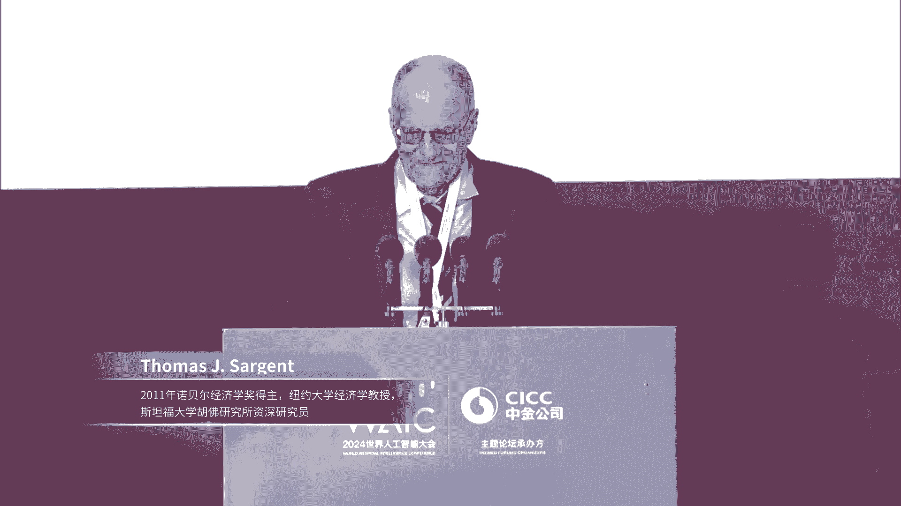
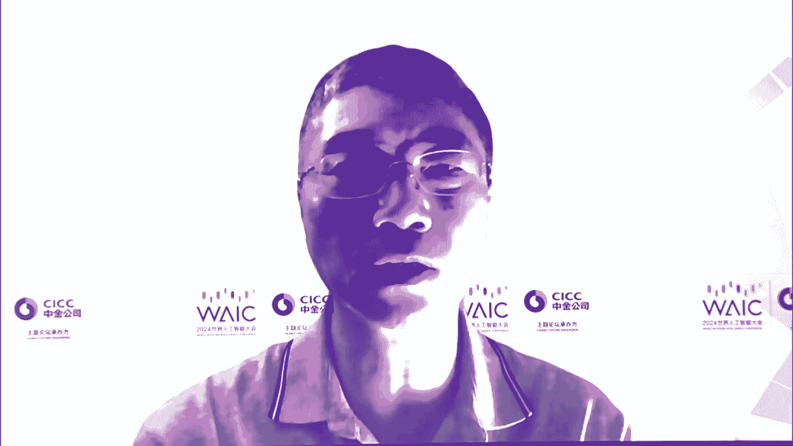

# 28：AI规模新经济——投融资主题论坛核心观点解析 📊

## 课程概述
在本节课中，我们将学习2024世界人工智能大会投融资主题论坛的核心内容。课程将围绕“AI规模新经济”这一主题，系统梳理多位专家关于人工智能发展趋势、经济影响、投融资机遇与挑战的见解。我们将重点关注AI的规模定律、对宏观经济和产业的影响，以及资本市场如何支持AI创新。

***

## 第一节：论坛开幕与核心主题介绍 🎤

本次论坛由中金公司承办，聚焦“AI规模新经济”。论坛指出，自2022年ChatGPT发布以来，全球掀起了AI热潮。当前AI进步的一个突出特征是遵循**规模定律（Scaling Law）**。中国凭借庞大的人口和市场，有利于加速技术追赶，并可能在应用层实现引领性创新，为经济增长注入新动能。

***

## 第二节：领导致辞与宏观展望 🌐

上一节我们介绍了论坛的核心主题，本节中我们来看看与会领导对AI发展的宏观展望。

中金公司董事长陈亮先生指出，人工智能作为新质生产力的代表，正以前所未有的速度重构各行业。中国超大规模市场带来的规模经济优势，有望在AI时代转化为技术发展优势。例如，基于完整的工业体系和庞大数据，AI能助力中国制造业从追赶式创新向引领式创新、从传统制造向智能制造转变。

科技发展离不开金融支持。中金公司持续为科技创新企业提供金融支持，并发布了《AI经济学》研究报告。报告估算，到2030年，中国AI产业市场需求将达**5.6万亿元**，2024-2030年总投资规模将超过**10万亿元**。

上海市人民政府副秘书长庄木弟先生强调，AI技术进步体现出明显的规模定律，其推广应用将呈现规模经济效应，引发经济结构重大变革。上海将人工智能作为重点发展的先导产业之一，积极发挥财政资金引导作用，推动设立人工智能产业投资母基金，并优化融资体系，支持产业投资与创新。

***

## 第三节：诺贝尔奖得主视角：AI的本质与影响 🧠

在了解了宏观政策导向后，本节我们将从经济学理论视角，深入探讨AI的本质及其社会经济影响。

2011年诺贝尔经济学奖得主托马斯·萨金特（Thomas Sargent）教授分享了他的见解。他首先定义了智能（Intelligence）的三项核心活动：
1.  **模式识别（Pattern Recognition）**：从海量数据中压缩提取关键模式。
2.  **泛化（Generalization）**：将从一个情境中学到的模式应用于新情境。
3.  **决策（Decision-Making）**：利用模式和泛化来指导选择。

人工智能（AI）即是让机器执行这些活动。萨金特教授指出，创造AI的工具（如统计学、生物学、经济学、物理学）恰恰是人类天生不擅长的领域，这是一个有趣的悖论。

他以AlphaGo为例，说明现代AI是融合多学科工具的“烹饪”结果：
*   **经济学**：价格与价值评估、博弈论。
*   **数学与统计学**：动态规划、蒙特卡洛模拟。
*   **计算机科学**：分布式计算。
*   **生物学**：进化算法（适者生存）。

萨金特教授提出了一个关键问题：**模式识别是否足够？** 他的答案是：对于某些目的，模式识别足以解决问题；但对于其他目的（如科学发现、理解经济系统运行规则），它仅是起点，并不足够。这区分了AI当前的能力与前沿挑战。

他进一步探讨了AI与经济学的关系：
*   **对劳动力市场的影响**：过去十多年，在许多国家，劳动收入占国民生产总值（GNP）的份额下降，而资本份额上升。软件（包括AI）对劳动力的替代以及由此带来的企业溢价能力提升，是可能的原因之一。这引发了关于收入分配和市场力量的关注。
*   **数字金融（Digital Finance）**：AI正在推动金融活动变革。数字金融本质上是利用新技术（如电子账本、平台）更快、更便宜地执行存贷款、支付等传统金融活动。平台通过记录行为、排除不良参与者来建立信任和执行合约，成本远低于传统法庭和律师。这带来了新的监管问题，例如平台应由谁运营（私营企业、银行还是政府）以及如何实现跨平台互操作性。

萨金特教授总结道，数字金融在中国帮助中小企业以更低成本获得了以前无法享受的金融服务，展现了巨大的应用潜力。

***

## 第四节：中金《AI经济学》报告核心发现 📈

上一节萨金特教授从理论层面分析了AI的影响，本节我们聚焦于中金公司研究部发布的《AI经济学》报告，看看其如何从规模经济主线出发，进行实证与前瞻分析。

报告的主线是**规模经济效应**。AI大模型的发展遵循规模定律，存在投入门槛，这与传统工业规模经济有相似之处，即规模越大，单位成本越低，效率越高。

以下是报告的主要分析维度与结论：

### 产业视角：中国的机遇与挑战
报告认为，AI作为通用目的技术（GPT），其产业化推广呈S型曲线。目前AI已越过技术可行性的“第一拐点”，进入产业化应用阶段。中国的优势在于庞大的应用市场与完整的工业体系。

**投资需求估算**：报告初步估算，到2030年，中国AI算力与模型层市场规模约**5.2万亿元**，AI应用层市场规模约**9.4万亿元**。

**应用潜力分析**：AI赋能产业可分为两个路径：
1.  **AI产业化**：创造新商业模式（如具身智能、人形机器人）。其潜力取决于操作的标准化程度和容错率。
2.  **产业AI化**：现有产业利用AI提升效率。中国在此具有显著规模优势。

**面临的制约**：AI的规模效应也存在极限，并受到算力能耗、数据供给等因素制约。中国在数据生产端和流通市场规模上相对小于美国，需在数据公开共享、隐私保护与知识产权平衡方面做出努力。

### 国际视角：收敛还是分化？
历史上，技术革命可能导致国家间收入水平“大分流”（如工业革命），也可能导致“大收敛”（如战后部分东亚经济体的追赶）。当前，AI可能引发“第二次大分流”，使中美等大国进一步领先。

报告构建了“AI竞争指数”，从技术层（算力、数据、人才、金融）和应用层（经济暴露度）评估各国竞争力。中国指数约为美国的0.7，位居第二，优势主要在应用层，但风险投资相对不足。

### 宏观视角：对就业与增长的影响
报告没有简单回答“AI是否导致失业”，而是将人类工作任务拆解为**16种“元任务”**（如体力型、智力型）。AI替代的是具体任务而非整个人。行业分析师调研绘制了各行业“元任务”的时间分布。

**一个重要发现是**：结合具身智能，**体力劳动**可能比纯脑力劳动面临更大的替代潜力，例如在采矿、农业、资源加工等领域。

**增长潜力估算**：基于分析，报告预计AI有望在未来十年为中国每年额外贡献约**0.8个百分点**的经济增长。

**公共政策含义**：技术进步虽不会导致长期大规模失业，但会造成劳动力转换和部分群体受损，需要公共政策干预以促进公平。报告建议利用AI提升的效率，优先用于改善社会保障体系（尤其是农村地区）的公平性与覆盖面，而非急于推行全民基本收入（UBI）。

***

## 第五节：高端对话：技术演变、商业化与资本助力 💡

在学习了系统的研究报告后，本节我们通过高端对话，聆听产业界与投资界一线专家对技术发展、商业化落地及资本角色的真知灼见。

### 议题一：AI技术演变与真实潜力
*   **吴军博士（人工智能专家）**：AI发展历经四波浪潮，当前处于深度学习与Transformer架构驱动的阶段。AI仍处早期，潜力巨大。当前AI擅长回答问题，但**提出好问题**的能力仍是人类的独特优势。
*   **朱云来（金融专业人士）**：本轮AI（如GPT）的进步给人以全新感受，显示人类在模仿智能上“找到了感觉”。其潜力可能达到工业革命级别。当前AI基于模式识别，存在“一本正经胡说八道”的问题。未来需要结合“证明”环节，形成“观察-归纳-证明-推理”的完整智能链条，前景广阔。

### 议题二：投资过热、商业化与能源挑战
*   **吴军博士**：全球AI投资（如估算的1万亿美元）是长期累计值，相对于全球经济总量和科技公司研发投入并非过高。当前问题是投资分散，建议“国家队”等大基金重点扶持少数几家基座模型公司，鼓励更多力量投入数据服务、行业应用等环节。
*   **朱云来**：从宏观比例看，AI投资占全球经济比重不高。关于能耗，初步估算全球现有芯片全速运行年耗电约5000亿至1万亿度，占当前全球总用电量（约30万亿度）的1/30左右，并非不可承受。随着光伏加储能技术的成熟，绿电供给可解决能源问题。

### 议题三：中国AI发展的挑战与应对
*   **吴军博士**：AI发展依赖算力、算法、数据三大要素。建议中国：1) 研制针对AI算法的专用芯片；2) 加强基础算法研究，而非仅跟随开源；3) 构建开放网络，获取全球数据，并发挥在数据标注与管理上的经验优势。
*   **朱云来**：除了算力算法数据，还需考虑算法背后的社会共识与立法问题（如自动驾驶伦理）。当前最大挑战之一是**商业模式**。大模型的公共属性强，可能需要探索公共部门与私人部门协调的新型投资模式，在激励创新与保障公共效益、投资回报之间取得平衡。

***

## 第六节：圆桌讨论（一）：产业发展与投融资趋势 🚀

上一节我们探讨了宏观趋势，本节进入更具体的产业与资本市场对接环节。第一场圆桌聚焦通用人工智能（AGI）产业发展及投融资趋势。

### 交易所视角：资本市场如何支持AI企业
*   **上海证券交易所**：科创板坚持“硬科技”定位，已支持31家AI产业链企业上市。将优先支持突破关键核心技术的硬科技企业，依法依规支持符合条件的未盈利企业上市，并优化再融资、股权激励等制度。
*   **香港交易所**：2018年上市改革后，已成为新经济公司重要融资地。新推出的《上市规则》第18C章（特专科技）允许包括新一代信息技术（如AI）在内的五大领域无收入公司上市。港股市场再融资便利，周期可短至一周左右，适合AI公司持续融资需求。建议企业规划好团队、专业资本市场队伍、投资人、中介机构及估值融资策略。

### 投资机构视角：系统性机会与耐心资本
*   **云启资本陈昱**：投资机会将从上层的基座模型向下层应用转移。重点关注四大方向：
    1.  **生产力提升**：信息获取、内容生成、任务自动化。
    2.  **AI for Science**：新药研发、材料发现等科学研究。
    3.  **具身智能**：可执行多种任务的机器人。
    4.  **娱乐**：游戏内容生成、情感陪伴等。
    *   呼吁“耐心资本”，希望人民币基金能像美元基金一样拥有较长存续期，支持企业长期成长。

### 企业视角（算力层、模型层、应用层）
*   **算力层（壁仞科技李新荣）**：AI是系统工程，需要资本、人才、资源密集投入。选择自带产业资源（如供应链、落地支持）的投资人至关重要。ChatGPT证明了千亿模型可训练及To C应用可行，为算力供应商带来新需求。
*   **模型层（微软中国、智谱AI、百川智能）**：
    *   **商业化差异**：中国To B市场及C端付费意愿与海外存在差异，需寻找适合本土的商业模式。AGI技术仍在快速演进，需关注多模态、超级智能等新方向。
    *   **企业定位**：需明确是做基座模型公司还是行业应用公司。基座模型公司竞争收敛，投入巨大；行业应用公司需深刻理解场景。
    *   **差异化竞争**：中国创业公司在基座模型上与大厂仍有博弈空间。可采取“超级模型+超级应用”双轮驱动，并在基座模型中融入差异化技术主张（如医疗、法律等垂直领域能力）。
*   **应用层（云迹科技李全印 - 机器人）**：机器人商业化需把握四点：1) **匹配真实需求**：做人类不能干或不想干的事；2) **性价比**：价值与价格匹配；3) **可用好用**：注重交互细节与用户体验；4) **可运维可交付**：保障稳定可靠的服务交付。移动通用能力加通用抓取能力是服务机器人的未来。

***

## 第七节：圆桌讨论（二）：创新趋势与应用落地展望 🔮

最后一场圆桌讨论聚焦AI创新趋势与应用落地，汇集了投资机构、算力基础设施、医疗AI、光芯片、脑机接口等多元领域的嘉宾。

### 技术信仰 vs. 市场信仰
嘉宾普遍认为两者并非对立，而是相辅相成、螺旋上升。
*   **创新工场任博冰**：投资人需两者兼顾。商业化取决于模型性能、推理成本、模态、生态四要素的成熟度。
*   **超聚变范瑞琦**：是“基础设施先行”还是“应用驱动”，如同“先有鸡还是先有蛋”，需辩证看待，是技术驱动与客户驱动的结合。
*   **商汤科技张少霆**：通用领域坚定看技术（Scaling Law），垂类领域则必须深入场景，结合应用才能迭代出价值。
*   **曦智科技张红**：硬件技术与应用市场唇齿相依。大模型的发展让硬件公司从“拿着榔头找钉子”变为客户主动上门寻求解决方案。
*   **强脑科技BrainCo倪骁**：不同阶段侧重点不同。技术突破期需坚定技术信仰；技术成熟后，必须通过真实世界应用创造价值。生成式AI与脑机接口可形成闭环，相互促进，在脑健康领域潜力巨大。

### 硬件层进展与机遇
*   **超聚变范瑞琦**：关注三大硬件方向：1) **供电与散热**（液冷等）；2) **高速互联**（硅光、光模块、全光交换）；3) **纸面算力转化为可用算力**的相关服务。
*   **曦智科技张红**：硅光技术有望像光纤取代铜线一样，在算力基础设施中解决传输带宽、速率、功耗等瓶颈，不仅在云端，在边缘端、卫星、汽车等领域也有广泛应用前景。

### 应用层突破与未来
*   **商汤科技张少霆（医疗）**：AI+医疗分两条路径：1) **To B（赋能医生）**：保收入下限，有望出现百亿市值公司；2) **To C（健康助手）**：撑估值天花板，需结合持续健康数据监测，与穿戴设备公司深度合作，形成壁垒。
*   **强脑科技BrainCo倪骁（脑机接口）**：生成式AI对脑机接口是颠覆性的。通过AI解析脑电信号，可实现意念控制假肢、机器人。在精神健康领域，AI可基于实时脑电数据生成个性化调控方案，并形成“评估-干预-反馈”闭环，想象空间巨大。

### 未来投资机会展望
*   **创新工场任博冰**：关注两个关键节点：1) **普惠拐点**（24-48个月内，推理成本降至千分之一）；2) **智能拐点**（3-4年内，出现GPT-6级模型）。投资将沿推动拐点的四要素展开：
    *   模型性能（大模型）。
    *   多模态（视频生成、具身智能）。
    *   推理成本（算力及生态）。
    *   AI生态（应用）。应用发展将按阶段展开：To B应用 → 生产力工具 → 高日活To C应用 → 融入吃喝玩乐衣食住行。当前处于第一阶段向第二阶段过渡期。

***

## 课程总结
本节课中，我们一起学习了“AI规模新经济”投融资论坛的核心内容。我们从宏观政策与经济学理论出发，理解了AI的规模定律及其对经济结构、劳动力市场和国际格局的潜在影响。通过中金公司的《AI经济学》报告，我们系统分析了AI在中国产业应用、投资需求、增长贡献等方面的具体前景。最后，通过两场高质量的圆桌讨论，我们聆听了来自交易所、投资机构、算力硬件、大模型公司、前沿应用企业的专家们，对技术趋势、商业化挑战、资本市场对接以及未来机遇的深刻见解。整体而言，AI作为驱动新质生产力的核心，其发展离不开技术与市场的双轮驱动，以及科技、产业与金融的良性循环。中国在应用层面拥有规模优势，但也需在基础创新、数据生态、商业模式和耐心资本等方面持续努力。