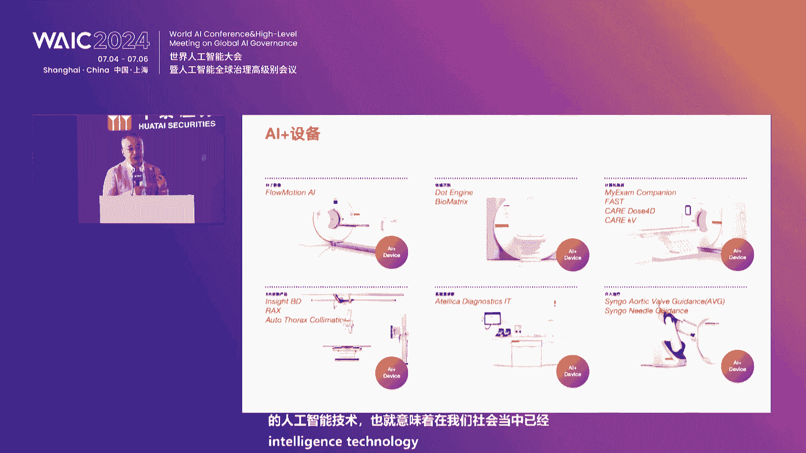
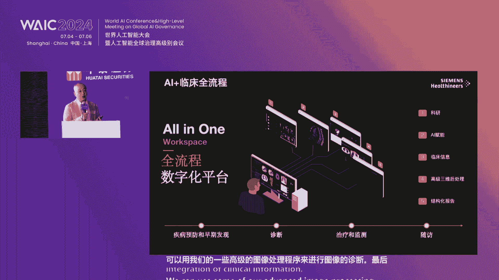
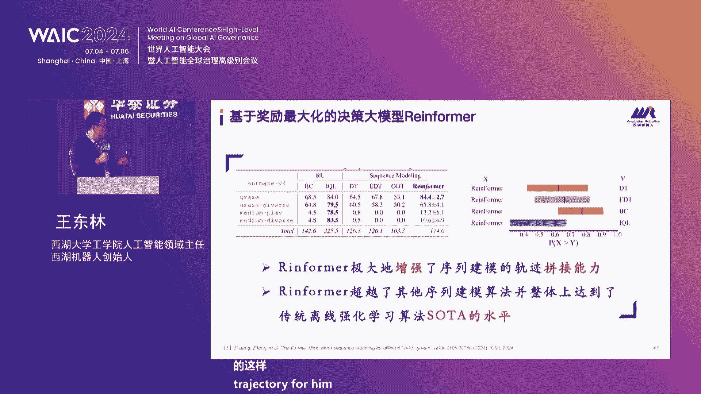
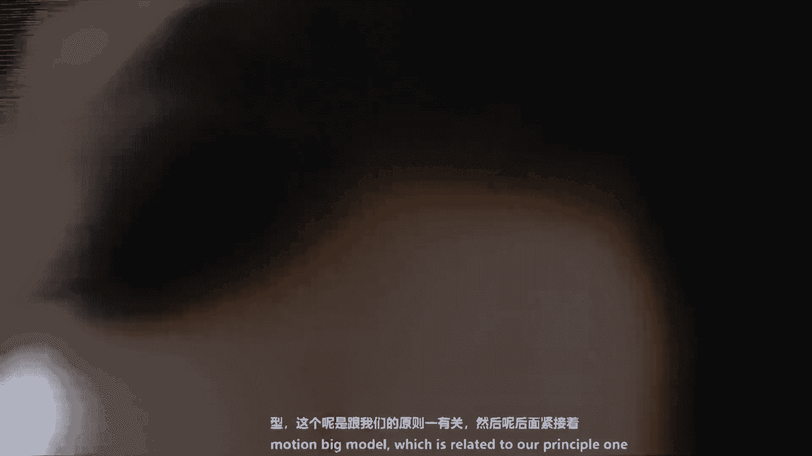
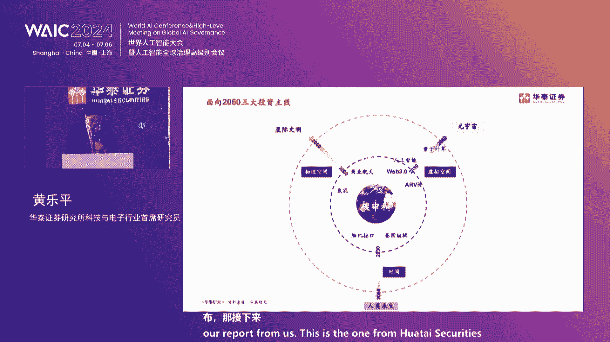
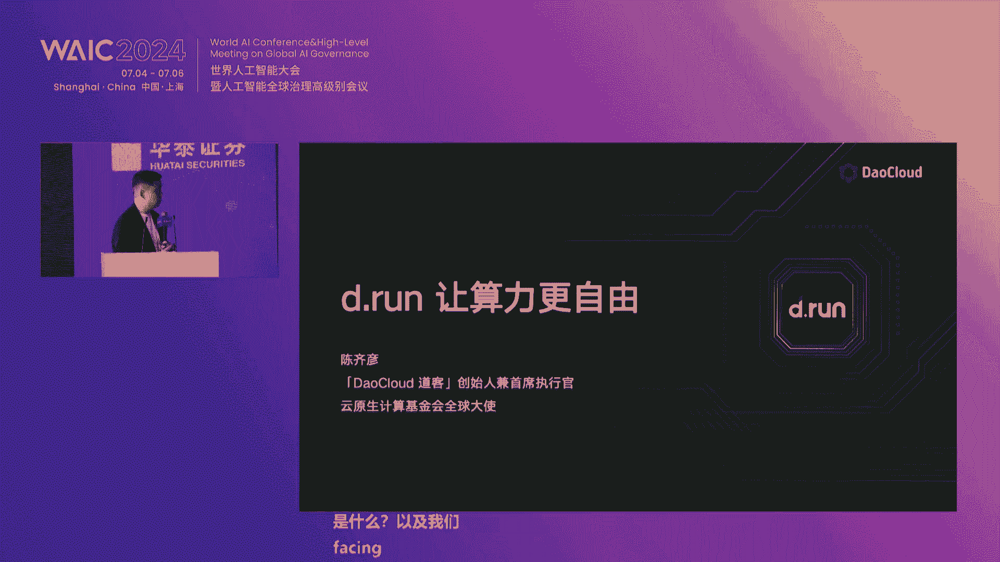
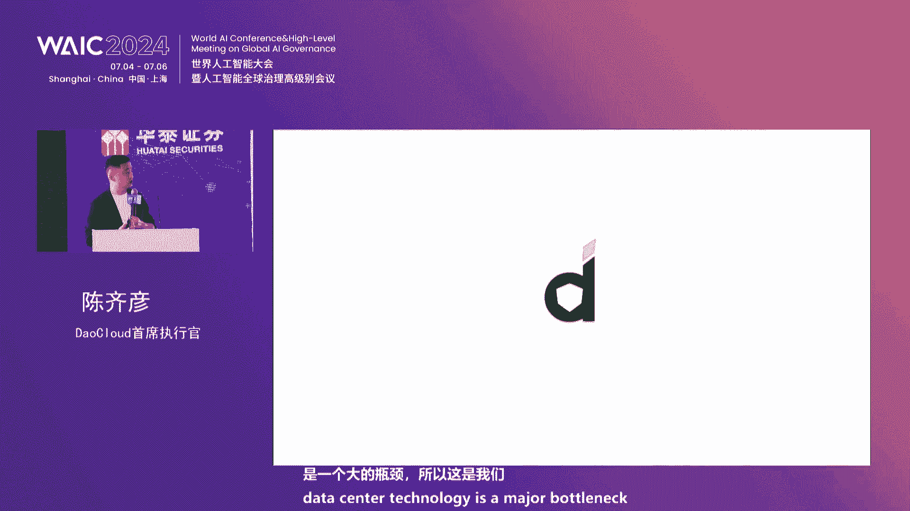
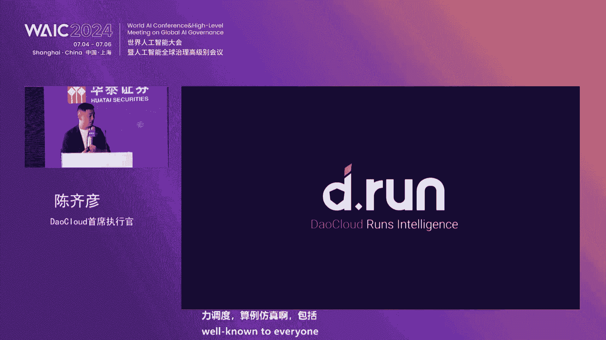

# 29：AI前沿趋势与产业应用深度解析 🚀

## 课程概述
在本节课中，我们将学习人工智能（AI）领域的最新发展趋势，特别是大模型、具身智能、算力网络以及AI在医疗、金融等垂直行业的应用落地。课程内容整理自华泰证券科技金融创新论坛的嘉宾演讲，旨在为初学者提供清晰、全面的知识概览。

---

## 第一节：AI发展回顾与宏观趋势 🌍

上一节我们介绍了课程的整体框架，本节中我们来看看AI发展的宏观背景与核心驱动力。

人工智能在过去一年发展迅猛，大模型技术持续爆发，呈现出模态丰富、能力增强、成本下降等特点。以生成式人工智能为代表的技术革新速度前所未有，并在医疗、金融、教育、法律等多个垂直行业加速落地。

科技是驱动变革的关键力量。在金融领域，移动互联网催生了掌上财富通等应用，实现了零售业务的跨越式成长。在机构服务领域，数字化转型打造了FICC大象交易平台等多个专业平台，提升了服务能力。

随着人工智能成为新生产工具、数据成为新生产要素、算力成为新基础设施，这“三新”体系与产业加速融合，必将带来深远影响，其方向是确定且不可逆的。

---

## 第二节：AI+医疗：精准诊疗与健康管理 🏥

上一节我们探讨了AI的宏观趋势，本节中我们将聚焦AI在医疗领域的创新应用。

AI与医疗的结合正在改变传统的诊疗模式。例如，GPT-4在没有接受医学训练的情况下，已能通过美国职业医师考试，这引发了关于AI是否会替代医生的讨论。更重要的应用在于，AI可以通过整合影像、基因、动力学等数据，构建数字孪生体，为心脏病的诊断与治疗带来变革。

医疗设备正在变得更加智能化。几乎所有先进的影像诊断设备（如CT、磁共振）和实验室检验设备都已嵌入AI技术。

AI能够赋能临床全流程，从疾病预防、早筛、诊断到治疗、监测和随访。通过整合多源异构数据，AI可以辅助医生进行决策。例如，在手术室中，医生可以实时调取并融合患者的CT、超声、病理等多种信息，并通过三维重建技术进行手术规划。

在危急重症救治中，AI能显著提升效率。以脑卒中为例，通过一站式诊疗设备和AI技术，可以将关键的DNT时间（从入院到开始治疗的时间）从国内平均的90分钟以上缩短至15分钟以内，极大地提高了救治成功率。

AI的终极目标是实现全生命周期的健康管理。通过构建患者的数字孪生体，可以模拟疾病发展和治疗效果。例如，数字心脏可以模拟心脏的电生理和机械性能，帮助医生在植入起搏器前评估手术方案的有效性，实现个性化治疗。

此外，增强现实（AR）和虚拟现实（VR）技术也已应用于临床教学和手术导航，提升了医生的培训效率和手术精准度。

**核心公式/概念**：
*   **数字孪生**：`Digital Twin = f(影像数据， 基因数据， 生理数据...)`
*   **关键救治指标**：`DNT时间（Door-to-Needle Time）`

---

## 第三节：具身智能：机器人的AGI之路 🤖

上一节我们看到了AI在虚拟世界的强大能力，本节中我们来看看AI如何与物理世界交互，即具身智能。

具身智能强调智能体通过身体与环境的交互来获取认知和产生行为。其发展遵循三条核心原则：
1.  系统不依赖预定义的复杂逻辑。
2.  系统需要具有面向环境的进化学习机制（如强化学习）。
3.  环境对物理行为和认知结构至关重要。

大模型的出现部分解决了第一条原则的通用性问题。多模态大模型（如GPT-4V）和机器人具身大模型（如RT-2）是当前的研究热点。然而，它们仍面临推理速度慢和操作精度不足的挑战。

**解决方案方向**：
*   **架构优化**：采用Mamba、MOE等更高效的架构替代部分Transformer，以提升推理速度。
*   **空间智能**：引入动作轨迹预测、空间关系理解和3D信息，以提高操作的精度和成功率。

强化学习是实现第二条原则（环境适应）的关键。它使机器人能够利用最优和次优数据，通过与环境交互来学习策略。人类反馈强化学习（RLHF）、决策大模型（如ReinforceM）等技术正在推动这一领域的发展。

仿真环境是应对第三条原则（环境）挑战的重要手段。通过构建高保真的虚拟环境，可以低成本、高效率地训练机器人策略。目前，利用大量仿真数据加少量真实数据训练出的模型，已在四足机器人上展现出优秀的运动、导航和操作能力。

**未来趋势**：
1.  **大模型**：持续提升通用性，解决幻觉、泛化、推理等问题。
2.  **强化学习**：与大模型深度融合，提升“小脑”（运动控制）的泛化能力，或实现大小脑合一的通用智能。
3.  **环境仿真**：通过软硬件协同，不断缩小仿真与现实的差距（Sim2Real）。

**核心公式/概念**：
*   **强化学习核心**：`策略π = argmax Σ(奖励R)`
*   **仿真到现实**：`策略性能 = g(仿真保真度， 自适应算法)`

---

## 第四节：AI算力产业链的重构与机遇 ⚡

上一节我们探讨了AI的“大脑”和“身体”，本节中我们来看看支撑这一切的“基础能源”——算力。

AI发展带来了投资顺序的变化：算力基础设施 -> 终端 -> 模型 -> 应用。英伟达凭借其软硬件一体的生态（CUDA平台 + GPU），抓住了开发者和用户，成为了AI时代的平台型企业，市值增长惊人。

**核心趋势判断**：
1.  **服务器市场超越手机**：预计到2030年，服务器市场规模将达到5500亿美元，超过手机，成为最大的硬件品类。算力需求的核心衡量指标正从“机柜数量”转向“能耗功率”。
2.  **中美算力产业链平行发展**：地缘政治等因素导致供应链重构，中国企业在英伟达产业链中占比很低，但这为国产算力生态创造了发展窗口。
3.  **AI催生新硬件形态**：从AI手机/AI PC，到XR设备，再到机器人、智能汽车，AI能力将驱动新一代硬件创新。
4.  **服务器产业链迭代机会**：在AI服务器市场中，光模块（向1.6T演进）、散热（液冷）等核心零部件将迎来量价齐升的成长机会。

**中国企业的机遇与挑战**：
*   **前景光明**：消费电子全球化趋势不变，中国制造优势稳固；AI应用出海（如TikTok、拼多多）表现亮眼。
*   **挑战巨大但必须做**：算力产业链国产化（芯片、软件）和基础大模型研发，是艰难但至关重要的任务。
*   **挑战较大**：国产算力部件融入全球主流生态、打造全球竞争力的AI手机、在数据跨境受限下实现大模型全球化，都面临较大困难。

**核心公式/概念**：
*   **平台型企业公式**：`生态护城河 = 开发者数量 × 用户粘性`
*   **产业链价值**：`零部件成长 = 服务器出货量 × 单品价值提升`

---

## 第五节：构建下一代AI算力基础设施 🌐

上一节我们分析了算力产业的宏观格局，本节中我们深入看看如何构建高效、自主的算力基础设施。

当前AI算力面临多重挑战：供给短缺、软硬件技术被锁定、建设运营成本高昂。真正的算力需求是“开箱即用”的、弹性的服务，而非简单的机器租赁。

新一代AI算力基础设施的核心是软件定义和智能调度。它需要一套复杂的软件栈来管理异构算力（包括国产GPU），实现资源的池化、优化和高效调度，并为上层的大模型训练和推理提供稳定支撑。

**关键技术与参与者**：
*   **算力调度与操作系统**：提供底层资源管理和调度能力，是算力池化的核心。
*   **高性能网络与互联**：低延迟、高带宽的网络是万卡集群协同工作的基础。涉及DPU智能网卡、高速交换芯片等。
*   **集群建设与运维**：提供从组网、部署到性能调优的全栈解决方案，确保大规模智算集群的稳定高效运行。

**国产化与出海**：
*   在软件、分布式系统等领域，国内团队与全球领先水平的差距相对较小，部分已达到并跑。
*   在芯片等硬件领域，需要持续投入，追赶先进工艺和生态。
*   出海是必然趋势。中国科技企业凭借在中国市场锤炼出的竞争力，在海外市场具备优势。但需注意地缘政治风险，可通过设立海外主体、发展本地合作伙伴等策略灵活应对。

**核心公式/概念**：
*   **有效算力**：`有效算力 = 硬件峰值算力 × 利用率 × 软件效率`
*   **网络性能**：`集群效率 ∝ 1 / 网络延迟， 受最慢节点制约`

---

## 第六节：AI垂直应用落地与产业化 🏢

上一节我们探讨了支撑AI的算力基础，本节中我们来看看AI如何在各行各业落地生根。

大模型正在加速与各行各业深度融合，其落地需要紧密结合行业知识、场景和数据。

**应用案例与特色**：
*   **AI+安全**：将大模型用于威胁检测、事件分析、自动化响应，提升安全运营效率。360智脑依托安全数据积累，构建了覆盖攻击、防御、内容安全的全栈安全大模型。
*   **AI+产业赋能**：智普AI等厂商在智能座舱、医疗研发、工业运维、零售导购、金融投顾等领域已有大量成功案例，帮助传统企业实现智能化升级。
*   **AI+医疗**：讯飞医疗等公司专注于医疗垂直大模型，通过“算法研究员+医学专家”的协同模式，深耕临床场景，在基层诊疗、医院管理、医保控费等方面落地产品。
*   **AI+金融**：商汤科技等企业利用多模态大模型能力，赋能金融机构在智能投研、风险管理、数据资产挖掘等场景，旨在降本增效和辅助决策。

**产业化过程中的关键考量**：
*   **安全与隐私**：尤其在医疗、金融等领域，需通过私有化部署、数据加密、合规认证等方式保障数据安全与用户隐私。
*   **自主可控**：从训练框架、算法到推理的全链路自主可控，是保障供应链安全和持续创新的基础。
*   **行业深化**：行业大模型的成功关键在于“用得好”和“用得起”。需要深入理解行业场景，并优化模型与成本，适配国产算力，满足不同客户的ROI要求。

**未来展望**：
大模型的下半场将围绕 **“三个融合”** 展开：
1.  **端云融合**：端侧小模型保障隐私与实时性，云侧大模型提供强大能力，实现统一体验。
2.  **多模态融合**：文本、图像、视频、语音等多模态输入输出，极大扩展人机交互带宽和应用边界。
3.  **多模型融合**：通过统一的模型管理平台，灵活调度和使用不同规模、不同能力的模型，以应对复杂任务。

**核心公式/概念**：
*   **行业大模型价值**：`业务价值 = 模型通用能力 × 行业知识注入 × 场景契合度`
*   **落地关键**：`成功落地 = 技术能力 ∩ 数据安全 ∩ 成本可控 ∩ 业务需求`

---

## 课程总结 🎯

本节课中，我们一起学习了人工智能领域从技术到产业的多维度发展趋势：
1.  **宏观层面**：AI作为“三新”体系的核心，正不可逆地推动各行业变革。
2.  **技术前沿**：**AI+医疗**走向精准与全生命周期管理；**具身智能**通过大模型、强化学习与仿真技术，迈向通用机器人；**算力网络**是支撑AI发展的基石，正经历重构与自主化建设。
3.  **产业应用**：大模型正在金融、医疗、工业、安全等垂直行业深度落地，解决实际业务问题，其未来发展将聚焦于端云融合、多模态融合与多模型融合。
4.  **中国路径**：在全球化与自主化并行的背景下，中国企业正凭借在应用创新、软件技术及庞大市场方面的优势，积极探索符合自身特点的AI发展道路。

希望本教程能帮助你建立起对AI前沿趋势与产业应用的系统性认知。