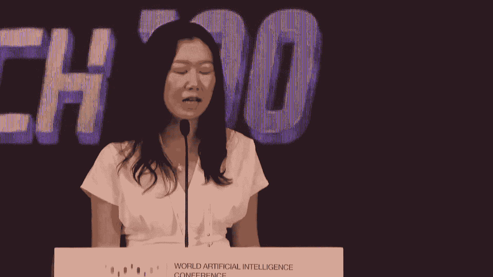
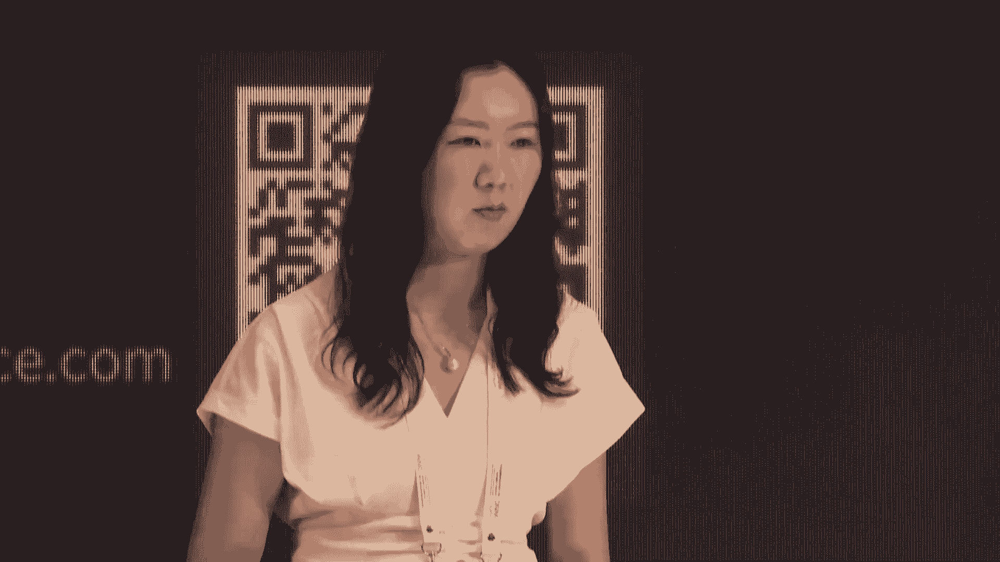
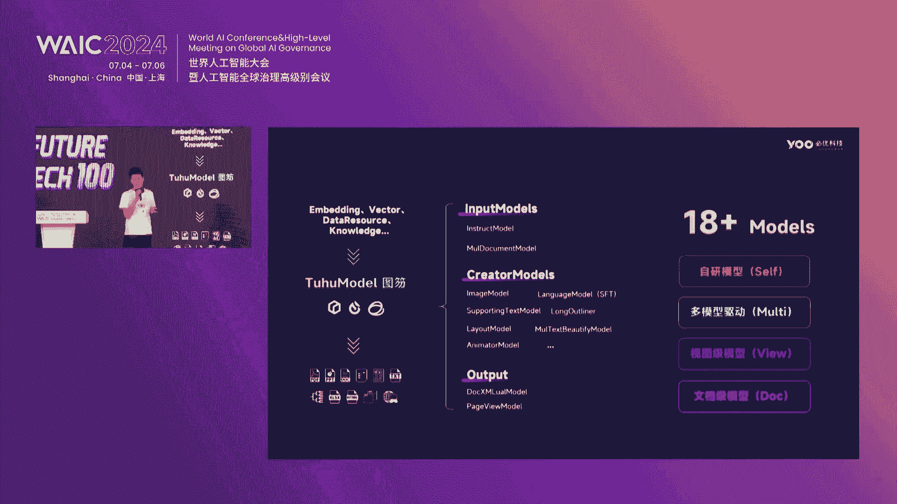
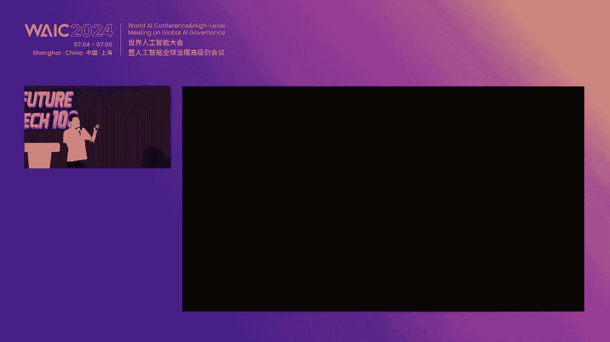
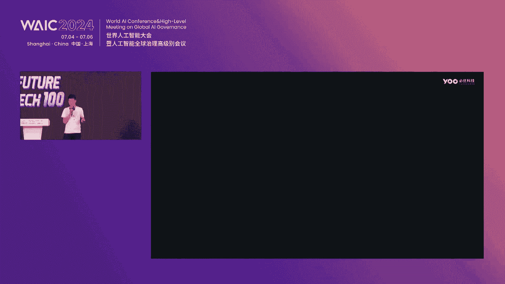
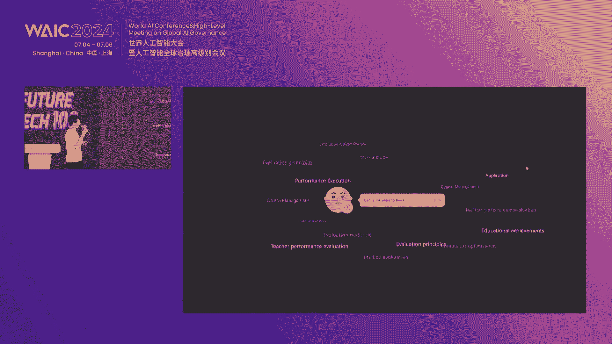
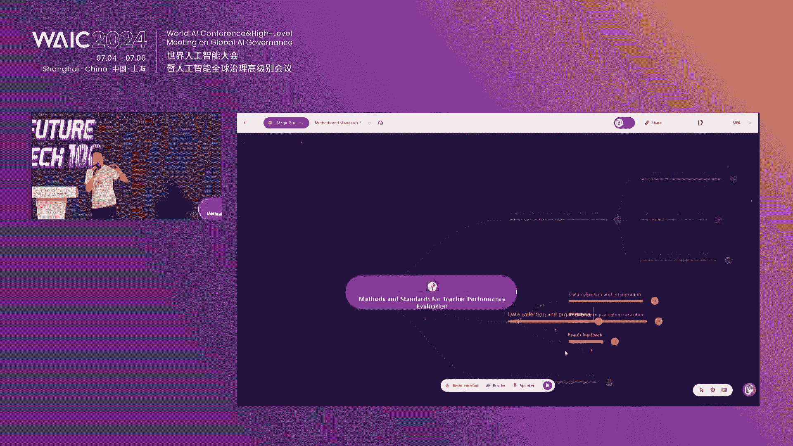
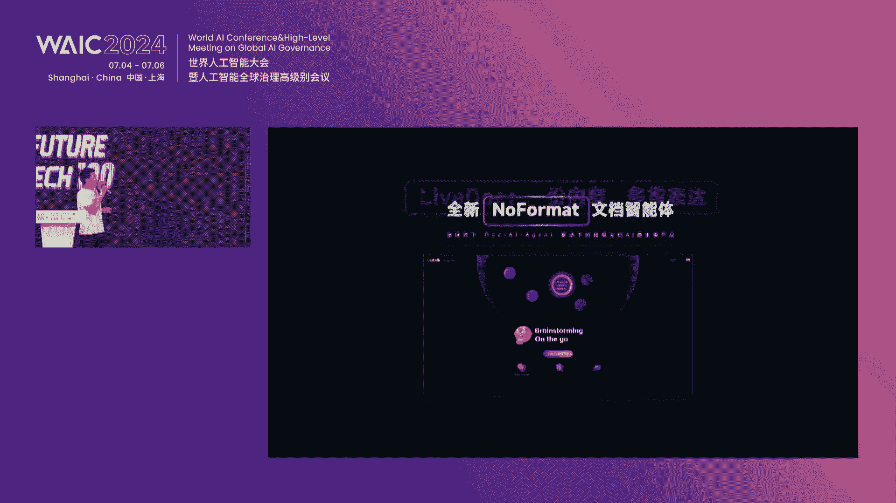
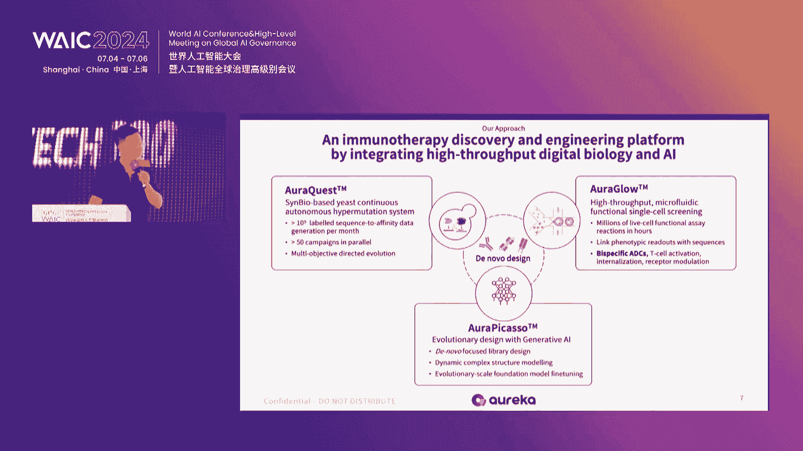

# 30：AI与商业创新项目路演解析 🚀



## 课程概述
在本节课中，我们将学习2024年7月5日“未来之星创新项目路演（Ⅱ）”中多家科技公司的核心内容。课程将涵盖具身智能、AI文档处理、AR/VR应用、智能办公、碳普惠平台及AI制药等多个前沿领域。我们将深入解析各公司的技术方案、商业模式及市场前景，帮助初学者理解AI技术如何重塑千行百业。

---

## 一、跨维智能：基于Sim-to-Real的高通用性具身智能解决方案 🤖



跨维智能成立于2021年6月，专注于通过Sim-to-Real技术实现高通用性具身智能。公司成立当年即获得真格基金和综合资本的天使轮融资，2022年产品初步商业化，2023年实现千万级营收。

### 1.1 对具身智能的理解
传统机器人多为定制化方案，缺乏通用性。例如，物流机器人只能抓取特定货架上的箱子，制造业机器人更换工件需重新编程。具身智能需具备通用性，能感知物理世界并决策交互，处理任意物体与多样任务。

**核心公式**：  
`通用性 = 感知能力 + 决策能力 + 交互能力`

### 1.2 具身智能发展路径
公司参考自动驾驶L1-L5分级，规划具身智能发展路径：
- **L1-L2阶段**：半结构化场景（如制造业），用特定或通用机器人操作任意对象。
- **L3-L4阶段**：非结构化场景（如家庭），用通用机器人处理未知任务。
- **L5阶段**：完全未知环境（如火星），用通用机器人执行任务。

**核心逻辑**：  
`处理对象 → 处理环境 → 处理任务`

### 1.3 技术核心：合成数据与物理引擎
3D数据在互联网中难以获取，传统数据采集成本高、规模有限。跨维智能通过自研物理仿真引擎，低成本生成海量高质量3D合成数据，解决虚拟域与真实域的统计分布差异。

**代码示例**（合成数据生成流程）：
```python
# 伪代码：基于物理引擎生成合成数据
def generate_synthetic_data(cad_model, textures, lighting):
    # 加载CAD模型
    model = load_model(cad_model)
    # 添加不同纹理与光照
    for texture in textures:
        for light in lighting:
            scene = apply_texture_and_light(model, texture, light)
            # 仿真物体散落姿态
            pose = simulate_falling(scene)
            # 生成训练数据
            data = render_scene(scene, pose)
            save_data(data)
```

### 1.4 产品与商业化
公司定位为“具身智能大脑”，提供软硬件一体化产品。目前已服务30多家制造业客户，实现千万级营收。2024年发布纯视觉解决方案，用RGB相机实现3D场景感知，并在室外及高速场景商业化落地。

---

## 二、韦长梦智能：液压人形机器人的创新与应用 🦿

韦长梦智能成立于2021年，专注于液压人形机器人研发。公司选择液压技术路线，因其爆发力强、续航久、噪音低，适用于服务与工业场景。

### 2.1 技术优势
- **液压动力系统**：自研液压泵（流量14升/分钟）与比例阀，支持机器人以4公里/小时行走。
- **行为决策模型**：支持多任务合并与自然交互，如从冰箱取水时顺带取牛奶。
- **运动控制算法**：基于液压的连续轨迹控制，实现类人行走姿态。

**核心公式**：  
`液压动力效率 > 电机动力效率`

### 2.2 商业化路径
- **机器人咖啡屋**：2024年9-10月运营，单店月净收入目标2-3万元。
- **24小时便利店**：2025年3月运营，采用集装箱快速部署。
- **工业应用**：与919厂、东方电网合作，从事喷涂、电力巡检等有毒高危作业。

**售价**：机器人30万元，机器人加咖啡屋套餐50万元，未来目标降至15万元。

---

## 三、易控智驾：露天矿无人驾驶运输解决方案 🚛

易控智驾专注于矿山无人驾驶，解决招工难、安全性低及绿色化需求。公司通过车路云一体化方案，以单车智能为主，实现规模化应用。

### 3.1 技术架构
- **车端智能**：不依赖网络，保障安全与泛化能力。
- **云端协同**：负责调度与效率优化。
- **V2V通信**：实现车辆间轨迹同步与协同。

**代码示例**（车辆协同调度）：
```python
# 伪代码：基于V2V的车辆协同
def vehicle_coordination(vehicle_list, network_status):
    for vehicle in vehicle_list:
        if network_status == 'stable':
            trajectory = cloud_scheduling(vehicle)
        else:
            # 依赖V2V通信
            trajectory = v2v_sync(vehicle, vehicle_list)
        execute_trajectory(vehicle, trajectory)
```

### 3.2 商业化进展
- **全球最大无人驾驶车队**：200多台车在露天煤矿常态化运营18个月。
- **全矿无人化案例**：石灰石矿实现全矿运输车辆无人驾驶，班次人员从25人降至4人。
- **驻山2.0发布**：引入BEV、Transformer等多模态感知，实现均匀碾压、障碍绕行等功能。

---

## 四、英领之途：一键生成AR/VR内容的神器 🕶️

英领之途成立于2016年，原为AR眼镜公司，现转型为AR/VR内容生成平台。公司通过标准化产品，让中小企业低成本创建AR内容。

### 4.1 产品功能
- **识别图生成**：上传图片、视频、模型，一键生成AR内容。
- **3D模型放置**：适用于汽车、家装、工业设备展示。
- **虚拟展厅**：拖拽式创建，支持3D扫描与电商交易。
- **虚拟人导航**：结合AR导览与实时交互。

**代码示例**（AR内容生成）：
```python
# 伪代码：AR内容一键生成
def generate_ar_content(image, video, model):
    # 上传素材
    assets = upload_assets(image, video, model)
    # 选择模板
    template = select_template('poster')
    # 生成AR小程序
    ar_app = render_ar(assets, template)
    return ar_app
```

### 4.2 商业化模式
- **收费标准**：年费2万元（展会期间1万元），3D建模单模型100元。
- **目标客户**：工业、大消费、家居、餐饮等行业。
- **未来规划**：推出AR魔方硬件，结合C端用户积累，拓展硬件生态。

---

## 五、BU科技：新一代智能文档处理平台 📄

BU科技是AI文档连续创业团队，2020年成立，2023年获百度投资。公司专注于文档垂类模型，2024年发布U Talk智能文档平台，全网用户突破1000万。

### 5.1 技术框架
- **数据层**：整合本地与互联网数据。
- **模型层**：结合大模型与小模型（MOE），处理排版、长文本、动效等任务。
- **输出层**：支持Word、PPT、合同等多种格式生成。



**核心公式**：  
`智能文档 = 数据 + 模型 + 交互`





### 5.2 产品矩阵
- **插件版**：集成于Office，通过Chat交互调整字体、排版等。
- **企业版**：支持SaaS与API，服务金融、教育等行业。
- **U Talk 3.0**：实时智能文档，支持内容多形态表达（PPT、脑图等）。







**代码示例**（文档智能生成）：
```python
# 伪代码：文档多形态生成
def generate_document(content, format):
    # 内容分析
    analyzed_content = analyze_content(content)
    # 选择输出形态
    if format == 'ppt':
        output = render_ppt(analyzed_content)
    elif format == 'mindmap':
        output = render_mindmap(analyzed_content)
    return output
```

---

## 六、玄武纪：AIoT赋能智能办公 🏢

玄武纪成立于2024年4月，专注于AIoT在办公场景的应用。公司通过智能机器人提升印章、合同、档案管理的效率与安全性。

### 6.1 解决方案
- **智能盖章机器人**：无人值守，实现身份识别、风险检测与自动用印。
- **合同管理机器人**：自动拟定、审查合同，规避法律风险。
- **档案管理机器人**：结合IoT传感器，实现档案自动查找与存取。

**售价**：智能工作站10万元，分子公司终端2万元。

### 6.2 商业化进展
公司已积累3000多家企业客户，其中5家正在试点智能盖章机器人。未来计划拓展至合同与档案管理场景，为中小企业提供一站式服务。

---

## 七、绿球金科：低碳大模型与碳普惠平台 🌱

绿球金科聚焦数字金融与绿色低碳，推出“护碳行”碳普惠平台，通过区块链与数字人民币激励用户低碳行为。

### 7.1 平台机制
- **碳足迹计量**：记录用户绿色出行等行为，转化为碳减排量。
- **区块链存证**：保障数据安全与碳资产可信。
- **数字人民币激励**：以现金形式返还用户。

**核心公式**：  
`碳普惠 = 行为计量 + 资产存证 + 激励返还`

### 7.2 商业化进展
平台已覆盖上海地区，与哈啰骑行、上海交通卡、T3出行等合作，用户超33万，碳减排量3万多吨。未来计划拓展至长三角及全国，覆盖衣食住行全场景。

---

## 八、一触科技：人工智能触觉交互解决方案 ✋

一触科技专注于触觉交互，通过振动触觉模拟材质感，提升数字内容体验。公司由中科院、北航、港科大实验室孵化，获奇绩创坛、红杉资本投资。

### 8.1 技术核心
- **触觉AI算法**：实时解析内容材质感，驱动线性马达振动。
- **低延迟匹配**：波形匹配误差低于1毫秒。
- **跨平台兼容**：支持iOS、安卓及AR/VR设备。

**代码示例**（触觉效果渲染）：
```python
# 伪代码：触觉效果实时渲染
def render_haptic(content, device):
    # 分析内容材质
    texture = analyze_texture(content)
    # 生成振动信号
    signal = generate_vibration_signal(texture)
    # 驱动设备马达
    device.vibrate(signal)
```

### 8.2 商业化应用
- **品牌营销**：服务LVMH、开云集团，为广告片添加触觉效果。
- **智能座舱**：与保时捷、奥迪合作，推出触觉座椅、方向盘及中控屏。
- **内容生态**：为B站、小红书提供触觉技术支持。

---

## 九、探硅智慧：AI驱动的分子设计平台 🧪

探硅智慧专注于AI制药，通过生成式AI与自动化实验加速小分子药物研发。公司由360前AI研究院院长与浙大教授联合创立。

### 9.1 技术平台
- **DrugFlow平台**：集成分子对接、活性预测、成药性分析等模块。
- **生成式AI**：探索更大化学空间，生成新型分子。
- **自动化实验**：验证AI生成分子，形成闭环优化。



**核心公式**：  
`药物研发加速 = AI生成 + 实验验证 + 闭环优化`

### 9.2 商业化进展
平台已注册用户2000多名，服务英伟达、智源等企业。案例显示，通过生成96万分子、筛选合成5个，获得高活性分子，大幅提升研发效率。

---

## 十、寻明生物：AI赋能抗体设计 🧬

寻明生物结合生成式AI与数字生物学，加速抗体发现。公司创始人来自UCSF，团队博士占比高，已与5家MNC合作，合同金额超500万美元。

### 10.1 技术平台
- **OrcaQuest**：酵母自进化平台，月产10亿级数据。
- **OrcaGo**：功能性筛选平台，单细胞水平验证抗体活性。
- **OrcaPicasso**：生成式AI模型，动态结构预测与抗体设计。

**核心公式**：  
`抗体发现 = 高通量数据 + AI生成 + 功能筛选`

### 10.2 商业化案例
- **GPCR抗体优化**：6周内将亲和力提升10倍。
- **双抗分子发现**：12周内获得10个高质量候选分子。

---

## 课程总结
本节课我们一起学习了10家创新公司的技术方案与商业模式。从具身智能到AI制药，我们看到AI技术正深入各行各业，推动生产力变革。关键要点包括：
1. **Sim-to-Real** 解决数据瓶颈，提升机器人通用性。
2. **液压机器人** 在续航与静音方面具备优势。
3. **车路云一体化** 实现矿山无人驾驶规模化。
4. **AR/VR内容生成** 降低中小企业使用门槛。
5. **智能文档平台** 实现内容与格式的自动生成。
6. **AIoT** 赋能办公场景的智能化管理。
7. **碳普惠平台** 通过区块链与数字人民币激励低碳行为。
8. **触觉交互** 补齐数字世界感官通道。
9. **生成式AI** 加速药物分子发现与抗体设计。

这些案例表明，AI技术不仅提升效率、降低成本，更在创造新的商业价值与社会福祉。未来，AI与人类的协作将进一步深化，推动千行百业迈向智能化新时代。