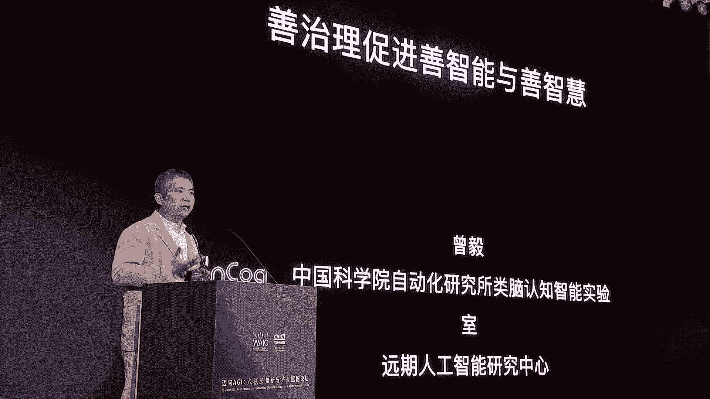
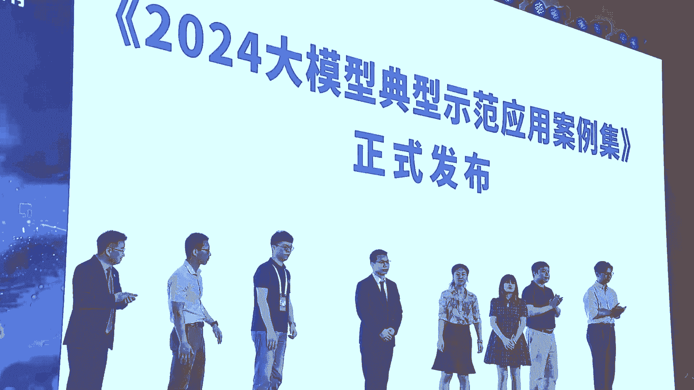
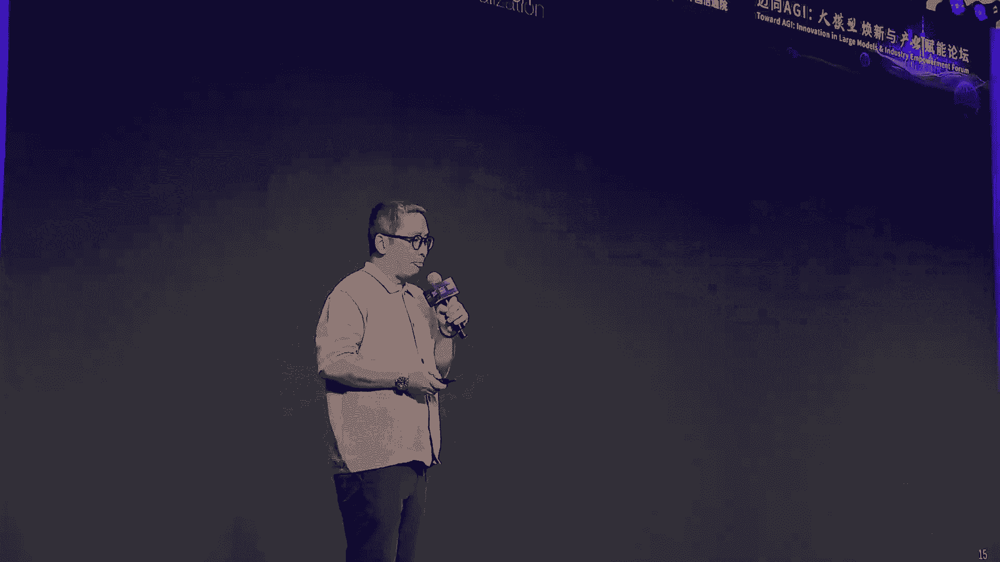
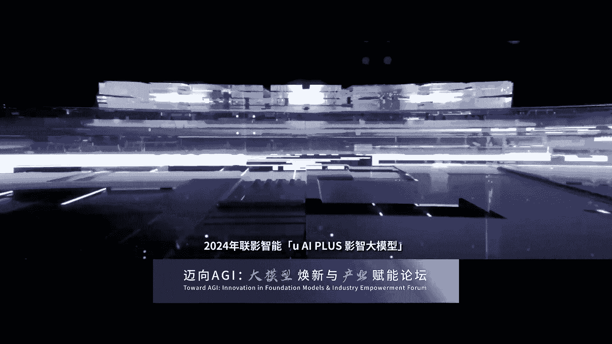
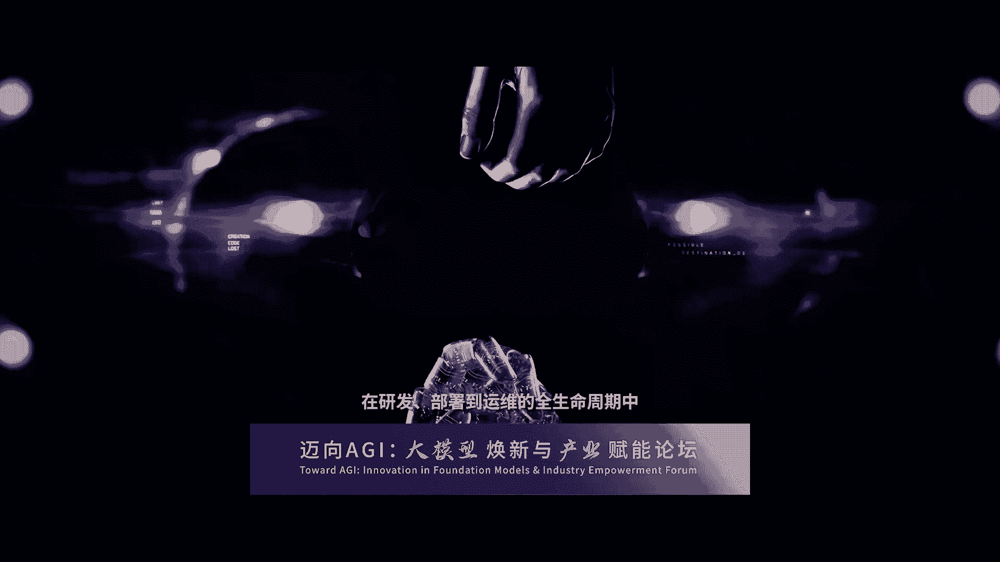
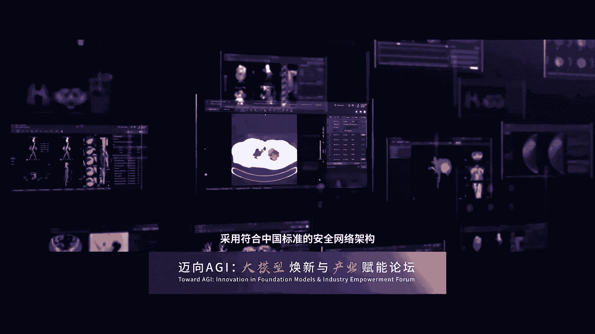
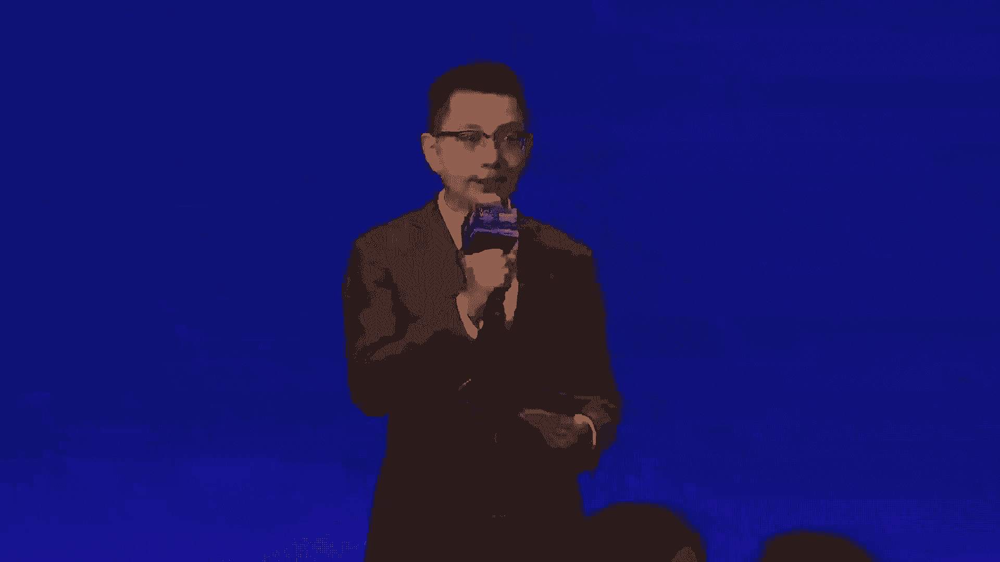

# 31：迈向AGI：大模型焕新与产业赋能论坛全记录 📚

## 概述

在本课程中，我们将系统性地学习2024年世界人工智能大会“迈向AGI：大模型焕新与产业赋能”论坛的核心内容。课程将涵盖从政府政策、产业生态、前沿技术研究到具体行业应用的全景图，深入探讨大模型（Large Language Models, LLMs）的发展现状、面临的挑战以及未来的产业落地路径。我们将重点关注技术原理、产业实践、安全治理和端侧智能等关键议题。

---

## 第一讲：开幕致辞与产业生态展望 🏛️

### 徐汇区产业实践与政策支持

上海市徐汇区副区长于林伟先生回顾了徐汇区在人工智能领域的发展历程。自2018年首届世界人工智能大会在西岸召开以来，徐汇区创建了首个人工智能产业集聚区，并于2019年入选国家首批战略性新兴产业集群。

**核心发展数据**：
*   2023年，徐汇创建了上海首个大模型产业生态社区。
*   目前已有22个大模型通过国家网信办备案，占全市三分之二，占全国近五分之一。
*   全区聚集了超过160家大模型企业，其中商汤、智谱、MiniMax等基础模型企业占比约50%，并在上半年发布了对标GPT-4.0的模型。

**未来三大努力方向**：
1.  **扩大物理空间**：9月，三期、四期共4万平方米空间将投入使用，可容纳超100家大模型企业。
2.  **深化产业政策**：已发布支持大模型发展的扶持意见，并于论坛当天发布了支持人工智能大模型科创街区建设的若干意见。下月还将发布支持行业大模型发展的政策。
3.  **完善产业生态**：在巩固大模型企业聚集优势的同时，积极引进上游芯片和下游智能终端等生态链企业。

### 中国信通院的角色与使命

中国信息通信研究院院长余晓晖先生指出，以大模型为代表的人工智能技术正突飞猛进，但同时也面临算力消耗大、训练数据要求高、存在“幻觉”、可解释性不足等问题。全球正在探索世界模型、类脑计算等多种技术路线共同迈向AGI。

**中国信通院的五项核心工作**：
1.  **深化战略研究**：发布人工智能系列白皮书。
2.  **打造技术服务平台**：承建工信部大模型公共服务平台、人工智能关键技术应用测评重点实验室，推出大模型性能和安全基准测试。
3.  **推动标准建设**：牵头制定50多项人工智能国际和国内标准。
4.  **构建产业协作网络**：发起成立中国人工智能产业发展联盟（会员超1000家），举办“新智杯”大赛，开展大模型赋能新型工业化供需对接活动。
5.  **推动国际合作**：参与联合国、国际电联等机构的人工智能治理工作，筹建金砖国家人工智能发展与合作研究中心。

**本节过渡**：在了解了宏观的产业政策与生态布局后，我们将深入技术层面，探讨大模型本身的工作原理与发展边界。

---

## 第二讲：大模型的“道”与“术”：原理、边界与挑战 🤔

澳大利亚科学院院士陶大程教授从哲学思辨角度探讨了大模型的“道”（工作机制与边界）与“术”（实现与实践路径）。

### 神经网络发展简史与启示

陶院士回顾了神经网络80年的关键节点：
*   **1943年**：McCulloch和Pitts提出神经元数学模型。
*   **1957年**：Rosenblatt提出感知机，并使用随机梯度下降算法。
*   **1986年**：Hinton引入反向传播算法优化多层感知机。
*   **2012年**：AlexNet成功前，神经网络曾因感知机解决不了异或问题（1969年）和统计学习理论的批评而两次陷入低谷。

**核心观点**：神经网络的发展动力主要来自算力和数据的增长。当前已进入由大模型驱动的“超级深度学习时代”。

### 大模型的“涌现能力”与可靠性反思

陶院士对“涌现能力”提出了深刻质疑。他通过一个比喻引发思考：如果两个学生考试分数不同，但考前复习资料高度重合，分数是否能真实反映智力水平？这类比了大模型在训练和测试数据高度相似时，其表现可能并非真正的“理解”和“推理”。

**实证测试**：
1.  **逻辑推理**：向大模型提问一个小学生逻辑题（两人交替跑步求相遇时间）。模型在规律总结、简单加法上均出现错误。
2.  **几何推理**：提问小学生几何图形组合题。模型给出了错误答案，并为所有选项都提供了看似合理的错误解释。

**核心挑战**：
*   **不可解释性**：大模型的工作原理尚不清晰，“幻觉”何时发生、为何发生难以预测。
*   **是否真在思考**：通过视觉错觉图测试，发现模型回答前后不一致，怀疑其并非进行真正的逻辑推理。
*   **多模态问题**：跨语言翻译误差传递、文生图的视觉文本错误、手部畸形、多模态混合生成错误等。
*   **安全问题**：包括内生安全（鲁棒性、隐私、公平、透明）和衍生安全（可靠性、偏见、毒性）。

**未来方向**：
*   **作为效率工具**：在娱乐、电商、搜索等领域有良好应用前景。
*   **革新交互方式**：大模型将推动人机交互向全感知、沉浸式、无边界、无障碍发展，实现“无形胜有形”。

**本节总结**：陶院士引用庄子“天下莫大于秋毫之末，而泰山为小”和老子“天下皆知美之为美，斯恶已”，提醒业界思考大模型的必要边界，避免无休止的内卷，寻求新的发展路径。

**本节过渡**：认识到大模型的局限性后，我们来看产业界如何从多模态和视觉角度寻求突破，并利用“幻觉”激发创意。

---

## 第三讲：多模态大模型与视觉交互新界面 🎨

加拿大工程院外籍院士、智象未来CEO梅涛院士分享了多模态大模型，特别是视觉生成模型的发展与产业应用。

### 生成式AI的产业前景与两条技术路线

梅院士引用数据指出，生成式AI将为全球GDP带来14%的增长，影响全球74%的经济总量。目前，世界500强中超过50%的企业已开始规模化使用AI技术。

**两条核心技术发展曲线**：
1.  **语言模型曲线（GPT路线）**：通过“下一个词预测”压缩知识。目前发展趋于平缓，有预测认为2026年人类现有语料将被消耗殆尽。
2.  **扩散模型曲线**：从视觉角度对物理世界进行建模和模拟。目前处于类似GPT-2的发展阶段，未来可能与语言模型曲线融合。

**一个关键预测**：到2026年，AI生成的图片数量将超过人类一年拍摄的所有图片数量。这标志着我们将走到一个数据与创新的十字路口。

### 视频生成技术的五个阶段

梅院士将视频生成技术的成熟度类比自动驾驶，分为L1到L5五个阶段：
*   **L1-L2**：单镜头内容生成（当前主流技术，如智象未来的模型）。
*   **L3-L5**：向多镜头、多故事性、连续性视频生成演进，终极目标是输入一部小说，AI能自动完成分镜、生成镜头并制作成完整电视剧。

**当前挑战**：成本（生成1秒视频约1元人民币）、效率（生成耗时）和体验（天花板高，尚未从服务专业用户过渡到普通用户）。

**智象未来的策略**：采用“基础大模型 + 产品应用型小模型（智能体）”的架构，服务千行百业。其“智象大模型2.0”是视频和图像混合训练的原生模型，支持可变时长及多镜头生成。

**本节过渡**：多模态模型拓展了能力边界，但当大模型要深入严谨的行业时，其“幻觉”和推理能力不足就成了必须跨越的障碍。

---

## 第四讲：可信大模型：产业智能升级的基石 🔒

蚂蚁集团大模型应用部总经理顾静杰聚焦于如何让大模型在严谨的产业应用中变得“可信”。

### 产业应用的三大挑战与可信实践

顾总指出，大模型在产业落地中面临三大挑战：
1.  **领域知识深度不足**：大量行业知识（如医疗经验）尚未数字化或不在公开数据中。
2.  **复杂专业决策能力弱**：涉及多步推理的专业任务容易出错。
3.  **与传统AI工具融合难**：如何将大模型与现有成熟的AI工具链结合。

**蚂蚁的三大实践方向**：
1.  **领域知识增强**：发现传统的检索增强生成（RAG）也存在幻觉问题。蚂蚁提出用**可信领域知识（如知识图谱）** 替代非结构化文档作为参考，显著提升生成准确性。蚂蚁与浙大联合发布了统一知识抽取框架OneKE，并参与开源了知识引擎框架OpenSPG。
2.  **专业决策与深度评测**：
    *   在医疗领域，提出 **“知识图谱思维链”** ，模仿医生的决策路径进行诊断推理。
    *   在金融领域，推出 **“智能体宇宙”框架**，与专家共同构建“1+4+1”分析框架，让大模型模仿金融专家思考。
    *   联合上海财经大学、上海市仁济医院发布了金融和医疗领域的推理评测数据集。
3.  **大模型与基础AI融合**：通过工业级认知推理框架，将大模型与图学习、大规模知识引擎、运筹优化决策引擎等传统AI能力结合，打造更强大的产业智能体。

**本节过渡**：在追求技术能力提升的同时，我们必须同步思考人工智能的治理问题，确保其发展合乎伦理、向善而行。

---

## 第五讲：善治理促进善智能与善智慧 ⚖️

中国科学院自动化研究所研究员、联合国AI高层顾问机构专家曾毅教授从伦理与治理的宏观视角，探讨了人工智能的发展路径。

### 发展路径的治理：超越“内卷”

曾教授指出，当国内出现数百个大模型时，我们需要思考发展路径的选择。他建议，前沿机构可将50%力量投入大模型，另外50%投入 **“大模型的焕新”** ，即颠覆性创新。

**焕新的科学问题**：
*   能否用更小规模的数据和功耗解决同样问题？
*   如何让人工智能具有真正的理解能力？
*   如何实现从“合乎伦理”到“具有道德”的跨越？

### 类脑通用人工智能的探索

曾教授介绍了其团队在类脑AI方向的探索，旨在重塑AI的根基：
*   **自我驱动与具身理解**：强调“我思故我在”对机器不成立，需为AI构建自我模型和具身理解能力。
*   **引入“胶质细胞”**：人脑中胶质细胞数量是神经元的10倍，参与学习。团队构建了融合脉冲神经元和胶质细胞的类脑神经网络模型，在能耗和内存上显示出优势。
*   **结构演化**：引入“抑制性神经元”和演化原理，让神经网络结构根据任务动态演化，在能耗和性能上实现跃迁。

**对当前AI的判断与倡议**：
*   当前AI仍是“看似智能的信息处理工具”，不具备真正智能。
*   安全与能力不是正交关系，提升安全也是提升能力。
*   **倡议**：负责任、稳健地发展和适度地使用AI，无需让AI无处不在。

**本节过渡**：治理框架为发展划定方向，而要将大模型能力普惠到每个人身边，离不开运营商和算力基础设施的支撑。

---

## 第六讲：算网数智联通，AI普惠化实践 📡

中国联通人工智能创新中心首席科学家连世国分享了中国联通推动AI普惠化的实践。

### “1+1+M”大模型体系与普惠理念

中国联通布局“1+1+M”大模型体系：
*   **第一个“1”**：一套基础大模型，探索不同参数模型的能力边界，追求高性价比，避免“大炮打蚊子”。
*   **第二个“1”**：一个大模型平台，提供零代码、低门槛的开发工具和方法论。
*   **“M”**：众多行业大模型，由行业专家塑造“职业技能”，真正应用于具体场景。

**应用案例**：
*   **公众业务**：赋能“联通助理”产品，打造反诈大模型。
*   **文化领域**：与国家博物馆、外文局共创“文物活化大模型”，实现文物知识问答与文创生成。
*   **工业领域**：通过大模型与小模型协同，实现产品质检、流程合规监测等，已服务全国70多个工业客户。

### 大模型安全实践

作为国资委AI内生安全任务牵头单位，中国联通在安全方面做了三项工作：
1.  **构建全面评测集**：开源了覆盖五大类31小类的安全风险评估数据集。
2.  **打造安全增强工具**：对模型进行针对性补强。例如，对Llama3-8B英文模型进行中文能力、安全和价值观补强，形成中文版。
3.  **建设安全工具链**：打造模型服务端到端安全工具链，让模型可靠应用。

**本节过渡**：运营商的网络是普惠的通道，而蚂蚁集团则从产业实践角度，系统化地提出了大模型安全发展的解决方案。

---

## 第七讲：大模型安全实践与一体化解决方案 🛡️

蚂蚁集团与清华大学联合发布《大模型安全实践2024》及“倚天剑”大模型安全一体化解决方案。

### 多模态“鉴真”解决方案

面对AIGC技术带来的深度伪造风险（如证件、视频伪造），蚂蚁推出“倚天鉴”多模态鉴真方案，支持图像、视频、音频、文本内容的真伪检测，图像识别准确率达99.9%。

### “倚天剑”安全一体化解决方案2.0

该方案具备三大特点：
1.  **攻防兼备**：融合安全评测、内置护栏防御、外置风险拦截。
2.  **以AI对抗AI**：通过智能体调度各种安全组件，提升适应性。
3.  **集成专项成果**：集成了多模态鉴真、大模型基础设施供应链安全、大模型幻觉修正等专项能力。

**方案核心模块**：
*   **大模型安全测评**：从攻击者视角扫描供应链安全风险。
*   **内生防护**：在训练阶段进行数据清洗和风险抑制。
*   **外置护栏**：融合智能风控，精准拦截输入输出风险内容。

**本节过渡**：解决了云端的安全与能力问题，大模型要真正融入万物，还需走向边缘，在终端侧释放价值。

---

## 第八讲：边缘AI：打造千行百业智能体 🤖

云天励飞董事长兼CEO陈宁阐述了边缘AI在推动大模型落地中的关键作用。

### 边缘AI的价值与场景

与云端AI相比，边缘AI具备三大特点：**成本更低、数据隐私保护更好、响应速度更快**。它适合将大模型带到每个人身边，渗透到物理世界的各个角落。

**三类应用场景**：
1.  **个人助手**：AI Phone、可穿戴设备。
2.  **家庭助手**：无人驾驶、低空经济无人机、人形机器人。
3.  **城市/行业助手**：电力、交通、能源、教育、医疗等行业的专业助手。

### 边缘AI的发展阶段与云天励飞实践

陈宁将边缘AI发展分为四个阶段，当前正从 **“小模型边缘计算”** 向 **“多模态大模型赋能AIPC/AIPhone”** 过渡，未来将进入 **“端到端行为大模型驱动机器人”** 的阶段。

云天励飞基于 **“算法+芯片”双技术平台**，拓展了智能硬件、智算运营和行业解决方案三大业务，并定义了场景智能化的L1-L5等级（从数字化到自进化），推动边缘AI生态建设。

**本节过渡**：边缘设备需要智能，而智能的诞生离不开强大的底层算力。如何高效、普惠地管理和调度算力，是下一个关键问题。

---

## 第九讲：智算操作系统：软件定义算力的新世界 💻

九章云极DataCanvas董事长方磊提出了“智算操作系统”的概念，以解决算力普惠的难题。

### 智算操作系统的必要性与价值

当前，许多智算中心仅提供“裸金属”算力，如同没有操作系统的手机或电脑，无法灵活调度。智算操作系统的核心任务是：**向下管理硬件，向上提供易用的算力服务**。

**核心价值**：推动进入 **“普惠算力”** 时代。通过软件将庞大的硬件池转换为可度量、可切分、可零售的小块算力，让中小企业也能像用电一样灵活使用算力。

### 九章云极的实践：Aalaya “新世界”

九章云极的智算操作系统Aalaya通过以下技术实现普惠算力：
*   **新内核与存储**：专为大模型设计的存储系统（如DingoFS），支持数据“物化视图”共享，避免重复拷贝，实现“断点续算”。
*   **AI Native交互**：操作系统本身即智能体。用户可用自然语言指令（如“用这3T数据微调某个基座模型”）驱动系统自动完成运算和调度。
*   **性能优化**：训练效率提升100%，GPU利用率提升50%，推理速度大幅提升。

**本节过渡**：算力是基础，医疗则是关乎民生的重要应用领域。大模型如何在这个严谨的领域发挥作用？

---

## 第十讲：AI蝶变，洞见医疗未来 🏥

联影智能联合创始人周强博士探讨了大模型在医疗健康领域的应用与挑战。

### 医疗大模型的挑战与“混合模型”路径

周博士指出，医疗数据多但利用率低，且大模型存在根本性缺陷（如他提出的“字母计数挑战”）。因此，**“自上而下的大模型”与“自下而上的垂域模型”融合**，是关键路径。

**联影智能的实践**：
1.  **影像大模型**：用Transformer实现“一扫多查”，用Diffusion Model生成医疗影像数据以训练分析算法，提升检测准确性。
2.  **文本大模型**：通过RAG等技术，应用于信息总结、证据提取、个性化推理，并开发了能听懂放射科医生口述、自动生成结构化报告的AI助手。
3.  **多模态与数据融合**：将摄像头、投影仪与VR结合，用于手术导航（如颌面外科手术）。未来，医院信息系统将因大模型而整合，实现生数据融合。

**未来愿景**：构建“元医院”，实现数据、模型、多模态的全面融合。

**本节过渡**：从严肃的医疗场景回到日常的知识工作，大模型如何成为我们得力的“第二大脑”？

---

## 第十一讲：AI赋能的“第二大脑”：知识管理新范式 📝